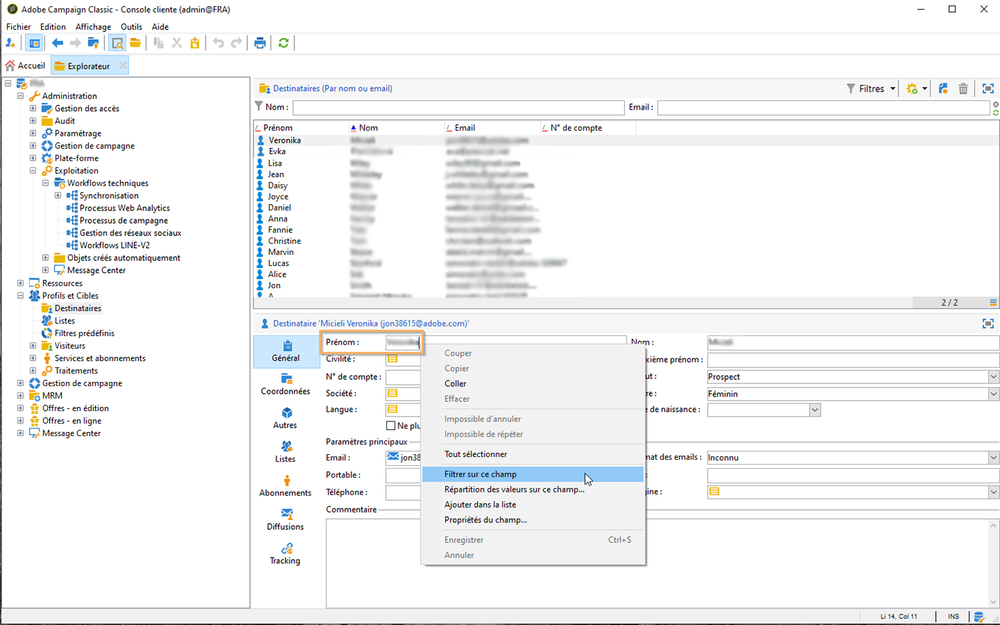

# Bonnes pratiques relatives au modèle de données{#data-model-best-practices}

Ce document présente les principales recommandations lors de la conception de votre modèle de données Adobe Campaign.

For a better understanding of Campaign built-in tables and their interaction, refer to the [Campaign Classic data model](../../configuration/using/about-data-model.md) section.

Lisez cette [documentation](../../configuration/using/about-schema-reference.md) pour commencer à utiliser Campaign . Learn how to configure extension schemas in order to extend the conceptual data model of the Adobe Campaign database in this [document](../../configuration/using/about-schema-edition.md).

## Présentation {#overview}

Le système Adobe Campaign est extrêmement flexible et peut être étendu au-delà de l’implémentation initiale. Toutefois, même si les possibilités sont infinies, il est essentiel de prendre des décisions judicieuses et de construire des bases solides pour commencer à concevoir votre modèle de données.

Ce fournit des cas d&#39;utilisation courants et des bonnes pratiques pour apprendre à architecturer correctement votre -outil.

## Architecture du modèle de données {#data-model-architecture}

Adobe Campaign Standard est un puissant système de gestion de campagnes cross-canal. Il peut vous aider à aligner vos stratégies on-line et off-line pour créer des expériences client personnalisées.

### Approche axée sur le client {#customer-centric-approach}

Bien que la plupart des fournisseurs de services de messagerie communiquent avec les clients par le biais d’une approche centrée sur des listes, Adobe Campaign s’appuie sur une base de données relationnelle afin d’obtenir une vision plus large des clients et de leurs attributs.

Cette approche axée sur le client est présentée dans le graphique ci-dessous. The **Recipient** table in grey represents the main customer table around which everything is being built:

To access the description of each table, go to **[!UICONTROL Admin > Configuration > Data schemas]**, select a resource from the list and click the **[!UICONTROL Documentation]** tab.

The Adobe Campaign default data model is presented in this [document](../../configuration/using/data-model-description.md).

>[!NOTE]
>
> Adobe Campaign Classic permet de créer un tableau client personnalisé. Cependant, dans la plupart des cas, il est recommandé de tirer parti de la table [de](../../configuration/using/about-data-model.md#default-recipient-table) standard qui comporte déjà des tables et des fonctionnalités supplémentaires préconçues.

### Données pour Adobe Campaign {#data-for-campaign}

Quelles données doivent être envoyées à Adobe Campaign ? Il est essentiel de déterminer les données requises pour vos activités marketing.

>[!NOTE]
>
> Adobe Campaign n&#39;est ni un entrepôt de données, ni un outil de. Par conséquent, n’essayez pas d’importer tous les clients possibles et leurs informations associées dans  Adobe Campaign, ni d’importer des données qui ne seront utilisées que pour créer des rapports.

Pour décider si un attribut serait nécessaire ou non dans  Adobe Campaign, demandez-vous s&#39;il tomberait sous l&#39;un de ces  :

* Attribut utilisé pour la **segmentation**
* Attribut utilisé pour les **processus de gestion des données** (calcul agrégé, par exemple)
* Attribut utilisé pour la **personnalisation**

S’il n’appartient à aucune de ces catégories, il est probable que vous n’ayez pas besoin de cet attribut dans Adobe Campaign.

### Choix des types de données {#data-types}

Pour garantir une architecture et des performances optimales de votre système, suivez les bonnes pratiques ci-dessous pour configurer les données dans  Adobe Campaign.

* Un tableau volumineux doit principalement comporter des champs numériques et des liens vers des tableaux de référence (lorsque vous utilisez des  de valeurs).
* L’attribut **expr** permet de définir un attribut de  sous la forme d’un champ calculé plutôt que d’une valeur d’ensemble physique dans un tableau. Cela peut permettre d’accéder aux informations dans un format différent (par exemple, pour l’âge et la date de naissance) sans avoir à stocker les deux valeurs. Il s’agit d’un bon moyen d’éviter la duplication des champs. Par exemple, le tableau du utilise un   pour le domaine, qui est déjà présent dans le champ de courrier électronique.
* Toutefois, lorsque le calcul du   est complexe, il n’est pas recommandé d’utiliser l’attribut **expr** car le calcul à la volée peut avoir une incidence sur les performances de votre.
* Le type **XML** est un bon moyen d’éviter de créer trop de champs. Mais il prend aussi de l&#39;espace disque car il utilise une colonne CLOB dans la base de données. Cela peut aussi conduire à des  SQL complexes et peut avoir un impact sur les performances.
* The length for a **string** field should always be defined with the column. Par défaut, la longueur maximale dans  Adobe Campaign est de 255, mais Adobe conseille de raccourcir le champ si vous savez déjà que la taille ne dépassera pas une longueur plus courte.
* Dans Adobe Campaign, il est acceptable de disposer d’un champ plus court que dans le système source si vous êtes sûr que la taille du système source a été surestimée et ne sera pas atteinte. Cela peut signifier une chaîne plus courte ou un entier plus petit dans Adobe Campaign.

### Choix des champs {#choice-of-fields}

Un champ doit être stocké dans un tableau s’il a un objectif de ciblage ou de personnalisation. En d’autres termes, si un champ n’est pas utilisé pour envoyer un courriel personnalisé ou comme critère dans un, il prend de l’espace disque alors qu’il est inutile.

Pour les instances hybrides et sur site, le  (Federated Data Access, fonctionnalité facultative permettant d’accéder aux données externes) répond à la nécessité d’ajouter un champ &quot;à la volée&quot; lors d’un processus de campagne. Vous n’avez pas besoin de tout importer si vous avez des . For more on this, see [About Federated Data Access](../../platform/using/about-fda.md).

### Choix des clés {#choice-of-keys}

Outre le code **automatique** défini par défaut dans la plupart des tableaux, vous devez envisager d’ajouter des clés logiques ou professionnelles (numéro de compte, numéro de client, etc.). Il peut être utilisé ultérieurement pour les importations/rapprochement ou les  de. Pour plus d’informations, voir [Identifiants](#identifiers).

Des clés efficaces sont essentielles à la performance. Les types de données numériques doivent toujours être préférés comme clés pour les tableaux.

Pour la base de données SQLServer, vous pouvez envisager d’utiliser &quot;index en grappe&quot; si des performances sont requises. Comme Adobe ne gère pas cette tâche, vous devez la créer dans SQL.

### Espaces de disque logiques dédiés {#dedicated-tablespaces}

L’attribut tablespace dans le  vous permet de spécifier un espace disque logique dédié pour un tableau.

L’assistant d’installation vous permet de stocker des objets par type (données, temporaires et index).

Les espaces disque logiques dédiés sont meilleurs pour le partitionnement, les règles de sécurité et permettent une administration fluide et flexible, une optimisation et des performances optimales.

## Identificateurs {#identifiers}

Les ressources Adobe Campaign ont trois identifiants et il est possible d’en ajouter un supplémentaire.

Le tableau ci-après décrit ces identifiants et leur finalité.

| Identifiant | Description | Bonnes pratiques |
|--- |--- |--- |
| Id | <ul><li>L’ID est la clé primaire physique d’une table Adobe Campaign . Pour les tableaux prêts à l’emploi, il s’agit d’un nombre 32 bits généré à partir d’une séquence.</li><li>Cet identifiant est généralement propre à une instance Adobe Campaign spécifique. </li><li>Un ID généré automatiquement peut être visible dans une définition de  de. Recherchez l’attribut *autopk=&quot;true&quot;* .</li></ul> | <ul><li>Les identifiants générés automatiquement ne doivent pas être utilisés comme référence dans un flux de travail ou dans une définition de package.</li><li>Il ne faut pas présumer que l’identifiant sera toujours un nombre croissant.</li><li>L’ID d’un tableau prêt à l’emploi est un nombre 32 bits et ce type ne doit pas être modifié. Ce numéro provient d’une &quot;séquence&quot; couverte dans la section portant le même nom.</li></ul> |
| Nom (ou nom interne) | <ul><li>Cette information est l’identifiant unique d’un enregistrement dans une table. Cette valeur peut être mise à jour manuellement, généralement avec un nom généré.</li><li>Cet identifiant conserve sa valeur lorsqu’il est déployé dans une autre instance de  Adobe Campaign et ne doit pas être vide.</li></ul> | <ul><li>Renommez le nom d’enregistrement généré par  Adobe Campaign si l’objet est destiné à être déployé d’un  à un autre.</li><li>Lorsqu’un objet possède un attribut   (par exemple, un ** ), cecommun sera exploité sur tous les objets personnalisés créés. Certains  réservés  ne doivent pas être utilisés : *nms*, *xtk*.</li><li>Lorsqu’un objet n’a pas de   (*flux de travail* ou *, par exemple), cette notion de* de est ajoutée comme préfixe d’un objet de nom interne : *namespaceMyObjectName*.</li><li>N’utilisez pas de caractères spéciaux tels que l’espace «  », le point-virgule « ; » ou le tiret « - ». Tous ces caractères seront remplacés par un trait de soulignement « _ » (caractère autorisé). Par exemple, « abc-def » et « abc:def » seront stockés sous la forme de « abc_def » et s’écraseront mutuellement.</li></ul> |
| Libellé | <ul><li>Le libellé est l’identifiant d’entreprise d’un objet ou d’un enregistrement dans Adobe Campaign.</li><li>Cet objet autorise les espaces et les caractères spéciaux.</li><li>Il ne garantit pas l&#39;unicité d&#39;un enregistrement.</li></ul> | <ul><li>Il est recommandé de déterminer une structure pour les libellés de vos objets.</li><li>Il s’agit de la solution la plus conviviale pour identifier un enregistrement ou un objet pour un utilisateur d’Adobe Campaign.</li></ul> |

## Clés internes personnalisées {#custom-internal-keys}

Les clés principales sont requises pour chaque table créée dans  Adobe Campaign.

La plupart des organisations importent des enregistrements à partir de systèmes externes. Bien que la clé physique de la table du soit l’attribut &quot;id&quot;, il est possible de déterminer une clé personnalisée.

Cette clé personnalisée est la clé primaire d&#39;enregistrement réelle dans le système externe qui alimente  Adobe Campaign.

Lorsqu’une table prête à l’emploi comporte à la fois une clé automatique et une clé interne, la clé interne est définie comme index unique dans la table de base de données physique.

Lors de la création d’un tableau personnalisé, vous disposez de deux options :
* Combinaison de clé générée automatiquement (id) et de clé interne (personnalisée). Cette option est intéressante si votre clé système est une clé composite ou n’est pas un entier. Les entiers offrent des performances supérieures dans les tables volumineuses et dans la jointure à d’autres tables.
* Utilisation de la clé primaire comme clé primaire du système externe. Cette solution est généralement préférable, car elle simplifie l’approche d’import et d’export des données, avec une clé cohérente entre les différents systèmes. La fonction Autopk doit être désactivée si la clé est nommée &quot;id&quot; et qu’elle doit être remplie avec des valeurs externes (et non pas avec une génération automatique).

>[!IMPORTANT]
>
>Un code automatique ne doit pas être utilisé comme référence dans les  de.

## Séquences {#sequences}

 Adobe Campaign clé primaire est un identifiant généré automatiquement pour toutes les tables prêtes à l’emploi et peut être identique pour les tables personnalisées. Voir à ce propos [cette section](#identifiers).

Cette valeur provient de ce qu’on appelle une **séquence**, qui est un objet de base de données utilisé pour générer une séquence de nombres.

Il existe deux types de séquences :
* **Partagé**: plusieurs tables choisiraient leur id dans la même séquence. Cela signifie que si un id &#39;X&#39; est utilisé par une table, aucune autre table partageant la même séquence n&#39;aurait d&#39;enregistrement avec cet id &#39;X&#39;. **XtkNewId** est la séquence partagée par défaut disponible dans  Adobe Campaign.
* **Dédié**: une seule table sélectionne ses identifiants dans la séquence. Le nom de la séquence contient généralement le nom de la table.

La séquence est un nombre entier de valeurs 32 bits, avec un nombre maximal fini de valeurs disponibles : 2,14 milliards. Après avoir atteint la valeur maximale, la séquence revient à 0 afin de recycler les identifiants. Si les anciennes données n’ont pas été purgées, le résultat sera une violation de clé unique, qui deviendra un bloqueur pour l’intégrité et l’utilisation de la plateforme.  Adobe Campaign ne serait pas en mesure d&#39;envoyer des communications (lorsqu&#39;il a une incidence sur la table de bûches des) et les performances seraient fortement touchées.

Par conséquent, un client envoyant 6 milliards de courriels par an avec une période de rétention de 180 jours pour ses journaux serait à court d&#39;identifiants en 4 mois. Pour éviter un tel problème, veillez à définir les paramètres de purge en fonction de vos volumes. Voir à ce propos [cette section](#data-retention).

Lorsqu’une table personnalisée est créée dans  Adobe Campaign avec une clé primaire en tant que autoPK, une séquence personnalisée dédiée doit être systématiquement associée à cette table.

Par défaut, une séquence personnalisée aura des valeurs allant de +1 000 à +2,1 BB. Techniquement, il est possible d&#39;obtenir une gamme complète de 4BB en activant des identifiants négatifs. Cette valeur doit être utilisée avec soin et un id sera perdu lors du passage d’un nombre négatif à un nombre positif : l&#39;enregistrement 0 est généralement ignoré par  Adobe Campaign Classic dans les SQL générés.

**Rubriques connexes :**
* Pour plus d’informations sur la fonction de génération **automatique de** séquence, reportez-vous à ce .
* Pour en savoir plus sur l&#39;épuisement des séquences, regardez cette [vidéo](https://helpx.adobe.com/customer-care-office-hours/campaign/sequences-exhaustion-campaign-classic.html).

## Index {#indexes}

Les index sont essentiels aux performances. Lorsque vous déclarez une clé dans le , Adobe crée automatiquement un index sur les champs de la clé. Vous pouvez également déclarer d’autres index pour les  qui n’utilisent pas la clé.

Adobe recommande de définir des index supplémentaires, car ils peuvent améliorer les performances.

Gardez toutefois à l’esprit les points suivants :

* L’utilisation de l’index est liée à votre modèle d’accès. L&#39;optimisation de l&#39;indexation est souvent un élément clé de la conception des bases de données et doit être géré par des experts. L&#39;ajout d&#39;index est souvent un processus itératif lié à la maintenance de la base de données. Il est effectué au fil du temps, étape par étape, pour résoudre les problèmes de performance lorsqu’ils surviennent.
* Les index augmentent la taille globale du tableau (pour stocker l’index lui-même).
* L’ajout d’un index sur des colonnes peut améliorer les performances de l’accès en lecture aux données (SELECT), mais peut réduire les performances de l’accès en écriture aux données (UPDATE).
* Comme cela a une incidence sur les performances lors de l’insertion de données, les index doivent être limités en taille et en nombre.
* N’ajoutez pas d’index lorsque cela n’est pas nécessaire. Assurez-vous qu’il est nécessaire et qu’il augmente les performances globales de votre (testez et apprenez).
* En général, un index est efficace si vous savez que votre ne rapportera pas plus de 10 % des enregistrements.
* Sélectionnez soigneusement les index à définir.
* Ne supprimez pas les index natifs des tables prêtes à l’emploi.

<!--When you are performing an initial import with very high volumes of data insert in Adobe Campaign database, it is recommended to run that import without custom indexes at first. It will allow to accelerate the insertion process. Once you’ve completed this important import, it is possible to enable the index(es).-->

### Exemple

La gestion des index peut devenir très complexe, il est donc important de comprendre comment ils fonctionnent. Pour illustrer cette complexité, prenons un exemple de base comme la recherche de en filtrant le prénom et le nom de famille. Pour cela :
1. Accédez au dossier qui  tous les de la base de données. Voir à ce sujet la section [Gérer les profils de ](../../platform/using/managing-profiles.md).
1. Cliquez avec le bouton droit sur le **[!UICONTROL First name]** champ.
1. Sélectionner **[!UICONTROL Filter on this field]**.

   

1. Répétez cette opération pour le **[!UICONTROL Last name]** champ.

Les deux  correspondantes sont ajoutées au-dessus de l’écran.

Vous pouvez désormais effectuer un filtrage de recherche sur les champs **[!UICONTROL First name]** et **[!UICONTROL Last name]** les champs en fonction des différentes conditions de filtre.

Maintenant, pour accélérer la recherche sur ces  de, vous pouvez ajouter des index. Mais quels indices doivent être utilisés ?

>[!NOTE]
>
>Cet exemple s&#39;applique aux clients hébergés utilisant une base de données PostgreSQL.

Le tableau suivant indique dans quels cas les trois index décrits ci-dessous sont utilisés ou non selon le modèle d’accès affiché dans la première colonne.

| Critères de recherche | Index 1 (Prénom + Nom) | Index 2 (prénom uniquement) | Index 3 (nom uniquement) | Commentaires |
|--- |--- |--- |--- |--- |
| Prénom est égal à &quot;Johnny&quot; | Utilisé | Utilisé | Non utilisé | Comme le prénom est en première position sur l’index 1, il sera utilisé de toute façon : il n&#39; est pas nécessaire d&#39; ajouter un critère au nom de famille. |
| Prénom est égal à &quot;Johnny&quot; ET nom est égal à &quot;Smith&quot; | Utilisé | Non utilisé | Non utilisé | Les deux attributs étant recherchés dans le même  de, seul l’index qui combine les deux attributs est utilisé. |
| Le nom est égal à &quot;Smith&quot; | Non utilisé | Non utilisé | Utilisé | L’ordre des attributs dans l’index est pris en compte. Si vous ne respectez pas cet ordre, l’index ne peut pas être utilisé. |
|  de prénom avec &quot;Joh&quot; | Utilisé | Utilisé | Non utilisé | La recherche à gauche active les index. |
| Le prénom se termine par &quot;nny&quot; | Non utilisé | Non utilisé | Non utilisé | &quot;Recherche correcte&quot; désactivera les index et une analyse complète sera effectuée. Certains types d’index spécifiques peuvent gérer ce cas d’utilisation, mais ils ne sont pas disponibles par défaut dans  Adobe Campaign. |
| Le prénom contient &quot;John&quot; | Non utilisé | Non utilisé | Non utilisé | Il s’agit d’une combinaison de recherches &quot;gauche&quot; et &quot;droite&quot;. Pour cette raison, il désactivera les index et une analyse complète sera effectuée. |
| Prénom est égal à &quot;john&quot; | Non utilisé | Non utilisé | Non utilisé | Les index sont sensibles à la casse. Pour qu’il ne soit pas sensible à la casse, vous devez créer un index spécifique qui inclut une fonction SQL telle que &quot;upper(firstname)&quot;. Vous devez faire de même avec d’autres transformations de données telles que &quot;unaccent(firstname)&quot;. |

## Liens et cardinalité {#links-and-cardinality}

### Liens {#links}

Attention à la &quot;propre&quot; intégrité sur les grandes tables. La suppression d’enregistrements dont l’intégrité est propre à des tables larges peut arrêter l’instance. La table est verrouillée et les suppressions sont faites une par une. Il est donc préférable d&#39;utiliser une intégrité &quot;neutre&quot; sur les tables enfants qui ont de gros volumes.

La déclaration d’un lien en tant que jointure externe n’est pas une bonne chose pour les performances. L’enregistrement d’ID zéro émule la fonctionnalité de jointure externe. Il n’est pas nécessaire de déclarer des jointures externes si le lien utilise le lien automatique.

Bien qu’il soit possible de joindre n’importe quelle table dans un workflow, Adobe recommande de définir des liens communs entre les ressources directement dans la définition de la structure de données.

Le lien doit être défini en fonction des données réelles contenues dans vos tables. Une mauvaise définition peut avoir un impact sur les données récupérées via les liens, par exemple la duplication inattendue d’enregistrements.

Nommez votre lien de manière cohérente avec le nom de la table : le nom du lien doit aider à comprendre ce qu&#39;est la table distante.

N’utilisez pas un nom de lien comportant le suffixe « id ». Par exemple, appelez-le « transaction » plutôt que « transactionId ».

Par défaut,  Adobe Campaign crée un lien à l&#39;aide de la clé primaire de la table externe. Pour plus de clarté, il est préférable de définir explicitement la jointure dans la définition du lien.

Un index sera ajouté aux attributs utilisés dans un lien.

Les liens créés par et modifiés en dernier sont présents dans de nombreux tableaux. Il est possible de désactiver l&#39;index en utilisant l&#39;attribut noDbIndex sur le lien, si ces informations ne sont pas utilisées par l&#39;entreprise.

### Cardinalité {#cardinality}

Lorsque vous concevez un lien, assurez-vous que l’enregistrement du  de est unique lorsqu’une relation 1-1 a été déclarée. Sinon, la jointure peut renvoyer plusieurs enregistrements alors qu’un seul est attendu. Cela entraîne des erreurs lors de la préparation des  du lorsque &quot;le  renvoie plus de lignes que prévu&quot;. Définissez le nom du lien sur le même nom que le  de.

Définissez un lien avec une cardinalité (1-N) dans le  du côté (1). Par exemple, le de relation (1) - (N) Transaction doit être défini dans le  de transaction.

Notez qu’une cardinalité inversée d’un lien est (N) par défaut. Il est possible de définir un lien (1-1) en ajoutant l&#39;attribut revCardinality=&#39;single&#39; à la définition du lien.

Si le lien inverse ne doit pas être visible pour l’utilisateur, vous pouvez le masquer avec la définition de lien revLink=&#39;_NONE_&#39;. Un bon exemple d’utilisation consiste à définir un lien entre le et la dernière transaction terminée, par exemple. Il vous suffit de voir le lien du à la dernière transaction et aucun lien inverse n’est nécessaire pour être visible à partir de la table de transaction.

Les liens qui effectuent une jointure externe (1-0.1) doivent être utilisés avec soin, car cela aura un impact sur les performances du système.

## Conservation des données - Nettoyage et purge {#data-retention}

 Adobe Campaign n&#39;est ni un entrepôt de données, ni un outil de. Par conséquent, pour garantir de bonnes performances de la solution  Adobe Campaign, la croissance des bases de données doit rester sous contrôle. Pour ce faire, il peut être utile de suivre certaines des meilleures pratiques ci-dessous.

Par défaut,  Adobe Campaign et lesont une durée de rétention de 180 jours. Un processus de nettoyage s’exécute pour supprimer tout journal plus ancien.

* Si vous souhaitez conserver les journaux plus longtemps, cette décision doit être prise avec soin en fonction de la taille de la base de données et du volume des messages envoyés. Pour rappel,  séquence Adobe Campaign est un entier de 32 bits.
* Il est recommandé de ne pas avoir plus d&#39;un milliard de documents à la fois dans ces tableaux (environ 50 % des 2,14 milliards d&#39;ID disponibles) pour limiter les risques de consommation de tous les ID disponibles. Pour ce faire, certains clients devront réduire la durée de rétention en dessous de 180 jours.

>[!IMPORTANT]
>
>Les tableaux personnalisés ne sont pas purgés avec le processus de nettoyage standard. Bien que cela ne soit pas nécessaire le premier jour, n’oubliez pas de créer un processus de purge pour vos tables personnalisées, car cela pourrait entraîner des problèmes de performances.

Il existe quelques solutions pour minimiser le besoin de documents dans  Adobe Campaign :
* Exportez les données dans un entrepôt de données en dehors de  Adobe Campaign.
* Générez des valeurs agrégées qui utilisent moins d’espace tout en étant suffisantes pour vos pratiques marketing. Par exemple, vous n’avez pas besoin de l’historique complet des transactions client dans  Adobe Campaign pour suivre les derniers achats.

Vous pouvez déclarer l’attribut &quot;deleteStatus&quot; dans un  de. Il est plus efficace de marquer l’enregistrement comme supprimé, puis de reporter la suppression dans le de nettoyage.

## Performances {#performance}

Afin d’optimiser les performances à tout moment, suivez les bonnes pratiques ci-dessous.

### Recommandations générales {#general-recommendations}

* Évitez d’utiliser des opérations telles que « CONTAINS » dans les requêtes. Si vous savez ce qui est attendu et souhaitez appliquer un filtre, appliquez la même condition avec un opérateur « ÉGAL À » ou d’autres opérateurs de filtre spécifiques.
* Évitez toute jointure avec des champs non indexés lors de la création de données dans des workflows.
* Veillez à ce que les processus tels que l’import et l’export se produisent en dehors des heures de bureau.
* Vérifiez qu’il existe un planning pour toutes les activités quotidiennes et respectez-le.
* Si un ou plusieurs processus quotidiens échouent et s’ils doivent être exécutés le même jour, vérifiez que des processus en conflit ne sont pas en cours d’exécution lorsque le processus manuel est lancé, car cela peut avoir un impact sur les performances du système.
* Vérifiez qu’aucune campagne quotidienne n’est exécutée pendant le processus d’import ou lorsqu’un processus manuel est exécuté.
* Utilisez une ou plusieurs tables de référence plutôt que de dupliquer un champ dans chaque ligne. Lors de l’utilisation de paires clé/valeur, il est préférable de choisir une clé numérique.
* Une chaîne courte reste acceptable. Si des tables de références sont déjà en place dans un système externe, les réutiliser facilitera l’intégration des données avec Adobe Campaign.

### Relations de type « un à plusieurs » {#one-to-many-relationships}

* La conception des données a un impact sur la convivialité et les fonctionnalités. Si vous concevez votre modèle de données avec de nombreuses relations de type « un à plusieurs », il devient plus difficile pour les utilisateurs de construire une logique significative dans l’application. Il peut s’avérer difficile pour les marketeurs n’ayant pas de compétences techniques de construire et de comprendre correctement la logique.
* Qu’une table comporte tous les champs essentiels est une bonne chose car cela facilite la création de requêtes par les utilisateurs. Il est aussi parfois judicieux de dupliquer certains champs d’une table à l’autre si cela permet d’éviter une jointure.
* Certaines fonctionnalités intégrées ne pourront pas faire référence à des relations de type « un à plusieurs », par exemple la formule Pondération d’offre et Diffusions.

## Tables volumineuses {#large-tables}

 Adobe Campaign repose sur des moteurs de base de données tiers. Selon le fournisseur, l’optimisation des performances pour les tableaux plus volumineux peut nécessiter une conception spécifique.

Vous trouverez ci-dessous quelques bonnes pratiques courantes à suivre lors de la conception de votre modèle de données à l’aide de tableaux volumineux et de jointures complexes.

* Lorsque vous utilisez des tables de destinataires par défaut supplémentaires, veillez à disposer d’une table de logs dédiée pour chaque mapping de diffusion.
* Diminuez le nombre de colonnes, notamment en identifiant celles qui ne sont pas utilisées.
* Optimisez les relations du modèle de données en évitant les jointures complexes, notamment celles qui concernent plusieurs conditions et/ou colonnes.
* Pour les clés de jointure, préférez toujours les données numériques aux chaînes de caractères.
* Réduisez autant que possible la profondeur de conservation des logs. Si vous avez besoin d’un historique plus détaillé, vous pouvez agréger le calcul et/ou gérer des tables de logs personnalisées pour stocker un historique plus volumineux.

### Taille des tableaux {#size-of-tables}

La taille de la table est une combinaison du nombre d’enregistrements et du nombre de colonnes par enregistrement. Les deux peuvent avoir un impact sur les performances des .

* Un tableau de **petite taille** est similaire au tableau .
* Un tableau de taille **moyenne** est identique à celui du tableau du. Il a un enregistrement par client.
* Un tableau de **grande taille** est similaire au tableau du journal de grande taille. Il contient de nombreux enregistrements par client.
Par exemple, si votre base de données contient 10 millions de, la table de journal large contient entre 100 et 200 millions de messages, et la table de  contient quelques milliers d&#39;enregistrements.

Sur PostgreSQL, une ligne ne doit pas dépasser 8 Ko pour éviter le mécanisme [TOAST](https://wiki.postgresql.org/wiki/TOAST) . Par conséquent, essayez de réduire autant que possible le nombre de colonnes et la taille de chaque ligne afin de préserver les performances optimales du système (mémoire et processeur).

Le nombre de lignes affecte également les performances. La base de données Adobe Campaign  n’est pas conçue pour stocker des données historiques qui ne sont pas activement utilisées à des fins de ciblage ou de personnalisation. Il s’agit d’une base de données opérationnelle.

Pour éviter tout problème de performances lié au nombre élevé de lignes, conservez uniquement les enregistrements nécessaires dans la base de données. Tout autre enregistrement doit être exporté vers un entrepôt de données tiers et supprimé de la base de données opérationnelle  Adobe Campaign.

Voici quelques bonnes pratiques concernant la taille des tableaux :

* Concevez de grands tableaux avec moins de champs et plus de données numériques.
* N’utilisez pas de type grand nombre de colonnes (ex : Int64) pour stocker de petits nombres comme des valeurs booléennes.
* Supprimez les colonnes inutilisées de la définition de tableau.
* Ne conservez pas les données historiques ou inactives dans votre base de données Adobe Campaign  (exportation et nettoyage).

Voici un exemple :

Dans cet exemple :
* Les tableaux *Transaction* et Elément *de* transaction sont volumineux : plus de 10 millions.
* Les tables *Produit* et *Magasin* sont plus petites : moins de 10 000.
* Le libellé et la référence du produit ont été placés dans la table *Produit* .
* La table *Transaction Item* ne comporte qu&#39;un lien vers la table *Product* , qui est numérique.

<!--For more detailed best practices on how to optimize the database design for larger volumes, see [Campaign Classic Data model Best practices](https://helpx.adobe.com/campaign/kb/acc-data-model-best-practices.html).-->