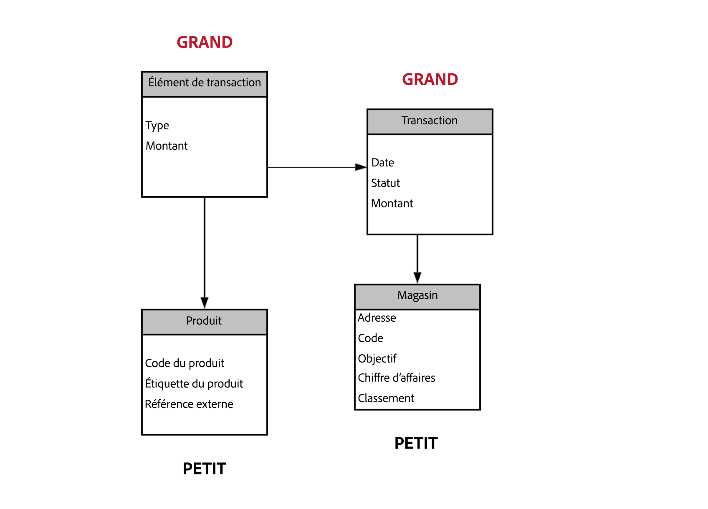

# Bonnes pratiques relatives au modèle de données{#data-model-best-practices}

Ce document présente les principales recommandations lors de la conception de votre modèle de données Adobe Campaign.

Pour une meilleure compréhension des tables intégrées de Campaign et de leur interaction, reportez-vous à [cette section](../../configuration/using/about-data-model.md).

Pour commencer à utiliser les schémas de Campaign, lisez cette [documentation](../../configuration/using/about-schema-reference.md). Découvrez comment configurer des schémas d’extension afin d’étendre le modèle de données conceptuel de la base de données Adobe Campaign en consultant [ce document](../../configuration/using/about-schema-edition.md).

## Vue d&#39;ensemble {#overview}

Le système Adobe Campaign est extrêmement flexible et peut être étendu au-delà de l’implémentation initiale. Toutefois, même si les possibilités sont infinies, il est essentiel de prendre des décisions judicieuses et de construire des bases solides pour commencer à concevoir votre modèle de données.

Ce document présente des cas pratiques courants et les bonnes pratiques pour apprendre à concevoir correctement votre outil Adobe Campaign.

## Architecture du modèle de données {#data-model-architecture}

Adobe Campaign est un puissant système de gestion de campagnes cross-canal. Il peut vous aider à aligner vos stratégies en ligne et hors ligne pour créer des expériences client personnalisées.

### Approche axée sur le client {#customer-centric-approach}

Bien que la plupart des fournisseurs de services de messagerie communiquent avec les clients par le biais d’une approche centrée sur des listes, Adobe Campaign s’appuie sur une base de données relationnelle afin d’obtenir une vision plus large des clients et de leurs attributs.

Cette approche axée sur le client est présentée dans le graphique ci-dessous. La table des **destinataires** en gris représente la table client principale autour de laquelle tout est construit :

Pour obtenir la description de chaque table, accédez à **[!UICONTROL Admin > Paramétrage > Schémas de données]**, sélectionnez une ressource dans la liste et cliquez sur l’onglet **[!UICONTROL Documentation]**.

Le modèle de données par défaut d’Adobe Campaign est présenté dans ce [document](../../configuration/using/data-model-description.md).

>[!NOTE]
>
> Adobe Campaign Classic permet de créer une table client personnalisée. Cependant, dans la plupart des cas, il est recommandé d’utiliser la [table des destinataires](../../configuration/using/about-data-model.md#default-recipient-table) standard qui contient des tables et des fonctionnalités supplémentaires préconfigurées.

### Données pour Adobe Campaign {#data-for-campaign}

Quelles données doivent être envoyées à Adobe Campaign ? Il est essentiel de déterminer les données requises pour vos activités marketing.

>[!NOTE]
>
> Adobe Campaign n&#39;est ni un entrepôt de données, ni un outil de reporting. Vous devez donc éviter d&#39;importer dans Adobe Campaign tous les clients possibles et les informations qui s&#39;y rapportent, ou d&#39;importer des données uniquement pour créer des rapports.

Pour décider si un attribut est nécessaire ou non dans Adobe Campaign, demandez-vous s&#39;il appartient à l&#39;une des catégories suivantes :

* Attribut utilisé pour la **segmentation**
* Attribut utilisé pour les **processus de gestion des données** (calcul agrégé, par exemple)
* Attribut utilisé pour la **personnalisation**

S&#39;il n&#39;appartient à aucune de ces catégories, il est probable que vous n&#39;ayez pas besoin de cet attribut dans Adobe Campaign.

### Choix des types de données {#data-types}

Pour optimiser l’architecture et les performances de votre système, appliquez les bonnes pratiques suivantes pour configurer les données dans Adobe Campaign.

* Une table volumineuse doit essentiellement contenir des champs numériques et des liens vers des tables de référence (si vous utilisez des listes de valeurs).
* L’attribut **expr** permet de définir un attribut de schéma sous la forme d’un champ calculé plutôt que d’une valeur physique définie dans une table. Vous pouvez ainsi accéder aux informations dans un format différent (par exemple, l’âge et la date de naissance) sans avoir à stocker les deux valeurs. Il s’agit d’un bon moyen d’éviter la duplication des champs. Par exemple, la table des destinataires utilise une expression relative au domaine qui est déjà présente dans le champ de l&#39;e-mail.
* Toutefois, lorsque le calcul de l&#39;expression est complexe, il n&#39;est pas recommandé d&#39;utiliser l&#39;attribut **expr**, car le calcul à la volée peut avoir une incidence sur les performances de vos requêtes.
* Le type **XML** est un bon moyen d&#39;éviter de créer des champs superflus. Cependant, il occupe aussi un certain volume d&#39;espace disque, car il utilise une colonne CLOB dans la base de données. Il peut aussi contribuer à la complexité des requêtes SQL et avoir un impact sur les performances.
* La longueur d’un champ de **chaîne** doit toujours être définie avec la colonne. Dans Adobe Campaign, la longueur maximale est de 255 par défaut, mais Adobe recommande de raccourcir le champ si vous savez déjà que la taille ne dépassera pas une longueur inférieure.
* Dans Adobe Campaign, il est acceptable de disposer d&#39;un champ plus court que dans le système source si vous êtes sûr que la taille du système source a été surestimée et ne sera pas atteinte. Cela peut signifier une chaîne plus courte ou un entier plus petit dans Adobe Campaign.

### Choix des champs {#choice-of-fields}

Un champ doit être stocké dans une table s’il est destiné à un ciblage ou une personnalisation. En d’autres termes, si un champ n’est pas utilisé pour envoyer un email personnalisé ou comme critère dans une requête, il occupe de l’espace disque alors qu’il est inutile.

Pour les instances hybrides et on-premise, le module FDA (Federated Data Access, fonctionnalité facultative d’accès aux données externes) répond à la nécessité d’ajouter un champ « à la volée » lors d’un processus de campagne. Si vous disposez de l’option FDA, vous n’avez pas besoin de tout importer. Voir à ce sujet la section [À propos de Federated Data Access](../../installation/using/about-fda.md).

### Choix des clés {#choice-of-keys}

Outre la clé **autopk** définie par défaut dans la plupart des tables, vous pouvez envisager d’ajouter des clés logiques ou métier (numéro de compte, numéro de client, etc.). Vous pourrez l’utiliser ultérieurement pour les imports et les réconciliations ou les packages de données. Pour plus d&#39;informations, voir la section [Identificateurs](#identifiers).

L’efficacité des clés est essentielle pour les performances. Les types de données numériques doivent toujours être préférés comme clés pour les tables.

Avec la base de données SQLServer, vous pouvez envisager d’appliquer des « index clusters » pour optimiser les performances. Comme Adobe ne gère pas cette fonctionnalité, vous devez la créer dans SQL.

### Tablespaces dédiés {#dedicated-tablespaces}

L’attribut tablespace du schéma permet de spécifier un tablespace dédié pour une table.

L’assistant d’installation vous permet de stocker des objets en fonction de leur type (données, temporaire et index).

Les tablespaces dédiés sont plus performants pour la création de partitions et les règles de sécurité. Ils offrent en outre une administration fluide et flexible, une meilleure optimisation et des performances optimales.

## Identificateurs {#identifiers}

Les ressources Adobe Campaign ont trois identifiants et il est possible d&#39;en ajouter un supplémentaire.

Le tableau ci-après décrit ces identifiants et leur finalité.

| Identifiant | Description | Bonnes pratiques |
|--- |--- |--- |
| Id | <ul><li>L’id est la clé primaire physique d’une table Adobe Campaign. Pour les tables d’usine, il s’agit d’un nombre sur 32 bits généré à partir d’une séquence.</li><li>Cet identifiant est généralement unique pour une instance Adobe Campaign spécifique. </li><li>Un id généré automatiquement est visible dans une définition de schéma. Il suffit de rechercher l’attribut *autopk=&quot;true&quot;*.</li></ul> | <ul><li>Les identifiants générés automatiquement ne peuvent pas être utilisés comme référence dans un workflow ou une définition de package.</li><li>Un id n’est pas nécessairement un nombre croissant.</li><li>L’id d’une table d’usine est un nombre sur 32 bits dont le type ne doit pas être modifié. Ce nombre provient d’une « séquence », qui est abordée dans la section éponyme.</li></ul> |
| Nom (ou nom interne) | <ul><li>Cette information est l&#39;identifiant unique d&#39;un enregistrement dans une table. Cette valeur peut être mise à jour manuellement, généralement avec un nom généré.</li><li>Cet identifiant conserve sa valeur lorsqu&#39;il est déployé dans une autre instance d&#39;Adobe Campaign et ne doit pas être vide.</li></ul> | <ul><li>Changez le nom d’enregistrement généré par Adobe Campaign si l’objet est destiné à être déployé d’un environnement à un autre.</li><li>Si un objet possède un attribut d’espace de noms (par exemple, *schema*), cet espace de noms commun sera appliqué à tous les objets personnalisés créés. Certains espaces de noms réservés ne doivent pas être utilisés : *nms*, *xtk*, *nl*, *ncl*, *crm*, *xxl*.</li><li>Lorsqu’un objet n’a pas d’espace de noms (*workflow* ou *delivery*, par exemple), cette notion d’espace de noms est ajoutée sous la forme d’un préfixe d’un objet de nom interne : *namespaceMyObjectName*.</li><li>N’utilisez pas de caractères spéciaux tels que l’espace «   », le point-virgule « ; » ou le tiret « - ». Tous ces caractères seront remplacés par un trait de soulignement « _ » (caractère autorisé). Par exemple, « abc-def » et « abc:def » seront tous deux stockés sous le nom « abc_def » et s’écraseront mutuellement.</li></ul> |
| Libellé | <ul><li>Le libellé est l&#39;identifiant d&#39;entreprise d&#39;un objet ou d&#39;un enregistrement dans Adobe Campaign.</li><li>Cet objet autorise les espaces et les caractères spéciaux.</li><li>Il ne garantit pas le caractère unique d&#39;un enregistrement.</li></ul> | <ul><li>Il est recommandé de déterminer une structure pour les libellés de vos objets.</li><li>Il s&#39;agit de la solution la plus conviviale pour identifier un enregistrement ou un objet pour un utilisateur d&#39;Adobe Campaign.</li></ul> |

## Clés internes personnalisées {#custom-internal-keys}

Pour chaque table créée dans Adobe Campaign, des clés primaires sont nécessaires.

La plupart des organisations importent des enregistrements à partir de systèmes externes. Bien que la clé physique de la table des destinataires soit l&#39;attribut &quot;id&quot;, il est possible de déterminer aussi une clé personnalisée.

Cette clé personnalisée est la clé primaire d’enregistrement réelle dans le système externe chargé d’alimenter Adobe Campaign.

Lorsqu’une table d’usine comporte à la fois une clé autopk et une clé interne, cette clé interne est définie comme index unique dans la table de base de données physique.

Pour la création d’une table personnalisée, vous avez deux possibilités :
* Combinaison d&#39;une clé générée automatiquement (id) et d&#39;une clé interne (personnalisée). Cette option est intéressante si votre clé système est une clé composite ou n&#39;est pas un entier. Les entiers offrent des performances supérieures dans les tables volumineuses et dans la jointure à d’autres tables.
* Utilisation de la clé primaire comme clé primaire du système externe. Cette solution est généralement préférable, car elle simplifie l&#39;approche d&#39;import et d&#39;export des données, avec une clé cohérente entre les différents systèmes. L’autopk doit être désactivé si la clé est nommée « id » et doit être rempli avec des valeurs externes (et non des valeurs générées automatiquement).

>[!IMPORTANT]
>
>Un autopk ne doit pas être utilisé comme référence dans les workflows.

## Séquences {#sequences}

 La clé primaire d’Adobe Campaign est un id généré automatiquement pour toutes les tables d’usine et elle peut être identique pour les tables personnalisées. Voir à ce propos [cette section](#identifiers).

Cette valeur provient d’une **séquence**, constituée d’un objet de base de données servant à générer une séquence de nombres.

Il existe deux types de séquences :
* **Partagée** : plusieurs tables choisissent leur id à partir d’une même séquence. Cela signifie que si un id « X » est utilisé par une table, aucune autre table partageant la même séquence ne disposera d’un enregistrement avec cet id « X ». **XtkNewId** est la séquence partagée par défaut disponible dans Adobe Campaign.
* **Dédiée** : une seule table sélectionne ses id dans la séquence. Le nom de la séquence contient généralement le nom de la table.

>[!IMPORTANT]
>
>La séquence est un nombre entier sur 32 bits, avec un nombre maximal fini de valeurs possibles (2,14 milliards). Après avoir atteint la valeur maximale, la séquence revient à 0 pour effectuer un nouveau cycle de génération d’id.
>
>Faute de purge des anciennes données, il se produit une violation de clé unique, obstacle à l’intégrité et l’utilisation de la plateforme. Adobe Campaign n’est plus en mesure d’envoyer des communications (en cas d’impact sur la table des logs de diffusion), ce qui a un impact sur les performances.

Ainsi, un client qui diffuse 6 milliards d’emails par an en conservant les logs pendant 180 jours, serait à court d’id en 4 mois. Pour éviter un tel problème, veillez à définir les paramètres de purge en fonction de vos volumes. Voir à ce propos [cette section](#data-retention).

Lorsqu’une table personnalisée est créée dans Adobe Campaign avec une clé primaire de type autoPK, une séquence personnalisée dédiée doit être systématiquement associée à cette table.

Par défaut, une séquence personnalisée aura des valeurs comprises entre +1 000 et +2,1 milliards. Techniquement, il est possible d’obtenir un intervalle complet de 4 milliards de valeurs en activant les id négatifs. Cette approche doit être utilisée avec précaution. En effet, un id sera perdu lors du passage d’un nombre négatif à un nombre positif : l’enregistrement 0 est généralement ignoré par Adobe Campaign dans les requêtes SQL générées.

Pour en savoir plus sur l’épuisement des séquences, regardez cette [vidéo](https://helpx.adobe.com/fr/customer-care-office-hours/campaign/sequences-exhaustion-campaign-classic.html).

## des index ; {#indexes}

Les index sont essentiels aux performances. Lorsque vous déclarez une clé dans le schéma, Adobe crée automatiquement un index sur les champs de la clé. Vous pouvez également déclarer d’autres index pour les requêtes qui n’utilisent pas la clé.

Adobe recommande de définir des index supplémentaires, car ils peuvent améliorer les performances.

Gardez toutefois à l’esprit les éléments suivants :

* L’utilisation d’index est liée à votre modèle d’accès. L’optimisation de l’indexation est souvent un élément crucial de la conception des bases de données. Elle doit être gérée par des experts. L’ajout d’index est souvent un processus itératif lié à la maintenance de la base de données. Il est effectué au fil du temps, étape par étape, pour résoudre les problèmes de performances lorsqu’ils surviennent.
* Les index augmentent la taille globale de la table (pour stocker l’index lui-même).
* L’ajout d’un index sur les colonnes peut améliorer les performances d’accès aux données en lecture (SELECT), mais peut aussi les diminuer pour l’accès en écriture (UPDATE).
* Du fait de l’incidence sur les performances lors de l’insertion de données, les index doivent être limités en taille et en nombre.
* N’ajoutez pas d’index lorsque cela est inutile. Assurez-vous de sa nécessité et des gains de performances globales de vos requêtes ainsi obtenus (processus de test et apprentissage).
* En général, un index est considéré comme efficace si vos requêtes ne renvoient pas plus de 10 % des enregistrements.
* Sélectionnez soigneusement les index à définir.
* Ne supprimez pas les index natifs des tables d’usine.

<!--When you are performing an initial import with very high volumes of data insert in Adobe Campaign database, it is recommended to run that import without custom indexes at first. It will allow to accelerate the insertion process. Once you've completed this important import, it is possible to enable the index(es).-->

### Exemple

La gestion des index pouvant devenir très complexe, il est important de comprendre comment ils fonctionnent. Pour illustrer cette complexité, prenons un exemple élémentaire comme la recherche d’un destinataire en effectuant un filtrage sur le prénom et le nom. Pour ce faire :

1. Accédez au dossier de la base de données contenant toutes les personnes destinataires.
1. Cliquez avec le bouton droit sur le champ **[!UICONTROL Prénom]**.
1. Sélectionnez **[!UICONTROL Filtrer sur ce champ]**.

   

1. Répétez cette opération pour le champ **[!UICONTROL Nom]**.

Les deux filtres correspondants sont ajoutés en haut de l’écran.

Vous pouvez maintenant effectuer un filtrage de recherche sur les champs **[!UICONTROL Prénom]** et **[!UICONTROL Nom]** selon les différentes conditions de filtre.

Vous pouvez maintenant ajouter des index pour accélérer les recherches associées à ces filtres. Mais quels index utiliser ?

>[!NOTE]
>
>Cet exemple concerne les clients hébergés qui utilisent une base de données PostgreSQL.

Le tableau ci-après indique dans quels cas les trois index décrits ci-dessous sont utilisés ou non, selon le modèle d’accès affiché dans la première colonne.

| Critères de recherche | Index 1 (prénom + nom) | Index 2 (prénom uniquement) | Index 3 (nom uniquement) | Commentaires |
|--- |--- |--- |--- |--- |
| Prénom est égal à « Jean-Luc » | Utilisé | Utilisé | Non utilisé | Comme le prénom est en première position sur l’index 1, il sera utilisé de toute façon : il n’est pas nécessaire d’ajouter un critère au nom. |
| Prénom est égal à « Jean-Luc » ET Nom est égal à « Durand » | Utilisé | Non utilisé | Non utilisé | La recherche des deux attributs correspondant à la même requête, seul l’index combinant les deux est utilisé. |
| Nom est égal à « Durand » | Non utilisé | Non utilisé | Utilisé | L’ordre des attributs dans l’index est pris en compte. Si vous ne respectez pas cet ordre, l’index ne peut pas être utilisé. |
|  Prénom commence par « Jea » | Utilisé | Utilisé | Non utilisé | La « recherche par la gauche » active les index. |
| Prénom se termine par « Luc » | Non utilisé | Non utilisé | Non utilisé | La « recherche par la droite » désactive les index et une analyse complète est effectuée. Certains types d’index spécifiques peuvent gérer ce cas pratique, mais ils ne sont pas disponibles par défaut dans Adobe Campaign. |
| Prénom contient « Jean » | Non utilisé | Non utilisé | Non utilisé | Il s’agit d’une combinaison de recherches « par la gauche » et « par la droite ». Pour cette raison, cette recherche désactive les index. Une analyse complète est ensuite effectuée. |
| Prénom est égal à « jean » | Non utilisé | Non utilisé | Non utilisé | Les index sont sensibles à la casse. Pour qu’ils ne le soient pas, vous devez créer un index spécifique contenant une fonction SQL telle que &quot;upper(firstname)&quot;. Vous devez faire de même avec les autres transformations de données telles que &quot;unaccent(firstname)&quot;. |

## Liens et cardinalité {#links-and-cardinality}

### Liens {#links}

Attention à l&#39;intégrité &quot;propre&quot; des grandes tables. La suppression d’enregistrements possédant des tables volumineuses avec une intégrité qui leur est propre peut arrêter l’instance. La table est verrouillée et les suppressions sont faites une par une. Il est donc préférable d&#39;appliquer une intégrité &quot;neutre&quot; sur les tables enfants très volumineuses.

La déclaration d&#39;un lien en tant que jointure externe est néfaste pour les performances. L’enregistrement Zero ID émule la fonctionnalité de jointure externe. Il n’est pas nécessaire de déclarer des jointures externes si le lien utilise l’autopk.

Bien qu&#39;il soit possible de joindre n&#39;importe quelle table dans un workflow, Adobe recommande de définir des liens communs entre les ressources directement dans la définition de la structure de données.

Le lien doit être défini en fonction des données réelles contenues dans vos tables. Une mauvaise définition peut avoir un impact sur les données récupérées via les liens, par exemple la duplication inattendue d&#39;enregistrements.

Attribuez au lien un nom cohérent avec celui de la table : le nom du lien doit permettre de comprendre à quoi correspond la table distante.

N’utilisez pas de nom de lien comportant le suffixe « id ». Par exemple, appelez-le « transaction » plutôt que « transactionId ».

Par défaut, Adobe Campaign crée un lien à l&#39;aide de la clé primaire de la table externe. Pour plus de clarté, il est préférable de définir explicitement la jointure dans la définition du lien.

Un index sera ajouté aux attributs utilisés dans un lien.

Les liens created-by et last-modified-by sont présents dans de nombreuses tables. Il est possible de désactiver l’index en utilisant l’attribut noDbIndex sur le lien, si ces informations ne sont pas utilisées par l’entreprise.

### Cardinalité {#cardinality}

Pour créer un lien, veillez à ce que l&#39;enregistrement cible soit unique lorsqu&#39;une relation 1-1 a été déclarée. Dans le cas contraire, la jointure risque de renvoyer plusieurs enregistrements alors qu&#39;un seul est attendu. Cette situation entraîne des erreurs lors de la préparation de la diffusion lorsque &quot;la requête renvoie plus de lignes qu&#39;attendu&quot;. Définissez un nom de lien identique à celui du schéma cible.

Définissez un lien possédant une cardinalité (1-N) dans le schéma du côté (1). Par exemple, la relation Destinataire (1) – (N) Transaction doit être définie dans le schéma de transaction.

Notez que la cardinalité inverse d&#39;un lien est (N) par défaut. Il est possible de définir un lien (1-1) en ajoutant l&#39;attribut revCardinality=&#39;single&#39; à la définition du lien.

Si le lien inverse ne doit pas être visible pour l&#39;utilisateur, vous pouvez le masquer avec la définition de lien revLink=&#39;_NONE_&#39;. Un bon exemple d&#39;utilisation consiste à définir un lien entre le destinataire et la dernière transaction effectuée, par exemple. Il vous suffit de voir le lien entre le destinataire et la dernière transaction. Aucun lien inverse ne doit être visible dans la table de transaction.

Les liens d&#39;une jointure externe (1-0..1) doivent être utilisés avec soin, car ils ont une incidence sur les performances du système.

## Conservation des données - nettoyage et purge {#data-retention}

 Adobe Campaign n&#39;est ni un entrepôt de données, ni un outil de reporting. Pour garantir de bonnes performances, la croissance des bases de données doit rester sous contrôle. Pour cela, il peut être utile de suivre certaines des bonnes pratiques ci-dessous.

Par défaut, les logs de diffusion et de tracking d’Adobe Campaign sont conservés pendant 180 jours. Un processus de nettoyage est appliqué pour supprimer les logs antérieurs.

* Si vous souhaitez les conserver plus longtemps, cette décision doit être prise avec soin en fonction de la taille de la base de données et du volume des messages envoyés. Pour rappel, une séquence Adobe Campaign est définie par un entier sur 32 bits.
* Il est recommandé de ne pas avoir plus d’un milliard de documents à la fois dans ces tables (soit près de 50 % des 2,14 milliards d’id disponibles) pour limiter tout risque d’utiliser l’ensemble de ces id. Pour ce faire, certains clients devront réduire la durée de conservation à moins de 180 jours.

En savoir plus sur la conservation des données dans les [recommandations relatives à la confidentialité et à la sécurité de Campaign](../../platform/using/privacy-and-recommendations.md).

Pour en savoir plus sur le workflow de nettoyage de base de données de Campaign, consultez [cette section](../../production/using/database-cleanup-workflow.md).

>[!IMPORTANT]
>
>Les tables personnalisées ne sont pas purgées par le processus de nettoyage standard. Bien que cela ne soit pas nécessaire dès le début, n&#39;oubliez pas de créer un processus de purge de vos tables personnalisées, faute de quoi des problèmes de performances peuvent se produire.

Il existe un certain nombre de solutions pour minimiser le besoin d&#39;enregistrements dans Adobe Campaign :
* Exportez les données dans un entrepôt de données extérieur à Adobe Campaign.
* Générez des valeurs agrégées qui utilisent moins d&#39;espace, mais suffisantes pour vos pratiques marketing. Par exemple, vous n&#39;avez pas besoin de l&#39;historique complet des transactions client d&#39;Adobe Campaign pour le tracking des derniers achats.

Vous pouvez déclarer l&#39;attribut &quot;deleteStatus&quot; dans un schéma. Il est plus efficace de marquer l&#39;enregistrement comme supprimé, puis de différer la suppression au cours de la tâche de nettoyage.

## Performances {#performance}

Afin d&#39;optimiser les performances à tout moment, suivez les bonnes pratiques ci-dessous.

### Recommandations générales {#general-recommendations}

* Évitez d’utiliser des opérations telles que « CONTAINS » dans les requêtes. Si vous savez ce qui est attendu et souhaitez appliquer un filtre, appliquez la même condition avec un opérateur « EQUAL TO » ou d’autres opérateurs de filtre spécifiques.
* Évitez toute jointure avec des champs non indexés lors de la création de données dans des workflows.
* Veillez à ce que les processus tels que l’import et l’export se produisent en dehors des heures de bureau.
* Vérifiez qu&#39;il existe un planning pour toutes les activités quotidiennes et respectez-le.
* Si un ou plusieurs processus quotidiens échouent et s&#39;ils doivent être exécutés le même jour, vérifiez que des processus en conflit ne sont pas en cours d&#39;exécution lorsque le processus manuel est lancé, car cela peut avoir un impact sur les performances du système.
* Vérifiez qu&#39;aucune campagne quotidienne n&#39;est exécutée pendant le processus d&#39;import ou lorsqu&#39;un processus manuel est exécuté.
* Utilisez une ou plusieurs tables de référence plutôt que de dupliquer un champ dans chaque ligne. Lors de l&#39;utilisation de paires clé/valeur, il est préférable de choisir une clé numérique.
* Une chaîne courte reste acceptable. Si des tables de références sont déjà en place dans un système externe, les réutiliser facilitera l&#39;intégration des données avec Adobe Campaign.

### Relations de type &quot;un à plusieurs&quot;  {#one-to-many-relationships}

* La conception des données a un impact sur la convivialité et les fonctionnalités. Si vous concevez votre modèle de données avec de nombreuses relations de type &quot;un à plusieurs&quot;, il devient plus difficile pour les utilisateurs de construire une logique significative dans l&#39;application. Il peut s’avérer difficile pour les spécialistes marketing n’ayant pas de compétences techniques de construire et de comprendre correctement la logique.
* Qu&#39;une table comporte tous les champs essentiels est une bonne chose car cela facilite la création de requêtes par les utilisateurs. Parfois, pour des raisons de performances, il est aussi judicieux de dupliquer certains champs d’une table à l’autre si cela permet d’éviter une jointure.
* Certaines fonctionnalités intégrées ne pourront pas faire référence à des relations de type &quot;un à plusieurs&quot;, par exemple la formule Pondération d&#39;offre et Diffusions.

## Tables volumineuses {#large-tables}

 Adobe Campaign fait appel à des moteurs de bases de données tiers. Selon le fournisseur, l&#39;optimisation des performances des tables les plus volumineuses peut nécessiter une conception spécifique.

Vous trouverez ci-dessous quelques bonnes pratiques courantes à appliquer lors de la conception de votre modèle de données utilisant des tables volumineuses et des jointures complexes.

* Lorsque vous utilisez des tables de destinataires par défaut supplémentaires, veillez à disposer d&#39;une table de logs dédiée pour chaque mapping de diffusion.
* Diminuez le nombre de colonnes, notamment en identifiant celles qui ne sont pas utilisées.
* Optimisez les relations du modèle de données en évitant les jointures complexes, notamment celles qui concernent plusieurs conditions et/ou colonnes.
* Pour les clés de jointure, préférez toujours les données numériques aux chaînes de caractères.
* Réduisez autant que possible la profondeur de conservation des logs. Si vous avez besoin d&#39;un historique plus détaillé, vous pouvez agréger le calcul et/ou gérer des tables de logs personnalisées pour stocker un historique plus volumineux.

### Taille des tables {#size-of-tables}

La taille de la table est le résultat d&#39;une combinaison du nombre d&#39;enregistrements et du nombre de colonnes par enregistrement. L&#39;un et l&#39;autre peuvent avoir une incidence sur les performances des requêtes.

* Une table de **petite taille** est similaire à la table de diffusion.
* Une table de **taille moyenne** possède une taille identique à celle de la table des destinataires. Elle contient un enregistrement par client.
* Une table de **grande taille** est similaire à la table des broadlogs. Elle contient de nombreux enregistrements par client.
Par exemple, si votre base de données contient 10 millions de destinataires, la table des broadlogs possède entre 100 et 200 millions de messages, et la table de diffusion quelques milliers d’enregistrements.

Avec PostgreSQL, une ligne ne doit pas dépasser 8 Ko pour éviter le mécanisme [TOAST](https://wiki.postgresql.org/wiki/TOAST). Par conséquent, essayez de réduire autant que possible le nombre de colonnes et la taille de chaque ligne afin de maintenir les performances optimales du système (mémoire et processeur).

Le nombre de lignes a également une incidence sur les performances. La base de données d’Adobe Campaign n’est pas conçue pour stocker des historiques qui ne sont pas activement utilisés à des fins de ciblage ou de personnalisation. Il s’agit d’une base de données opérationnelle.

Pour éviter tout problème de performances lié au nombre élevé de lignes, conservez uniquement les enregistrements nécessaires dans la base de données. Les autres enregistrements doivent être exportés vers un entrepôt de données tiers et supprimés de la base de données opérationnelle d&#39;Adobe Campaign.

Voici quelques bonnes pratiques concernant la taille des tables :

* Créez de grandes tables contenant moins de champs et plus de données numériques.
* N’utilisez pas les types correspondant aux grands nombres pour les colonnes (par exemple Int64) si vous souhaitez stocker de petits nombres comme les valeurs booléennes.
* Supprimez les colonnes inutilisées de la définition de la table.
* Ne conservez pas les données historiques ou inactives dans votre base de données Adobe Campaign (export et nettoyage).

Voici un exemple :

Dans cet exemple :
* Les tables *Transaction* et *Élément de transaction* sont volumineuses : plus de 10 millions.
* Les tables *Produit* et *Magasin* sont plus petites : moins de 10 000.
* Les libellés et références de produits ont été placés dans la table *Produit*.
* La table *Élément de transaction* ne comporte qu’un lien vers la table *Produit*, qui est numérique.
