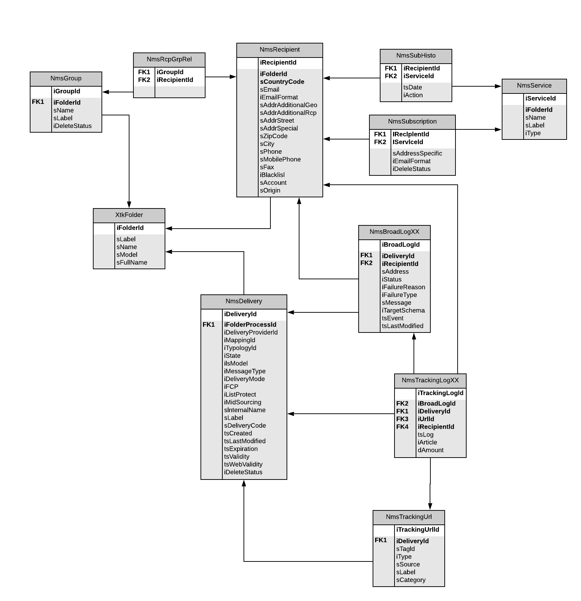
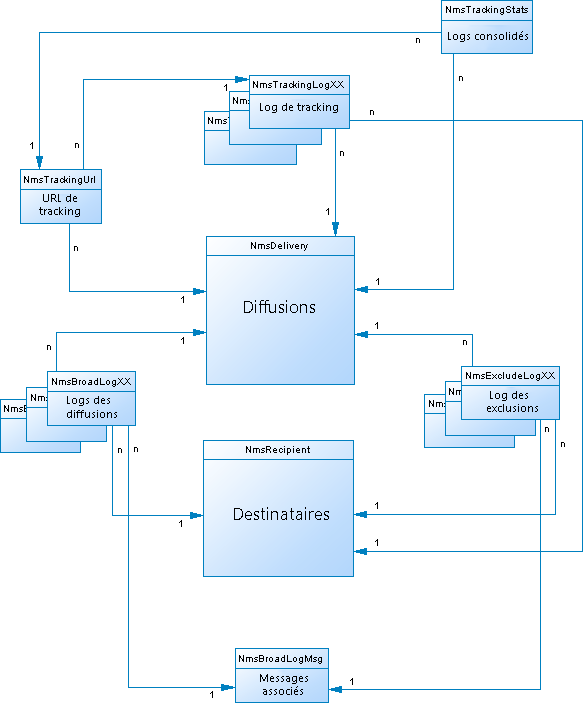
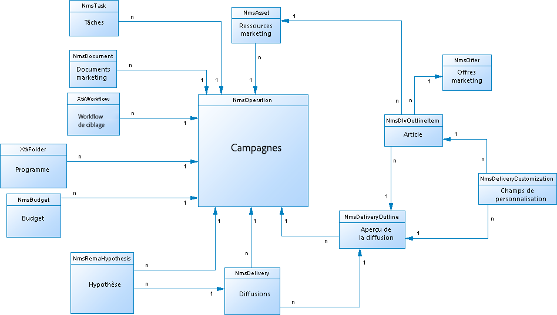
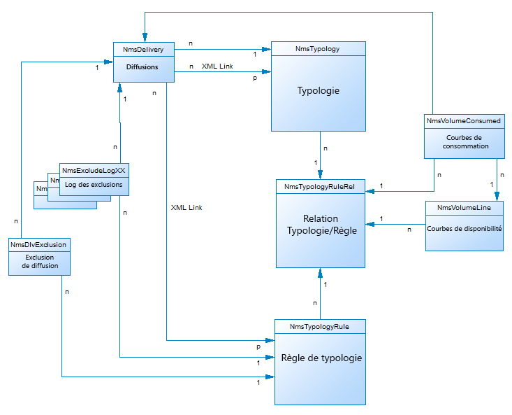
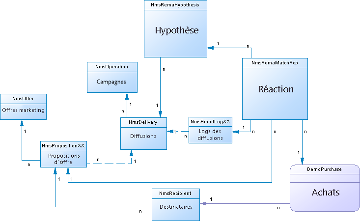
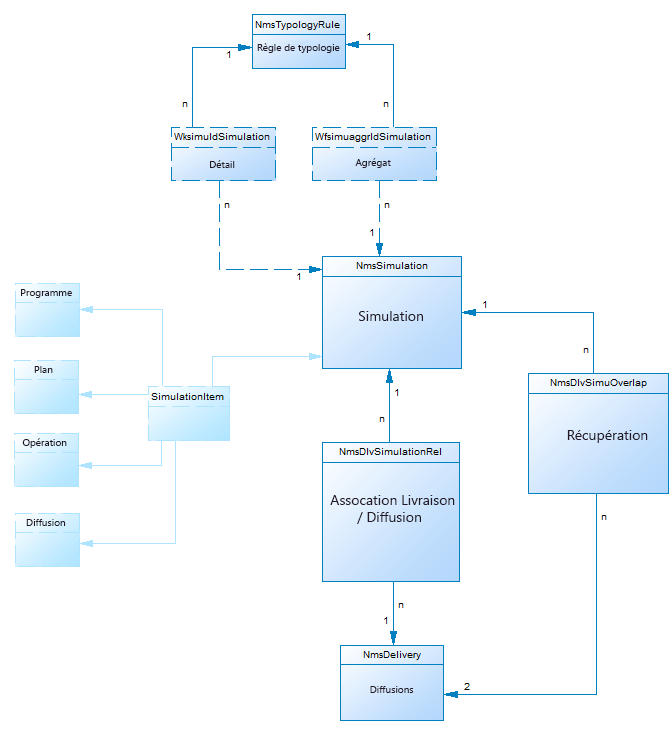
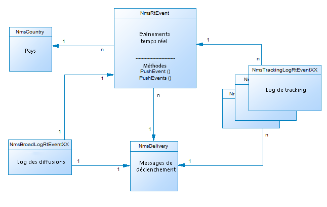
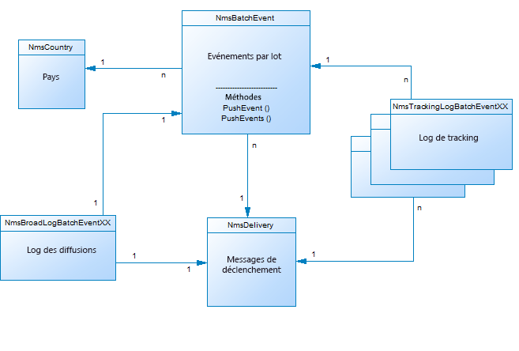
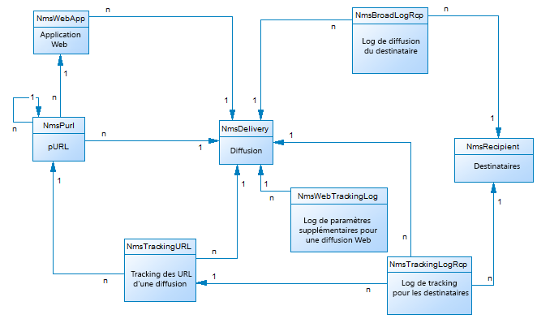
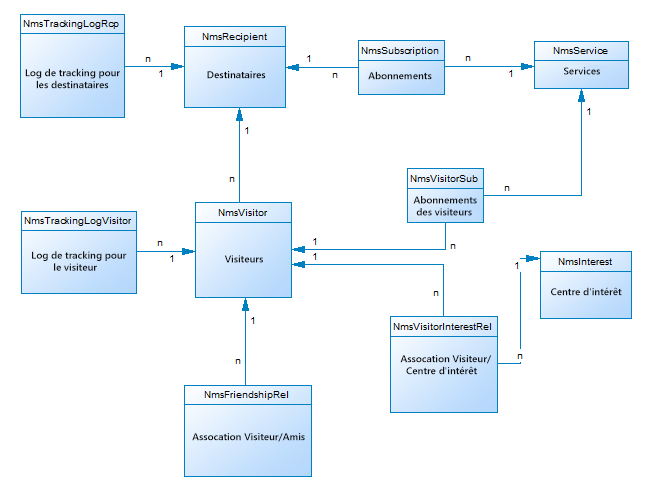

# Description du modèle de données de Campaign{#data-model-description}

Un modèle de données d’usine est fourni avec Adobe Campaign. Cette section donne un certain nombre de détails sur les tables intégrées du modèle de données d’Adobe Campaign et leurs interactions.

Pour obtenir la description de chaque table, accédez à **[!UICONTROL Admin > Paramétrage > Schémas de données]**, sélectionnez une ressource dans la liste et cliquez sur l’onglet **[!UICONTROL Documentation]**.

>[!NOTE]
>
>La structure physique et logique des données véhiculées dans l&#39;application est décrite en XML et respecte une grammaire propre à Adobe Campaign appelée schéma. Pour en savoir plus sur les schémas Adobe Campaign, lisez cette [section](../../configuration/using/about-schema-reference.md).

## Description des tables principales {#description-main-tables}

Adobe Campaign repose sur une base de données relationnelle contenant des tables liées entre elles.

Le diagramme ci-après illustre les jointures entre les principales tables métier du modèle de données d’Adobe Campaign et leurs champs principaux.

<!---->

Le modèle de données prédéfini d’Adobe Campaign est constitué des principales tables répertoriées ci-dessous.

### NmsRecipient {#NmsRecipient}

Ce tableau correspond au schéma **nms:recipient**.

Il s’agit de la table par défaut utilisée pour les **destinataires des diffusions**. Elle contient les informations nécessaires aux diffusions effectuées par l’intermédiaire des différents canaux :

* sEmail : adresse email.
* iEmailFormat : format à privilégier pour les emails (1 pour le texte, 2 pour le code HTML et 0 si indéfini).
* Les champs sAddress1, sAddress2, sAddress3, sAddress4, sZipCode, sCity sont utilisés pour construire l’adresse postale (conformément à la norme AFNOR XPZ 10-011 de mai 1997).
* Les champs sPhone, sMobilePhone, sFax contiennent respectivement les numéros de téléphone, de téléphone mobile et de fax.
* iBlackList est l’indicateur d’opt-out par défaut utilisé pour les profils (1 signifie « désabonné », 0 dans le cas contraire).

Le champ iFolderId est la clé étrangère servant à relier le destinataire à son dossier d’exécution. Pour plus d&#39;informations, consultez la section [XtkFolder](#XtkFolder).

Le champ sCountryCode contient le code ISO 3166-1 Alpha 2 (2 caractères) du pays associé au destinataire. Ce champ est en fait une clé étrangère liée à la table de référence des pays (NmsCountry), qui contient les libellés des pays et d’autres données relatives aux codes des pays. Si le pays n’est pas renseigné, la valeur « XX » est indiquée (et est utilisée à la place d’un enregistrement d’ID nul).

Pour plus d’informations sur la table des destinataires, voir cette [section](../../configuration/using/about-data-model.md#default-recipient-table).

### NmsGroup {#NmsGroup}

Ce tableau correspond au schéma **nms:group**.

Elle permet de créer des **groupes statistiques destinataires**. Il existe une relation de type « plusieurs à plusieurs » entre destinataires et groupes. Par exemple, un destinataire peut appartenir à plusieurs groupes et un groupe peut contenir plusieurs destinataires. Il est possible de créer manuellement des groupes par le biais d’un import ou d’un ciblage de diffusion. Les groupes sont souvent utilisés comme cibles de diffusion. Il existe un index unique relatif au champ qui représente le nom interne du groupe sName. Le groupe est lié à un dossier (la clé est iFolderId. Pour plus d&#39;informations, consultez la section [XtkFolder](#XtkFolder)).

### NmsRcpGrpRel {#NmsRcpGrpRel}

La table de relations NmsRcpGrpRel ne contient que les deux champs correspondant aux identifiants des tables liées iRecipientId et iGroupId.

### NmsService {#NmsService}

Ce tableau correspond au schéma **nms:service**.

Adobe Campaign permet de créer et de gérer des abonnements à des services d’information (rubriques). La table NmsService contient la définition des services d’information (rubriques) proposés à vos destinataires pour qu’ils s’abonnent (par exemple à une newsletter).

Les services sont des entités similaires aux groupes (regroupements statiques de destinataires), sauf qu’ils diffusent davantage d’informations et facilitent la gestion des abonnements et des désabonnements grâce à des formulaires.

Il existe un index unique relatif au champ qui représente le nom interne du service sName. Le service est lié à un dossier (la clé est iFolderId. Pour plus d&#39;informations, consultez la section [XtkFolder](#XtkFolder)). Enfin, le champ iType spécifie le canal de diffusion de ce service (0 pour les emails, 1 pour les SMS, 2 pour le téléphone, 3 pour le courrier et 4 pour le fax).

### NmsSubscription {#NmsSubscription}

Ce tableau correspond au schéma **nms:subscription**.

Elle permet de gérer les abonnements des destinataires à des services d’information.

### NmsSubHisto {#NmsSubHisto}

Ce tableau correspond au schéma **nms:subHisto**.

Si les abonnements sont gérés à l’aide de formulaires web ou de l’interface de l’application, tous les abonnements et désabonnements sont répertoriés dans la table NmsSubHisto. Le champ iAction spécifie l’action (0 pour les abonnements et 1 pour les désabonnements) effectuée à la date indiquée dans le champ tsDate.

### NmsDelivery {#NmsDelivery}

Ce tableau correspond au schéma **nms:delivery**.

Chaque enregistrement de cette table représente une **action de diffusion** ou un **modèle de diffusion**. Elle contient tous les paramètres nécessaires pour effectuer des diffusions (cible, contenu, etc.). Les logs de diffusion (NmsBroadLog) et leurs URL de tracking associées (NmsTrackingUrl) sont créés au cours de la phase d’analyse (voir ci-dessous pour plus de détails sur ces deux tables).

Il existe un index unique relatif au champ qui représente le nom interne de la diffusion ou du scénario sInternalName. La diffusion est liée à un dossier d’exécution (la clé étrangère est iFolderProcessId. Pour plus d&#39;informations, consultez la section [XtkFolder](#XtkFolder)).

### XtkFolder {#XtkFolder}

Il contient **tous les dossiers de l’arborescence** visibles dans l’onglet **Navigation** de la console.

Les dossiers sont associés à des types : la valeur du champ sModel indique le type des données éventuellement contenues dans le dossier. Ce champ permet également à la console cliente d’afficher correctement les données à l’aide des formulaires correspondants. Les valeurs possibles de ce champ sont définies dans navTree.

L’arborescence est gérée à l’aide des champs iParentId et iChildCount. Le champ sFullName indique le chemin d’accès complet du dossier dans l’arborescence. Enfin, il existe un index unique relatif au champ qui représente le nom interne du dossier sName.

## Diffusion et tracking {#delivery-and-tracking}

Cet ensemble de tables, lié au module **Diffusion**, permet de surveiller les diffusions et les éventuels problèmes rencontrés lors de l’envoi des messages. Pour plus d&#39;informations, consultez la section [Suivre les diffusions](../../delivery/using/about-delivery-monitoring.md). Pour plus d&#39;informations, consultez la section [Tracker les messages](../../delivery/using/about-message-tracking.md).

**NmsBroadLogMsg** : ce tableau correspond au schéma **nms:broadLogMsg**. Il s’agit d’une extension de la table des logs de diffusion.

## Gestion de campagne {#campaign-management}

Cet ensemble de tables, lié au module **Campagnes marketing**, permet de définir, d’optimiser, d’exécuter et d’analyser les campagnes de communication et de marketing Voir à ce sujet la documentation [Campaign v8](https://experienceleague.adobe.com/docs/campaign/campaign-v8/campaigns/campaigns.html?lang=fr){target=_blank}.

* **NmsOperation** : ce tableau correspond au schéma **nms:operation**. Elle contient les données relatives aux campagnes marketing.
* **NmsDeliveryOutline** : ce tableau correspond au schéma **nms:deliveryOutline**. Elle contient les propriétés étendues de la diffusion (composition de la diffusion).
* **NmsDlvOutlineItem** : ce tableau correspond au schéma **nms:dlvOutlineItem**. Elle contient les articles d’une composition de diffusion.
* **NmsDeliveryCustomization** : ce tableau correspond au schéma **nms:deliveryCustomization**. Elle contient les champs de personnalisation d’une diffusion.
* **NmsBudget** : cette table correspond au schéma **nms:budget**. Elle contient les données de budget d’une campagne, d’un plan, d’un programme, d’une tâche et/ou de diffusions.
* **NmsDocument** : ce tableau correspond au schéma **nms:document**. Elle contient les documents marketing de la campagne sous forme de fichiers (images, fichiers Excel ou Word, etc.)
* **XtkWorkflow** : ce tableau correspond au schéma **xtk:workflow**. Elle contient le ciblage de la campagne.
* **NmsTask** : ce tableau correspond au schéma **nms:task**. Elle contient la définition d’une tâche marketing.
* **NmsAsset** : ce tableau correspond au schéma **nms:asset**. Elle contient la définition d’une ressource marketing.

## Cohérence des communications {#communication-consistency}

Cet ensemble de tables, lié au module **Optimisation des campagnes**, permet de contrôler, de filtrer et de surveiller l’envoi des diffusions. Reportez-vous à la documentation de [Campaign v8](https://experienceleague.adobe.com/docs/campaign/automation/campaign-optimization/campaign-typologies.html?lang=fr){target="_blank"}.

* **NmsTypologyRule** : ce tableau correspond au schéma **nms:typologyRule**. Elle contient les règles applicables aux diffusions, selon leurs typologies.
* **NmsTypology** : ce tableau correspond au schéma **nms:typology**. Elle contient l’ensemble des règles applicables aux diffusions en correspondance avec leur typologie.
* **NmsTypologyRuleRel** : ce tableau correspond au schéma **nms:typologyRuleRel**. Elle contient les relations entre les typologies et leurs règles.
* **NmsVolumeLine** : ce tableau correspond au schéma **nms:volumeLine**. Elle contient l’ensemble des lignes de disponibilité des règles de capacité.
* **NmsVolumeConsumed** : ce tableau correspond au schéma **nms:volumeConsumed**. Elle contient toutes les lignes de consommation des règles de capacité.

## Gestion de la réaction {#response-management}

Cet ensemble de tables, lié au module **Gestion de la réaction**, permet de mesurer le succès et la rentabilité des campagnes marketing ou des propositions d’offres pour tous les canaux de communication. Pour plus d&#39;informations, consultez la section [À propos de la gestion de la réaction](../../response/using/about-response-manager.md).

### NmsRemaHypothesis {#NmsRemaHypothesis}

Ce tableau correspond au schéma **nms:remaHypothesis**. Elle contient la définition de l’hypothèse de mesure.

Ce tableau contient des informations importantes stockées au format XML, notamment :

**Contexte d’exécution (informations stockées au format XML)**

Le contexte d’exécution renseigne les tables et les champs à prendre en compte pour le calcul des mesures, à savoir :
* Schéma de stockage des logs de réaction nms:remaMatchRcp.
*  Le schéma de la table de transaction (achats, par exemple)
* Le schéma de requêtage, destiné à définir la table de départ des conditions des hypothèses
* Les liens vers les personnes, pour les identifier spécifiquement en fonction du schéma de requêtage
* La date de transaction Ce champ n’est pas obligatoire, mais nous vous recommandons de l’utiliser pour limiter le périmètre de calcul.
* Le montant de la transaction : il s’agit d’un champ facultatif pour calculer automatiquement les indicateurs de chiffre d’affaires.

**Périmètre de l’hypothèse (informations stockées au format XML)**

Le périmètre de l’hypothèse consiste à filtrer l’hypothèse en fonction de la table du schéma de requêtage.

**Script de surcharge d’hypothèse (informations stockées au format XML)**

Le script de surcharge de l’hypothèse, écrit en code JavaScript, permet de surcharger le contenu de l’hypothèse en cours d’exécution.

**Indicateurs de mesure**

Les indicateurs suivants sont automatiquement mis à jour lors de l’exécution de l’hypothèse :

* Nombre de réactions : **iTransaction**. Nombre de lignes dans la table des logs de réaction.
* Nombre de contactés : **iContactReacted**. Nombre distinct de contacts ciblés dans l’hypothèse.
* Nombre de contacts de la population témoin : **iProofReacted**. Nombre distinct de contacts ciblés de la population témoin pour l’hypothèse.
* Taux de réponse des contactés : **dContactReactedRate**. Taux de réponse des contacts ciblés pour l’hypothèse.
* Taux de réponse de la population témoin : **dProofReactedRate**. Taux de réponse de la population témoin pour l’hypothèse.
* Chiffre d’affaires total de la population contactée : **dContactReactedTotalAmount**. Chiffre d’affaires total des contacts ciblés dans l’hypothèse.
* Chiffre d’affaires moyen de la population témoin : **dContactReactedAvgAmount**. Chiffre d’affaires moyen des contacts ciblés de la population témoin dans l’hypothèse.
* Chiffre d’affaires total de la population témoin : **dProofReactedTotalAmount**. Chiffre d’affaires total de la population témoin de l’hypothèse.
* Chiffre d’affaires moyen de la population témoin : **dProofReactedAvgAmount**. Chiffre d’affaires moyen de la population témoin de l’hypothèse.
* Marge totale des contactés : **dContactReactedTotalMargin**. Marge totale des contacts ciblés dans l’hypothèse.
* Marge moyenne des contactés : **dContactReactedAvgMargin**. Marge moyenne des contacts ciblés dans l’hypothèse.
* Marge totale de la population témoin : **dProofReactedTotalMargin**. Marge totale de la population témoin ciblée dans l’hypothèse.
* Marge moyenne de la population témoin : **dProofReactedAvgMargin**. Marge moyenne de la population témoin ciblée dans l’hypothèse
* Chiffre d’affaires additionnel : **dAdditionnalAmount**. (Chiffre d’affaires moyen des contactés - chiffre d’affaires moyen de la population témoin) * nombre des contactés.
* Marge additionnelle : **dAdditionalMargin**. (Marge moyenne des contactés - marge moyenne de la population témoin) / nombre des contactés.
* Coût moyen des contactés (expression SQL). Coût calculé de la diffusion / nombre des contactés.
* ROI (expression SQL). Coût calculé de la diffusion / marge totale des contactés.
* ROI effectif (expression SQL). Coût calculé de la diffusion / marge additionnelle.
* Significativité : **iSignificativy** (expression SQL). Contient des valeurs comprises entre 0 et 3 selon la significativité de la campagne.

### NmsRemaMatchRcp {#NmsRemaMatchRcp}

Ce tableau correspond au schéma **nms:remaMatchRcp**.

Elle contient un enregistrement qui représente la réaction d’une personne à une hypothèse donnée. Ces enregistrements ont été créés lors de l’exécution de l’hypothèse.

## Simulation et diffusion {#simulation-and-delivery}

Cet ensemble de tables est lié au module **Simulation**. Il permet de tester la distribution d’offres appartenant à une catégorie ou à un environnement avant d’envoyer votre proposition aux destinataires. Voir à ce sujet la section [À propos de la simulation des offres](../../interaction/using/about-offers-simulation.md).

* **NmsSimulation** : ce tableau correspond au schéma **nms:simulation**. Elle représente une simulation pour un ensemble de diffusions ou d’offres pour une population donnée.
* **NmsDlvSimulationRel** : ce tableau correspond au schéma **nms:dlvSimulationRel**. Elle contient la liste des diffusions prises en compte dans la simulation. La portée de la simulation est stockée au format XML.
* **NmsOfferSimulationRel** : Ce tableau correspond au schéma **nms:offerSimulationRel**. Elle permet de lier une simulation à une offre.

## Module Interaction {#interaction-module}

Cet ensemble de tables est lié au module **Interaction**. Il permet de répondre en temps réel lors d’une interaction avec un contact donné en proposant une ou plusieurs offres adaptées. Pour plus d&#39;informations, consultez la section [Interaction et gestion des offres](../../interaction/using/interaction-and-offer-management.md) de.

* **NmsOffer** : Ce tableau correspond au schéma **nms:offer**. Elle contient la définition des offres marketing.
* **NmsPropositionRcp** : ce tableau correspond au schéma **nms:propositionRcp**. Elle contient le log cross-canal des propositions marketing envoyées à chaque personne. L’enregistrement est créé suite à la préparation ou à la présentation effective d’une proposition à une personne.
* **NmsOfferSpace** : Ce tableau correspond au schéma **nms:offerSpace**. Elle contient la définition des emplacements pour lesquels des propositions sont faites.
* **NmsOfferContext** : Ce tableau correspond au schéma **nms:offerContext**. Elle contient des critères supplémentaires relatifs à l’applicabilité de la proposition ainsi que la définition de la formule de calcul du poids.
* **NmsOfferView** : ce tableau correspond au **nms:offerView**. Elle contient les représentations des offres.
* **NmsOfferCategory** : ce tableau correspond au **nms:offerCategory**. Elle contient les catégories des offres.
* **NmsOfferEnv** : Ce tableau correspond au **nms:offerEnv**. Elle contient les environnements des offres.

## Module Message Center {#message-center-module}

L’ensemble de tables ci-après est lié au module **Messages transactionnels** (Message Center). Il permet de gérer les communications individuelles et uniques envoyées à un utilisateur et générées suite à des événements déclenchés à partir de systèmes d’information. Pour plus d&#39;informations, consultez la section [À propos des messages transactionnels](../../message-center/using/about-transactional-messaging.md).

### NmsRtEvent {#NmsRtEvent}

Ce tableau correspond au schéma **nms:rtEvent**. Elle contient une définition des événements temps réel.

### NmsBatchEvent {#NmsBatchEvent}

Ce tableau correspond au schéma **nms:batchEvent**. Elle contient la définition des événements par lots.

<!--## Microsites Module {#microsites-module}

This set of tables is linked to the **Web applications** functionality, which allows to create and publish dynamic and interactive web applications with data from the database and content adapted to the rights of the connected user. For more on this, see [About web applications](../../web/using/about-web-applications.md).

* **NmsTrackingUrl**: This table matches the **nms:trackingUrl** schema.

* **NmsPurl**: This table matches the **nms:purl** schema.-->

## Module NMAC {#nmac-module}

Cet ensemble de tables est lié au module **Canal des applications mobiles**. Il permet d’envoyer des notifications personnalisées aux terminaux iOS et Android par le biais d’applications. Voir à ce propos la section [À propos du canal des applications mobile](../../delivery/using/about-mobile-app-channel.md).

* **NmsMobileApp** : ce tableau correspond au schéma **nms:mobileApp**. Elle contient les applications mobiles définies dans Adobe Campaign.
* **NmsAppSubscription** : cette table correspond au schéma **nms:appSubscription**. Elle contient les informations relatives aux abonnés concernant une ou plusieurs applications.
* **NmsAppSubscriptionRcp** : cette table correspond au schéma **nms:appSubscriptionRcp**. Elle permet de relier les visiteurs abonnés à une application avec la table des destinataires.
* **NmsExcludeLogAppSubRcp** : cette table correspond au schéma **nms:excludeLogAppSubRcp**.
* **NmsTrackingLogAppSubRcp** : cette table correspond au schéma **nms:trackingLogAppSubRcp**.
* **NmsBroadLogAppSubRcp** : cette table correspond au schéma **nms:broadLogAppSubRcp**.

## Module Social Marketing {#social-marketing-module}

Cet ensemble de tables est lié au module **Gestion des réseaux sociaux** qui permet d’interagir avec la clientèle et les prospects via Facebook et X (anciennement Twitter). Pour plus d&#39;informations, consultez la section [À propos du marketing sur les réseaux sociaux](../../social/using/about-social-marketing.md).

* **NmsVisitor** : ce tableau correspond au schéma **nms:visitor**. Elle contient des informations sur les visiteurs.
* **NmsVisitorSub** : ce tableau correspond au schéma **nms:visitorSub**. Elle permet de lier une personne aux services auxquels elle est abonnée (X ou Facebook).
* **NmsFriendShipRel** : ce tableau correspond au schéma **nms:friendshipRel**. Elle permet de lier des visiteurs à leurs amis dans le cadre du service Facebook.
* **NmsVisitorInterestRel** : ce tableau correspond au schéma **nms:visitorInterestRel**. Elle permet de lier des visiteurs et leurs centres d’intérêt.
* **NmsInterest** : ce tableau correspond au schéma **nms:interest**. Elle contient la liste des centres d’intérêt de chaque visiteur.
