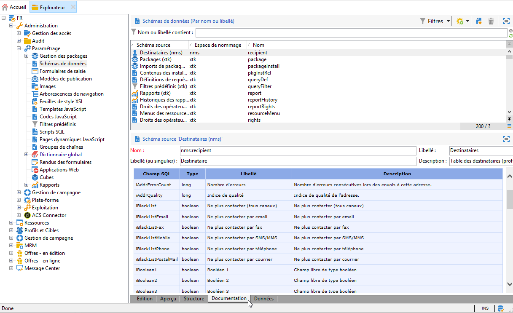

# Description du modèle de données Campaign{#data-model-description}

Un modèle de données d&#39;usine est fourni avec Adobe Campaign. Cette section donne quelques détails sur les tableaux intégrés du modèle de données Adobe Campaign  et sur leur interaction.

Pour accéder à la description de chaque tableau, accédez à **[!UICONTROL Admin > Configuration > Data schemas]**, sélectionnez une ressource dans le et cliquez sur l’ **[!UICONTROL Documentation]** onglet.

>[!NOTE]
>
>La structure physique et logique des données véhiculées dans l&#39;application est décrite en XML et respecte une grammaire propre à Adobe Campaign appelée schéma. Pour en savoir plus sur  Adobe Campaign, lisez cette [section](../../configuration/using/about-schema-reference.md).

## Description des tableaux principaux {#description-main-tables}

 Adobe Campaign s&#39;appuie sur une base de données relationnelle contenant des tables qui sont reliées entre elles.

Le diagramme suivant montre les jointures entre les principaux tableaux d&#39;activité du modèle de données Adobe Campaign  et les champs principaux de chacun.

<!---->

Le modèle de données  prédéfini Adobe Campaign comprend les tableaux principaux suivants.

### NmsRecipient {#NmsRecipient}

Ce tableau correspond au  **nms:** .

Il s’agit du tableau par défaut utilisé pour les **de**. Par conséquent, il contient les informations requises pour les  par l&#39;intermédiaire des divers  de :

* sEmail : adresse électronique.
* iEmailFormat : format préféré pour les courriers électroniques (1 pour le texte, 2 pour le code HTML et 0 si non défini).
* sAddress1, sAddress2, sAddress3, sAddress4, sZipCode, sCity sont utilisés pour construire l’adresse postale (conformément à la norme XPZ 10-011 AFNOR de mai 1997).
* sPhone, sMobilePhone, sFax contiennent respectivement les numéros de téléphone, de téléphone mobile et de fax.
* iBlackList est l’indicateur d’exclusion par défaut utilisé pour le  du (1 signifie &quot;désabonnement&quot;, 0 dans le cas contraire).

Le champ iFolderId est la clé étrangère qui lie le à son dossier d’exécution. For more on this, see [XtkFolder](#XtkFolder).

Le champ sCountryCode correspond au code ISO 3166-1 Alpha 2 (2 caractères) du pays associé au. Ce champ est en fait une clé étrangère sur la table de référence du pays (NmsCountry), qui contient les étiquettes du pays et d&#39;autres données de code du pays. Si le pays n’est pas renseigné, la valeur XX est stockée (et utilisée à la place d’un enregistrement d’ID nul).

Pour plus d’informations sur le tableau du, reportez-vous à cette [section](../../configuration/using/about-data-model.md#default-recipient-table).

### NmsGroup {#NmsGroup}

Ce tableau correspond au  **nms:group** .

Il vous permet de créer des groupes **statistiques de**. Il existe une relation de type &quot;plusieurs à plusieurs&quot; entre et groupes. Par exemple, un peut appartenir à plusieurs groupes et un groupe peut contenir plusieurs. Les groupes peuvent être créés manuellement, par le biais d’une importation ou d’un ciblage de . Les groupes sont souvent utilisés comme  . Il existe un index unique sur le champ représentant le nom interne du groupe sName. Le groupe est lié à un dossier (la clé est iFolderId. For more on this, see [XtkFolder](#XtkFolder)).

### NmsRcpGrpRel {#NmsRcpGrpRel}

La table de relations NmsRcpGrpRel contient uniquement les deux champs correspondant aux identificateurs des tables liées iRecipientId et iGroupId.

### NmsService {#NmsService}

Ce tableau correspond au  **nms:service** .

Les services sont des entités qui sont similaires aux groupes (groupes de statiques), sauf qu&#39;ils diffusent plus d&#39;informations et permettent une gestion facile des  de  et de de l&#39;par le biais de formulaires.

Il existe un index unique sur le champ représentant le nom interne du service sName. Le service est lié à un dossier (la clé est iFolderId. For more on this, see [XtkFolder](#XtkFolder)). Enfin, le champ iType spécifie le  de ce service (0 pour le courrier électronique, 1 pour le SMS, 2 pour le téléphone, 3 pour le courrier direct et 4 pour le fax).

### NmsSubscription {#NmsSubscription}

Ce tableau correspond au **** nms: .

Il vous permet de gérer   à l&#39; de l&#39;.

### NmsSubHisto {#NmsSubHisto}

Ce tableau correspond au  **nms:subHisto** .

Si les  de  sont gérées à l’aide de formulaires Web ou de l’interface de l’application, tous les sous-titres et les  de sont répertoriés dans le tableau NmsSubHisto. Le champ iAction spécifie l’action (0 pour  et 1 pour ) effectuée à la date stockée dans le champ tsDate.

### NmsDelivery {#NmsDelivery}

Ce tableau correspond au **** nms:.

Chaque enregistrement de ce tableau représente une action **** ou un ****. Il contient tous les paramètres nécessaires à l’exécution des  de (le , le contenu, etc.). Les journaux de  (diffusion) (NmsBroadLog) et les URL de suivi associées (NmsTrackingUrl) sont créés au cours de la phase  de l&#39; de l&#39;(voir ci-dessous pour plus de détails sur ces deux tableaux).

Il existe un index unique sur le champ représentant le nom interne du ou du scénario sInternalName. Le est lié à un dossier d’exécution (la clé étrangère est iFolderProcessId. For more on this, see [XtkFolder](#XtkFolder)).

### XtkFolder {#XtkFolder}

Il contient **tous les dossiers de l’arborescence** visibles dans l’onglet **Navigation** de la console.

Les dossiers sont saisis : la valeur du champ sModel spécifie le type de données pouvant être contenues dans le dossier. Ce champ permet également à la console client d’afficher correctement les données avec les formulaires correspondants. Les valeurs possibles de ce champ sont définies dans navTree.

L’arborescence est gérée par les champs iParentId et iChildCount. Le champ sFullName indique le chemin d’accès complet du dossier dans l’arborescence. Enfin, il existe un index unique sur le champ représentant le nom interne du dossier sName.

##  et suivi des {#delivery-and-tracking}

**NmsBroadLogMsg**: Ce tableau correspond au  **nms:broadLogMsg** . Il s’agit d’une extension de la table du journal des  du.

## Gestion de campagne {#campaign-management}

* **NmsOperation**: Ce tableau correspond au  **nms:operation** . Il contient les données des campagnes marketing.
* **NmsDeliveryOutline**: Ce tableau correspond au  **nms:deliveryOutline** . Il contient les propriétés étendues du  ().
* **NmsDlvOutlineItem**: Ce tableau correspond au  **nms:dlvOutlineItem** . Il contient les articles d’un .
* **NmsDeliveryCustomization**: Ce tableau correspond au  **nms:deliveryCustomization** . Il contient le  d’un  de.
* **NmsBudget**: Ce tableau correspond au  **nms:budget** . Il contient les données d’un budget sur une campagne, un plan, un , un, un  et/ou un .
* **NmsDocument**: Ce tableau correspond au **** nms:. Il contient le marketing de la campagne sous la forme de fichiers (images, fichiers Excel ou Word, etc.)
* **XtkWorkflow**: Ce tableau correspond au  **xtk:workflow** . Il contient le ciblage de campagne.
* **NmsTask**: Ce tableau correspond au **** nms:. Il contient la définition d’un  marketing.
* **NmsAsset**: Ce tableau correspond au  **nms:asset** . Il contient la définition d’un .

## Cohérence des communications {#communication-consistency}

* **NmsTypologyRule**: Ce tableau correspond au  **nms:typologyRule** . Il contient les règles qui s&#39;appliquent aux selon les typologies.
* **NmsTypology**: Ce tableau correspond au  **nms:typology** . Il contient l’ensemble de règles à appliquer aux  qui correspondent à la typologie.
* **NmsTypologyRuleRel**: Ce tableau correspond au  **nms:typologyRuleRel** . Il contient les relations entre les typologies et leurs règles.
* **NmsVolumeLine**: Ce tableau correspond au  **nms:volumeLine** . Il contient l&#39;ensemble des lignes de disponibilité des règles de capacité.
* **NmsVolumeConsumed**: Ce tableau correspond au  **nms:volumeConsumed** . Il contient toutes les lignes de consommation des règles de capacité.

## Gestion des réponses {#response-management}

### NmsRemaHypothèse {#NmsRemaHypothesis}

Ce tableau coïncide avec le  **nms:remaHypothèse** . Il contient la définition de la mesure  .

Ce tableau contient des informations importantes stockées dans XML, notamment :

**Contexte d’exécution (informations stockées dans XML)**

Le contexte d’exécution renseigne les tableaux et les champs à prendre en compte pour le calcul des mesures, à savoir :
* Le journal de réaction nms:remaMatchRcp  le  .
*  de la table de transaction (achats, par exemple).
* Le d’interrogation, qui vous permet de définir la table  des conditions dede .
* Liens vers des individus, qui vous permettent d’identifier l’individu en fonction du d’interrogation.
* Date de transaction. Ce champ n’est pas obligatoire, mais nous vous recommandons de l’utiliser pour limiter le périmètre de calcul.
* Montant de la transaction : il s’agit d’un champ facultatif permettant de calculer automatiquement les indicateurs de recettes.

**de périmètre du (informations stockées dans XML)**

Le périmètre   consiste à filtrer le de la  en fonction de la table du d’interrogation.

**script de  surcharge du (informations stockées dans XML)**

Le script de  de surcharge du est un code JavaScript qui vous permet de surcharger le contenu du  pendant l’exécution.

**Indicateurs de mesure**

Les indicateurs suivants sont mis à jour automatiquement lors de l’ d’exécution du  :

* Nombre de réactions : **iTransaction**. Nombre de lignes dans le tableau des journaux de réaction.
* Nombre de personnes contactées : **iContactReact**. Nombre unique de contacts ciblés dans le  .
* Nombre de  : **iProofReact**. Nombre unique de contacts  ciblés dans la  de l’.
* Taux de réponse contacté : **dContactReactRate**. Taux de réponse des contacts ciblés dans le  .
* Taux de réponse du  : **dProofReactRate**. Taux de réponse de la   .
* Recettes totales de la population contactée : **dContactReactTotalAmount**. Recettes totales des contacts ciblés dans le  .
* Recettes moyennes des  : **dContactReactAvgAmount**. Recettes moyennes des contacts  du ciblé dans la  de l’.
* Recettes totales du  : **dProofReactTotalAmount**. Recettes totales de la   .
* Recettes moyennes des  : **dProofReactAvgAmount**. Recettes moyennes de l&#39;  .
* Marge totale par contact : **dContactReactTotalMargin**. Marge totale par contact ciblé dans le  .
* Marge moyenne par contact : **dContactReactAvgMargin**. Marge moyenne par contact ciblé dans le  .
* Marge totale des  de : **dProofReactTotalMargin**. Marge totale du  ciblé dans le .
* Marge moyenne des  : **dProofReactAvgMargin**. Marge moyenne du  ciblé dans le .
* Recettes supplémentaires : **dAdditionnalAmount**. (Recettes moyennes des personnes contactées - Recettes moyennes des) * Nombre de personnes contactées.
* Marge supplémentaire : **dAdditionalMargin**. (Marge moyenne des personnes contactées - Marge moyenne des  du) / Nombre de personnes contactées.
* Coût moyen par contact (SQL  ). Coût calculé du  / Nombre de personnes contactées.
* RSI (SQL  ). Coût calculé du  du / Marge totale de contact.
* RSI effectif (SQL  ). Coût calculé de la  du / Marge supplémentaire.
* Signification : **iSignificativy** (SQL  ). Contient des valeurs comprises entre 0 et 3 selon la signification de la campagne.

### NmsRemaMatchRcp {#NmsRemaMatchRcp}

Ce tableau correspond au  **nms:remaMatchRcp** .

Il contient un enregistrement qui représente la réaction d&#39;un individu à un   donné. Ces enregistrements ont été créés pendant   exécution de.

##  et {#simulation-and-delivery}

* **NmsSimulation**: Ce tableau correspond au **** nms:. Il représente un  pour un ensemble de  ou desur une population donnée.
* **NmsDlvSimulationRel**: Ce tableau correspond au  **nms:dlvSimulationRel** . Il contient les  de l&#39; pris en compte dans la . La portée du  de est stockée dans XML.
* **NmsOfferSimulationRel**: Ce tableau correspond au  **nms:offerSimulationRel** . Il vous permet de lier un  à un  de.

## Module Interaction {#interaction-module}

* **NmsOffer**: Ce tableau correspond au **** nms: . Il contient la définition de chaque  de  marketing.
* **NmsPropositionRcp**: Ce tableau correspond au  **nms:propositionRcp** . Il contient le journal  croisé des propositions marketing envoyées à chaque individu. Le dossier est créé lorsqu&#39;une proposition est préparée ou présentée efficacement à une personne.
* **NmsOfferSpace**: Ce tableau correspond au  **nms:offerSpace** . Il contient la définition des emplacements sur lesquels des propositions sont faites.
* **NmsOfferContext**: Ce tableau correspond au  **nms:offerContext** . Il contient des critères supplémentaires sur l&#39;applicabilité de la proposition ainsi que la définition de la formule de calcul de la .
* **NmsOfferView**: Ce tableau correspond à **nms:offerView**. Il contient le .
* **NmsOfferCategory**: Ce tableau correspond à **nms:offerCategory**. Il contient le   .
* **NmsOfferEnv**: Ce tableau correspond à **nms:offerEnv**. Il contient le    .

## Module Centre de messages {#message-center-module}

### NmsRtEvent {#NmsRtEvent}

Ce tableau correspond au  **nms:rtEvent** . Il contient une définition de .

### NmsBatchEvent {#NmsBatchEvent}

Ce tableau correspond au  **nms:batchEvent** . Il contient la définition de la  par lot.

## Module Microsites {#microsites-module}

* **NmsTrackingUrl**: Ce tableau correspond au  **nms:trackingUrl** .

* **NmsPurl**: Ce tableau correspond au  **nms:purl** .

## Module NMAC {#nmac-module}

* **NmsMobileApp**: Ce tableau correspond au  **nms:mobileApp** . Il contient les applications mobiles définies dans  Adobe Campaign.
* **NmsAppSubscription**: Ce tableau correspond au  **nms:appSubscription** . Il contient les informations sur les abonnés concernant une ou plusieurs applications.
* **NmsAppSubscriptionRcp**: Ce tableau correspond au  **nms:appSubscriptionRcp** . Il vous permet de lier les qui se sont abonnés à une application à la table.
* **NmsExcludeLogAppSubRcp**: Ce tableau correspond au  **nms:excludeLogAppSubRcp** .
* **NmsTrackingLogAppSubRcp**: Ce tableau correspond au  **nms:trackingLogAppSubRcp** .
* **NmsLargeLogAppSubRcp**: Ce tableau correspond au  **nms:broadLogAppSubRcp** .

## Module Marketing social {#social-marketing-module}

* **NmsVisitor**: Ce tableau correspond au  **nms:** . Il contient des informations sur les.
* **NmsVisitorSub**: Ce tableau correspond au **** nms:visitorSub. Il vous permet de lier un aux services auxquels il s’est abonné (Twitter ou Facebook).
* **NmsFriendShipRel**: Ce tableau correspond au  **nms:FrishipRel** . Il vous permet de lier des à leurs amis dans le cadre du service Facebook.
* **NmsVisitorInterestRel**: Ce tableau correspond au  **nms:visitorInterestRel** . Il vous permet de lier les et leurs intérêts.
* **NmsInterest**: Ce tableau correspond au  **nms:interest** . Il contient les  d&#39;intérêts de chaque.