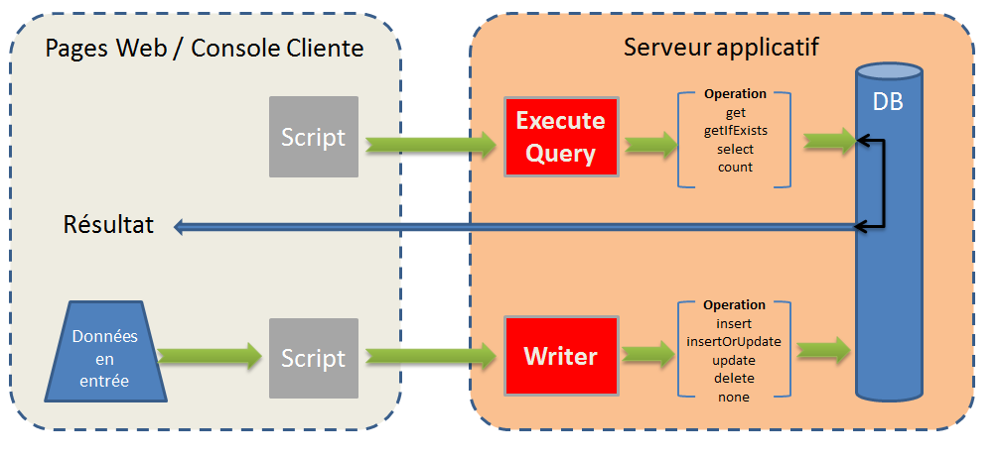

# API orientées données{#data-oriented-apis}

Les API orientées données permettent d’adresser le modèle de données dans son intégralité.

## Principe du modèle de données {#overview-of-the-datamodel}

Adobe Campaign ne propose pas une API de lecture dédiée par entité (pas de fonction de type getRecipient, getDelivery, etc.). Vous devez utiliser les méthodes de lecture et modification des données, QUERY &amp; WRITER, pour accéder aux données du modèle.

Adobe Campaign permet de gérer les collections : un appel (query) permet de récupérer un ensemble d&#39;informations collectées dans toute la base. Contrairement à un accès aux données en mode SQL, les API Adobe Campaign ne renvoient pas des colonnes de données mais une arborescence XML. Ainsi, Adobe Campaign crée des documents composites avec toutes les données collectées.

Ce mode de fonctionnement ne propose pas un mapping un pour un entre les attributs et éléments des documents XML et les colonnes des tables de la base de données.

Les documents XML sont stockés dans des champs de type MEMO de la base.

## Description du modèle {#description-of-the-model}

Vous devez impérativement connaître le modèle de données Adobe Campaign afin d&#39;adresser correctement les champs de la base de données dans vos scripts.

Pour obtenir une présentation du modèle de données, consultez la section [Description du modèle de données d’Adobe Campaign](../../configuration/using/data-model-description.md).

## Query et Writer {#query-and-writer}

Le schéma introductif suivant montre les échanges bas niveaux pour la lecture (ExecuteQuery) et l&#39;écriture (Writer) entre la base de données et un client (pages web ou console cliente Adobe Campaign).



### ExecuteQuery {#executequery}

Pour les colonnes et les conditions, vous pouvez utiliser des Query.

Vous pouvez ainsi isoler le SQL sous-jacent. Le langage des requêtes est indépendant du moteur sous-jacent : certaines fonctions vont être re-mappées, ce qui peut générer de nombreux ordres SELECT SQL.

Voir à ce sujet la section [Exemple sur la méthode &#39;ExecuteQuery&#39; du schéma &#39;xtk:queryDef&#39;](../../configuration/using/web-service-calls.md#example-on-the--executequery--method-of-schema--xtk-querydef-).

La méthode **ExecuteQuery** est présentée dans [ExecuteQuery (xtk:queryDef)](#executequery--xtk-querydef-).

### Write {#write}

Les commandes Write permettent d&#39;écrire des documents simples ou complexes, avec des écritures dans une ou plusieurs tables de la base.

Les API transactionnelles vous permettent de gérer les réconciliations via le **updateOrInsert** : une commande permet de créer ou mettre à jour des données. Vous pouvez également configurer la fusion des modifications (**merge**) : ce mode de fonctionnement permet d&#39;autoriser les mises à jour partielles.

La structure XML propose une vision logique des données et permet de s&#39;affranchir de la structure physique de la table SQL.

La méthode Write est présentée dans [Write / WriteCollection (xtk:session)](#write---writecollection--xtk-session-).

## ExecuteQuery (xtk:queryDef) {#executequery--xtk-querydef-}

Cette méthode permet d&#39;effectuer des requêtes à partir de données associées à un schéma. Elle prend en paramètres une chaîne d&#39;authentification (nécéssité d&#39;être loggé) et un document XML décrivant la requête à soumettre. Le paramètre de retour est un document XML contenant le résultat de la requête au format du schéma sur lequel porte la requête.

Définition de la méthode &quot;ExecuteQuery&quot; dans le schéma &quot;xtk:queryDef&quot; :

```
<method name="ExecuteQuery" const="true">
  <parameters>
    <param desc="Output XML document" name="output" type="DOMDocument" inout="out"/>
  </parameters>
</method>
```

>[!NOTE]
>
>Cette méthode est de type &quot;const&quot;, les paramètres en entrée sont compris dans un document XML au format du schéma &quot;xtk:queryDef&quot;.

### Format du document XML de la requête en entrée {#format-of-the-xml-document-of-the-input-query}

La structure du document XML de la requête est décrite dans le schéma &quot;xtk:queryDef &quot;, ce document décrit les différentes clauses d&#39;une requête SQL : &quot;select&quot;, &quot;where&quot;, &quot;order by&quot;, &quot;group by&quot;, &quot;having&quot;.

```
<queryDef schema="schema_key" operation="operation_type">
  <select>
    <node expr="expression1">
    <node expr="expression2">
    ...
  </select>
  <where> 
    <condition expr="expression1"/> 
    <condition expr="expression2"/>
    ... 
  </where>
  <orderBy>
    <node expr="expression1">
    <node expr="expression2">
    ...
  </orderBy>
  <groupBy>
    <node expr="expression1">
    <node expr="expression2">
    ...
  </groupBy>
  <having>
    <condition expr="expression1"/> 
    <condition expr="expression2"/>
    ...
  </having>
</queryDef>
```

Une sous-requête ( `<subquery>` ) peut être définie dans un élément `<condition> `. La syntaxe d’un élément `<subquery> ` repose sur la syntaxe d’un `<querydef>`.

Exemple d’un `<subquery>  : </subquery>`

```
<condition setOperator="NOT IN" expr="@id" enabledIf="$(/ignored/@ownerType)=1">
  <subQuery schema="xtk:operatorGroup">
     <select>
       <node expr="[@operator-id]" />
     </select>
     <where>
       <condition expr="[@group-id]=$long(../@owner-id)"/>
     </where>
   </subQuery>
</condition>  
  
```

Une requête doit référencer un schéma de départ à partir de l&#39;attribut **schema**.

Le type d&#39;opération souhaité est renseigné dans l&#39;attribut **operation** et contient une des valeurs suivantes :

* **get** : récupère un enregistrement de la table, et retourne une erreur si la donnée n&#39;existe pas,
* **getIfExists** : récupère un enregistrement de la table, et retourne un document vide si la donnée n&#39;existe pas,
* **select** : crée un curseur pour retourner plusieurs enregistrements, et retourne un document vide si aucune données,
* **count** : retourne un comptage des données.

La syntaxe **XPath** sert à localiser les données en fonction du schéma de départ. Pour plus d’informations sur XPath, voir [Schémas de données](../../configuration/using/data-schemas.md).

#### Exemple avec l&#39;opération &#39;get&#39; {#example-with-the--get--operation}

Récupère le nom et le prénom d’un destinataire (schéma « nms:recipient ») avec un filtre sur l’e-mail.

```
<queryDef schema="nms:recipient" operation="get">
  <!-- fields to retrieve -->
  <select>
    <node expr="@firstName"/>
    <node expr="@lastName"/>
  </select> 

  <!-- condition on email -->
  <where>  
    <condition expr="@email= 'john.doe@aol.com'"/>
  </where>
</queryDef>
```

#### Exemple avec l’opération « select » {#example-with-the--select--operation}

Retourne la liste des destinataires filtrés sur un dossier et le domaine de l’e-mail avec un tri décroissant sur la date de naissance.

```
<queryDef schema="nms:recipient" operation="select">
  <select>
    <node expr="@email"/>
    <!-- builds a string with the concatenation of the last name and first name separated by a dash -->      
    <node expr="@lastName+'-'+@firstName"/>
    <!-- get year of birth date -->
    <node expr="Year(@birthDate)"/>
  </select> 

  <where>  
     <condition expr="[@folder-id] = 1234 and @domain like 'Adobe%'"/>
  </where>

  <!-- order by birth date -->
  <orderBy>
    <node expr="@birthDate" sortDesc="true"/> <!-- by default sortDesc="false" -->
  </orderBy>
</queryDef>
```

Les expressions peuvent être des champs simples ou des expressions complexes telles que les opérations arithmétiques ou la concaténation de chaînes.

Pour limiter le nombre d’enregistrements à retourner, il faut ajouter l’attribut **lineCount** à l’élément `<querydef>`.

Pour limiter à 100 le nombre d&#39;enregistrements retournés par la requête :

```
<queryDef schema="nms:recipient" operation="select" lineCount="100">
...
```

Pour récupérer les 100 enregistrements suivants, lancer de nouveau la même requête en ajoutant l&#39;attribut **startLine**.

```
<queryDef schema="nms:recipient" operation="select" lineCount="100" startLine="100">
...
```

#### Exemple avec l&#39;opération &#39;count&#39; {#example-with-the--count--operation}

Pour compter le nombre d&#39;enregistrements sur une requête :

```
<queryDef schema="nms:recipient" operation="count"">
  <!-- condition on the folder and domain of the email -->
  <where>  
    <condition expr="[@folder-id] = 1234" and @domain like 'Adobe%'"/>
  </where>
</queryDef>
```

>[!NOTE]
>
>Encore une fois, nous utilisons la condition de l’exemple précédent. Les `<select>` et clauses ne sont pas utilisés. `</select>`

#### Groupement de données {#data-grouping}

Pour récupérer les adresses e-mail référencées plus d’une fois :

```
<queryDef schema="nms:recipient" operation="select">
  <select>
    <node expr="@email"/>
    <node expr="count(@email)"/>
  </select>

  <!-- email grouping clause -->
  <groupby>
    <node expr="@email"/>
  </groupby>

  <!-- grouping condition -->
  <having>
    <condition expr="count(@email) > 1"/>
  </having>

</queryDef>
```

On peut simplifier la requête en renseignant l&#39;attribut **groupBy** directement sur le champ à grouper :

```
<select>
  <node expr="@email" groupBy="true"/>
</select>
```

>[!NOTE]
>
>Il n’est plus nécessaire de renseigner l’élément `<groupby>`.

#### Parenthésage dans les conditions {#bracketing-in-conditions}

Voici deux exemples de parenthésages sur une même condition.

* La version simple en une seule expression :

  ```
  <where>
    <condition expr="(@age > 15 or @age <= 45) and  (@city = 'Newton' or @city = 'Culver City') "/>
  </where>
  ```

* La version structurée avec des éléments `<condition>` :

  ```
  <where>
    <condition bool-operator="AND">
      <condition expr="@age > 15" bool-operator="OR"/>
      <condition expr="@age <= 45"/>
    </condition>
    <condition>
      <condition expr="@city = 'Newton'" bool-operator="OR"/>
      <condition expr="@city = 'Culver City'"/>
    </condition>
  </where>
  ```

Il est possible de remplacer l&#39;opérateur &#39;OR&#39; avec l&#39;opérateur &#39;IN&#39; lorsque plusieurs conditions portent sur le même champ :

```
<where>
  <condition>
    <condition expr="@age IN (15, 45)"/>
    <condition expr="@city IN ('Newton', 'Culver City')"/>
  </condition>
</where>
```

Cette syntaxe simplifie la requête lorsque plus de deux données sont utilisées dans la condition.

#### Exemples sur les liens {#examples-on-links}

* Liens 1-1 ou N-1 : lorsque la table possède la clé étrangère (le lien part de la table), on peut filtrer ou récupérer directement les champs de la table liée.

  Exemple de filtre sur le libellé du dossier :

  ```
  <where>
    <condition expr="[folder/@label] like 'Segment%'"/>
  </where>
  ```

  Pour récupérer les champs du dossier à partir du schéma &quot;nms:recipient&quot; :

  ```
  <select>
    <!-- label of recipient folder -->
    <node expr="[folder/@label]"/>
    <!-- displays the string count of the folder -->
    <node expr="partition"/>
  </select>
  ```

* Liens de collections (1-N) : le filtrage sur les champs d&#39;une table de collection doit passer par l&#39;opérateur **EXISTS** ou **NOT EXISTS**.

  Pour filtrer les destinataires abonnés au service d&#39;information &#39;Newsletter&#39; :

  ```
  <where>
    <condition expr="subscription" setOperator="EXISTS">
      <condition expr="@name = 'Newsletter'"/>
    </condition>
  </where>
  ```

  La récupération directe des champs d’un lien de collection à partir de la clause `<select>` n’est pas recommandée, car la requête renvoie un produit cardinal. Elle est utilisée uniquement lorsque la table liée contient un seul enregistrement (exemple `<node expr="">`).

  Exemple sur le lien de collection &quot;subscription&quot; :

  ```
  <select>
    <node expr="subscription/@label"/>
  </select>
  ```

  Il est possible de récupérer une sous-liste contenant les éléments d’un lien de collection dans la clause `<select>`. Les XPath des champs référencés sont contextuels à partir de l’élément de collection.

  Les éléments de filtrage ( `<orderby>` ) et de restriction ( `<where>` ) peuvent être ajoutés à l’élément de collection.

  Dans cet exemple, la requête retourne l’e-mail de chaque destinataire ainsi que la liste des services d’information auxquels il est abonné :

  ```
  <queryDef schema="nms:recipient" operation="select">
    <select>
      <node expr="@email"/>
  
      <!-- collection table (unbound type) -->
      <node expr="subscription">  
        <node expr="[service/@label]"/>    
        <!-- sub-condition on the collection table -->
        <where>  
          <condition expr="@expirationDate >= GetDate()"/>
        </where>
        <orderBy>
          <node expr="@expirationDate"/> 
        </orderBy>
      </node>
    </select> 
  </queryDef>
  ```

#### Binding des paramètres de la clause &#39;where&#39; et &#39;select&#39; {#binding-the-parameters-of-the--where--and--select--clause}

Le binding des paramètres laisse le moteur fixer les valeurs des paramètres utilisés dans la requête. Ceci est très utile car l&#39;échappement des valeurs est à la charge du moteur et on bénéficie en plus d&#39;un cache sur les paramètres à récupérer.

Lorsqu’une requête est créée, les valeurs « liées » sont remplacées par un caractère (? dans ODBC, `#[index]#` dans postgres...) dans le corps de la requête SQL.

```
<select>
  <!--the value will be bound by the engine -->
  <node expr="@startDate = #2002/02/01#"/>                   
  <!-- the value will not be bound by the engine but visible directly in the query -->
  <node expr="@startDate = #2002/02/01#" noSqlBind="true"/> 
</select>
```

Pour ne pas binder un paramètre, il faut renseigner l&#39;attribut &quot;noSqlBind&quot; avec la valeur &quot;true&quot;.

>[!IMPORTANT]
>
>Dans le cas où la requête comprend des instructions du type &quot;order-by&quot; ou &quot;group-by&quot;, les moteurs de base de données ne peuvent pas &quot;binder&quot; les valeurs. Il est donc indispensable de placer dans la même requête l&#39;attribut @noSqlBind=&quot;true&quot; sur les instructions &quot;select&quot; et/ou &quot;where&quot;.

#### Astuce pour construire une requête :  {#query-building-tip-}

Pour vous aider à trouver la syntaxe d&#39;une requête, vous pouvez mettre au point la requête à partir du requêteur générique dans la console cliente Adobe Campaign (menu **[!UICONTROL Outils/Requêteur générique...]**). Pour cela :

1. Sélectionnez les données à récupérer :

   

1. Définissez le critère de filtrage :

   

1. Exécutez la requête et appuyez sur les touches CTRL+F4 pour visualiser le code source de la requête.

   

### Format du document de sortie {#output-document-format}

Le paramètre de retour est un document XML au format du schéma associé à la requête.

Exemple de retour à partir du schéma &quot;nms:recipient&quot; sur une opération de type &quot;get&quot; :

```
<recipient email="john.doe@adobe.com" lastName"Doe" firstName="John"/>
```

Sur une opération de type &quot;select&quot;, le document retourné est une énumération d&#39;éléments :

```
<!-- the name of the first element does not matter -->
<recipient-collection>   
  <recipient email="john.doe@adobe.com" lastName"Doe" firstName="John"/>
  <recipient email="peter.martinez@adobe.com" lastName"Martinez" firstName="Peter"/>
  <recipient...
</recipient-collection>  
```

Exemple de document de retour sur une opération de type &quot;count&quot; :

```
<recipient count="3"/>
```

#### Alias {#alias}

Un alias permet de modifier l&#39;emplacement des données dans le document de sortie. La variable **alias** doit spécifier un XPath sur le champ correspondant.

```
<queryDef schema="nms:recipient" operation="get">
  <select>
    <node expr="@firstName" alias="@firstName"/>
    <node expr="@lastName"/>
    <node expr="[folder/@label]" alias="@My_folder"/>
  </select> 
</queryDef>
```

Retourne :

```
<recipient My_folder="Recipients" First name ="John" lastName="Doe"/>
```

A la place de :

```
<recipient firstName="John" lastName="Doe">
  <folder label="Recipients"/>
</recipient>
```

### Exemple de messages SOAP {#example-of-soap-messages}

* Requête:

  ```
  <?xml version='1.0' encoding='ISO-8859-1'?>
  <SOAP-ENV:Envelope xmlns:xsd='http://www.w3.org/2001/XMLSchema' xmlns:xsi='http://www.w3.org/2001/XMLSchema-instance' xmlns:ns='http://xml.apache.org/xml-soap' xmlns:SOAP-ENV='http://schemas.xmlsoap.org/soap/envelope/'>
    <SOAP-ENV:Body>
      <ExecuteQuery xmlns='urn:xtk:queryDef' SOAP-ENV:encodingStyle='http://schemas.xmlsoap.org/soap/encoding/'>
        <__sessiontoken xsi:type='xsd:string'/>
        <entity xsi:type='ns:Element' SOAP-ENV:encodingStyle='http://xml.apache.org/xml-soap/literalxml'>
          <queryDef operation="get" schema="nms:recipient" xtkschema="xtk:queryDef">
            <select>
              <node expr="@email"/>
              <node expr="@lastName"/>
              <node expr="@firstName"/>
            </select>
            <where>
              <condition expr="@id = 3599"/>
            </where>
          </queryDef>
        </entity>
      </ExecuteQuery>
    </SOAP-ENV:Body>
  </SOAP-ENV:Envelope>
  ```

* Réponse :

  ```
  <?xml version='1.0' encoding='ISO-8859-1'?>
  <SOAP-ENV:Envelope xmlns:xsd='http://www.w3.org/2001/XMLSchema' xmlns:xsi='http://www.w3.org/2001/XMLSchema-instance' xmlns:ns='http://xml.apache.org/xml-soap' xmlns:SOAP-ENV='http://schemas.xmlsoap.org/soap/envelope/'>
    <SOAP-ENV:Body>
      <ExecuteQueryResponse xmlns='urn:xtk:queryDef' SOAP-ENV:encodingStyle='http://schemas.xmlsoap.org/soap/encoding/'>
        <pdomOutput xsi:type='ns:Element' SOAP-ENV:encodingStyle='http://xml.apache.org/xml-soap/literalxml'>
          <recipient email="john.doe@adobe.com" lastName"Doe" firstName="John"/>
        </pdomOutput>
      </ExecuteQueryResponse>
    </SOAP-ENV:Body>
  </SOAP-ENV:Envelope>
  ```

## Write / WriteCollection (xtk:session) {#write---writecollection--xtk-session-}

Ces services permettent l&#39;insertion/la mise à jour/la suppression d&#39;une entité (méthode &quot;Write&quot;) ou d&#39;une collection d&#39;entités (méthode &quot;WriteCollection&quot;).

Les entités à mettre à jour sont associées à un schéma de données. Les paramètres en entrée sont une chaîne d&#39;authentification (nécéssité d&#39;être loggé) et un document XML contenant les données à mettre à jour.

Ce document est complété par des instructions permettant de paramétrer les procédures d&#39;écriture.

L&#39;appel ne retourne pas de données, hormis les erreurs.

Définition des méthodes &quot;Write&quot; et &quot;WriteCollection&quot; dans le schéma &quot;xtk:session&quot; :

```
<method name="Write" static="true">
  <parameters>
    <param name="doc" type="DOMDocument" desc="Difference document"/>
  </parameters>
</method>
<method name="WriteCollection" static="true">
  <parameters>
    <param name="doc" type="DOMDocument" desc="Difference collection document"/>
  </parameters>
</method>
```

>[!NOTE]
>
>Cette méthode est de type &quot;static&quot;, les paramètres en entrée sont compris dans un document XML au format du schéma à mettre à jour.

### Vue d’ensemble {#overview}

La réconciliation des données s&#39;opère à partir de la définition des clés renseignées dans le schéma associé. La procédure d&#39;écriture va rechercher la première clé éligible en fonction des données renseignées dans le document en entrée. L&#39;entité est insérée ou mise à jour en fonction de son existence dans la base de données.

La clé du schéma de l&#39;entité à mettre à jour est renseignée à partir de l&#39;attribut **xtkschema**.

La clé de réconciliation peut être forcée avec l’attribut **_key** contenant la liste des XPath qui composent la clé (séparés par une virgule).

Il est possible de forcer le type d&#39;opération en renseignant l&#39;attribut **_operation** avec les valeurs suivantes :

* **insert** : force l&#39;insertion de l&#39;enregistrement (la clé de réconciliation n&#39;est pas utilisée),
* **insertOrUpdate** : met à jour ou insère l&#39;enregistrement en fonction de la clé de réconciliation (mode par défaut),
* **update** : met à jour l&#39;enregistrement, ne fait rien si la donnée n&#39;existe pas,
* **delete** : supprime les enregistrements,
* **none** : utilisé uniquement pour la réconciliation de lien, sans mise à jour ni insertion.

### Exemple avec la méthode &#39;Write&#39; {#example-with-the--write--method}

Mise à jour ou insertion d’un destinataire (opération « insertOrUpdate » implicite) avec son adresse e-mail, sa date de naissance et sa ville :

```
<recipient xtkschema="nms:recipient" email="john.doe@adobe.com" birthDate="1956/05/04" folder-id=1203 _key="@email, [@folder-id]">
  <location city="Newton"/>
</recipient>
```

Suppression d&#39;un destinataire :

```
<recipient xtkschema="nms:recipient" _operation="delete" email="rene.dupont@adobe.com" folder-id=1203 _key="@email, [@folder-id]"/>
```

>[!NOTE]
>
>Dans le cas d&#39;une opération en suppression, le document en entrée ne doit contenir que les champs qui composent la clé de réconciliation.

### Exemple avec la méthode &#39;WriteCollection&#39; {#example-with-the--writecollection--method}

Mise à jour ou insertion sur plusieurs destinataires :

```
<recipient-collection xtkschema="nms:recipient">    
  <recipient email="john.doe@adobe.com" firstName="John" lastName="Doe" _key="@email"/>
  <recipient email="peter.martinez@adobe.com" firstName="Peter" lastName="Martinez" _key="@email"/>
  <recipient ...
</recipient-collection>
```

### Exemple sur les liens {#example-on-links}

#### Exemple 1 {#example-1}

Associer le dossier sur un destinataire à partir de son nom interne (@name).

```
<recipient _key="[folder/@name], @email" email="john.doe@adobe.net" lastName="Doe" firstName="John" xtkschema="nms:recipient">
  <folder name="Folder2" _operation="none"/>
</recipient>
```

Les attributs &quot;_key&quot; et &quot;_operation&quot; peuvent être renseignés sur un élément lié, le comportement sur cet élément est le même que sur l&#39;élément principal du schéma de départ.

La définition de la clé de l’entité principale (« nms:recipient ») est composée d’un champ provenant d’une table liée (élément `<folder>` du schéma « xtk:folder ») et de l’e-mail.

>[!NOTE]
>
>L’opération « aucun » renseignée sur l’élément dossier définit une réconciliation sur le dossier sans mise à jour ni insertion.

#### Exemple 2 {#example-2}

Mettre à jour la société (table liée de schéma &quot;cus:company&quot;) à partir d&#39;un destinataire :

```
<recipient _key="[folder/@name], @email" email="john.doe@adobe.net" lastName="Doe" firstName="John" xtkschema="nms:recipient">
  <company name="adobe" code="ERT12T" _key="@name" _operation="update"/>
</recipient>
```

#### Exemple 3 {#example-3}

Ajouter un destinataire dans un groupe avec la table de relation des groupes (&quot;nms:rcpGrpRel&quot;) :

```
<recipient _key="@email" email="martin.ledger@adobe.net" xtkschema="nms:recipient">
  <rcpGrpRel _key="[rcpGroup/@name]">
    <rcpGroup name="GRP1"/>
  </rcpGrpRel>
</recipient>
```

>[!NOTE]
>
>La définition de la clé n’est pas renseignée sur l’élément `<rcpgroup>` car une clé implicite sur le nom du groupe est définie dans la schéma &quot;nms:group&quot;.

### Eléments de collections XML {#xml-collection-elements}

Par défaut, pour mettre à jour les éléments de collection XML, il faut renseigner tous les éléments de collection. Les données de la base seront remplacées par les données du document en entrée. Si le document contient uniquement les éléments à mettre à jour, vous devez renseigner l&#39;attribut &quot;_operation&quot; sur tous les éléments de collection à mettre à jour afin de forcer la fusion (merge) avec les données XML de la base.

### Exemple de messages SOAP {#example-of-soap-messages-1}

* Requête:

  ```
  <?xml version='1.0' encoding='ISO-8859-1'?>
  <SOAP-ENV:Envelope xmlns:xsd='http://www.w3.org/2001/XMLSchema' xmlns:xsi='http://www.w3.org/2001/XMLSchema-instance' xmlns:ns='http://xml.apache.org/xml-soap' xmlns:SOAP-ENV='http://schemas.xmlsoap.org/soap/envelope/'>
    <SOAP-ENV:Body>
      <Write xmlns='urn:xtk:persist' SOAP-ENV:encodingStyle='http://schemas.xmlsoap.org/soap/encoding/'>
        <__sessiontoken xsi:type='xsd:string'/>
        <domDoc xsi:type='ns:Element' SOAP-ENV:encodingStyle='http://xml.apache.org/xml-soap/literalxml'>
          <recipient xtkschema="nms:recipient" email="rene.dupont@adobe.com" firstName="René" lastName="Dupont" _key="@email">
        </domDoc>
      </Write>
    </SOAP-ENV:Body>
  </SOAP-ENV:Envelope>
  ```

* Réponse :

  ```
  <?xml version='1.0' encoding='ISO-8859-1'?>
  <SOAP-ENV:Envelope xmlns:xsd='http://www.w3.org/2001/XMLSchema' xmlns:xsi='http://www.w3.org/2001/XMLSchema-instance' xmlns:ns='http://xml.apache.org/xml-soap' xmlns:SOAP-ENV='http://schemas.xmlsoap.org/soap/envelope/'>
    <SOAP-ENV:Body>
      <WriteResponse xmlns='urn:' SOAP-ENV:encodingStyle='http://schemas.xmlsoap.org/soap/encoding/'>
      </WriteResponse>
    </SOAP-ENV:Body>
  </SOAP-ENV:Envelope>
  ```

  Retour avec erreur :

  ```
  <?xml version='1.0'?>
  <SOAP-ENV:Envelope xmlns:xsd="http://www.w3.org/2001/XMLSchema" xmlns:xsi="http://www.w3.org/2001/XMLSchema-instance" xmlns:SOAP-ENV='http://schemas.xmlsoap.org/soap/envelope/'>
    <SOAP-ENV:Body>
      <SOAP-ENV:Fault>
        <faultcode>SOAP-ENV:Server</faultcode>
        <faultstring xsi:type="xsd:string">Error while executing the method 'Write' of service 'xtk:persist'.</faultstring>
        <detail xsi:type="xsd:string">PostgreSQL error: ERROR:  duplicate key violates unique constraint &quot;nmsrecipient_id&quot;Impossible to save document of type 'Recipients (nms:recipient)'</detail>
      </SOAP-ENV:Fault>
    </SOAP-ENV:Body>
  </SOAP-ENV:Envelope>
  ```
