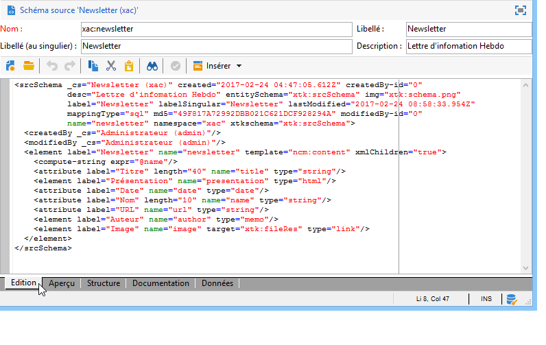

# Schémas de données{#data-schemas}

## Principes {#principles}

Pour modifier, créer et paramétrer les schémas, cliquez sur le nœud **[!UICONTROL Administration > Paramétrage > Schémas de données]** de la console cliente Adobe Campaign.

>[!NOTE]
>
>Les schémas de données prédéfinis peuvent uniquement être supprimés par un administrateur de votre console Adobe Campaign Classic.


La zone d&#39;édition affiche le contenu XML du schéma source :



>[!NOTE]
>
>Le contrôle d&#39;édition &quot;Nom&quot; permet de saisir la clé du schéma, composée du nom et de l&#39;espace de noms. Les attributs &quot;name&quot; et &quot;namespace&quot; de l&#39;élément racine du schéma sont automatiquement mis à jour dans la zone d&#39;édition XML du schéma.

L&#39;aperçu génère automatiquement le schéma étendu :


>[!NOTE]
>
>La sauvegarde du schéma source va automatiquement lancer la génération du schéma étendu.

Si vous devez vérifier la structure complète d&#39;un schéma, vous pouvez utiliser l&#39;onglet Aperçu. Si le schéma a été étendu, vous serez alors en mesure de visualiser toutes ses extensions. En complément, l&#39;onglet Documentation affiche tous les attributs et les éléments du schéma, ainsi que leurs propriétés (champ SQL, type/longueur, libellé, description). L&#39;onglet Documentation ne s&#39;applique qu&#39;aux schémas générés. Pour plus d&#39;informations, consultez la section [Régénération des schémas](../../configuration/using/regenerating-schemas.md).

## Exemple : créer une table des contrats {#example--creating-a-contract-table}

Dans l&#39;exemple suivant, nous allons créer une nouvelle table pour les **contrats** dans le modèle de données de la base Adobe Campaign. Cette table permettra de stocker, pour chaque contrat, les noms, prénoms et adresses email des titulaires et co-titulaires.

Pour cela, vous devez créer le schéma de la table puis procéder à la mise à jour de la structure de la base pour générer la table correspondante. Les étapes sont les suivantes :

1. Editez le nœud **[!UICONTROL Administration > Paramétrage > Schémas de données]** de l&#39;arborescence Adobe Campaign et cliquez sur l&#39;icône **[!UICONTROL Nouveau]** .
1. Sélectionnez l&#39;option **[!UICONTROL Créer une nouvelle table dans le modèle de données de la base]** et cliquez sur **[!UICONTROL Suivant]** .

   

1. Indiquez le nom de la table et son espace de noms.

   

   >[!NOTE]
   >
   >Par défaut, les schémas créés par les utilisateurs sont stockés dans l&#39;espace de noms « cus ». Pour plus d&#39;informations, consultez la section [Identification d&#39;un schéma](../../configuration/using/about-schema-reference.md#identification-of-a-schema).

1. Créez le contenu de la table. Nous vous recommandons d’utiliser l’assistant d’entrée pour vous assurer qu’aucun paramètre n’est manquant. Pour ce faire, cliquez sur le bouton **[!UICONTROL Insérer]** et sélectionnez le type de paramètre à ajouter.

   

1. Définissez les paramètres de la table des contrats :

   ```
   <srcSchema desc="Active contracts" img="ncm:channels.png" label="Contracts" labelSingular="Contract" mappingType="sql" name="Contracts" namespace="cus" xtkschema="xtk:srcSchema">
     <element desc="Active contracts" img="ncm:channels.png" label="Contracts" labelSingular="Contract"
              name="Contracts" autopk="true">
              <attribute name="holderName" label="Holder last name" type="string"/>
              <attribute name="holderFirstName" label="Holder first name" type="string"/>
              <attribute name="holderEmail" label="Holder email" type="string"/>
              <attribute name="co-holderName" label="Co-holder last name" type="string"/>           
              <attribute name="co-holderFirstName" label="Co-holder first name" type="string"/>           
              <attribute name="co-holderEmail" label="Co-holder email" type="string"/>    
              <attribute name="date" label="Subscription date" type="date"/>     
              <attribute name="noContract" label="Contract number" type="long"/>  
     </element>
   </srcSchema>
   ```

   Ajoutez le type de contrat et positionnez un index sur le numéro de contrat.

   ```
   <srcSchema _cs="Contracts (cus)" desc="Active contracts" entitySchema="xtk:srcSchema" img="ncm:channels.png"
              label="Contracts" labelSingular="Contract" name="Contracts" namespace="cus" xtkschema="xtk:srcSchema">
     <enumeration basetype="byte" name="typeContract">
       <value label="Home" name="home" value="0"/>
       <value label="Car" name="car" value="1"/>
       <value label="Health" name="health" value="2"/>
       <value label="Pension fund" name="pension fund" value="2"/>
     </enumeration>
     <element autopk="true" desc="Active contracts" img="ncm:channels.png" label="Contracts"
              labelSingular="Contract" name="Contracts">
       <attribute label="Holder last name" name="holderName" type="string"/>
       <attribute label="Holder first name" name="holderFirstName" type="string"/>
       <attribute label="Holder email" name="holderEmail" type="string"/>
       <attribute label="Co-holder last name" name="co-holderName" type="string"/>
       <attribute label="Co-holder first name" name="co-holderFirstName" type="string"/>
       <attribute label="Co-holder email" name="co-holderEmail" type="string"/>
       <attribute label="Subscription date" name="date" type="date"/>
      <attribute desc="Type of contract" enum="cus:Contracts:typeContract" label="Type of contract"
                  name="type" type="byte"/>
       <attribute label="Contract number" name="noContract" type="long"/>
       <dbindex name="noContract" unique="true">
         <keyfield xpath="@noContract"/>
       </dbindex>
     </element>
   </srcSchema>
   ```

1. Enregistrez le schéma pour en générer la structure :

   

1. Mettez à jour la structure de la base de données pour créer la table à laquelle le schéma sera lié. Pour plus d&#39;informations, consultez la section [Mettre à jour la structure de la base de données](../../configuration/using/updating-the-database-structure.md).
