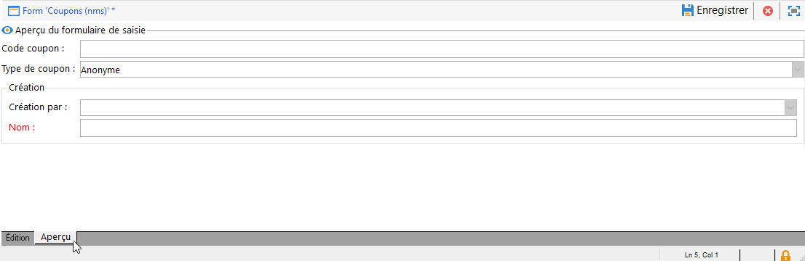

# Editer les formulaires{#editing-forms}

L&#39;écran de création et de configuration des formulaires de saisie est accessible à partir du dossier **[!UICONTROL Administration > Paramétrage > Formulaires de saisie]** de la console cliente Adobe Campaign :

La zone d&#39;édition permet de renseigner le contenu XML du formulaire de saisie :

L&#39;aperçu génère l&#39;affichage du formulaire de saisie :

