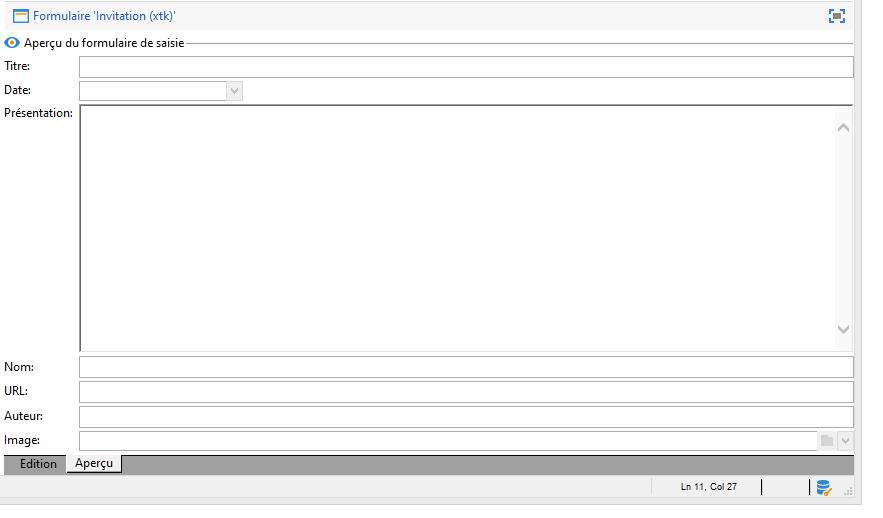

# Modification de formulaires{#editing-forms}


## Vue d’ensemble

Les marketeurs et les opérateurs utilisent des formulaires de saisie pour créer, modifier et prévisualiser des enregistrements. Les formulaires affichent une représentation visuelle des informations.

Vous pouvez créer et modifier des formulaires de saisie :

* Vous pouvez modifier les formulaires de saisie d’usine fournis par défaut. Les formulaires de saisie d’usine sont basés sur les schémas de données d’usine.
* Vous pouvez créer des formulaires de saisie personnalisés, en fonction des schémas de données que vous définissez.

Les formulaires sont des entités de type `xtk:form`. Vous pouvez afficher la structure du formulaire de saisie dans le schéma `xtk:form`. Pour afficher ce schéma, sélectionnez **[!UICONTROL Administration]** > **[!UICONTROL Configuration]** > **[!UICONTROL Schémas de données]** à partir du menu. En savoir plus sur la [structure des formulaires](form-structure.md).

Pour accéder aux formulaires de saisie, sélectionnez **[!UICONTROL Administration] > [!UICONTROL Configuration] > [!UICONTROL Formulaires de saisie]** à partir du menu :


Pour concevoir des formulaires, modifiez le contenu XML dans l’éditeur XML :


[En savoir plus](form-structure.md#formatting).

Pour prévisualiser un formulaire, cliquez sur l’onglet **[!UICONTROL Aperçu]** :


## Types de formulaires

Vous pouvez créer différents types de formulaires de saisie. Le type de formulaire détermine la manière dont les utilisateurs naviguent dans ce dernier :

* Écran console

   Il s’agit du type de formulaire par défaut. Le formulaire comprend une seule page.

   

* Gestion de contenu

   Utilisez ce type de formulaire pour la gestion de contenu. Consultez ce [cas d’utilisation](../../delivery/using/use-case--creating-content-management.md).

   

* Assistant

   Ce formulaire comprend plusieurs écrans flottants organisés en séquences spécifiques. Les utilisateurs peuvent naviguer d’un écran à l’autre. [En savoir plus](form-structure.md#wizards).

* Iconbox

   Ce formulaire comprend plusieurs pages. Pour parcourir le formulaire, les utilisateurs doivent sélectionner les icônes à sa gauche.

   

* Notebook

   Ce formulaire comprend plusieurs pages. Pour parcourir le formulaire, les utilisateurs doivent sélectionner les onglets dans la partie supérieure.

   

* Séparation verticale

   Ce formulaire affiche une arborescence de navigation.

* Séparation horizontale

   Ce formulaire affiche une liste d’éléments.

## Conteneurs

Dans les formulaires, vous pouvez utiliser des conteneurs à diverses fins :

* Organisation du contenu dans les formulaires
* Définition de l’accès aux champs de saisie
* Imbrication de formulaires dans d’autres formulaires

[En savoir plus](form-structure.md#containers).

### Organisation du contenu

Utilisez des conteneurs pour organiser le contenu dans les formulaires :

* Vous pouvez regrouper des champs en sections.
* Vous pouvez ajouter des pages à des formulaires de plusieurs pages.

Pour insérer un conteneur, utilisez l’élément `<container>`. [En savoir plus](form-structure.md#containers).

#### Regroupement de champs

Utilisez des conteneurs pour regrouper les champs de saisie en sections organisées.

Pour insérer une section dans un formulaire, utilisez l’élément suivant : `<container type="frame">`. Vous pouvez éventuellement ajouter un titre de section. Pour ce faire, utilisez l’attribut `label`.

Syntaxe : `<container type="frame" label="`*titre_section*`"> […] </container>`

Dans cet exemple, un conteneur définit la section **Création**, qui comprend les champs de saisie **[!UICONTROL Créé par]** et **[!UICONTROL Nom]** :

```xml
<form _cs="Coupons (nms)" entitySchema="xtk:form" img="xtk:form.png" label="Coupons"
      name="coupon" namespace="nms" type="default" xtkschema="xtk:form">
  <input xpath="@code"/>
  <input xpath="@type"/>
  <container label="Creation" type="frame">
    <input xpath="createdBy"/>
    <input xpath="createdBy/@name"/>
  </container>
</form>
```


#### Ajout de pages à des formulaires de plusieurs pages

Pour les formulaires à plusieurs pages, utilisez un conteneur pour créer une page de formulaire.

Cet exemple montre les conteneurs pour les pages **Général** et **Détails** d’un formulaire :

```xml
<container img="ncm:book.png" label="General">
[…]
</container>
<container img="ncm:detail.png" label="Details">
[…]
</container>
```

### Définition de l’accès aux champs

Utilisez des conteneurs pour définir ce qui est visible et l’accès aux champs. Vous pouvez activer ou désactiver des groupes de champs.

### Imbrication de formulaires

Utilisez des conteneurs pour imbriquer des formulaires dans d’autres formulaires. [En savoir plus](#add-pages-to-multipage-forms).

## Références aux images

Pour rechercher des images, sélectionnez **[!UICONTROL Administration]** > **[!UICONTROL Configuration]** > **[!UICONTROL Images]** à partir du menu.

Pour associer une image à un élément du formulaire, par exemple une icône, vous pouvez ajouter une référence à une image. Par exemple, utilisez l’attribut `img` dans l’élément `<container>`.

Syntaxe : `img="`*`namespace`*`:`*`filename`*`.`*`extension`*`"`

Cet exemple montre les références aux images `book.png` et `detail.png` de l’espace de noms `ncm` :

```xml
<container img="ncm:book.png" label="General">
[…]
</container>
<container img="ncm:detail.png" label="Details">
[…]
</container>
```

Ces images constituent les icônes sur lesquelles les utilisateurs cliquent pour parcourir un formulaire à plusieurs pages :


## Création d’un formulaire simple {#create-simple-form}

Pour créer un formulaire, procédez comme suit :

1. Dans le menu, sélectionnez **[!UICONTROL Administration]** > **[!UICONTROL Configuration]** > **[!UICONTROL Formulaires de saisie]**.
1. Cliquez sur le bouton **[!UICONTROL Nouveau]** dans le coin supérieur droit de la liste.

   

1. Renseignez les propriétés du formulaire :

   * Renseignez le nom du formulaire et l’espace de noms.

      Le nom du formulaire et l’espace de noms peuvent correspondre au schéma de données associé.  Cet exemple montre un formulaire pour le schéma de données `cus:order` :

      ```xml
      <form entitySchema="xtk:form" img="xtk:form.png" label="Order" name="order" namespace="cus" type="iconbox" xtkschema="xtk:form">
        […]
      </form>
      ```

      Vous pouvez également renseigner explicitement le schéma de données dans l’attribut `entity-schema`.

      ```xml
      <form entity-schema="cus:stockLine" entitySchema="xtk:form" img="xtk:form.png" label="Stock order" name="stockOrder" namespace="cus" xtkschema="xtk:form">
        […]
      </form>
      ```

   * Renseignez le libellé à afficher sur le formulaire.
   * Vous pouvez éventuellement renseigner le type de formulaire. Si vous ne renseignez pas de type de formulaire, le type Écran console est utilisé par défaut.

      

      Si vous concevez un formulaire à plusieurs pages, vous pouvez omettre le type de formulaire dans l’élément `<form>` et renseigner le type dans un conteneur.

1. Cliquez sur **[!UICONTROL Enregistrer]**.

1. Insérez les éléments de formulaire.

   Par exemple, pour insérer un champ de saisie, utilisez l’élément `<input>`. Définissez l’attribut `xpath` sur la référence du champ en tant qu’expression XPath. [En savoir plus](schema-structure.md#referencing-with-xpath).

   Cet exemple montre des champs de saisie basés sur le schéma `nms:recipient`.

   ```xml
   <input xpath="@firstName"/>
   <input xpath="@lastName"/>
   ```

1. Si le formulaire est basé sur un type de schéma spécifique, vous pouvez rechercher les champs de ce schéma :

   1. Cliquez sur **[!UICONTROL Insérer]** > **[!UICONTROL Champs du document]**.

      

   1. Sélectionnez le champ et cliquez sur **[!UICONTROL OK]**.

      

1. Vous pouvez éventuellement renseigner l’éditeur de champ.

   Un éditeur de champ par défaut est associé à chaque type de données :
   * Pour un champ de type date, le formulaire affiche un calendrier de saisie.
   * Pour un champ de type énumération, le formulaire affiche une liste de sélection.

   Vous pouvez utiliser les types d’éditeur de champ suivants :

   | Éditeur de champ | Attribut de formulaire |
   | --- | --- |
   | Bouton radio | `type="radiobutton"` |
   | Case à cocher | `type="checkbox"` |
   | Modifier l’arborescence | `type="tree"` |

   En savoir plus sur les [contrôles de liste de mémoire](form-structure.md#memory-list-controls).

1. Vous pouvez éventuellement définir l’accès aux champs :

   | Élément | Attribut | Description |
   | --- | --- | --- |
   | `<input>` | `read-only="true"` | Fournit un accès en lecture seule à un champ |
   | `<container>` | `type="visibleGroup" visibleIf="`*edit-expr*`"` | Affiche de manière conditionnelle un groupe de champs |
   | `<container>` | `type="enabledGroup" enabledIf="`*edit-expr*`"` | Active de manière conditionnelle un groupe de champs |

   Exemple :

   ```xml
   <container type="enabledGroup" enabledIf="@gender=1">
     […]
   </container>
   <container type="enabledGroup" enabledIf="@gender=2">
     […]
   </container>
   ```

1. Vous pouvez éventuellement utiliser des conteneurs pour regrouper des champs en sections.

   ```xml
   <container type="frame" label="Name">
      <input xpath="@firstName"/>
      <input xpath="@lastName"/>
   </container>
   <container type="frame" label="Contact details">
      <input xpath="@email"/>
      <input xpath="@phone"/>
   </container>
   ```

   

## Création d’un formulaire à plusieurs pages {#create-multipage-form}

Vous pouvez créer des formulaires à plusieurs pages. Vous pouvez également imbriquer des formulaires dans d’autres formulaires.

### Création d’un formulaire `iconbox`

Utilisez le type de formulaire `iconbox` pour afficher des icônes à gauche du formulaire, qui redirigent les utilisateurs vers différentes pages du formulaire.


Pour modifier le type d’un formulaire existant en `iconbox`, procédez comme suit :

1. Modifiez l’attribut `type` de l’élément `<form>` en `iconbox` :

   ```xml
   <form […] type="iconbox">
   ```

1. Définissez un conteneur pour chaque page de formulaire :

   1. Ajoutez un élément `<container>` comme enfant de l’élément `<form>`.
   1. Pour définir un libellé et une image pour l’icône, utilisez les attributs `label` et `img`.

      ```xml
      <form entitySchema="xtk:form" name="Service provider" namespace="nms" type="iconbox" xtkschema="xtk:form">
          <container img="xtk:properties.png" label="General">
              <input xpath="@label"/>
              <input xpath="@name"/>
              […]
          </container>
          <container img="nms:msgfolder.png" label="Details">
              <input xpath="@address"/>
              […]
          </container>
          <container img="nms:supplier.png" label="Services">
              […]
          </container>
      </form>
      ```

   Vous pouvez également supprimer l’attribut `type="frame"` des éléments `<container>` existants.

### Création d’un formulaire de type notebook

Utilisez le type de formulaire `notebook` pour afficher des onglets dans la partie supérieure du formulaire, qui redirigent les utilisateurs vers différentes pages.


Pour modifier le type d’un formulaire existant en `notebook`, procédez comme suit :

1. Modifiez l’attribut `type` de l’élément `<form>` en `notebook` :

   ```xml
   <form […] type="notebook">
   ```

1. Ajoutez un conteneur pour chaque page de formulaire :

   1. Ajoutez un élément `<container>` comme enfant de l’élément `<form>`.
   1. Pour définir le libellé et l’image de l’icône, utilisez les attributs `label` et `img`.

   ```xml
     <form entitySchema="xtk:form" name="Service provider" namespace="nms" type="notebook" xtkschema="xtk:form">
         <container label="General">
             <input xpath="@label"/>
             <input xpath="@name"/>
             […]
         </container>
         <container label="Details">
             <input xpath="@address"/>
             […]
         </container>
         <container label="Services">
             […]
         </container>
     </form>
   ```

   Vous pouvez également supprimer l’attribut `type="frame"` des éléments `<container>` existants.

### Imbrication de formulaires

Vous pouvez imbriquer des formulaires dans d’autres formulaires. Vous pouvez, par exemple, imbriquer des formulaires de type notebook dans des formulaires de type iconbox.

Le niveau d’imbrication contrôle la navigation. Les utilisateurs peuvent accéder aux sous-formulaires.

Pour imbriquer un formulaire dans un autre formulaire, insérez un élément `<container>` et définissez l’attribut `type` sur le type de formulaire. Vous pouvez définir le type du formulaire de niveau supérieur dans un conteneur externe ou dans l’élément `<form>`.

### Exemple

Cet exemple montre un formulaire complexe :

* Le formulaire de niveau supérieur est un formulaire de type iconbox. Ce formulaire comprend deux conteneurs libellés **Général** et **Détails**.

   Par conséquent, le formulaire externe affiche les pages **Général** et **Détails** au niveau supérieur. Pour accéder à ces pages, les utilisateurs doivent cliquer sur les icônes situées à gauche du formulaire.

* Le sous-formulaire est un formulaire de type notebook imbriqué dans le conteneur **Général**. Le sous-formulaire se compose de deux conteneurs libellés **Nom** et **Contact**.

```xml
<form _cs="Profile (nms)" entitySchema="xtk:form" img="xtk:form.png" label="Profile" name="profile" namespace="nms" xtkschema="xtk:form">
  <container type="iconbox">
    <container img="ncm:general.png" label="General">
      <container type="notebook">
        <container label="Name">
          <input xpath="@firstName"/>
          <input xpath="@lastName"/>
        </container>
        <container label="Contact">
          <input xpath="@email"/>
        </container>
      </container>
    </container>
    <container img="ncm:detail.png" label="Details">
      <input xpath="@birthDate"/>
    </container>
  </container>
</form>
```

Par conséquent, la page **Général** du formulaire externe affiche les onglets **Nom** et **Contact**.


Pour imbriquer un formulaire dans un autre formulaire, insérez un élément `<container>` et définissez l’attribut `type` sur le type de formulaire. Vous pouvez définir le type du formulaire de niveau supérieur dans un conteneur externe ou dans l’élément `<form>`.

### Exemple

Cet exemple montre un formulaire complexe :

* Le formulaire de niveau supérieur est un formulaire de type iconbox. Ce formulaire comprend deux conteneurs libellés **Général** et **Détails**.

   Par conséquent, le formulaire externe affiche les pages **Général** et **Détails** au niveau supérieur. Pour accéder à ces pages, les utilisateurs doivent cliquer sur les icônes situées à gauche du formulaire.

* Le sous-formulaire est un formulaire de type notebook imbriqué dans le conteneur **Général**. Le sous-formulaire se compose de deux conteneurs libellés **Nom** et **Contact**.

```xml
<form _cs="Profile (nms)" entitySchema="xtk:form" img="xtk:form.png" label="Profile" name="profile" namespace="nms" xtkschema="xtk:form">
  <container type="iconbox">
    <container img="ncm:general.png" label="General">
      <container type="notebook">
        <container label="Name">
          <input xpath="@firstName"/>
          <input xpath="@lastName"/>
        </container>
        <container label="Contact">
          <input xpath="@email"/>
        </container>
      </container>
    </container>
    <container img="ncm:detail.png" label="Details">
      <input xpath="@birthDate"/>
    </container>
  </container>
</form>
```

Par conséquent, la page **Général** du formulaire externe affiche les onglets **Nom** et **Contact**.


## Modification d’un formulaire de saisie d’usine {#modify-factory-form}

Pour modifier un formulaire d’usine, procédez comme suit :

1. Modifiez le formulaire de saisie d’usine :

   1. Dans le menu, sélectionnez **[!UICONTROL Administration]** > **[!UICONTROL Configuration]** > **[!UICONTROL Formulaires de saisie]**.
   1. Sélectionnez un formulaire de saisie et modifiez-le.

   Vous pouvez étendre les schémas de données d’usine, mais pas les formulaires de saisie d’usine. Nous vous recommandons de modifier directement les formulaires de saisie d’usine sans les recréer. Lors des mises à niveau logicielles, les modifications que vous avez apportées dans les formulaires de saisie d’usine sont fusionnées avec les mises à niveau. Si la fusion automatique échoue, vous pouvez résoudre les conflits. [En savoir plus](../../production/using/upgrading.md#resolving-conflicts).

   Par exemple, si vous étendez un schéma d’usine avec un champ supplémentaire, vous pouvez ajouter ce champ au formulaire d’usine associé.

## Validation des formulaires {#validate-forms}

Vous pouvez inclure des contrôles de validation dans les formulaires.

### Octroi d’accès en lecture seule aux champs

Pour octroyer l’accès en lecture seule à un champ, utilisez l’attribut `readOnly="true"`. Par exemple, vous pouvez vouloir afficher la clé primaire d’un enregistrement, mais avec un accès en lecture seule. [En savoir plus](form-structure.md#non-editable-fields).

Dans cet exemple, la clé primaire (`iRecipientId`) du schéma `nms:recipient` s’affiche en mode d’accès en lecture seule :

```xml
<value xpath="@iRecipientId" readOnly="true"/>
```

### Vérification des champs obligatoires

Vous pouvez vérifier les informations obligatoires :

* Utilisez l’attribut `required="true"` pour les champs obligatoires.
* Utilisez le nœud `<leave>` pour vérifier ces champs et afficher les messages d’erreur.

Dans cet exemple, l’adresse e-mail est requise et un message d’erreur s’affiche si l’utilisateur n’a pas fourni ces informations :

```xml
<input xpath="@email" required="true"/>
<leave>
  <check expr="@email!=''">
    <error>The email address is required.</error>
  </check>
</leave>
```

En savoir plus sur les [champs d’expression](form-structure.md#expression-field) et le [contexte du formulaire](form-structure.md#context-of-forms).

### Validation des valeurs

Vous pouvez utiliser des appels SOAP JavaScript pour valider les données de formulaire à partir de la console. Utilisez ces appels pour une validation complexe, par exemple pour comparer une valeur à une liste de valeurs autorisées. [En savoir plus](form-structure.md#soap-methods).

1. Créez une fonction de validation dans un fichier JS.

   Exemple :

   ```js
   function nms_recipient_checkValue(value)
   {
     logInfo("checking value " + value)
     if (…)
     {
       logError("Value " + value + " is not valid")
     }
     return 1
   }
   ```

   Dans cet exemple, la fonction est nommée `checkValue`. Cette fonction permet de vérifier le type de données `recipient` dans l’espace de noms `nms`. La valeur en cours de vérification est consignée. Si la valeur n’est pas valide, un message d’erreur est consigné. Si la valeur est valide, la valeur 1 est renvoyée.

   Vous pouvez utiliser la valeur renvoyée pour modifier le formulaire.

1. Dans le formulaire, ajoutez l’élément `<soapCall>` à l’élément `<leave>`.

   Dans cet exemple, un appel SOAP est utilisé pour valider la chaîne `@valueToCheck` :

   ```xml
   <form name="recipient" (…)>
   (…)
     <leave>
       <soapCall name="checkValue" service="nms:recipient">
         <param exprIn="@valueToCheck" type="string"/>
       </soapCall>
     </leave>
   </form>
   ```

   Dans cet exemple, la méthode `checkValue` et le service `nms:recipient` sont utilisés :

   * Le service correspond à l’espace de noms et au type de données.
   * La méthode correspond au nom de la fonction. Le nom est sensible à la casse.

   L’appel est effectué de manière synchrone.

   Toutes les exceptions s’affichent. Si vous utilisez l’élément `<leave>`, les utilisateurs ne peuvent pas enregistrer le formulaire tant que les informations saisies ne sont pas validées.

Cet exemple montre comment effectuer des appels de service depuis les formulaires :

```xml
<enter>
  <soapCall name="client" service="c4:ybClient">
    <param exprIn="@id" type="string"/>
    <param type="boolean" xpathOut="/tmp/@count"/>
  </soapCall>
</enter>
```

Dans cet exemple, l’entrée est un identifiant, qui correspond à une clé primaire. Lorsque les utilisateurs remplissent le formulaire pour cet identifiant, un appel SOAP est effectué avec cet identifiant comme paramètre d’entrée. La sortie est une valeur booléenne qui est écrite dans ce champ : `/tmp/@count`. Vous pouvez utiliser cette valeur booléenne dans le formulaire. En savoir plus sur le [contexte du formulaire](form-structure.md#context-of-forms).
