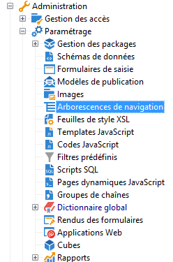
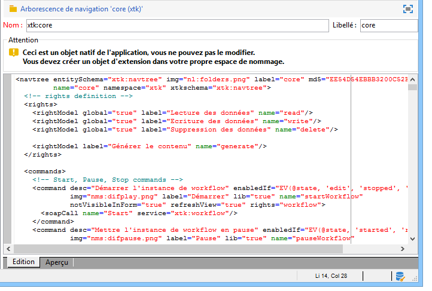

# Modifier l&#39;arborescence de navigation de l&#39;Explorateur Campaign{#edition}

L&#39;écran de création et de configuration des documents de paramétrage de l&#39;arborescence de navigation est accessible à partir du nœud **[!UICONTROL Administration > Paramétrage > Arborescences de navigation]** :

La configuration de l’arborescence de navigation est divisée en plusieurs documents XML.Son principe de fonctionnement est similaire à celui de l’extension de schéma : tous les documents sont fusionnés pour générer un document unique contenant l’ensemble de la configuration.Ce document ne peut pas être modifié et s’affiche à partir de l’onglet « Prévisualisation ».

La zone d&#39;édition renseigne le contenu du document XML :

>[!NOTE]
>
>Le contrôle d’édition « Name » vous permet de saisir la clé du document, composée du nom et de l’espace de noms. Les attributs « name » et « namespace » de l’élément **`<navtree>`** sont automatiquement mis à jour dans le champ de modification XML du schéma.

L&#39;aperçu génère automatiquement le document fusionné contenant le paramétrage complet :

