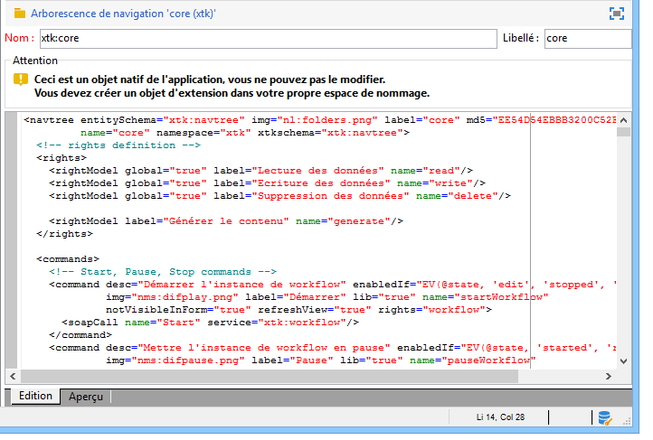

# Edition{#edition}

L&#39;écran de création et de configuration des documents de paramétrage de l&#39;arborescence de navigation est accessible à partir du nœud **[!UICONTROL Administration > Paramétrage > Arborescences de navigation]** :

Le paramétrage de l&#39;arborescence de navigation est réparti entre plusieurs documents XML. Le principe est similaire à celui de l&#39;extension des schémas : tous les documents sont fusionnés pour générer un document unique contenant l&#39;ensemble du paramétrage. Celui-ci n&#39;est pas éditable et peut être visualisé à partir de l&#39;onglet &quot;Aperçu&quot;.

La zone d&#39;édition renseigne le contenu du document XML :

>[!NOTE]
>
>Le contrôle d’édition &quot;Name&quot; vous permet de saisir la clé du document, composée du nom et de l’espace de noms. Les attributs &quot;name&quot; et &quot;namespace&quot; de l’ **`<navtree>`** élément sont automatiquement mis à jour dans le champ de modification XML du schéma.

L&#39;aperçu génère automatiquement le document fusionné contenant le paramétrage complet :

