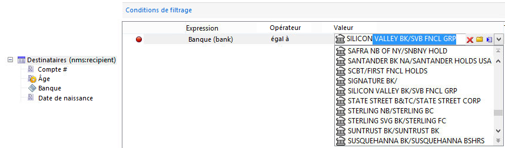

# Exemples dʼédition de schémas{#examples-of-schemas-edition}

## Extension dʼun tableau {#extending-a-table}

Pour étendre la table des destinataires de schéma **nms:recipient**, la procédure est la suivante :

1. Créez le schéma d&#39;extension (**cus:extension**) avec les données suivantes :

   ```
   <srcSchema mappingType="sql" name="extension" namespace="cus" xtkschema="xtk:srcSchema" extendedSchema="nms:recipient">  
     <enumeration basetype="string" default="area1" name="area">    
       <value label="Zone 1" name="area1"/>    
       <value label="Zone 2" name="area2"/>  
     </enumeration>  
   
     <element name="extension">    
       <dbindex name="area">      
         <keyfield xpath="location/@area"/>    
       </dbindex>      
   
       <attribute label="Loyalty code" name="fidelity" type="long"/>    
       <element name="location">      
         <attribute name="area" label="Purchasing zone" type="string" length="50" enum="area"/>    
       </element>  </element>  
   </srcSchema>
   ```

   Dans cet exemple, on ajoute un champ indexé (**fidelity**) et on complète l&#39;élément **location** (déjà existant dans le schéma **nms:recipient**) avec un champ énuméré (**area**).

   >[!IMPORTANT]
   >
   >N&#39;oubliez pas d&#39;ajouter l&#39;attribut **extendedSchema** pour référencer le schéma d&#39;extension.

1. Vérifiez que le schéma étendu est bien le schéma **nms:recipient** et que les données ajoutées sont bien présentes :

   ```
   <schema dependingSchemas="cus:extension" mappingType="sql" name="recipient" namespace="nms" xtkschema="xtk:schema">
     ...
     <enumeration basetype="string" default="area1" name="area">    
       <value label="Zone 1" name="area1"/>    
       <value label="Zone 2" name="area2"/>  
     </enumeration>
     ...
     <element autopk="true" name="recipient" sqltable="NmsRecipient"> 
       <dbindex name="area">      
         <keyfield xpath="location/@area"/>    
       </dbindex>
   
       ...
       <attribute belongsTo="cus:extension" label="Loyalty code" name="fidelity" sqlname="iFidelity" type="long"/>
       <element name="location">
         ...
         <attribute enum="area" label="Purchasing zone" length="50" name="area" sqlname="sArea" type="string"/>
       </element>
       ...
     </element>
   </schema>
   ```

   Le script SQL généré à partir de l&#39;assistant de mise à jour de la base est le suivant :

   ```
   ALTER TABLE NmsRecipient ADD iFidelity INTEGER;
   UPDATE NmsRecipient SET iFidelity = 0;
   ALTER TABLE NmsRecipient ALTER COLUMN iFidelity SET NOT NULL;ALTER TABLE NmsRecipient ALTER COLUMN iFidelity SET Default 0;
   ALTER TABLE NmsRecipient ADD sArea VARCHAR(50); 
   CREATE INDEX NmsRecipient_area ON NmsRecipient(sArea);
   ```

## Table liée de collection {#linked-collection-table}

Cette section présente le mode de création d&#39;une table des commandes liée à la table des destinataires avec une cardinalité 1-N.

Schéma source de la table des commandes :

```
<srcSchema label="Order" name="order" namespace="cus" xtkschema="xtk:srcSchema">  
  <element autopk="true" name="order">    
    <compute-string expr="@number" + '(' + ToString(@date) + ')'/>    
    
    <attribute label="Number" length="128" name="number" type="string"/>    
    <attribute desc="Order date" label="Date" name="date" type="datetime" default="GetDate()"/>    
    <attribute desc="order total" label="Total" name="total" type="double"/>    
    <element label="Recipient" name="recipient" revDesc="Orders associated with this recipient" revIntegrity="own" revLabel="Orders" target="nms:recipient" type="link"/>  
  </element>
</srcSchema>
```

La table est de type **autopk** afin de créer automatiquement une clé primaire auto-générée qui sera utilisée par défaut par la jointure du lien sur la table des destinataires.

Schéma généré :

```
<schema label="Order" mappingType="sql" name="order" namespace="cus" xtkschema="xtk:schema">  
  <element autopk="true" label="Order" name="order" sqltable="CusOrder">    
    <compute-string expr="ToString(@date) + ' - ' + @number"/>    

    <dbindex name="id" unique="true">      
      <keyfield xpath="@id"/>    
    </dbindex>    

    <key internal="true" name="id">      
      <keyfield xpath="@id"/>    
    </key>    

    <dbindex name="recipientId">      
      <keyfield xpath="@recipient-id"/>    
    </dbindex>    

    <attribute desc="Internal primary key" label="Primary key" name="id" sqlname="iOrderId" type="long"/>    
    <attribute label="Number" length="128" name="number" sqlname="sNumber" type="string"/>    
    <attribute desc="Order date" label="Date" name="date" sqlname="tsDate" type="datetime"/>    
    <attribute desc="order total" label="Total" name="total" sqlname="Total" type="double"/>    
    <element label="Recipient" name="recipient" revLink="order" target="nms:recipient" type="link">      
      <join xpath-dst="@id" xpath-src="@recipient-id"/>    
    </element>    
    <attribute advanced="true" label="Foreign key of 'Recipient' link ('id' field)" name="recipient-id" sqlname="iRecipientId" type="long"/>  
   </element>
</schema>
```

Le script SQL de création de la table est le suivant :

```
CREATE TABLE CusOrder(dTotal DOUBLE PRECISION NOT NULL Default 0, iOrderId INTEGER NOT NULL Default 0, iRecipientId INTEGER NOT NULL Default 0, sNumber VARCHAR(128), tsDate TIMESTAMP Default NULL);
CREATE UNIQUE INDEX CusOrder_id ON CusOrder(iOrderId);
CREATE INDEX CusOrder_recipientId ON CusOrder(iRecipientId);  
INSERT INTO CusOrder (iOrderId) VALUES (0); 
```

>[!NOTE]
>
>L&#39;ordre SQL INSERT INTO en fin de script permet d&#39;insérer un enregistrement d&#39;identifiant à 0 afin de simuler les jointures externes.

## Table d&#39;extension {#extension-table}

Une table d&#39;extension permet d&#39;étendre le contenu d&#39;une table existante dans une table liée de cardinalité 1-1.

Le principe de la table d&#39;extension est d&#39;éviter les limitations du nombre de champs supportés dans une table ou encore d&#39;optimiser la place occupée par les données car celles-ci sont consommées à la demande.

Créer le schéma de la table d&#39;extension (**cus:feature**) :

```
<srcSchema mappingType="sql" name="feature" namespace="cus" xtkschema="xtk:srcSchema">  
  <element autopk="true" name="feature">    
    <attribute label="Children" name="children" type="byte"/>    
    <attribute label="Single" name="single" type="boolean"/>    
    <attribute label="Spouse first name" length="100" name="spouseFirstName" type="string"/>  
  </element>
</srcSchema>
```

Créer un schéma d&#39;extension sur la table des destinataires pour ajouter le lien de cardinalité 1-1 :

```
<srcSchema extendedSchema="nms:recipient" label="Recipient" mappingType="sql" name="recipient" namespace="cus" xtkschema="xtk:srcSchema">  
  <element name="recipient">    
    <element desc="Features" integrity="own" label="Features" name="feature" revCardinality="single" revLink="recipient" target="cus:feature" type="link"/> 
  </element>
</srcSchema>
```

>[!NOTE]
>
>La définition du lien entre la table des destinataires et la table d&#39;extension doit être renseignée à partir du schéma qui possède la clé étrangère.

Le script SQL de création de la table d&#39;extension est le suivant :

```
CREATE TABLE CusFeature(  iChildren NUMERIC(3) NOT NULL Default 0, iFeatureId INTEGER NOT NULL Default 0, iSingle NUMERIC(3) NOT NULL Default 0, sSpouseFirstName VARCHAR(100));
CREATE UNIQUE INDEX CusFeature_id ON CusFeature(iFeatureId);  
INSERT INTO CusFeature (iFeatureId) VALUES (0); 
```

Le script SQL de mise à jour de la table des destinataires est le suivant :

```
ALTER TABLE NmsRecipient ADD iFeatureId INTEGER;
UPDATE NmsRecipient SET iFeatureId = 0;
ALTER TABLE NmsRecipient ALTER COLUMN iFeatureId SET NOT NULL;
ALTER TABLE NmsRecipient ALTER COLUMN iFeatureId SET Default 0;
CREATE INDEX NmsRecipient_featureId ON NmsRecipient(iFeatureId);
```

## Table d’Overflow {#overflow-table}

Une table d&#39;Overflow est une table d&#39;extension (cardinalité 1-1), mais la déclaration du lien vers la table à étendre est renseignée dans le schéma de la table d&#39;Overflow.

C&#39;est la table d&#39;Overflow qui possède la clé étrangère vers la table à étendre : on ne modifie donc pas la table à étendre. La relation entre les deux tables est la valeur de la clé primaire de la table à étendre.

Créer le schéma de la table d&#39;Overflow (**cus:overflow**) :

```
<srcSchema label="Overflow" name="overflow" namespace="cus" xtkschema="xtk:srcSchema">  
  <element name="overflow">    
    <key internal="true" name="id">      
      <keyfield xlink="recipient"/>    
    </key>    

    <attribute label="Children" name="children" type="byte"/>    
    <attribute label="Single" name="single" type="boolean"/>    
    <attribute label="Spouse first name" length="100" name="spouseFirstName" type="string"/>  
    <element label="Customer" name="recipient" revCardinality="single" revIntegrity="own" revExternalJoin="true" target="nms:recipient" type="link"/>  
  </element>  
</srcSchema>
```

>[!NOTE]
>
>La clé primaire de la table d&#39;Overflow est le lien vers la table à étendre (schéma &quot;nms:recipient&quot; dans notre exemple).

Le script SQL de création de la table est le suivant :

```
CREATE TABLE CusOverflow(iChildren NUMERIC(3) NOT NULL Default 0, iRecipientId INTEGER NOT NULL Default 0, iSingle NUMERIC(3) NOT NULL Default 0, sSpouseFirstName VARCHAR(100));
CREATE UNIQUE INDEX CusOverflow2_id ON CusOverflow2(iRecipientId);  
```

## Table de relation {#relationship-table}

Une table de relation permet de lier deux tables avec une cardinalité N-N. Cette table ne contient que les clés étrangères des tables à lier.

Exemple d&#39;une table de relation entre les groupes (**nms:group**) et les destinataires (**nms:recipient**).

Schéma source de la table de relation :

```
<srcSchema name="rcpGrpRel" namespace="cus">
  <element name="rcpGrpRel">
    <key internal="true" name="id">      
      <keyfield xlink="rcpGroup"/>      
      <keyfield xlink="recipient"/>    
    </key>

    <element integrity="neutral" label="Recipient" name="recipient" revDesc="Groups to which this recipient belongs" revIntegrity="own" revLabel="Groups" target="nms:recipient" type="link"/>    
    <element integrity="neutral" label="Group" name="rcpGroup" revDesc="Recipients in the group" revIntegrity="own" revLabel="Recipients" revLink="rcpGrpRel" target="nms:group" type="link"/>
  </element>
</srcSchema>
```

Le schéma généré est le suivant :

```
<schema mappingType="sql" name="rcpGrpRel" namespace="cus" xtkschema="xtk:schema">  
  <element name="rcpGrpRel" sqltable="CusRcpGrpRel">    
    <compute-string expr="ToString([@rcpGroup-id]) + ',' + ToString([@recipient-id])"/>    
    <dbindex name="id" unique="true">      
      <keyfield xpath="@rcpGroup-id"/>      
      <keyfield xpath="@recipient-id"/>    
    </dbindex>    

    <key internal="true" name="id">      
      <keyfield xpath="@rcpGroup-id"/>      
      <keyfield xpath="@recipient-id"/>    
    </key>    

    <dbindex name="rcpGroupId">      
      <keyfield xpath="@rcpGroup-id"/>    
    </dbindex>    
    <dbindex name="recipientId">      
      <keyfield xpath="@recipient-id"/>    
    </dbindex>    

    <element integrity="neutral" label="Recipient" name="recipient" revLink="rcpGrpRel" target="nms:recipient" type="link">      
      <join xpath-dst="@id" xpath-src="@recipient-id"/>    
    </element>    
    <attribute advanced="true" label="Foreign key of 'Recipient' link ('id' field)" name="recipient-id" sqlname="iRecipientId" type="long"/>    

    <element integrity="neutral" label="Group" name="rcpGroup" revLink="rcpGrpRel" target="nms:group" type="link">      
      <join xpath-dst="@id" xpath-src="@rcpGroup-id"/>    
    </element>    
    <attribute advanced="true" label="Foreign key of 'Group' link ('id' field)" name="rcpGroup-id" sqlname="iRcpGroupId" type="long"/>  
  </element>
</schema>
```

Le script SQL de création de la table est le suivant :

```
CREATE TABLE CusRcpGrpRel( iRcpGroupId INTEGER NOT NULL Default 0, iRecipientId INTEGER NOT NULL Default 0);
CREATE UNIQUE INDEX CusRcpGrpRel_id ON CusRcpGrpRel(iRcpGroupId, iRecipientId);
CREATE INDEX CusRcpGrpRel_recipientId ON CusRcpGrpRel(iRecipientId);
```

## Cas pratique : lier un champ à une table de référence existante {#uc-link}

Ce cas pratique illustre comment utiliser une table de référence existante comme alternative aux mécanismes d&#39;énumération intégrés d&#39;Adobe Campaign (enum, userEnum ou dbEnum).

Vous pouvez également utiliser une table de référence existante comme énumération dans vos schémas. Pour ce faire, vous pouvez créer un lien entre une table et la table de référence en ajoutant l&#39;attribut **displayAsField=&quot;true&quot;**.

Dans cet exemple, la table de référence contient une liste de noms de banque et d&#39;identifiants :

```
<srcSchema entitySchema="xtk:srcSchema" img="cus:bank16x16.png" label="Bank" mappingType="sql" name="bank" namespace="cus"
xtkschema="xtk:srcSchema">
    <element img="cus:bank16x16.png" label="Banks" name="bank">
        <compute-string expr="@name"/>
        <key name="id">
            <keyfield xpath="@id"/>
        </key>
        <attribute label="Bank Id" name="id" type="short"/>
        <attribute label="Name" length="64" name="name" type="string"/>
     </element> 
</srcSchema>
```

Dans toute table utilisant cette table de référence, définissez un lien et ajoutez l&#39;attribut **displayAsField=&quot;true&quot;**.

```
<element displayAsField="true" label="Bank" name="bank" target="cus:bank" type="link" noDbIndex="true"/>
```

L&#39;interface utilisateur n&#39;affiche pas de lien mais un champ. Lorsque l’utilisateur sélectionne ce champ, il peut choisir une valeur dans la table de référence ou utiliser la fonction de saisie semi-automatique.



* Pour qu&#39;il soit complété semi-automatiquement, vous devez définir une chaîne de calcul dans la table de référence.

* Ajoutez l&#39;attribut **noDbIndex=&quot;true&quot;** dans la définition de lien pour empêcher Adobe Campaign de créer un index vers les valeurs stockées dans la table source du lien.

## Rubriques connexes :

* [Utilisation des énumérations](../../platform/using/managing-enumerations.md)

* [Prise en main des schémas de Campaign](../../configuration/using/about-schema-edition.md)

* [Mettre à jour la structure de la base de données](../../configuration/using/updating-the-database-structure.md)
