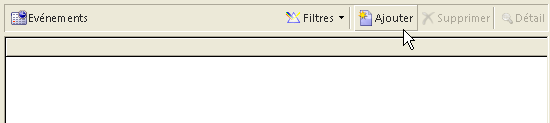

# Structure d&#39;un formulaire{#form-structure}


La description d’un formulaire est un document XML structuré respectant la grammaire du schéma de formulaire **xtk:form**.

Le document XML du formulaire de saisie doit contenir l’élément racine `<form>` avec les attributs **nom** et **espace de noms** pour renseigner le nom et l’espace de noms du formulaire.

```xml
<form name="form_name" namespace="name_space">
…
</form>
```

Par défaut, un formulaire est associé au schéma de données possédant un nom et un espace de noms identiques. Pour associer un formulaire avec un nom différent, définissez l&#39;attribut **entity-schema** de l&#39;élément `<form>` sur le nom de la clé de schéma. Pour illustrer la structure d&#39;un formulaire de saisie, nous allons décrire une interface à partir du schéma d&#39;exemple &quot;cus:recipient&quot; :

```xml
<srcSchema name="recipient" namespace="cus">
  <enumeration name="gender" basetype="byte">    
    <value name="unknown" label="Not specified" value="0"/>    
    <value name="male" label="Male" value="1"/>   
    <value name="female" label="Female" value="2"/>   
  </enumeration>

  <element name="recipient">
    <attribute name="email" type="string" length="80" label="Email" desc="Email address of recipient"/>
    <attribute name="birthDate" type="datetime" label="Date"/>
    <attribute name="gender" type="byte" label="Gender" enum="gender"/>
  </element>
</srcSchema>
```

Le formulaire de saisie à partir du schéma d&#39;exemple :


```xml
<form name="recipient" namespace="cus">
  <input xpath="@gender"/>
  <input xpath="@birthDate"/>
  <input xpath="@email"/>
</form>
```

La description des contrôles d&#39;édition commence à partir de l&#39;élément `<form>`. Un contrôle d&#39;édition est renseigné sur un élément **`<input>`** avec l&#39;attribut **xpath** qui contient le chemin du champ dans son schéma.

Le contrôle d&#39;édition s&#39;adapte automatiquement au type de données correspondant et utilise le libellé défini dans le schéma.

>[!NOTE]
>
>Vous pouvez surcharger le libellé défini dans son schéma de données en ajoutant l’attribut **label** à l’élément `<input>` :\
>`<input label="Email address" xpath="@name" />`

Par défaut, chaque champ est affiché sur une seule ligne et occupe tout l&#39;espace disponible selon le type de données.

## Mise en forme {#formatting}

La disposition des contrôles entre eux ressemble à celle utilisée dans les tableaux HTML, avec la possibilité de diviser un contrôle en plusieurs colonnes, utiliser des imbrications d&#39;éléments ou de spécifier l&#39;occupation de l&#39;espace disponible. Il faut cependant retenir que la mise en page autorise seulement des répartitions de proportions, il n&#39;est pas possible de spécifier des dimensions fixes pour un objet.

Pour afficher les contrôles de l&#39;exemple précédent sur deux colonnes :


```xml
<form name="recipient" namespace="cus">
  <container colcount="2">
    <input xpath="@gender"/>
    <input xpath="@birthDate"/>
    <input xpath="@email"/>
  </container>
</form>
```

L&#39;élément **`<container>`** avec l&#39;attribut **colcount** permet de forcer l&#39;affichage des contrôles enfants sur deux colonnes.

L&#39;attribut **colspan** sur un contrôle étend celui-ci avec le nombre de colonnes renseignées dans sa valeur :


```xml
<form name="recipient" namespace="cus">
  <container colcount="2">
    <input xpath="@gender"/>
    <input xpath="@birthDate"/>
    <input xpath="@email" colspan="2"/>
  </container>
</form> 
```

En renseignant l&#39;attribut **type=&quot;frame&quot;**, le conteneur ajoute un habillage autour des contrôles enfants avec le libellé contenu dans l&#39;attribut **label** :


```xml
<form name="recipient" namespace="cus">
  <container colcount="2" type="frame" label="General">
    <input xpath="@gender"/>
    <input xpath="@birthDate"/>
    <input xpath="@email" colspan="2"/>
  </container>
</form>
```

Un élément **`<static>`** peut être utilisé pour mettre en forme le formulaire de saisie :


```xml
<form name="recipient" namespace="cus">
  <static type="separator" colspan="2" label="General"/>
  <input xpath="@gender"/>
  <input xpath="@birthDate"/>
  <input xpath="@email" colspan="2"/>
  <static type="help" label="General information about recipient with date of birth, gender, and email address." colspan="2"/>
</form>
```

La balise **`<static>`** avec le type **separator** permet d&#39;ajouter une barre de séparation avec un libellé contenu dans l&#39;attribut **label**.

Un texte d&#39;aide a été ajouté à l&#39;aide de la balise `<static>` avec le type d&#39;aide. Le contenu du texte est saisi dans l&#39;attribut **label**.

## Conteneurs {#containers}

Les conteneurs permettent de regrouper un ensemble de contrôles. Ils sont représentés par l’élément **`<container>`**. Ils ont été utilisés ci-dessus pour mettre en forme les contrôles sur plusieurs colonnes.

L&#39;attribut **xpath** sur un `<container>` permet de simplifier le référencement des contrôles enfants. Le référencement des contrôles est alors relatif à l’élément `<container>` parent.

Exemple de conteneur sans &quot;xpath&quot; :

```xml
<container colcount="2">
  <input xpath="location/@zipCode"/>
  <input xpath="location/@city"/>
</container>
```

Exemple avec ajout du &quot;xpath&quot; sur l&#39;élément de nom &quot;location&quot; :

```xml
<container colcount="2" xpath="location">
  <input xpath="@zipCode"/>
  <input xpath="@city"/>
</container>
```

### Types de conteneurs {#types-of-container}

Les conteneurs sont utilisés pour construire des contrôles complexes ayant recours à un ensemble de champs mis en forme dans des pages.

#### Conteneur à onglets {#tab-container}

Un conteneur à onglets met en forme les données dans des pages accessibles depuis des onglets.


```xml
<container type="notebook">
  <container colcount="2" label="General">
    <input xpath="@gender"/>
    <input xpath="@birthDate"/>
    <input xpath="@email" colspan="2"/>
  </container>
  <container colcount="2" label="Location">
    …
  </container>
</container>
```

Le conteneur principal est défini par l&#39;attribut **type=&quot;notebook&quot;**. Les onglets sont déclarés dans les conteneurs enfants, le libellé des onglets est renseigné à partir de l&#39;attribut **label**.


>[!NOTE]
>
>Une propriété **style=&quot;down|up**(par défaut)**&quot;** force le positionnement vertical des libellés des onglets en bas ou en haut du contrôle. Cette propriété est optionnelle.
>`<container style="down" type="notebook">  … </container>`

#### Liste à icônes {#icon-list}

Ce conteneur affiche une barre d&#39;icônes verticale permettant de sélectionner les pages à afficher.


```xml
<container type="iconbox">
  <container colcount="2" label="General" img="xtk:properties.png">
    <input xpath="@gender"/>
    <input xpath="@birthDate"/>
    <input xpath="@email" colspan="2"/>
  </container>
  <container colcount="2" label="Location" img="nms:msgfolder.png">
    …
  </container>
</container>
```

Le conteneur principal est défini par l&#39;attribut **type=&quot;iconbox&quot;**. Les pages associées aux icônes sont déclarées dans les conteneurs enfants. Le libellé des icônes est renseigné à partir de l&#39;attribut **label**.

L&#39;icône d&#39;une page est renseignée à partir de l&#39;attribut `img="<image>"`, où `<image>` est le nom de l&#39;image correspondant à sa clé construite avec le nom et l&#39;espace de noms (par exemple &quot;xtk:properties.png&quot;).

Les images sont disponibles à partir du nœud **[!UICONTROL Administration > Paramétrage > Images]**.

#### Conteneur de visibilité {#visibility-container}

Vous pouvez masquer un ensemble de contrôles à partir d&#39;une condition dynamique.

Cet exemple illustre la visibilité des contrôles sur la valeur du champ &quot;Genre&quot; :

```xml
<container type="visibleGroup" visibleIf="@gender=1">
  …
</container>
<container type="visibleGroup" visibleIf="@gender=2">
  …
</container>
```

Un conteneur de visibilité est défini par l&#39;attribut **type=&quot;visibleGroup&quot;**. L&#39;attribut **visibleIf** contient la condition de visibilité.

Exemples de syntaxes de conditions :

* **visibleIf=&quot;@email=&#39;peter.martinezATneeolane.net&#39;&quot;** : teste l&#39;égalité sur les données de type chaîne. La valeur de comparaison doit être entre guillemets.
* **visibleIf=&quot;@gender >= 1 and @gender != 2&quot;** : condition sur une valeur numérique.
* **visibleIf=&quot;@boolean1=true or @boolean2=false&quot;** : test sur des champs booléens.

#### Conteneur d&#39;activation {#enabling-container}

Ce conteneur pemet l&#39;activation ou la désactivation d&#39;un ensemble de données à partir d&#39;une condition dynamique. La désactivation d&#39;un contrôle empêche son édition. L&#39;exemple suivant illustre l&#39;activation des contrôles à partir de la valeur du champ &quot;Genre&quot; :

```xml
<container type="enabledGroup" enabledIf="@gender=1">
  …
</container>
<container type="enabledGroup" enabledIf="@gender=2">
  …
</container>
```

Un conteneur d&#39;activation est défini par l&#39;attribut **type=&quot;enabledGroup&quot;**. L&#39;attribut **enabledIf** contient la condition d&#39;activation.

## Edition d&#39;un lien {#editing-a-link}

Pour rappel, un lien est déclaré dans le schéma de données de la façon suivante :

```xml
<element label="Company" name="company" target="cus:company" type="link"/>
```

Le contrôle d&#39;édition du lien dans son formulaire de saisie est :


```xml
<input xpath="company"/>
```

Le choix de la cible est accessible à partir de la zone d&#39;édition. Une aide à la saisie par auto-complétion permet de retrouver facilement un élément de la cible en fonction des premiers caractères renseignés. La recherche se base alors sur la **Compute string** définie dans le schéma ciblé. Si la cible n&#39;existe pas après validation dans le contrôle, un message de confirmation de création à la volée de la cible est affiché. La confirmation crée un nouvel enregistrement de la table cible et l&#39;associe sur le lien.

Une liste déroulante permet de sélectionner un élément de la cible parmi la liste des enregistrements déjà créés.

L&#39;icône **[!UICONTROL Modifier le lien]** (dossier) lance une forme de sélection avec la liste des éléments ciblés et une zone de filtrage :


L&#39;icône **[!UICONTROL Editer le lien]** (loupe) lance la forme d&#39;édition de l&#39;élément lié. La forme utilisée est déduite par défaut sur la clé du schéma ciblé, l&#39;attribut **form** permet de forcer le nom de la forme d&#39;édition (par exemple &quot;cus:company2&quot;).

Vous pouvez restreindre le choix des éléments de la cible en ajoutant l’élément **`<sysfilter>`** à partir de la définition du lien dans le formulaire de saisie :

```xml
<input xpath="company">
  <sysFilter>
    <condition expr="[location/@city] =  'Newton"/>
  </sysFilter>
</input>
```

Vous pouvez aussi trier la liste avec l&#39;élément **`<orderby>`** :

```xml
<input xpath="company">
  <orderBy>
    <node expr="[location/@zipCode]"/>
  </orderBy>
</input>
```

### Propriétés du contrôle {#control-properties}

* **noAutoComplete** : désactive l&#39;auto-complétion (avec la valeur &quot;true&quot;)
* **createMode** : crée le lien à la volée s&#39;il n&#39;existe pas, les valeurs possibles sont :

   * **none** : désactive la création, un message d&#39;erreur est affiché si le lien n&#39;existe pas
   * **inline** : crée le lien avec le contenu dans la zone d&#39;édition
   * **edition** : affiche la forme d&#39;édition sur le lien, la validation de la forme enregistre les données (mode par défaut)

* **noZoom** : pas de forme d&#39;édition sur le lien (avec la valeur &quot;true&quot;)
* **form** : surcharge la forme d&#39;édition de l&#39;élément ciblé

## Liste de liens {#list-of-links}

Un lien renseigné dans le schéma de données en tant que élément de collection (@unbound=&quot;true&quot;) doit obligatoirement passer par une liste afin de visualiser l&#39;ensemble des éléments qui lui sont associés.

Le principe consiste à afficher la liste des éléments liés avec un chargement des données optimisé (récupération par batch des données, exécution de la liste uniquement si elle est visible).

Exemple de lien de collection dans un schéma :

```xml
<element label="Events" name="rcpEvent" target="cus:event" type="link" unbound="true">
…
</element>
```

La liste dans son formulaire de saisie :



```xml
 <input xpath="rcpEvent" type="linklist">
  <input xpath="@label"/>
  <input xpath="@date"/>
</input>
```

Le contrôle liste est defini par l&#39;attribut **type=&quot;linklist&quot;**, le chemin de la liste doit porter sur le lien de collection.

Les colonnes sont déclarées via les éléments **`<input>`** fils de la liste. L&#39;attribut **xpath** fait référence au chemin du champ dans le schéma cible.

Une barre d&#39;outils avec un libellé (défini sur le lien dans le schéma) est automatiquement positionnée au-dessus de la liste.

La liste peut être filtrée à partir du bouton **[!UICONTROL Filtres]** et configurée pour ajouter et trier les colonnes.

Les boutons **[!UICONTROL Ajouter]** et **[!UICONTROL Supprimer]** permettent l&#39;ajout et la suppression des éléments de collection du lien. L&#39;ajout d&#39;un élément lance par défaut la forme d&#39;édition du schéma cible.

Le bouton **[!UICONTROL Détail]** est automatiquement ajouté lorsque l&#39;attribut **zoom=&quot;true&quot;** est renseigné sur la balise **`<input>`** de la liste : il permet de lancer la forme d&#39;édition de la ligne sélectionnée.

Un filtre et un tri peuvent être appliqués lors du chargement de la liste :

```xml
 <input xpath="rcpEvent" type="linklist">
  <input xpath="@label"/>
  <input xpath="@date"/>
  <sysFilter>
    <condition expr="@type = 1"/>
  </sysFilter>
  <orderBy>
    <node expr="@date" sortDesc="true"/>
  </orderBy>
</input>
```

### Table de relation {#relationship-table}

Une table de relation permet de lier deux tables avec une cardinalité N-N. La table de relation contient uniquement les liens vers les deux tables.

L&#39;ajout d&#39;un élément dans la liste doit donc permettre de renseigner une liste à partir d&#39;un des deux liens de la table de relation.

Exemple de table de relation dans un schéma :

```xml
<srcSchema name="subscription" namespace="cus">
  <element name="recipient" type="link" target="cus:recipient" label="Recipient"/>
  <element name="service" type="link" target="cus:service" label="Subscription service"/>
</srcSchema>
```

Pour notre exemple, nous partirons du formulaire de saisie du schéma &quot;cus:recipient&quot;. La liste doit afficher les associations avec les abonnements aux services et permettre d&#39;ajouter un abonnement en sélectionnant un service déjà existant.


```xml
<input type="linklist" xpath="subscription" xpathChoiceTarget="service" xpathEditTarget="service" zoom="true">
  <input xpath="recipient"/>
  <input xpath="service"/>
</input>
```

L&#39;attribut **xpathChoiceTarget** permet de lancer une forme de choix à partir du lien renseigné. La création de l&#39;enregistrement de la table de relation va automatiquement mettre à jour le lien sur le destinataire courant et le service sélectionné.

>[!NOTE]
>
>L&#39;attribut **xpathEditTarget** permet de forcer l&#39;édition de la ligne sélectionnée sur le lien renseigné.

### Propriétés de la liste {#list-properties}

* **noToolbar** : cache la barre d&#39;outils (avec la valeur &quot;true&quot;)
* **toolbarCaption** : surcharge le libellé de la barre d&#39;outils
* **toolbarAlign** : modifie la géométrie verticale ou horizontale de la barre d&#39;outils (valeurs possibles : &quot;vertical&quot;|&quot;horizontal&quot;)
* **img** : affiche l&#39;image associée à la liste
* **form** : surcharge la forme d&#39;édition de l&#39;élément ciblé
* **zoom** : ajoute le bouton **[!UICONTROL Zoom]** pour l&#39;édition de l&#39;élément ciblé
* **xpathEditTarget** : fixe l&#39;édition sur le lien renseigné
* **xpathChoiceTarget** : pour l&#39;ajout, lance la forme de choix sur le lien renseigné

## Contrôles liste mémoire {#memory-list-controls}

Les listes mémoire permettent d&#39;éditer les éléments de collection avec le préchargement des données la liste. Cette liste ne peut être ni filtrée, ni configurée.

Ces listes sont utilisées sur les éléments de collections mappés en XML ou sur les liens à faible volume.

### Liste en colonnes {#column-list}

Ce contrôle affiche une liste à colonnes éditable avec une barre d&#39;outils contenant les boutons d&#39;ajout et de suppression.


```xml
<input xpath="rcpEvent" type="list">
  <input xpath="@label"/>
  <input xpath="@date"/>
</input>
```

Le contrôle liste doit être renseigné avec l&#39;attribut **type=&quot;list&quot;**, le chemin de la liste doit porter sur l&#39;élément de collection.

Les colonnes sont déclarées dans les balises **`<input>`** enfants de la liste. Le libellé et la taille de colonne peuvent être forcés avec les attributs **label** et **colSize**.

>[!NOTE]
>
>Les flèches d&#39;ordonnancement sont ajoutées automatiquement lorsque l&#39;attribut **ordered=&quot;true&quot;** est ajouté sur l&#39;élément de collection dans le schéma de données.

Les boutons de la barre d&#39;outils peuvent être alignés horizontalement :


```xml
<input nolabel="true" toolbarCaption="List of events" type="list" xpath="rcpEvent" zoom="true">
  <input xpath="@label"/>
  <input xpath="@date"/>
</input>
```

L&#39;attribut **toolbarCaption** force l&#39;alignement horizontal de la barre d&#39;outils et renseigne le titre au dessus de la liste.

#### Zoom dans les listes {#zoom-in-a-list}

L’insertion et l’édition des données d’une liste peuvent être renseignées dans un formulaire de modification séparé.


```xml
<input nolabel="true" toolbarCaption="List of events" type="list" xpath="rcpEvent" zoom="true" zoomOnAdd="true">
  <input xpath="@label"/>
  <input xpath="@date"/>

  <form colcount="2" label="Event">
    <input xpath="@label"/>
    <input xpath="@date"/>
  </form>
</input>
```

Le formulaire de modification est rempli à partir de l’élément `<form>` sous la définition de liste. Sa structure est identique à celle d&#39;un formulaire de saisie. Le bouton **[!UICONTROL Détail]** est ajouté automatiquement lorsque l&#39;attribut **zoom=&quot;true&quot;** est renseigné sur la balise **`<input>`** de la liste. Cet attribut permet de lancer le formulaire d&#39;édition de la ligne sélectionnée.

>[!NOTE]
>
>L&#39;ajout de l&#39;attribut **zoomOnAdd=&quot;true&quot;** force l&#39;appel de la forme d&#39;édition sur l&#39;insertion d&#39;un élément de la liste.

### Propriétés de la liste {#list-properties-1}

* **noToolbar** : cache la barre d&#39;outils (avec la valeur &quot;true&quot;)
* **toolbarCaption** : surcharge le libellé de la barre d&#39;outils
* **toolbarAlign** : modifie le positionnement de la barre d&#39;outils (valeurs possibles : &quot;vertical&quot;|&quot;horizontal&quot;)
* **img** : affiche l&#39;image associée à la liste
* **form** : surcharge la forme d&#39;édition de l&#39;élément ciblé
* **zoom** : ajoute le bouton **[!UICONTROL Zoom]** pour l&#39;édition de l&#39;élément ciblé
* **zoomOnAdd** : lance le forme d&#39;édition sur l&#39;ajout
* **xpathChoiceTarget** : pour l&#39;ajout, lance la forme de choix sur le lien renseigné

## Champs non éditables {#non-editable-fields}

Pour afficher un champ et empêcher son édition, vous devez utiliser la balise **`<value>`** ou renseigner l&#39;attribut **readOnly=&quot;true&quot;** sur la balise **`<input>`**.

Exemple sur le champ &quot;Genre&quot; :


```xml
<value value="@gender"/>
<input xpath="@gender" readOnly="true"/>
```

## Bouton radio {#radio-button}

Un bouton radio permet d&#39;effectuer un choix parmi plusieurs options. Les balises **`<input>`** sont utilisées pour répertorier les options possibles et l&#39;attribut **checkedValue** spécifie la valeur associée au choix.

Exemple sur le champ &quot;Genre&quot; :

```xml
<input type="RadioButton" xpath="@gender" checkedValue="0" label="Choice 1"/>
<input type="RadioButton" xpath="@gender" checkedValue="1" label="Choice 2"/>
<input type="RadioButton" xpath="@gender" checkedValue="2" label="Choice 3"/>
```


## Case à cocher {#checkbox}

Une case à cocher permet de refléter un état booléen (qu&#39;elle soit cochée ou non). Par défaut, ce contrôle est utilisé par les champs de type &quot;booléen&quot; (true/false). On peut associer à ce bouton une variable qui prendra par défaut la valeur 0 ou 1. Cette valeur peut être surchargée à partir de l&#39;attribut **checkValue**.

```xml
<input xpath="@boolean1"/>
<input xpath="@field1" type="checkbox" checkedValue="Y"/>
```


## Énumération {#enumeration}

<!-- to be completed -->

## Modification arborescente {#navigation-hierarchy-edit}

Ce contrôle construit une arborescence sur un ensemble de champs à éditer.

Les contrôles à éditer sont regroupés dans un **`<container>`** renseigné sous la balise **`<input>`** du contrôle arborescent :

```xml
<input nolabel="true" type="treeEdit">
  <container label="Text fields">
    <input xpath="@text1"/>
    <input xpath="@text2"/>
  </container>
  <container label="Boolean fields">
    <input xpath="@boolean1"/>
    <input xpath="@boolean2"/>
  </container>
</input>
```


## Champ d&#39;expression {#expression-field}

Un champ d’expression permet de mettre à jour dynamiquement un champ à partir d’une expression ; la balise **`<input>`** est utilisée avec un attribut **xpath** pour renseigner le chemin du champ à mettre à jour et un attribut **expo** contenant l’expression de mise à jour.

```xml
<!-- Example: updating the boolean1 field from the value contained in the field with path /tmp/@flag -->
<input expr="Iif([/tmp/@flag]=='On', true, false)" type="expr" xpath="@boolean1"/>
<input expr="[/ignored/@action] == 'FCP'" type="expr" xpath="@launchFCP"/>
```

## Contexte des formes {#context-of-forms}

L&#39;exécution d&#39;un formulaire de saisie initialise un document XML contenant les données de l&#39;entité en cours d&#39;édition. Ce document représente le contexte du formulaire et peut être utilisé comme espace de travail.

### Mise à jour du contexte {#updating-the-context}

Pour modifier le contexte du formulaire, vous devez utiliser la balise `<set expr="<value>" xpath="<field>"/>`, où `<field>` est le chemin destination et `<value>` est la valeur ou expression de mise à jour.

Exemples d&#39;utilisation de la balise `<set>` :

* **`<set expr="'Test'" xpath="/tmp/@test" />`** : positionne la valeur &#39;Test&#39; à l&#39;emplacement temporaire /tmp/@test1
* **`<set expr="'Test'" xpath="@lastName" />`** : met à jour l&#39;entité sur l&#39;attribut &quot;lastName&quot; avec la valeur &#39;Test&#39;
* **`<set expr="true" xpath="@boolean1" />`** : définit sur vrai (&quot;true&quot;) la valeur du champ &quot;boolean1&quot;
* **`<set expr="@lastName" xpath="/tmp/@test" />`** : met à jour avec le contenu de l&#39;attribut &quot;lastName&quot;

La mise à jour du contexte du formulaire peut être effectuée à l&#39;initialisation et à la fermeture du formulaire, à partir des balises **`<enter>`** et **`<leave>`**.

```xml
<form name="recipient" namespace="cus">
  <enter>
    <set…
  </enter>
  …
  <leave>
    <set…
  </leave>
</form>
```

>[!NOTE]
>
>Les balises `<enter>` et `<leave>` peuvent être utilisées sur les `<container>` des pages (types « notebook » et « iconbox »).

### Langage d&#39;expression {#expression-language-}

Un macro-langage peut être utilisé dans la définition d&#39;un formulaire afin d&#39;effectuer des tests conditionnels.

La balise **`<if expr="<expression>" />`** exécute les instructions spécifiées sous la balise si l&#39;expression est vérifiée :

```xml
<if expr="([/tmp/@test] == 'Test' or @lastName != 'Doe') and @boolean2 == true">
  <set xpath="@boolean1" expr="true"/>
</if>
```

La balise **`<check expr="<condition>" />`** combinée avec la balise **`<error>`** empêche la validation du formulaire et affiche un message d&#39;erreur si la condition n&#39;est pas respectée :

```xml
<leave>
  <check expr="/tmp/@test != ''">
    <error>You must populate the 'Test' field!</error> 
  </check>
</leave>
```

<!-- changer exemple par un exemple plus parlant. cf. vidéo validation 02:27. noter aussi l'attribut required dans l'exemple de la vidéo. -->

## Assistants {#wizards}

Un assistant permet une saisie guidée à travers un ensemble d&#39;étapes présentées sous forme de pages. La validation du formulaire enregistre les informations saisies.

Un assistant se construit de la façon suivante :

```xml
<form type="wizard" name="example" namespace="cus" img="nms:rcpgroup32.png" label="Wizard example" entity-schema="nms:recipient">
  <container title="Title of page 1" desc="Long description of page 1">
    <input xpath="@lastName"/>
    <input xpath="comment"/>
  </container>
  <container title="Title of page 2" desc="Long description of page 2">
    …
  </container>
  …
</form>
```


La présence de l’attribut **type=&quot;wizard&quot;** sur l’élément `<form>` permet de définir le mode assistant dans la construction du formulaire. Les pages sont renseignées à partir d&#39;éléments `<container>` qui sont des enfants de l&#39;élément `<form>`. L&#39;élément `<container>` d&#39;une page est renseigné avec l&#39;attribut title pour le titre, et l&#39;attribut desc pour afficher la description sous le titre de la page. Les boutons **[!UICONTROL Précédent]** et **[!UICONTROL Suivant]** sont automatiquement ajoutés afin de naviguer de page en page.

Le bouton **[!UICONTROL Terminer]** enregistre les informations saisies et ferme le formulaire.

### Méthodes SOAP {#soap-methods}

L&#39;exécution d&#39;une méthode SOAP peut être lancée à partir d&#39;une balise **`<leave>`** renseignée en fin de page.

La balise **`<soapcall>`** contient l&#39;appel de la méthode avec les paramètres en entrée :

```xml
<soapCall name="<name>" service="<schema>">
  <param  type="<type>" exprIn="<xpath>"/>  
  …
</soapCall>
```

Le nom du service et son schéma d&#39;implémentation sont renseignés à partir des attributs **name** et **service** de la balise **`<soapcall>`**.

Les paramètres en entrée sont décrits sur les éléments **`<param>`** sous la balise **`<soapcall>`**.

Le type du paramètre doit être spécifié à partir de l&#39;attribut **type**. Les différents types possibles sont les suivants :

* **string** : chaîne de caractères
* **boolean** : booléen
* **byte** : nombre entier 8 bits
* **short** : nombre entier 16 bits
* **long** : nombre entier 32 bits
* **short** : nombre entier 16 bits
* **double** : nombre flottant double précision
* **DOMElement** : noeud de type élément

L&#39;attribut **exprIn** contient l&#39;emplacement de la donnée à passer en paramètre.

**Exemple**:

```xml
<leave>
  <soapCall name="RegisterGroup" service="nms:recipient">         
    <param  type="DOMElement"    exprIn="/tmp/entityList"/>         
    <param  type="DOMElement"    exprIn="/tmp/choiceList"/>         
    <param  type="boolean"       exprIn="true"/>       
  </soapCall>
</leave>
```
