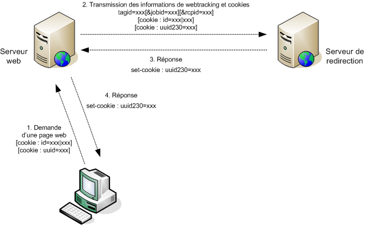

# Insertion de balises de tracking web sur votre site{#inserting-tags-in-your-site}

## Méthode simple {#simple-method}

Cette méthode consiste à effectuer l&#39;appel HTTP au serveur de redirection via l&#39;insertion d&#39;une balise HTML **``** dans le code source HTML de la page web que vous souhaitez tracker.

>[!IMPORTANT]
>
>Cette méthode utilise les cookies transmis par le navigateur Web pour identifier le destinataire : sa fiabilité n&#39;est pas garantie à 100%.

**Exemple**:

```

  <...>
  <body>
  <script>
      document.write("");
    </script>
    <noscript>
     
    </noscript>
    <h1>My site</h1>
    <form action="http://localhost/amount.md">
      Quantity: <input type="text" name="quantity"/><br/><br/>
      Amount: <input type="text" name="amount"/><br/><br/>
      <input value="Save" type="submit">
    </form>
  </body>
</html>
```

Insertion d&#39;une balise de tracking Web de type TRANSACTION sur la page de confirmation (&quot;amount.md&quot;).

```
<html>
  <body>
    <script>
      function getURLparam(name) 
      {
        var m = location.search.match new RegExp("[?&]" + name + "=([^&]+)"));
        return m ? unescape(m[1]) : "";
      }
 
       var params = "https://localhost/r/" + Math.random().toString() + "?tagid=amount&amount="
                      +getURLparam("amount")+"&article="+getURLparam("quantity");
       document.write("");
    </script>

    <h1>Approval confirmation</h1>
  </body>
</html>
```

### Génération dynamique des balises de tracking Web {#dynamic-generation-of-web-tracking-tags}

Lorsque vos pages web sont générées dynamiquement, vous avez la possibilité d&#39;ajouter la balise de tracking Web au moment de la génération des pages.

**Exemple** : tracking Web ajouté dans des JSP.

```
<%@page import="java.util.Random" %>
<html>
  <body>
    ?tagid=home'>
    <h1>My site</h1>
    <form action="https://localhost/amount.md">
      Quantity: <input type="text" name="quantity"/><br/><br/>
      Amount: <input type="text" name="amount"/><br/><br/>
      <input value="Save" type="submit">
    </form>
  </body>
</html>
```

```
<%@page import="java.util.Random" %>
<html>
  <body>
    <%  
      String strParams = new Random().nextInt() + "?tagid=amount";
      strParams += "&amount="+request.getParameter("amount");
      strParams += "&article="+request.getParameter("quantity");
    %>
    '>
    <h1>Approval confirmation</h1>
    </body>
</html>
```

## Méthode optimale {#optimum-method-}

Si vous souhaitez contrôler les informations envoyées au serveur de redirection, la solution la plus fiable est d&#39;effectuer vous-même, avec un langage de génération de page, la requête HTTP de façon synchrone.

L’URL que vous créez doit respecter les règles de syntaxe définies dans la section [Balise de tracking web : définition](../../configuration/using/web-tracking-tag-definition.md).



>[!NOTE]
>
>La redirection et le tracking Web utilisent des cookies : il est important que le serveur Web effectuant l&#39;appel HTTP synchrone soit sur le même domaine que le serveur de redirection. Les différents échanges HTTP doivent faire transiter les cookies &#39;id&#39;, &#39;uuid&#39; et &#39;uuid230&#39;.

**Exemple** : génération dynamique en java, avec authentification du destinataire via son numéro de compte.

```
[...]
  // Recipient account, amount and articles
  String strAccount = request.getParameter("account");
  String strAmount = request.getParameter("amount");
  String strArticle = request.getParameter("article");

  StringBuffer strCookies = new StringBuffer();
  String strSetCookie = null;

  // Get cookies from client request
  Cookie[] cookies = request.getCookies();
  for(int i=0; i< cookies.length; i++ )
  {
    Cookie c = cookies[i];
    String strName = c.getName();
    if( strName.equals("id") || strName.equals("uuid") || strName.equals("uuid230") )
      // Helper function to add cookies in string
      AddCookie(strCookies, c);
  }
  // Now perform a synchronous HTTP request to inform redirection server
  // Add a tagid in auto-discover mode, and a default jobId to use (in hexa)
  StringBuffer strURL = new StringBuffer("https://www.adobe.com/r/a?tagid=cmd_page%7Ct&jobid=27EE");
  if( strAccount != null )
    AddParameter(strURL, "rcpid", "saccount="+strAccount);
  if( strAmount != null )
    AddParameter(strURL, "amount", strAmount);
  if( strArticle != null )
    AddParameter(strURL, "article", strArticle);
  
  URL url = new URL(strURL.toString());
  HttpURLConnection connection = (HttpURLConnection)url.openConnection();
  // Add the client cookies
  if( strCookies.length() > 0 )
    connection.setRequestProperty("Cookie", strCookies.toString());

  int errcode = connection.getResponseCode();

  // Now add the Adobe Campaign cookies if the server returned one :
  if( errcode == 200 )
  {
    strSetCookie = connection.getHeaderField("Set-Cookie");
    if( strSetCookie != null && strSetCookie.length() > 0 )
      response.addHeader("Set-Cookie", strSetCookie);
  }
  [...]
```
