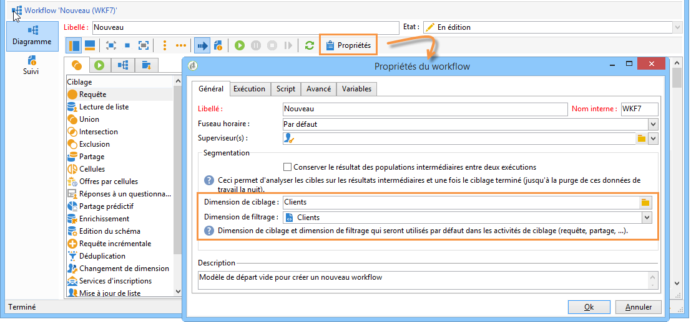

# Gestion des workflows{#managing-workflows}

Par défaut, les nouveaux workflows reposent sur un modèle préconfiguré, basé sur une table de destinataires (nms:recipient). Pour qu’ils soient automatiquement basés sur la table personnalisée des destinataires référencée dans l’option **Nms_DefaultRcpSchema** (voir la section [Configuration de l’interface](../../configuration/using/configuring-the-interface.md)), vous devez créer un modèle de workflow.

Créez un modèle à partir du nœud **[!UICONTROL Ressources > Modèles > Modèles de workflow]**. Dans les propriétés du modèle, les dimensions renseignées correspondent alors à votre table de destinataires externe.

En basant vos nouveaux workflows sur le modèle nouvellement créé, votre table personnalisée sera sélectionnée par défaut au niveau des dimensions de ciblage et de filtrage globales du workflow.

Toutes les activités utilisées dans votre workflow utiliseront ainsi votre table personnalisée sans besoin de paramétrage manuel supplémentaire.

Pour plus d&#39;informations sur les workflows, voir [cette section](../../workflow/using/about-workflows.md).

