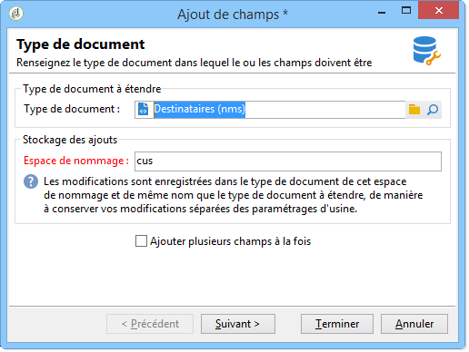
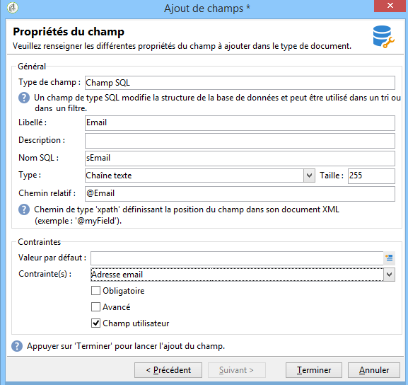

# Assistant d&#39;ajout de champs{#new-field-wizard}


Un assistant accessible à partir du menu **[!UICONTROL Outils > Avancé > Ajout de champs]** permet d&#39;ajouter un ou plusieurs champs dans une table de la base de données.

La validation de l&#39;assistant met à jour le schéma d&#39;extension de la table à étendre et lance le script SQL pour modifier la structure physique de la base de données.

Cet assistant à l&#39;avantage d&#39;ajouter rapidement un champ sans avoir à connaître la structure d&#39;un schéma de données.

L&#39;inconvénient principal est la limitation des données et des propriétés à étendre.

Les écrans de l&#39;assistant contiennent les étapes suivantes :

1. La première page permet de renseigner le nom du schéma à étendre et l&#39;espace de noms du schéma d&#39;extension où seront enregistrées les modifications :

   

1. La page suivante renseigne les propriétés du champ à ajouter.

   

1. Pour valider les modifications, cliquez sur le bouton **[!UICONTROL Terminer]**.

Un fichier d&#39;extension de nom &quot;cus:recipient&quot; dans notre exemple, est automatiquement créé et le script SQL correspondant exécuté :

```
<srcSchema extendedSchema="nms:recipient" label="Recipients" name="recipient"  namespace="cus">  
  <element name="recipient">    
    <attribute belongsTo="cus:recipient" dataPolicy="email" label="Email" length="80" name="email1" sqlname="sEmail1" type="string" user="true"/>  
  </element>
</srcSchema>
```

>[!NOTE]
>
>Par défaut, les champs ajoutés sont déclarés avec la propriété **user** (avec la valeur &quot;true&quot;). Celle-ci permet d&#39;afficher et d&#39;éditer le champ dans le formulaire de saisie du schéma étendu avec l&#39;utilisation d&#39;un contrôle de type &quot;treeEdit&quot; (voir à ce sujet le chapitre Formulaires de saisie).
