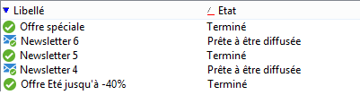

# Caractéristiques du schéma{#schema-characteristics}


Les particularités propres à un schéma qui référence une table existante sont les suivantes :

* Adobe Campaign doit s&#39;abstenir de modifier les objets SQL relatifs aux tables existantes,
* Les noms des tables et colonnes doivent être précisés explicitement,
* Les index doivent être déclarés.

>[!IMPORTANT]
>
>Ne supprimez pas les champs de la table des destinataires intégrée, même s’ils sont inutiles. Cela peut entraîner des erreurs de comportement dans la base de données d’Adobe Campaign.

## Attribut view {#the-view-attribute}

Les schémas source acceptent l’attribut **view** pour l’élément racine **srcSchema**. Il doit être utilisé lorsqu’Adobe Campaign est manipulé dans des tableaux personnalisés. L’attribut **view=&quot;true&quot;** indique à l’assistant de mise à jour de la structure de base de données d’ignorer le schéma. Ainsi, on interdit à l&#39;application de synchroniser la table, ses colonnes et ses index avec le schéma correspondant.

Lorsque cet attribut est défini sur **true**, le schéma sert uniquement à générer les requêtes SQL pour accéder aux données de ce tableau.

## Noms de tables et de colonnes {#names-of-tables-and-columns}

Lorsque les tableaux sont créés par l’assistant de mise à jour de tableau, les noms des tableaux et des colonnes sont générés automatiquement à partir des noms des schémas et des attributs respectifs. Il est toutefois possible de forcer l’utilisation des noms SQL en renseignant les attributs suivants :

* **sqltable** au niveau de l&#39;élément principal du schéma, pour préciser la table,
* **sqlname** au niveau de chaque attribut, pour préciser les colonnes.

**Exemple**:

```
<element label="Individual" name="individual" sqltable="individual">
    <key internal="true" name="id">
      <keyfield xpath="@id"/>
    </key> 
    <attribute name="id" type="long" length="32" />
    <attribute name="lastName" type="string" length="100" sqlname="Last_Name"/>
    <attribute name="firstName" type="string" length="100" sqlname="First_Name"/>
    <attribute name="email" type="string" length="100"/>
    <attribute name="mobile" type="string" length="100"/>
</element>
```

Dans cet exemple, si les noms des tables et des colonnes n&#39;avaient pas été explicitement précisés, l&#39;application aurait utilisé **CusIndividual** pour la table, **lastName** et **firstName** pour les colonnes.

Dans un schéma, il est possible de ne renseigner qu’une partie des colonnes d’une table existante. Les colonnes non renseignées ne seront pas accessibles aux utilisateurs et utilisatrices.

## Champs indexés {#indexed-fields}

Pour trier les enregistrements d&#39;une liste depuis la console cliente, il est préférable, en termes de performances, de trier sur des champs indexés. La déclaration d&#39;un index dans un schéma provoque, dans la console, l&#39;affichage des champs indexés avec un trait rouge sous la flèche de tri située à gauche du libellé de la colonne, comme dans l&#39;écran ci-dessous :



Dans un schéma, un index se définit comme suit :

```
<dbindex name="name_of_index" unique="true/false"
  <keyfield xpath="xpath_1st_field"/
  <keyfield xpath="xpath_2nd_field"/
  ...
</dbindex
```

Il est donc important de déclarer les index existants de la table personnalisée dans le schéma correspondant.

Un index est implicitement déclaré pour chaque déclaration de clé et de lien du schéma source. La déclaration d’index peut être empêchée en spécifiant l’attribut **noDbIndex=&quot;true&quot;** :

**Exemple**:

```
<key internal="true" name="customer" noDbIndex="true">
  <keyfield xpath="@customerId"/>
</key>
```
