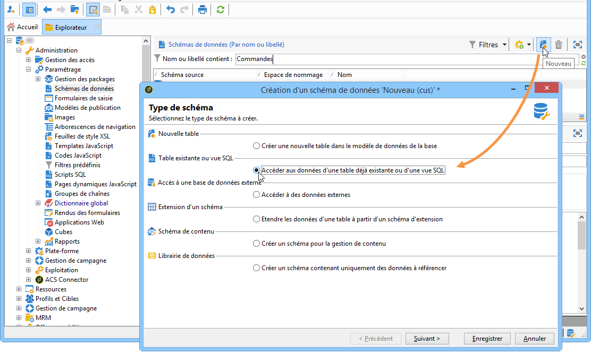
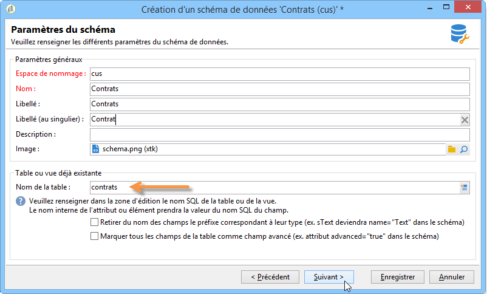
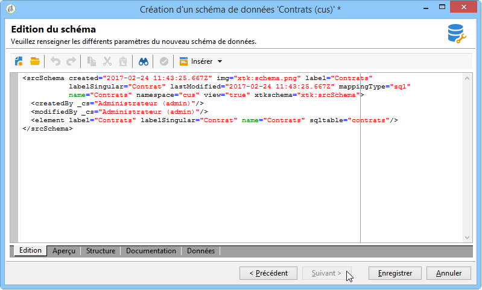

# Schéma d&#39;une table existante{#schema-of-an-existing-table}

## Présentation {#overview}

Lorsque l&#39;application doit accéder aux données d&#39;une table déjà existante, ou d&#39;une vue SQL, ou de données provenant d&#39;une base distante, vous devez créer son schéma dans Adobe Campaign avec les données suivantes :

* le nom de la table : renseigner le nom de la table (avec son alias dans le cas d&#39;une utilisation d&#39;un dblink) avec l&#39;attribut &quot;sqltable&quot;,
* la clé du schéma : référencer le ou les champs de réconciliation,
* les index : utilisés pour la génération des requêtes,
* les champs et leur emplacement dans la structure XML : renseigner uniquement les champs utilisés dans l&#39;application,
* les liens : s&#39;il existe des jointures avec les autres tables de la base.

## Mise en oeuvre {#implementation}

Pour créer le schéma correspondant, les étapes sont les suivantes :

1. Editez le nœud **[!UICONTROL Administration > Paramétrage > Schémas de données]** de l&#39;arborescence Adobe Campaign et cliquez sur l&#39;icône **[!UICONTROL Nouveau]** .
1. Sélectionnez l&#39;option **[!UICONTROL Accéder aux données d&#39;une table déjà existante ou d&#39;une vue SQL]** et cliquez sur **[!UICONTROL Suivant]** .

   

1. Sélectionnez la table ou la vue déjà existante :

   

1. Adaptez le contenu du schéma selon vos besoins.

   

   The schema must be populated with the view=&quot;true&quot; attribute on the `<srcSchema>` root element in order not to generate a table creation SQL script.

**Exemple** :

```
<srcSchema name="recipient" namespace="cus" view="true">
  <element name="recipient" sqltable="dbsrv.recipient">
    <key name="email">
      <keyfield xpath="@email"/>
    </key>   
    <attribute name="email" type="string" length="80" sqlname="email"/>
  </element>
</srcSchema>
```

## Accès à une base de données externe {#accessing-an-external-database}

Grâce à l’option **Federated Data Access - FDA**, vous pouvez accéder aux données stockées dans une base externe.

Le paramétrage nécessaire au niveau des schémas pour accéder aux données d&#39;une base externe est détaillé dans [cette page](../../platform/using/creating-data-schema.md).
