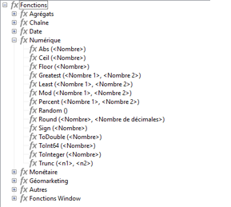

# Comprendre la structure d&#39;un schéma {#schema-structure}

La structure de base d’un schéma est décrite ci-dessous.

## Schémas de données  {#data-schema}

Pour un `<srcschema>`, la structure est la suivante :

```sql
<srcSchema>
    <enumeration>
        ...          //definition of enumerations
    </enumeration>
   
    <element>         //definition of the root <element>    (mandatory)

        <compute-string/>  //definition of a compute-string
        <dbindex>
            ...        //definition of indexes
        </dbindex>
        <key>
            ...        //definition of keys
        </key>
        <sysFilter>
            ...           //definition of filters
        </sysFilter>
        <attribute>
            ...             //definition of fields
        </attribute>
    
            <element>           //definition of sub-<element> 
                  <attribute>           //(collection, links or XML)
                  ...                         //and additional fields
                  </attribute>
                ...
            </element>
      
    </element> 

        <methods>                 //definition of SOAP methods
            <method>
                ...
            </method>
            ...
    </methods>  
          
</srcSchema>
```

Le document XML d&#39;un schéma de données doit contenir l&#39;élément racine **`<srcschema>`** avec les attributs **name** et **namespace** pour renseigner respectivement le nom du schéma et son espace de noms.

```sql
<srcSchema name="schema_name" namespace="namespace">
...
</srcSchema>
```

Pour illustrer la structure d&#39;un schéma de données, nous partirons du contenu XML suivant :

```sql
<recipient email="John.doe@aol.com" created="2009/03/12" gender="1"> 
  <location city="London"/>
</recipient>
```

Avec son schéma de données correspondant :

```sql
<srcSchema name="recipient" namespace="cus">
  <element name="recipient">
    <attribute name="email"/>
    <attribute name="created"/>
    <attribute name="gender"/>
    <element name="location">
      <attribute name="city"/>
   </element>
  </element>
</srcSchema>
```

## Description {#description}

Le point d’entrée du schéma est son élément principal. Il est facilement identifiable car son nom est identique à celui du schéma et il doit être enfant de l&#39;élément racine. C&#39;est à partir de cet élément que commence la description du contenu.

Dans notre exemple, l&#39;élément principal est représenté par la ligne :

```
<element name="recipient">
```

Les éléments **`<attribute>`** et **`<element>`** qui suivent l&#39;élément principal permettent de définir l&#39;emplacement et le nom des éléments de données dans la structure XML.

Soit dans notre schéma d&#39;exemple :

```sql
<attribute name="email"/>
<attribute name="created"/>
<attribute name="gender"/>
<element name="location">
  <attribute name="city"/>
</element>
```

Les règles suivantes s’appliquent :

* Chaque **`<element>`** et **`<attribute>`** doit être identifié par son nom à partir de l&#39;attribut **name**.

  >[!IMPORTANT]
  >
  >Le nom de l&#39;élément doit être concis, de préférence en anglais, et ne comprendre que des caractères autorisés dans les règles de nommage XML.

* Seuls les éléments **`<element>`** peuvent contenir des éléments **`<attribute>`** et des éléments **`<element>`** dans la structure XML.
* Un élément **`<attribute>`** doit être unique par son nom dans un **`<element>`**.
* L&#39;utilisation des **`<elements>`** sur les données de type chaîne multi-lignes est préconisée.

## Types de données {#data-types}

Le type de données est renseigné à partir de l&#39;attribut **type** sur les éléments **`<attribute>`** et **`<element>`**.

Une liste complète est disponible dans la description de l&#39;[`<attribute>`élément](../../configuration/using/schema/attribute.md) et de l’[`<element>`élément](../../configuration/using/schema/element.md).

Lorsque cet attribut n’est pas renseigné, **string** est le type de données par défaut, sauf si l’élément contient des éléments enfants. Si tel est le cas, il est utilisé uniquement pour structurer les éléments de manière hiérarchique (élément **`<location>`** dans notre exemple).

Les types de données supportés dans un schéma sont les suivants :

* **string** : chaîne de caractères. Exemples : un prénom, une ville, etc.

  La taille peut être spécifiée via l&#39;attribut **length** (optionnel, valeur par défaut &quot;255&quot;).

* **boolean** : champ booléen. Exemples de valeurs possibles : vrai/faux, 0/1, oui/non, etc.
* **byte**, **short**, **long** : entiers (1 octet, 2 octets, 4 octets). Exemples : un age, un numéro de compte, un nombre de points, etc.
* **double** : nombre flottant à double précision. Exemples : un prix, un taux, etc.
* **date**, **datetime**: dates et dates + heures. Exemples : une date de naissance, une date d&#39;achat, etc.
* **datetimenotz** : date + heure sans données de fuseau horaire.
* **timespan** : durée. Exemple : l&#39;ancienneté.
* **memo** : champ texte long (multi-lignes). Exemples : une description, un commentaire, etc.
* **uuid** : champ de type &quot;uniqueidentifier&quot; pour la prise en charge d’un GUID (pris en charge uniquement sous Microsoft SQL Server).

  >[!NOTE]
  >
  >Pour contenir un champ de type **uuid** dans un SGBDR autre que Microsoft SQL Server, la fonction `the newuuid()` doit être ajoutée et renseignée avec sa valeur par défaut.

Notre schéma d&#39;exemple complété avec les types :

```sql
<srcSchema name="recipient" namespace="cus">
  <element name="recipient">
    <attribute name="email" type="string" length="80"/>
    <attribute name="created" type="datetime"/>
    <attribute name="gender" type="byte"/>
    <element name="location">
      <attribute name="city" type="string" length="50"/>
   </element>
  </element>
</srcSchema>
```

### Mapping des types de données Adobe Campaign/SGBD {#mapping-the-types-of-adobe-campaign-dbms-data}

Le tableau suivant répertorie les mappings pour les types de données générés par Adobe Campaign pour les différents systèmes de gestion de base de données.

<table> 
 <tbody> 
  <tr> 
   <td> <strong>Adobe Campaign</strong><br /> </td> 
   <td> <strong>PosgreSQL</strong><br /> </td> 
   <td> <strong>Oracle</strong><br /> </td> 
  </tr> 
  <tr> 
   <td> Chaîne <br /> </td> 
   <td> VARCHAR(255)<br /> </td> 
   <td> VARCHAR2 (NVARCHAR2 si unicode)<br /> </td> 
  </tr> 
  <tr> 
   <td> Booléen<br /> </td> 
   <td> SMALLINT<br /> </td> 
   <td> NUMBER(3)<br /> </td> 
  </tr> 
  <tr> 
   <td> Octet<br /> </td> 
   <td> SMALLINT<br /> </td> 
   <td> NUMBER(3)<br /> </td> 
  </tr> 
  <tr> 
   <td> Court<br /> </td> 
   <td> SMALLINT<br /> </td> 
   <td> NUMBER(5)<br /> </td> 
  </tr> 
  <tr> 
   <td> Double<br /> </td> 
   <td> DOUBLE PRECISION<br /> </td> 
   <td> FLOAT<br /> </td> 
  </tr> 
  <tr> 
   <td> Long<br /> </td> 
   <td> INTEGER<br /> </td> 
   <td> NUMBER(10)<br /> </td> 
  </tr> 
  <tr> 
   <td> Int64<br /> </td> 
   <td> BIGINT<br /> </td> 
   <td> NUMBER(20)<br /> </td> 
  </tr> 
  <tr> 
   <td> Date<br /> </td> 
   <td> DATE<br /> </td> 
   <td> DATE<br /> </td> 
  </tr> 
  <tr> 
   <td> Time<br /> </td> 
   <td> TIME<br /> </td> 
   <td> FLOAT<br /> </td> 
  </tr> 
  <tr> 
   <td> Datetime<br /> </td> 
   <td> TIMESTAMPZ<br /> </td> 
   <td> DATE<br /> </td> 
  </tr> 
  <tr> 
   <td> Datetimenotz<br /> </td> 
   <td> TIMESTAMPZ<br /> </td> 
   <td> DATE<br /> </td> 
  </tr> 
  <tr> 
   <td> Timespan<br /> </td> 
   <td> DOUBLE PRECISION<br /> </td> 
   <td> FLOAT<br /> </td> 
  </tr> 
  <tr> 
   <td> Memo<br /> </td> 
   <td> TEXT<br /> </td> 
   <td> CLOB (NCLOB si Unicode)<br /> </td> 
  </tr> 
  <tr> 
   <td> Blob<br /> </td> 
   <td> BLOB<br /> </td> 
   <td> BLOB<br /> </td> 
  </tr> 
 </tbody> 
</table>

## Propriétés {#properties}

Les éléments **`<elements>`** et **`<attributes>`** du schéma de données peuvent être enrichis de diverses propriétés. Vous pouvez remplir un libellé afin de décrire l’élément actif.

### Les libellés et les descriptions {#labels-and-descriptions}

* La propriété **label** permet de saisir une description courte.

  >[!NOTE]
  >
  >Le libellé est associé à la langue courante de l&#39;instance.

  **Exemple**:

  ```sql
  <attribute name="email" type="string" length="80" label="Email"/>
  ```

  Le libellé est affiché dans le formulaire de saisie de la console cliente Adobe Campaign :

  

* La propriété **desc** permet de saisir une description longue.

  La description est affichée dans le formulaire de saisie dans la barre de statut de la fenêtre principale de la console cliente Adobe Campaign.

  >[!NOTE]
  >
  >La description est associée à la langue courante de l&#39;instance.

  **Exemple**:

  ```sql
  <attribute name="email" type="string" length="80" label="Email" desc="Email of recipient"/>
  ```

### Les valeurs par défaut {#default-values}

Utilisez la propriété **default** pour définir une expression qui renvoie une valeur par défaut lors de la création du contenu.

La valeur doit être une expression conforme au langage XPath. Pour plus d’informations, consultez la section [Référencer avec XPath](../../configuration/using/schema-structure.md#referencing-with-xpath).

**Exemple**:

* Date courante : **default=&quot;GetDate()&quot;**
* Compteur : **default=&quot;&#39;FRM&#39;+CounterValue(&#39;myCounter&#39;)&quot;**

  Dans cet exemple, la valeur par défaut est construite à l&#39;aide de la concaténation d&#39;une chaîne et de l&#39;appel de la fonction **CounterValue** avec un nom de compteur gratuit. Le nombre renvoyé est incrémenté d&#39;une unité à chaque insertion.

  >[!NOTE]
  >
  >Dans la console cliente Adobe Campaign, accédez au dossier **[!UICONTROL Administration > Compteurs]** de l’explorateur pour gérer les compteurs.

Pour lier une valeur par défaut à un champ, vous pouvez utiliser le champ `<default>` ou `<sqldefault>`.

`<default>` : vous permet de préremplir le champ avec une valeur par défaut lors de la création d’entités. La valeur ne sera pas une valeur SQL par défaut.

`<sqldefault>` : vous permet d&#39;avoir une valeur ajoutée lors de la création d&#39;un champ. Cette valeur s&#39;affiche sous forme de résultat SQL. Lors de la mise à jour d&#39;un schéma, seuls les nouveaux enregistrements seront affectés par cette valeur.

### Énumérations {#enumerations}

#### Énumération ouverte {#free-enumeration}

La propriété **userEnum** permet de définir une énumération ouverte pour stocker et afficher les valeurs renseignées dans ce champ.

La syntaxe est la suivante :

`userEnum="name of enumeration"`

Une liste déroulante énumère la liste de ces valeurs à partir du formulaire de saisie :


>[!NOTE]
>
>Dans la console cliente Adobe Campaign, accédez au dossier **[!UICONTROL Administration > Énumérations]** de l’explorateur pour gérer les énumérations.

#### Énumération fixe {#set-enumeration}

La propriété **enum** permet de définir une énumération fixe utilisée lorsque la liste des valeurs possibles est connue à l&#39;avance.

L&#39;attribut **enum** fait référence à la définition d&#39;une classe d&#39;énumération renseignée dans le schéma en dehors de l&#39;élément principal.

Les énumérations permettent à l&#39;utilisateur de sélectionner une valeur dans une liste déroulante au lieu de saisir cette valeur dans une zone de saisie classique :


Exemple de déclaration d&#39;énumération dans le schéma de données :

```sql
<enumeration name="gender" basetype="byte" default="0">    
  <value name="unknown" label="Not specified" value="0"/>    
  <value name="male" label="male" value="1"/>   
  <value name="female" label="female" value="2"/>   
</enumeration>
```

Une énumération est déclarée en dehors de l&#39;élément principal à partir de l&#39;élément **`<enumeration>`**.

Les propriétés de l&#39;énumération sont :

* **baseType** : type des données associées aux valeurs
* **label** : description de l&#39;énumération
* **name** : nom de l&#39;énumération
* **default** : valeur par défaut de l&#39;énumération

Les valeurs de l&#39;énumération sont déclarées dans l&#39;élément **`<value>`** avec les attributs suivants :

* **name** : nom de la valeur stockée en interne
* **label** : libellé affiché dans l&#39;interface graphique

#### Énumération dbenum {#dbenum-enumeration}

* La propriété **dbenum** permet de définir une énumération dont les propriétés sont semblables à celles de la propriété **enum**.

En revanche, l&#39;attribut **name** ne stocke pas de valeur en interne, mais un code, ce qui permet d&#39;étendre les tables concernées sans avoir à modifier leur schéma.

Cette énumération est utilisée par exemple, pour spécifier la nature des opérations.


### Exemple {#example}

Notre schéma d&#39;exemple complété avec les propriétés :

```sql
<srcSchema name="recipient" namespace="cus">
  <enumeration name="gender" basetype="byte">    
    <value name="unknown" label="Not specified" value="0"/>    
    <value name="male" label="male" value="1"/>   
    <value name="female" label="female" value="2"/>   
  </enumeration>

  <element name="recipient">
    <attribute name="email" type="string" length="80" label="Email" desc="Email of recipient"/>
    <attribute name="created" type="datetime" label="Date of creation" default="GetDate()"/>
    <attribute name="gender" type="byte" label="gender" enum="gender"/>
    <element name="location" label="Location">
      <attribute name="city" type="string" length="50" label="City" userEnum="city"/>
   </element>
  </element>
</srcSchema>
```

## des collections. {#collections}

Une collection est une liste d&#39;éléments de même nom et de même niveau hiérarchique.

L&#39;attribut **unbound** avec la valeur &quot;true&quot; permet de renseigner un élément de collection.

**Exemple** : définition de l&#39;élément de collection **`<group>`** dans le schéma.

```sql
<element name="group" unbound="true" label="List of groups">
  <attribute name="label" type="string" label="Label"/>
</element>
```

Avec la projection du contenu XML :

```sql
<group label="Group1"/>
<group label="Group2"/>
```

## Référencer avec XPath {#referencing-with-xpath}

Le langage XPath est utilisé dans Adobe Campaign pour référencer un élément ou un attribut appartenant à un schéma de données.

XPath est une syntaxe permettant la localisation d’un nœud dans l’arbre d’un document XML.

Les éléments sont désignés par leur nom, les attributs sont désignés par leur nom précédé d&#39;un caractère &quot;@&quot;.

**Exemple**:

* **@email** : sélectionne l&#39;email,
* **Location/@city** : sélectionne l&#39;attribut &quot;city&quot; sous l&#39;élément **`<location>`**.
* **../@email** : sélectionne l’adresse e-mail dans l’élément parent de l’élément courant
* **group`[1]/@label`** : sélectionne l&#39;attribut &quot;label&quot; enfant du premier élément de collection **`<group>`**
* **group`[@label='test1']`** : sélectionne l&#39;attribut &quot;label&quot;, enfant de l&#39;élément **`<group>`** et contenant la valeur &quot;test1&quot;

>[!NOTE]
>
>Une contrainte supplémentaire a été ajoutée lorsque le chemin traverse un sous-élément. Dans ce cas, il faut mettre l&#39;expression entre crochets :
>
>* **Location/@city** n&#39;est pas valide ; veuillez utiliser **`[location/@city]`**
>* **`[@email]`** et **@email** sont équivalents
>

Il est aussi possible de définir des expressions complexes, telles que les opérations arithmétiques :

* **@gender+1** : ajoute 1 au contenu de l&#39;attribut **gender**,
* **@email + &#39;(&#39;+@created+&#39;)&#39;** : construit une chaîne en prenant la valeur de l’adresse e-mail ajoutée à la date de création entre parenthèses (pour le type chaîne, il faut mettre la constante entre guillemets).

Des fonctions de haut niveau ont été ajoutées aux expressions afin d&#39;enrichir les possibilités offertes par ce langage.

La liste des fonctions disponibles est accessible à partir de n&#39;importe quel éditeur d&#39;expressions dans la console cliente Adobe Campaign :



**Exemple**:

* **GetDate()** : retourne la date courante
* **Year(@created)** : renvoie l&#39;année de la date contenue dans l&#39;attribut « created »
* **GetEmailDomain(@email)** : renvoie le domaine de l’adresse e-mail

## Construire une chaîne via la compute string {#building-a-string-via-the-compute-string}

**Compute string** est une expression XPath utilisée pour construire une chaîne représentant un enregistrement dans une table associée au schéma. **Compute string** est principalement utilisée dans l’interface graphique pour afficher le libellé d’un enregistrement sélectionné.

La chaîne **Compute string** est définie via l&#39;élément **`<compute-string>`** sous l&#39;élément principal du schéma de données. Un attribut **expr** contient une expression XPath pour calculer l’affichage.

**Exemple** : compute string de la table des destinataires.

```sql
<srcSchema name="recipient" namespace="nms">  
  <element name="recipient">
    <compute-string expr="@lastName + ' ' + @firstName +' (' + @email + ')' "/>
    ...
  </element>
</srcSchema>
```

Résultat de la chaîne calculée sur un destinataire : **Dupont René (rene.dupont@aol.com)**

>[!NOTE]
>
>Si le schéma ne contient pas de Compute string, une Compute string est renseignée par défaut avec les valeurs de la clé primaire du schéma.


## En savoir plus

Pour en savoir plus, consultez les liens suivants :

* [Prise en main des schémas](about-schema-reference.md)
* [Mapping de la base de données](database-mapping.md)
* [Gestion des liens](database-links.md)
* [Gestion des clés](database-keys.md)
* [Modèle de données Campaign](about-data-model.md)