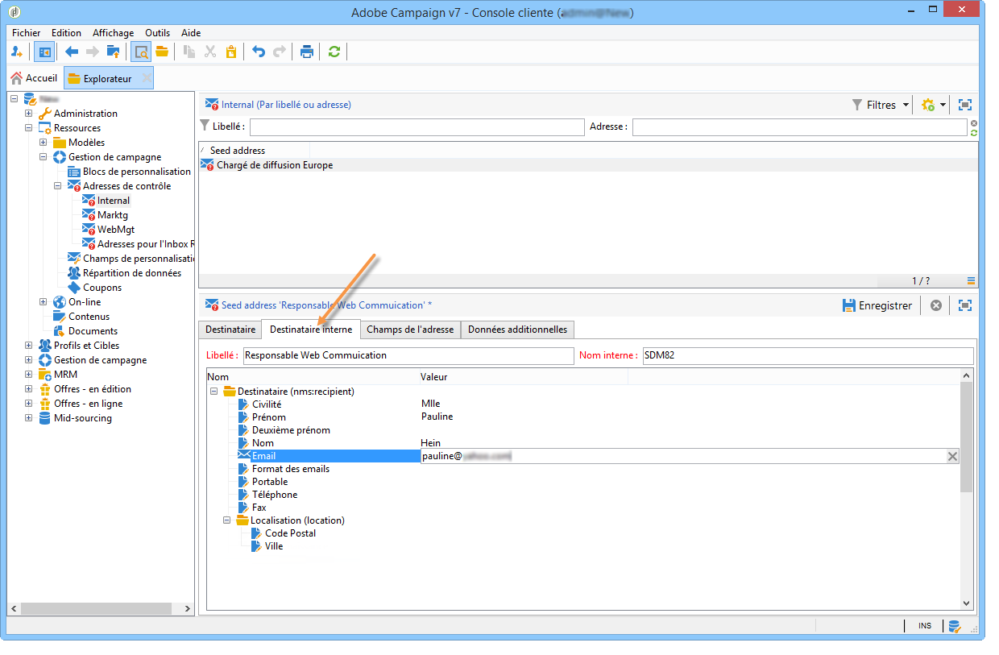

# Adresses de contrôle{#seed-addresses}


Si la table des destinataires est une table personnalisée, vous devez effectuer des paramétrages complémentaires. Le schéma **[!UICONTROL nms:seedMember]** doit être étendu. Un onglet supplémentaire est alors ajouté au niveau des adresses de contrôle afin de définir les champs adéquats, comme dans l&#39;exemple ci-dessous :



Pour plus d&#39;informations sur l&#39;utilisation des adresses de contrôle, consultez [cette section](../../delivery/using/about-seed-addresses.md).

## Mise en œuvre {#implementation}

Le schéma **nms:seedMember** et le formulaire lié prêts à l’emploi sont destinés à être étendus pour la configuration du client, afin de référencer tous les champs nécessaires. La définition du schéma contient des commentaires expliquant son mode de paramétrage.

Définition du schéma étendu de la table des destinataires :

```
<srcSchema label="Person" name="person" namespace="cus">
  <element autopk="true" label="Person" name="person">
      <attribute label="LastName" name="lastname" type="string"/>
      <attribute label="FirstName" name="firstname" type="string"/>
    <element label="Address" name="address">
      <attribute label="Email" name="addrEnv" type="string"/>
    </element>
    <attribute label="Code Offer" name="codeOffer" type="string"/>
  </element>
</srcSchema>
```

Les étapes sont les suivantes :

1. Créez une extension du schéma **nms:seedMember**. Pour plus d’informations, consultez [cette section](../../configuration/using/extending-a-schema.md).
1. Dans cette extension, ajoutez un nouvel élément à la racine de l&#39;élément **[!UICONTROL seedMember]**, avec les paramètres suivants :

   ```
   name="custom_customNamespace_customSchema"
   ```

   Cet élément doit contenir les champs nécessaires à l&#39;export des campagnes. Ces champs doivent porter le même nom que les champs correspondants du schéma externe. Par exemple, si le schéma est **[!UICONTROL cus:person]** , le schéma **[!UICONTROL nms:seedMember]** doit être étendu comme suit :

   ```
     <srcSchema extendedSchema="nms:seedMember" label="Seed addresses" labelSingular="Seed address" name="seedMember" namespace="cus">
     <element name="common">
       <element name="custom_cus_person">
         <attribute name="lastname" template="cus:person:person/@lastname"/>
         <attribute name="firstname" template="cus:person:person/@firstname"/>
         <attribute name="email" sqlname="myEmailField" template="cus:person:person/address/@addrEnv" xml="false"/>
       </element>
     </element>
     <element name="seedMember">
      <element aggregate="cus:seedMember:common"/>
     </element>
   </srcSchema>
   ```

   >[!NOTE]
   >
   >L&#39;extension du schéma **nms:seedMember** doit respecter les structures d&#39;une campagne et d&#39;une diffusion dans Adobe Campaign.

   >[!IMPORTANT]
   >
   >
   >    
   >    
   >    * Lors de l&#39;extension, vous devez obligatoirement préciser **un nom SQL (@sqlname)** pour le champ &#39;email&#39;. Le nom SQL doit être différent de &#39;sEmail&#39; qui est réservé pour le schéma des destinataires.
   >    * Vous devez mettre à jour la structure de la base de données avec le schéma créé lors de l&#39;extension **nms:seedMember**.
   >    * Dans l’extension **nms:seedMember**, le champ contenant l’adresse e-mail doit avoir **name=« email »** comme attribut. Le nom SQL doit être différent de &#39;sEmail&#39; qui est déjà utilisé pour le schéma des destinataires. Cet attribut doit être immédiatement déclaré sous l’élément **`<element name="custom_cus_person" />`**.
   >    
   >

1. Modifiez le formulaire **[!UICONTROL seedMember]** en conséquence pour définir un nouvel onglet « Destinataire interne » dans la fenêtre **[!UICONTROL Adresses de contrôle]**. Pour plus dʼinformations, consultez [cette page](../../configuration/using/form-structure.md).

   ```
   <container colcount="2" label="Internal recipient" name="internal"
                xpath="custom_cus_person">
       <input colspan="2" editable="true" nolabel="true" type="treeEdit">
         <container label="Recipient (cus:person)">
           <input xpath="@last name"/>
           <input xpath="@first name"/>
           <input xpath="@email"/>
         </container>
       </input>
     </container>
   ```

Si tous les attributs de lʼadresse de contrôle ne sont pas renseignés, Adobe Campaign procède automatiquement à la substitution de profils : ils seront alimentés automatiquement, lors de la personnalisation, par les données dʼun profil existant.
