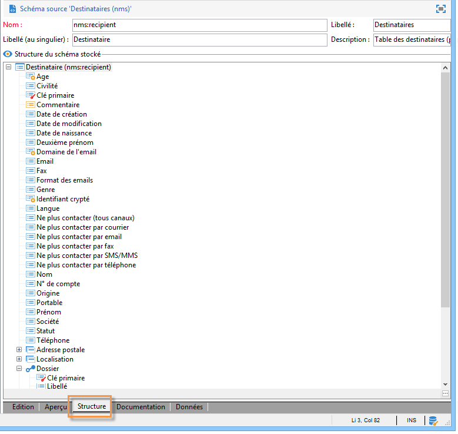

# Structure d’un schéma de données{#structure-of-a-data-schema}

La structure d’un schéma de données est présentée sous la forme d’une arborescence. Pour la visualiser graphiquement dans la console client Adobe Campaign, sélectionnez le schéma ciblé et cliquez sur le sous-onglet **[!UICONTROL Structure]**.

Par convention, les champs (Actif, Activé, etc.) sont affichés en premier et par ordre alphabétique. Les éléments de structure viennent ensuite (Adresse postale, Emplacement) et enfin les liens (Informations sur l’e-mail, Dossier, etc.).

Les clés primaires sont identifiées par une clé rouge et les clés étrangères par une clé jaune.

Les liens sont différenciés graphiquement en fonction de leur appartenance à la table. Ceux qui commencent à partir de la table, c’est-à-dire ceux qui possèdent la clé étrangère dans la table, s’affichent en premier (Informations sur l’e-mail, Dossier, Pays). Les liens de collection « Inverse » (Abonnement, Commandes, etc.) sont affichés à la fin.
