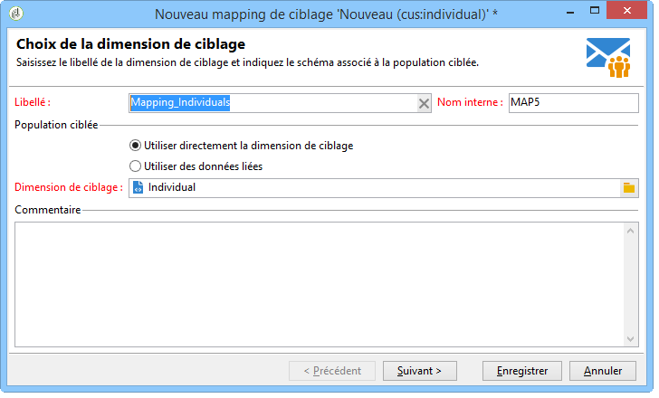
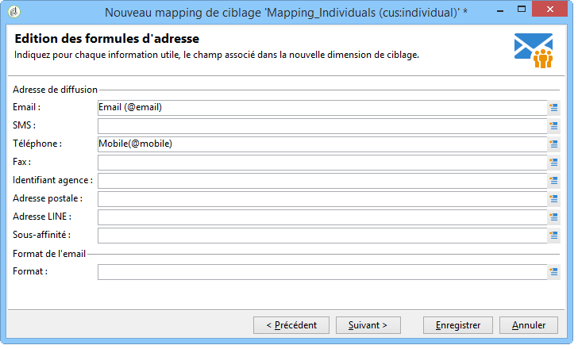
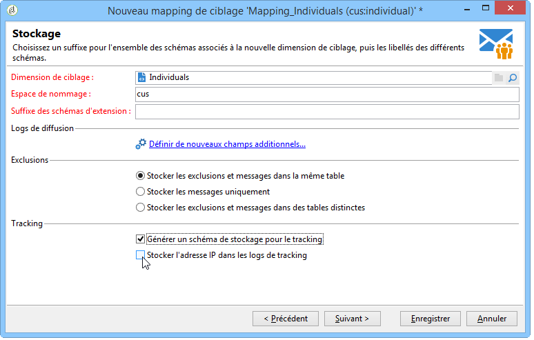
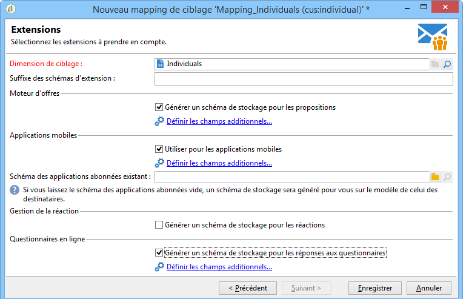
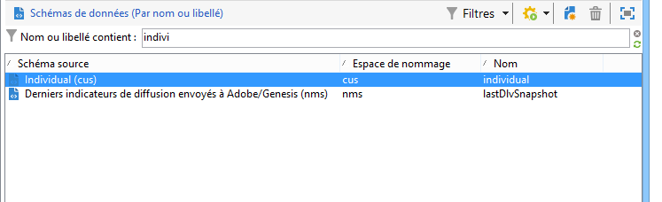
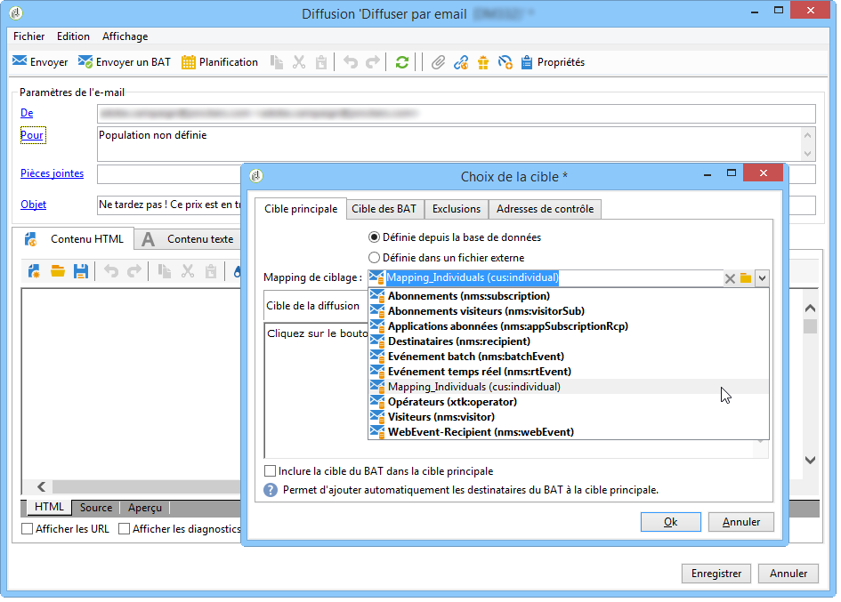

# Mapping de ciblage{#target-mapping}


La création d&#39;un mapping de ciblage est nécessaire dans deux cas de figure :

* si vous utilisez une table de destinataires autre que celle fournie par Adobe Campaign,
* si vous paramétrez une dimension de filtrage différente de la dimension de ciblage standard dans l&#39;écran des mappings de ciblage.

L&#39;assistant de création du mapping de ciblage va vous permettre de créer tous les schémas nécessaires pour la bonne utilisation de votre table personnalisée.

## Création et paramétrage des schémas liés à la table personnalisée {#creating-and-configuring-schemas-linked-to-the-custom-table}

Avant de créer un mapping de ciblage, vous devez procéder à un certain nombre de paramétrages afin que Adobe Campaign puisse fonctionner avec un nouveau schéma de données de destinataires.

Pour cela, les étapes sont les suivantes :

1. Créez un nouveau schéma de données intégrant les champs de votre table personnalisée que vous voulez utiliser.

   Pour plus d&#39;informations, reportez-vous au chapitre [Référence des schémas (xtk:srcSchema)](../../configuration/using/about-schema-reference.md).

   Dans notre exemple, nous allons créer un schéma client, une table très simple contenant les champs suivants : ID, prénom, nom, adresse e-mail, numéro de téléphone mobile. L’objectif est de pouvoir envoyer des alertes par e-mail ou SMS aux individus stockés dans cette table.

   Schéma d&#39;exemple (cus:individual)

   ```
   <srcSchema name="individual" namespace="cus" label="Individuals">
     <element name="individual">
       <key name="id" internal="true">
         <keyfield xpath="@id"/>
       </key>
       <attribute name="id" type="long" length="32"/>
       <attribute name="lastName" type="string" length="100"/>
       <attribute name="firstName" type="string" length="100"/>
       <attribute name="email" type="string" length="100"/>
       <attribute name="mobile" type="string" length="100"/>
     </element>
   </srcSchema>
   ```

1. Déclarez votre schéma comme vue externe à l&#39;aide de l&#39;attribut view=&quot;true&quot;. Pour plus d&#39;informations, consultez la section [Attribut view](../../configuration/using/schema-characteristics.md#the-view-attribute).

   ```
    <srcSchema desc="External recipient table" namespace="cus" view="true"....>
      ...
    </srcSchema>
   ```

1. Si vous avez besoin d&#39;ajouter une adresse postale, vous devez utiliser le type de structure suivante :

   ```
   <element advanced="true" name="postalAddress" template="nms:common:postalAddress">
        <attribute expr="SubString(JuxtWords(Smart([../infos/@firstname]), Upper([../infos/@name])), 1, 80)"
                   name="line1"/>
        <attribute expr="Upper([../address/@line2])" name="line2"/>
        <attribute expr="Upper([../address/@line])" name="line3"/>
        <attribute expr="Upper([../address/@line])" name="line4"/>
        <attribute expr="Upper([../address/@line])" name="line5"/>
        <attribute expr="Upper([../address/@line])" name="line6"/>
        <attribute _operation="delete" name="line7"/>
        <attribute _operation="delete" name="addrErrorCount"/>
        <attribute _operation="delete" name="addrQuality"/>
        <attribute _operation="delete" name="addrLastCheck"/>
        <element expr="@line1+'n'+@line2+'n'+@line3+'n'+@line4+'n'+@line5+'n'+@line6"
                 name="serialized"/>
        <attribute expr="AllNonNull2([../address/@line], [../infos/@name])" name="addrDefined"/>
      </element>
   ```

1. Cliquez sur le nœud **[!UICONTROL Administration > Gestion de campagne > Mappings de ciblage]**.
1. Cliquez sur le bouton **Nouveau** afin de lancer l&#39;assistant de création d&#39;un nouveau mapping de ciblage.
1. Complétez le champ **Libellé** et sélectionnez le schéma que vous venez de créer dans le champ **Dimension de ciblage**.

   

1. Dans la fenêtre suivante **Edition des formules d&#39;adresse**, sélectionnez les champs du schéma correspondant aux différentes adresses de diffusion. Dans le cas actuel, il est possible de mapper le champ **@email** et **@mobile**.

   

1. Dans la fenêtre suivante **Stockage**, complétez le champ **Suffixe des schémas d&#39;extension** pour différencier les nouveaux schémas crées des schémas génériques fournis par Adobe Campaign.

   Cliquez sur **[!UICONTROL Définir de nouveaux champs additionnels]** pour sélectionner la dimension que vous souhaitez cibler dans votre diffusion.

   Par défaut, la gestion des exclusions est stockée dans la même table que les messages.

   Cochez la case **Générer un schéma de stockage pour le tracking** si vous souhaitez configurer le stockage pour le tracking associé à votre mapping de ciblage.

   

   >[!IMPORTANT]
   >
   >Adobe Campaign ne prend pas en charge les schémas de destinataires multiples, appelés schémas de ciblage, liés aux mêmes schémas de broadlog et/ou de trackinglog. Leur prise en charge entraînerait des anomalies dans la réconciliation ultérieure des données. Pour plus d&#39;informations sur ce sujet, voir la page [Recommandations et limitations](../../configuration/using/about-custom-recipient-table.md).

1. Dans la fenêtre suivante **Extensions**, sélectionnez les schémas optionnels que vous souhaitez générer (la liste des schémas disponibles dépend des modules installés dans la plateforme Adobe Campaign).

   

1. Cliquez sur le bouton **Enregistrez** pour terminer l&#39;assistant.

   Basé sur le schéma de départ, l&#39;assistant a crée tous les schémas nécessaires au bon fonctionnement du nouveau mapping de ciblage.

   

## Utilisation du mapping de ciblage {#using-target-mapping}

Pour utiliser le nouveau schéma comme cible d&#39;une diffusion, il existe deux solutions :

* Créer un ou plusieurs modèles de diffusion basés sur le mapping
* Sélectionner directement le mapping lors de la sélection d&#39;une cible à la création d&#39;une diffusion, comme le montre la capture ci-dessous :


