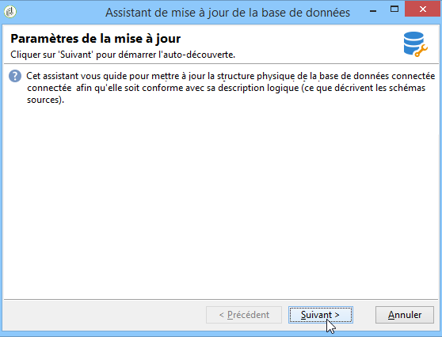
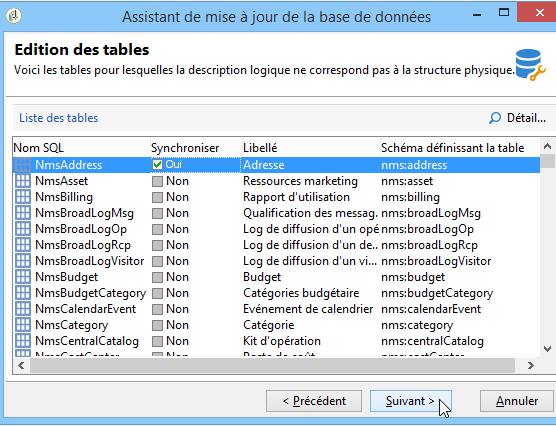
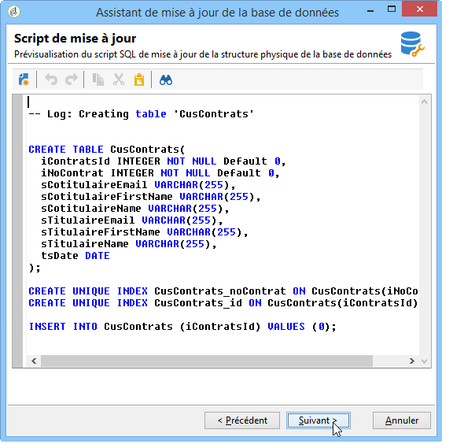
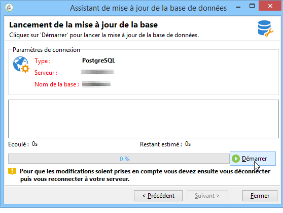

# Mettre à jour la structure de la base de données{#updating-the-database-structure}

Pour appliquer les modifications apportées dans les schémas, lancez l’assistant de mise à jour de la base de données. Cet assistant est accessible via **[!UICONTROL Outils > Avancé > Mise à jour de la structure de la base de données]**. Il vérifie que la structure physique de la base de données correspond bien à sa description logique et exécute les scripts de mise à jour SQL.

Les modules présents dans la base de données sont automatiquement renseignés et activés.

Les options **[!UICONTROL Ajouter les procédures stockées]** et **[!UICONTROL Importer les données d&#39;initialisation]** permettent respectivement de lancer les scripts SQL initiaux et les packages de données (&quot;data package&quot;) exécutés lors de la création de la base de données.

Il est possible d&#39;importer un jeu de données provenant d&#39;un package de données externe : Pour ce faire, sélectionnez **[!UICONTROL Importer un package]** et saisissez le fichier XML du package.

Suivez les étapes et visualisez le script SQL de mise à jour de la base de données :

>[!NOTE]
>
>Cette zone est en édition et peut être modifiée afin de supprimer ou ajouter du code SQL.

Lancez ensuite la mise à jour de la base de données :

