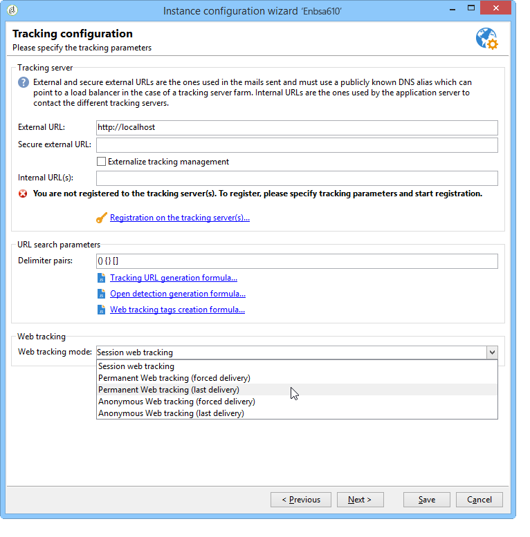
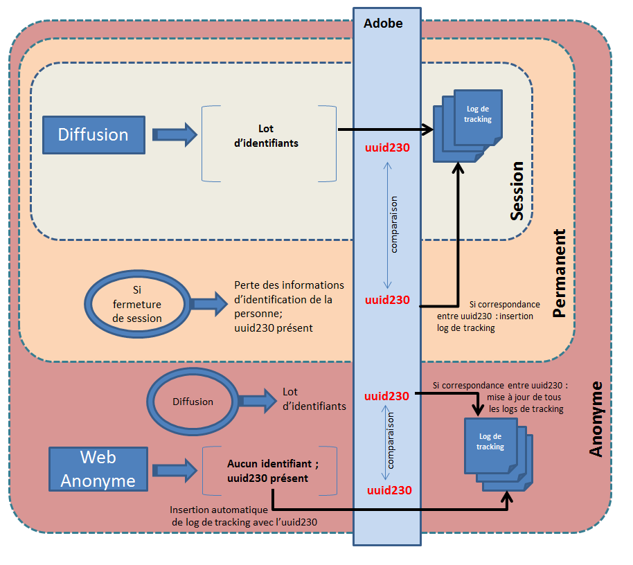

# Mode de tracking web{#web-tracking-mode}


Adobe Campaign permet de sélectionner depuis l&#39;assistant de déploiement, un mode de tracking Web qui définit la façon dont les logs de tracking sont remontés dans l&#39;application.

Trois modes de tracking Web sont disponibles :**&quot;Tracking Web de session&quot;**,**&quot;Tracking Web permanent&quot;** et **&quot;Tracking Web anonyme&quot;**.



Chaque mode possède des caractéristiques spécifiques. Le mode de tracking Web « permanent » comprend les caractéristiques du mode de tracking Web « session », tandis que le mode « anonyme » comprend les caractéristiques des modes « permanent » et « session ».

>[!IMPORTANT]
>
>Le mode de tracking Web « anonyme » est activé par défaut si le package « Leads » est activé. Dans tous les autres cas, le mode de tracking Web « session » est activé par défaut.
>
>Il est possible de modifier le mode par défaut à tout moment dans l&#39;assistant de déploiement de l&#39;instance.

Notez que si vous utilisez le mode de tracking **Web permanent** ou **anonyme**, vous devez impérativement ajouter un index sur la colonne « sourceID » (uuid230) dans les tables de tracking (trackingLogXXX) :

1. Identifiez la ou les tables de tracking concernées par le tracking permanent.
1. Etendez les schémas correspondant à ces tables en ajoutant les lignes :

```
<dbindex name="sourceId">
 <keyfield xpath="@sourceId"/>
</dbindex>
```

Les modes de tracking Web **Permanent** et **Anonyme** comportent deux options : **Diffusion forcée** et **Dernière diffusion**.

L&#39;option **Diffusion forcée** permet de spécifier l&#39;identifiant de la diffusion (@jobid) lors du tracking.

L&#39;option **Dernière diffusion** permet de rattacher le log de tracking courant à la dernière diffusion suivie.

**Caractéristiques du tracking Web de session:**

Ce mode crée un log de tracking pour les personnes disposant d’un cookie de session. Il s’agit de personnes qui ont cliqué sur une URL dans un email envoyé par Adobe Campaign, ce qui nous permet de suivre les informations suivantes :

* Identifiant de la diffusion
* l&#39;identifiant de la personne
* le log de diffusion
* le cookie permanent (uuid230)
* URL de tracking
* la date du log de tracking

Pour ce mode de tracking Web, s&#39;il manque une de ces informations, aucun log de tracking n&#39;est créée dans l&#39;application.

Ce mode est peu coûteux en volume (nombre d&#39;enregistrements restreint dans la table trackingLog) ainsi qu&#39;en calcul (pas de réconciliation).

**Caractéristiques du mode de tracking Web permanent :**

Ce mode de tracking Web permet de créer un log de tracking basé sur la présence du cookie permanent uuid230. Si un visiteur ferme sa session, Adobe Campaign utilise le cookie permanent pour récupérer les informations le concernant dans les logs de tracking précédents. Adobe Campaign réinsère un log de tracking si l’uuid230 de la session en cours a la même valeur qu’un uuid230 déjà stocké dans la table de tracking.

Il est donc nécessaire que la personne soit déjà identifiée dans Adobe Campaign (via une diffusion) afin de faire la réconciliation sur les valeurs d&#39;uuid230.

Par défaut, la recherche dans les logs de tracking précédents se fait dans la table « trackingLog ». Si le package Leads est activé, avant de rechercher dans la table « trackingLog », Adobe Campaign recherche dans la table « incomingLead » les enregistrements précédents de logs de tracking.

Ce mode est coûteux particulièrement en calcul lors de la réconciliation des logs.

**Caractéristiques du mode de tracking Web anonyme :**

Ce mode de tracking Web permet de récupérer un log de tracking associé à une navigation anonyme dans Adobe Campaign. Un log de tracking est automatiquement créé à chaque clic sur une URL trackée. Ce journal contient uniquement la valeur de l’uuid230. Lors d&#39;une campagne marketing, un log de tracking est automatiquement créé avec toutes les informations d&#39;identification (voir la section tracking des sessions). Adobe Campaign recherche automatiquement dans les journaux précédents une valeur « uuid230 » égale à la valeur du journal de tracking pour cette campagne marketing. Si des valeurs identiques sont trouvées, tous les logs de tracking précédents sont saisis avec toutes les informations du log de tracking des campagnes marketing.

Ce mode est le plus coûteux en calcul comme en volume.

>[!NOTE]
>
>Si le package **[!UICONTROL Leads]** est installé, vous devez faire de même pour la table des activités (**crm:incomingLead**).

Le schéma suivant regroupe les différentes fonctionnalités des trois modes de tracking Web:



**Exemple de tracking Web Permanent basé sur la dernière diffusion :**

Florence reçoit une livraison, ouvre l&#39;email, clique sur le lien, navigue sur le site de vente au détail mais ne fait aucun achat. Le lendemain, Florence retourne sur le site de vente au détail, navigue et effectue un achat. Comme le tracking Web permanent (dernière diffusion) est activé, tous les logs de sa deuxième visite seront associés à la diffusion qui lui a été envoyée la veille.
