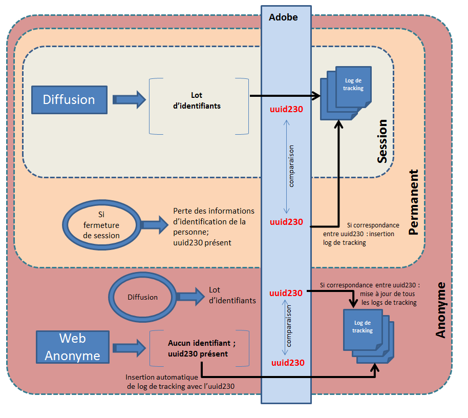

# Mode de tracking web{#web-tracking-mode}


Adobe Campaign permet de sélectionner depuis l&#39;assistant de déploiement, un mode de tracking Web qui définit la façon dont les logs de tracking sont remontés dans l&#39;application.

Trois modes de tracking Web sont disponibles :**&quot;Tracking Web de session&quot;**,**&quot;Tracking Web permanent&quot;** et **&quot;Tracking Web anonyme&quot;**.


Chaque mode possède des caractéristiques propres. Cependant le mode de tracking Web &quot;permanent&quot; englobe les caractéristiques du mode de tracking Web &quot;session&quot; tandis que le mode de tracking Web &quot;anonyme&quot; englobe les caractéristiques des modes &quot;permanent&quot; et &quot;session&quot;.

>[!IMPORTANT]
>
>Le mode de tracking Web &quot;anonyme&quot; est activé par défaut si le package &quot;Leads&quot; est activé. Dans tous les autres cas, le mode de tracking Web &quot;session&quot; est activé par défaut.
>
>Il est possible de modifier le mode par défaut à tout moment dans l&#39;assistant de déploiement de l&#39;instance.

Notez que si vous utilisez le mode de tracking **Web permanent** ou **anonyme**, vous devez impérativement ajouter un index sur la colonne « sourceID » (uuid230) dans les tables de tracking (trackingLogXXX) :

1. Identifiez la ou les tables de tracking concernées par le tracking permanent.
1. Etendez les schémas correspondant à ces tables en ajoutant les lignes :

```
<dbindex name="sourceId">
 <keyfield xpath="@sourceId"/>
</dbindex>
```

Les modes de tracking Web **Permanent** et **Anonyme** comportent deux options : **Diffusion forcée** et **Dernière diffusion**.

L&#39;option **Diffusion forcée** permet de spécifier l&#39;identifiant de la diffusion (@jobid) lors du tracking.

L&#39;option **Dernière diffusion** permet de rattacher le log de tracking courant à la dernière diffusion suivie.

**Caractéristiques du tracking Web de session:**

Ce mode crée un log de tracking pour les personnes qui possèdent un cookie de session. Ces personnes ont cliqué sur une URL dans un email provenant d&#39;une diffusion Adobe Campaign. Il est donc possible de remonter les informations suivantes dans le log de tracking :

* Identifiant de la diffusion
* l&#39;identifiant de la personne
* le log de diffusion
* le cookie permanent (uuid230)
* URL de tracking
* la date du log de tracking

Pour ce mode de tracking Web, s&#39;il manque une de ces informations, aucun log de tracking n&#39;est créée dans l&#39;application.

Ce mode est peu coûteux en volume (nombre d&#39;enregistrements restreint dans la table trackingLog) ainsi qu&#39;en calcul (pas de réconciliation).

**Caractéristiques du mode de tracking Web permanent :**

Ce mode de tracking Web permet de créer un log de tracking basé sur la présence du cookie permanent uuid230. Dans le cas où le visiteur ferme sa session, Adobe Campaign se base sur le cookie permanent (uuid230) pour retrouver les informations sur la personne dans les logs de tracking précédents. Adobe Campaign réinsère un log de tracking si l&#39;uuid230 de la session courante a la même valeur qu&#39;un uuid230 déjà stocké dans la table de tracking.

Il est donc nécessaire que la personne soit déjà identifiée dans Adobe Campaign (via une diffusion) afin de faire la réconciliation sur les valeurs d&#39;uuid230.

Par défaut, la recherche dans les logs de tracking précédents se fait dans la table &quot;trackingLog&quot;. Si le package Leads est activé, avant de rechercher dans la table &quot;trackingLog&quot;, Adobe Campaign va rechercher dans la table &quot;incomingLead&quot; les enregistrements précédents de logs de tracking.

Ce mode est coûteux particulièrement en calcul lors de la réconciliation des logs.

**Caractéristiques du mode de tracking Web anonyme :**

Ce mode de tracking Web permet de récupérer un log de tracking associé à une navigation anonyme dans Adobe Campaign. Un log de tracking est donc automatiquement crée à chaque clic sur une URL suivie. Ce log ne comporte que la valeur de l&#39;uuid230. Lors d&#39;une campagne marketing, un log de tracking est automatiquement créée avec l&#39;ensemble des informations d&#39;identification (voir tracking de session). Adobe Campaign va alors automatiquement rechercher dans les logs précédents pour déterminer si une précédente valeur de &quot;l&#39;uuid230&quot; est égale à la valeur provenant du log de tracking de la campagne marketing. Si les valeurs sont identiques alors tous les logs de tracking précédents sont remplis avec l&#39;ensemble des informations provenant du log de tracking de la campagne marketing.

Ce mode est le plus coûteux en calcul comme en volume.

>[!NOTE]
>
>Si le package **[!UICONTROL Leads]** est installé, vous devez faire de même pour la table des activités (**crm:incomingLead**).

Le schéma suivant regroupe les différentes fonctionnalités des trois modes de tracking Web:



**Exemple de tracking Web Permanent basé sur la dernière diffusion :**

Florence reçoit une diffusion, elle ouvre la diffusion, clique sur un lien, navigue sur le site marchand mais ne fait pas d&#39;achat. Le lendemain, Florence revient sur le site marchand en ouvrant son navigateur web, navigue sur le site et réalise un achat. Comme le tracking web permanent (dernière diffusion) est activé, tous les logs lors de sa deuxième visite vont être rattachés à la diffusion envoyée la veille.
