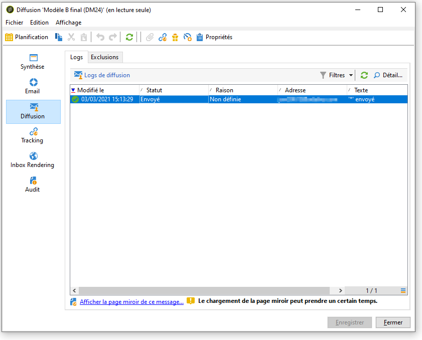
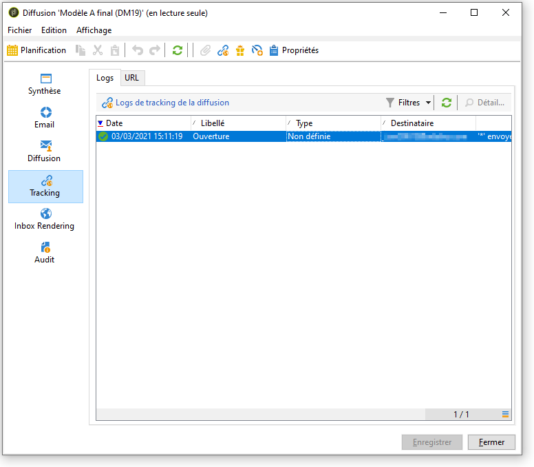
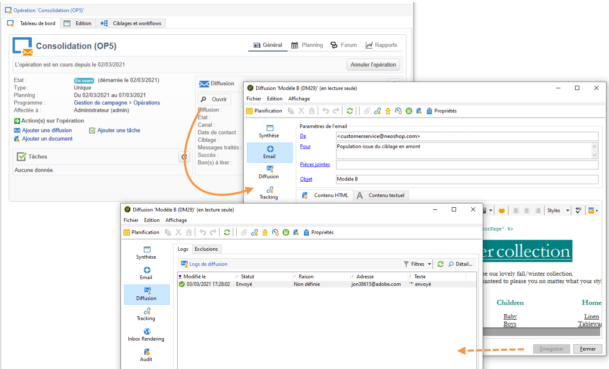

# AB Testing : analyser le résultat {#step-8--analyzing-the-result}

Lorsque les diffusions test ont été envoyées, vous avez la possibilité de vérifier à quel(s) destinataire(s) elles ont été envoyées et si elles ont été ouvertes.

* Pour savoir quel destinataire a été ciblé, ouvrez une des diffusions depuis le tableau de bord de l&#39;opération et cliquez sur l&#39;onglet **[!UICONTROL Diffusion]**.

  

* Pour savoir si la diffusion a été ouverte, positionnez-vous dans l&#39;onglet **[!UICONTROL Tracking]**.

  

* Comparez avec l&#39;autre diffusion.

  

Dans notre exemple, la diffusion B a obtenu le taux d’ouverture le plus élevé.C’est donc le contenu B qui sera utilisé pour la diffusion finale.

