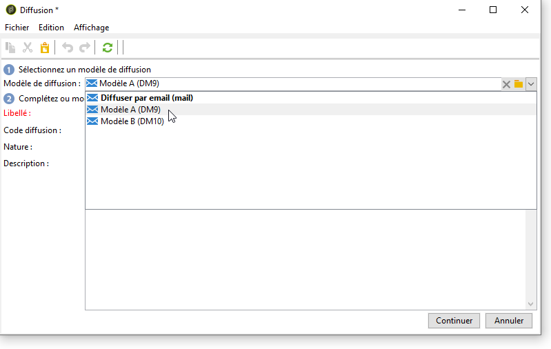

# Paramétrer les diffusions dans le workflow {#step-4--configuring-the-deliveries-in-the-workflow}

L’étape suivante consiste à configurer les diffusions. Elles sont destinées aux trois populations créées au cours de l&#39;étape précédente : [Étape 2 : paramétrer les échantillons de population](#step-2--configuring-population-samples). Les deux premières diffusions vous permettent d&#39;envoyer des contenus différents à la population A et B. La troisième diffusion est destinée à la population qui n&#39;a reçu ni A ni B. Son contenu sera calculé par un script et sera identique à A ou B, selon celle qui a obtenu le taux d’ouverture le plus élevé. Il est nécessaire de configurer une période d&#39;attente pour la troisième diffusion, afin de connaître le résultat des diffusions A et B. C’est pourquoi la troisième diffusion comprend une activité **[!UICONTROL Attente]**.

1. Depuis l&#39;activité **[!UICONTROL Partage]**, rattachez la transition destinée à la population A à l&#39;une des diffusions e-mail déjà présentes dans le workflow.

   

1. Double-cliquez sur la diffusion pour l&#39;ouvrir.
1. A l&#39;aide de la liste déroulante, sélectionnez le modèle de la diffusion A.

   

1. Cliquez sur **[!UICONTROL Continuer]** pour visualiser la diffusion puis enregistrez-la.

   

1. Rattachez la transition de l&#39;activité **[!UICONTROL Partage]** destiné à la population B à la seconde diffusion e-mail.

   

1. Ouvrez la diffusion et sélectionnez le modèle de la diffusion B et enregistrez la diffusion.

   

1. Reliez la transition destinée à la population restante à l&#39;activité **[!UICONTROL Attente]**.

   

1. Ouvrez l&#39;activité **[!UICONTROL Attente]** et configurez le délai à 5 jours.

   

1. Reliez l&#39;activité **[!UICONTROL Attente]** à l&#39;activité **[!UICONTROL Code JavaScript]**.

   

Vous pouvez maintenant créer le script (voir [Étape 5 : créer le script ](../../delivery/using/a-b-testing-uc-script.md)).
