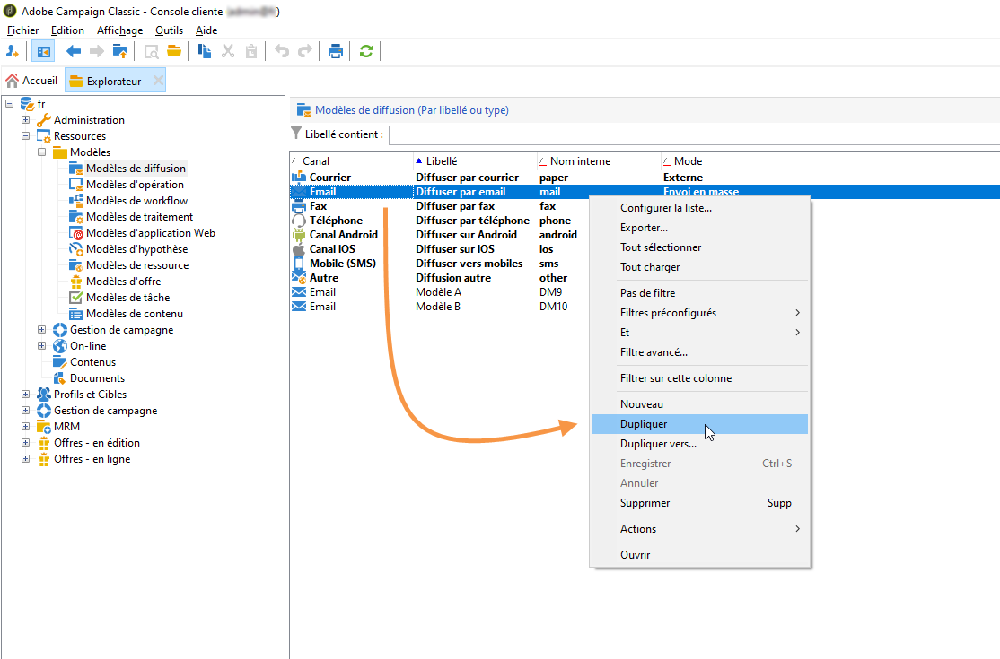
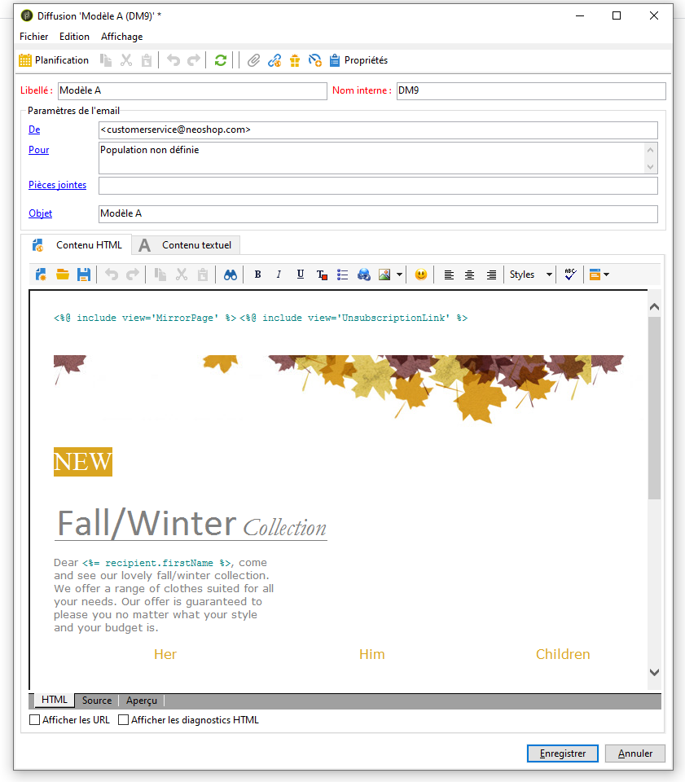
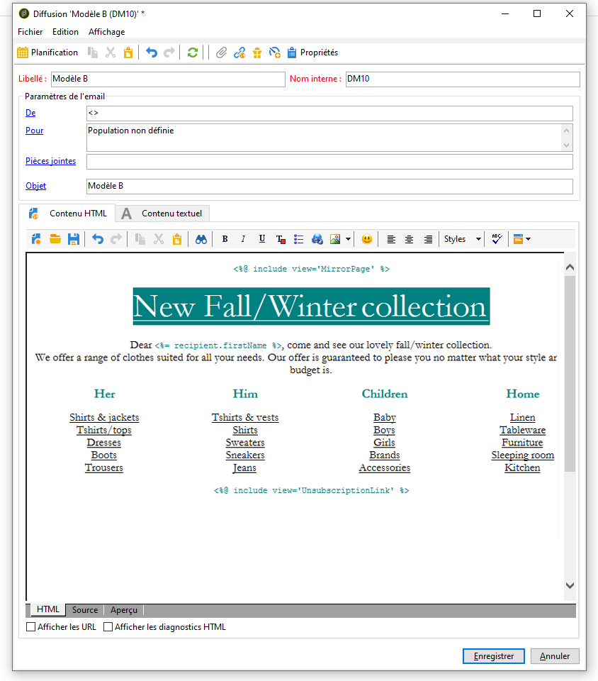

# AB Testing : créer les modèles de diffusion {#step-3--creating-two-delivery-templates}

Vous allez à présent créer deux modèles de diffusion. Chaque modèle sera référencé dans une activité **[!UICONTROL Diffusion e-mail]** liée à l&#39;activité **[!UICONTROL Partage]**. Reportez-vous à la documentation de [Campaign v8](https://experienceleague.adobe.com/docs/campaign/campaign-v8/send/create-templates.html?lang=fr){target="_blank"}.

1. Accédez au dossier **[!UICONTROL Ressources > Modèle de diffusion]**.
1. Dupliquez le modèle de diffusion **[!UICONTROL E-mail]**.

   

1. Créez le contenu destiné à votre diffusion A.

   

1. Répétez les mêmes étapes pour créer un modèle destiné à la diffusion B.

   

Vous pouvez maintenant paramétrer les diffusions dans le workflow. [En savoir plus](a-b-testing-uc-configuring-deliveries.md).
