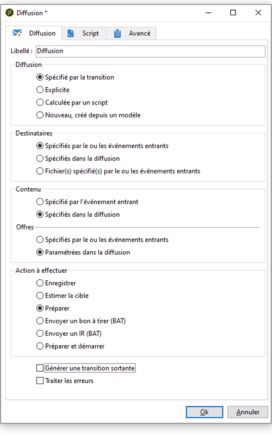

# Définition de la diffusion finale {#step-6--defining-the-final-delivery}

Une fois que le script pour sélectionner le gagnant du test A/B a été créé, vous pouvez définir les paramètres de la diffusion finale.

1. Reliez l&#39;activité **[!UICONTROL Code JavaScript]** à l&#39;activité **[!UICONTROL Diffusion]** restante.
1. Ouvrez l&#39;activité **[!UICONTROL Diffusion]**.
1. Décochez l&#39;option **[!UICONTROL Générer une transition sortante]** pour terminer le workflow avec cette activité.
1. Conservez les valeurs par défaut des autres options.

   

En préparant la diffusion spécifiée dans la transition (définie via l&#39;activité **[!UICONTROL Code Javascript]**), vous pourrez alors la valider et démarrer l&#39;envoi, comme décrit à l&#39;étape suivante.

Vous pouvez maintenant démarrer le workflow. [En savoir plus](a-b-testing-uc-start-workflow.md).
