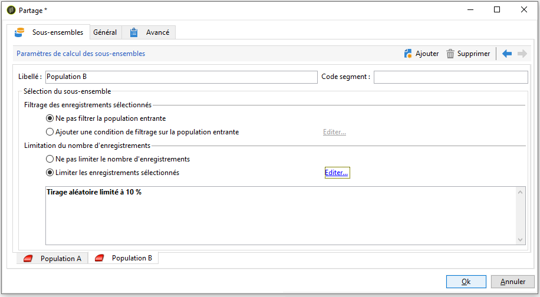

# Configuration des échantillons de population {#step-2--configuring-population-samples}

## Configurer l&#39;activité de Requête {#configuring-the-query-activity}

* Double-cliquez sur l&#39;activité **[!UICONTROL Requête]**.

   

* Cliquez sur le lien **[!UICONTROL Editer la requête]** et sélectionnez les destinataires que vous souhaitez cibler.

   

* Reliez l&#39;activité **[!UICONTROL Requête]** à l&#39;activité **[!UICONTROL Partage]**.

   

## Configurer l&#39;activité Partage {#configuring-the-split-activity}

Cette activité permet de créer plusieurs populations : celle qui reçoit la diffusion A, celle qui reçoit la diffusion B et la population restante. D&#39;autre part, l&#39;utilisation du tirage aléatoire permet de ne cibler qu&#39;une partie de la population de chacune des diffusions.

1. Création de la population A :

   * Double-cliquez sur l&#39;activité **[!UICONTROL Partage]**.

      

   * Dans l&#39;onglet existant, modifiez le libellé pour désigner la population A.

      

   * Sélectionnez l&#39;option **[!UICONTROL Limiter les enregistrements sélectionnés]**.

      

   * Cliquez sur le lien **[!UICONTROL Editer]**, sélectionnez **[!UICONTROL Activer le tirage aléatoire]**, puis cliquez sur **[!UICONTROL Suivant]**.

      

   * Configurez la limite à 10%, puis cliquez sur **[!UICONTROL Terminer]**.

      

1. Création de la population B :

   * Cliquez sur **[!UICONTROL Ajouter]** pour créer un nouvel onglet destiné à la population B.

      

   * Limitez la population à 10% comme fait précédemment.

      

1. Création de la population restante :

   * Positionnez-vous dans l&#39;onglet **[!UICONTROL Général]**.

      

   * Sélectionnez **[!UICONTROL Générer le complémentaire]**.

      

   * Modifiez le libellé pour désigner la population qui ne comprend ni la population A, ni la B et cliquez sur **[!UICONTROL OK]** pour fermer l&#39;activité.

      

Vous pouvez maintenant créer les deux modèles de diffusion. [En savoir plus](a-b-testing-uc-delivery-templates.md)).
