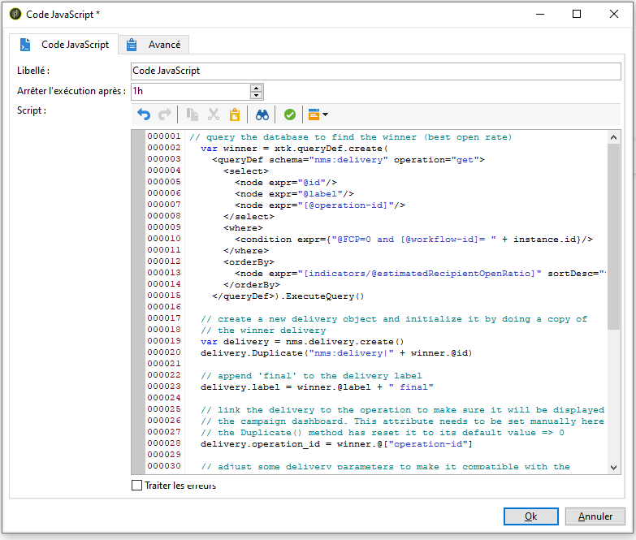
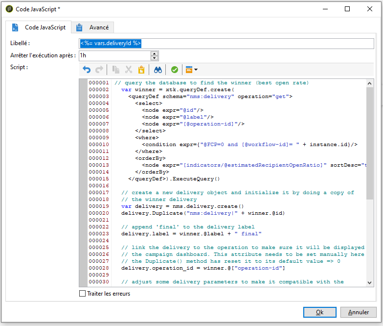

# Création du script {#step-5--creating-the-script}


Le choix du contenu de la diffusion destinée à la population restante est calculé par un script. Ce script récupère l&#39;information quant à la diffusion qui a obtenu le plus fort taux d&#39;ouverture et copie le contenu dans la diffusion finale.

## Exemple de script {#example-of-a-script}

Le script suivant peut être utilisé tel quel dans le workflow de ciblage. Pour plus d’informations, consultez [cette section](#implementation).

```
 // query the database to find the winner (best open rate)
   var winner = xtk.queryDef.create(
     <queryDef schema="nms:delivery" operation="get">
       <select>
         <node expr="@id"/>
         <node expr="@label"/>
         <node expr="[@operation-id]"/>
         <node expr="[@workflow-id]"/>
       </select>
       <where>
         <condition expr={"@FCP=0 and [@workflow-id]= " + instance.id}/>
       </where>
       <orderBy>
         <node expr="[indicators/@estimatedRecipientOpenRatio]" sortDesc="true"/>
       </orderBy>
     </queryDef>).ExecuteQuery()
   
   // create a new delivery object and initialize it by doing a copy of
   // the winner delivery
   var delivery = nms.delivery.create()
   delivery.Duplicate("nms:delivery|" + winner.@id)

   // append 'final' to the delivery label
   delivery.label = winner.@label + " final"

   // link the delivery to the operation to make sure it will be displayed in
   // the campaign dashboard. This attribute needs to be set manually here since 
   // the Duplicate() method has reset it to its default value => 0
   delivery.operation_id = winner.@["operation-id"]
   delivery.workflow_id = winner.@["workflow-id"]

   // adjust some delivery parameters to make it compatible with the 
   // "Prepare and start" option selected in the Delivery tab of this activity
   delivery.scheduling.validationMode = "manual"
   delivery.scheduling.delayed = 0
 
   // save the delivery in database
   delivery.save()
 
   // store the new delivery Id in event variables
   vars.deliveryId = delivery.id
```

Pour une explication détaillée du script, reportez-vous à [cette section](#details-of-the-script).

## Mise en œuvre {#implementation}

1. Ouvrez votre activité **[!UICONTROL Code JavaScript]**,
1. Copiez le script proposé dans [Exemple de script](#example-of-a-script) dans la fenêtre **[!UICONTROL Code JavaScript]**.

   

1. Dans le champ **[!UICONTROL Libellé]**, entrez le nom du script, soit

   ```
   <%= vars.deliveryId %>
   ```

   

1. Fermez l&#39;activité **[!UICONTROL Code JavaScript]**.
1. Sauvegardez votre workflow.

## Détails du script {#details-of-the-script}

Cette section détaille les différentes parties du script et leur fonctionnement.

* La première partie du script est une requête. La commande **queryDef** vous permet de récupérer à partir de la table **NmsDelivery** les diffusions créées par l&#39;exécution du workflow de ciblage et de les classer selon l&#39;estimation du taux d&#39;ouverture, puis les informations de la diffusion qui a eu le meilleur taux d&#39;ouverture sont également récupérées.

   ```
   // query the database to find the winner (best open rate)
      var winner = xtk.queryDef.create(
        <queryDef schema="nms:delivery" operation="get">
          <select>
            <node expr="@id"/>
            <node expr="@label"/>
            <node expr="[@operation-id]"/>
          </select>
          <where>
            <condition expr={"@FCP=0 and [@workflow-id]= " + instance.id}/>
          </where>
          <orderBy>
            <node expr="[indicators/@estimatedRecipientOpenRatio]" sortDesc="true"/>
          </orderBy>
        </queryDef>).ExecuteQuery()
   ```

* La diffusion qui a eu le meilleur taux d&#39;ouverture est dupliquée.

   ```
    // create a new delivery object and initialize it by doing a copy of
    // the winner delivery
   var delivery = nms.delivery.create()
   delivery.Duplicate("nms:delivery|" + winner.@id)
   ```

* Le libellé de la diffusion dupliquée est modifié en y ajoutant le terme **final**.

   ```
   // append 'final' to the delivery label
   delivery.label = winner.@label + " final"
   ```

* La diffusion est copiée dans le tableau de bord de l&#39;opération.

   ```
   // link the delivery to the operation to make sure it will be displayed in
   // the campaign dashboard. This attribute needs to be set manually here since 
   // the Duplicate() method has reset it to its default value => 0
   delivery.operation_id = winner.@["operation-id"]
   delivery.workflow_id = winner.@["workflow-id"]
   ```

   ```
   // adjust some delivery parameters to make it compatible with the 
   // "Prepare and start" option selected in the Delivery tab of this activity
   delivery.scheduling.validationMode = "manual"
   delivery.scheduling.delayed = 0
   ```

* La diffusion est enregistrée dans la base.

   ```
   // save the delivery in database
   delivery.save()
   ```

* L&#39;identifiant unique de la diffusion dupliquée est stockée dans la variable du workflow.

   ```
   // store the new delivery Id in event variables
   vars.deliveryId = delivery.id
   ```

## Autres critères de sélection {#other-selection-criteria}

L&#39;exemple présenté ci-dessus permet de sélectionner le contenu d&#39;une diffusion en fonction du taux d&#39;ouverture des emails. Vous pouvez l&#39;adapter pour vous baser sur d&#39;autres indicateurs propres aux diffusions :

* Meilleur taux de clic publicitaire :`[indicators/@recipientClickRatio]`,
* Meilleure réactivité (email ouvert et clics dans le message) : `[indicators/@reactivity]`,
* Taux de plainte le plus bas : `[indicators/@refusedRatio]` (mettre la valeur « false » pour l’attribut sortDesc),
* Meilleur taux de conversion : `[indicators/@transactionRatio]`;
* Nombre de pages web visitées suite à la réception d&#39;un message : `[indicators/@totalWebPage]`,
* Taux de désinscription le plus bas : `[indicators/@optOutRatio]`,
* Montant des transactions : `[indicators/@amount]`.

Vous pouvez maintenant définir la diffusion finale. [En savoir plus](a-b-testing-uc-final-delivery.md).
