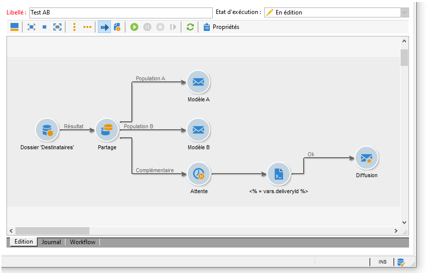
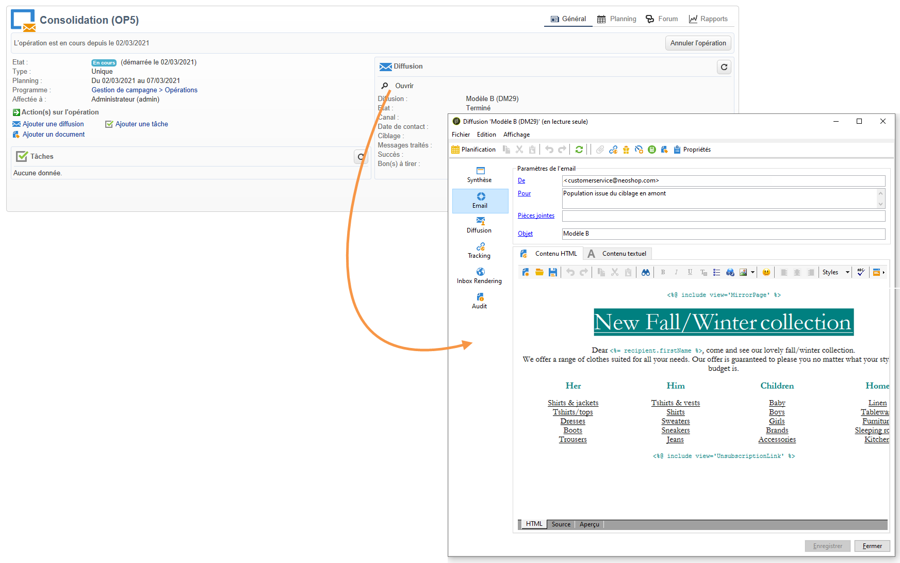

# Démarrez le workflow {#step-7--starting-the-workflow}

1. Cliquez sur **[!UICONTROL Démarrer]** le workflow.

   

1. Effectuez la validation de la cible et du contenu des diffusions A et B depuis le tableau de bord de l&#39;opération.
1. Confirmez l&#39;envoi des diffusions.
1. Laissez passer le délai d&#39;attente de 5 jours pour savoir quel contenu a été calculé d&#39;après les résultats d&#39;ouverture des diffusions.

   

   Dans notre exemple, c&#39;est le modèle A qui a été retenu.

1. Lorsque le contenu de la troisième diffusion est déterminé, procédez à la validation de la cible et du contenu.

Vous pouvez maintenant analyser le résultat. [En savoir plus](a-b-testing-uc-analyzing.md).
