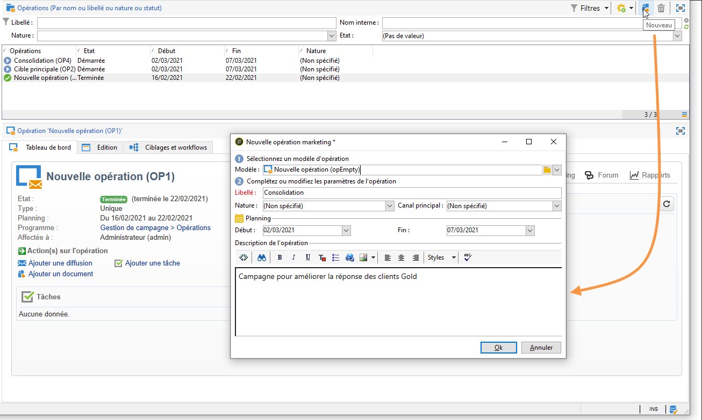
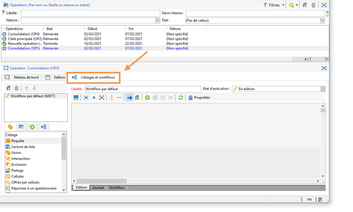
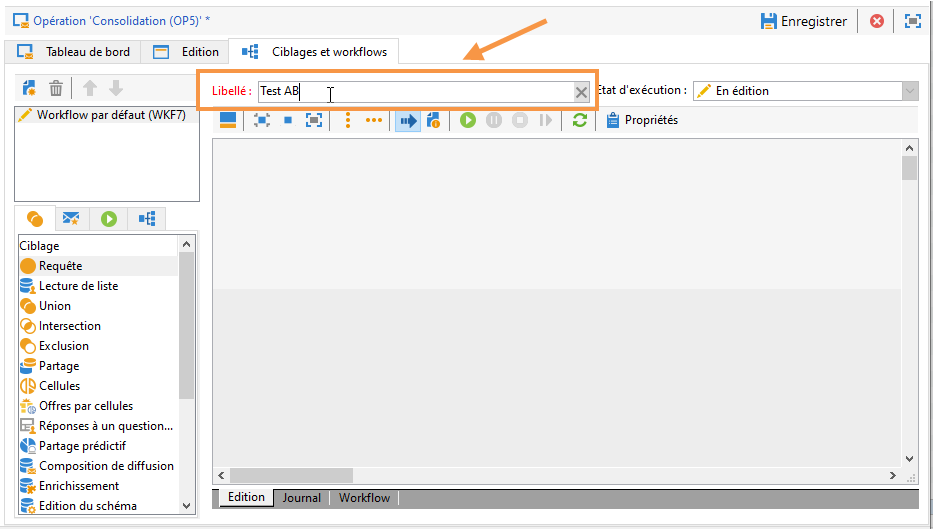
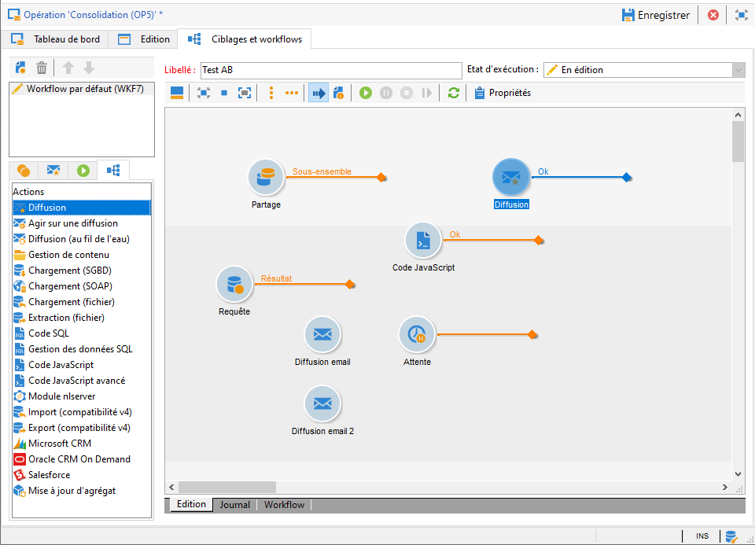

# Création d&#39;un workflow de ciblage {#step-1--creating-a-targeting-workflow}

Vous devez créer votre workflow dans l&#39;onglet **[!UICONTROL Ciblages et Workflows]** d&#39;une opération. Il est composé d&#39;une activité **[!UICONTROL Requête]**, d&#39;une activité **[!UICONTROL Partage]** à laquelle sont reliées deux activités **[!UICONTROL Diffusions e-mail]**, une activité **[!UICONTROL Attente]**, d&#39;une activité **[!UICONTROL Code JavaScript]** et une activité **[!UICONTROL Diffusion]**.

1. Créez une opération si elle n&#39;existe pas déjà, (voir à ce sujet [cette section](../../campaign/using/setting-up-marketing-campaigns.md#creating-a-campaign)).

   

1. Positionnez-vous dans l&#39;onglet **[!UICONTROL Ciblages et Workflows]**.

   

1. Modifiez le libellé du workflow déjà existant ou cliquez sur **[!UICONTROL Ajouter]** pour en créer un (voir à ce sujet [cette section](../../campaign/using/marketing-campaign-deliveries.md#selecting-the-target-population)).

   

1. A l&#39;aide de la souris, faites glisser les différentes activités dans la fenêtre du workflow, soit une activité **[!UICONTROL Requête]** (onglet **[!UICONTROL Ciblage]**), une activité **[!UICONTROL Partage]** (onglet **[!UICONTROL Ciblage]**), deux activités **[!UICONTROL Diffusion e-mail]** (onglet **[!UICONTROL Diffusions]**), une activité **[!UICONTROL Attente]** (onglet **[!UICONTROL Ordonnancement]**), une activité **[!UICONTROL Code JavaScript]** (onglet **[!UICONTROL Action]**) et une activité **[!UICONTROL Diffusion]** (onglet **[!UICONTROL Actions]**).

Vous pouvez maintenant configurer les échantillons de population. [En savoir plus](a-b-testing-uc-population-samples.md).
