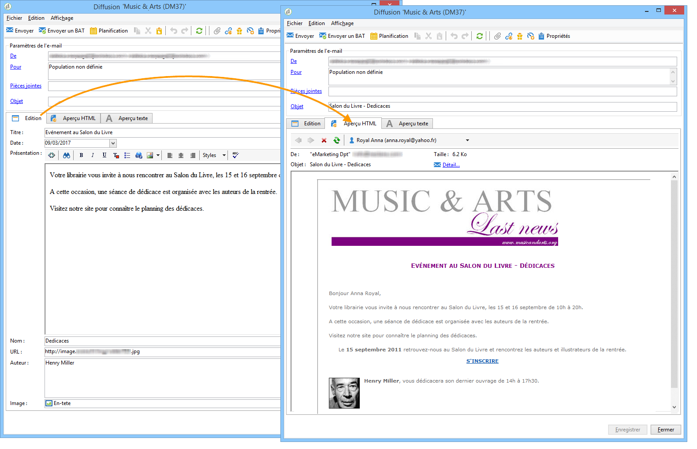

# À propos de la gestion de contenu{#about-content-management}

Le module Adobe Campaign Content Manager est un [package natif](../../installation/using/installing-campaign-standard-packages.md) spécifique à Campaign Classic. Vous pouvez l’installer pour créer des newsletters récurrentes ou des sites web. Il permet de vous assister dans la création, la validation et la publication de vos messages.

>[!NOTE]
>
>Cette section fait référence au module de gestion de contenu. Pour plus d’informations sur la conception du contenu des diffusions email, voir [cette section](defining-the-email-content.md).

Le module de gestion de contenu intègre des fonctionnalités de groupe de travail, de workflow et d’agrégation de contenu. Il permet de mettre automatiquement en forme un message : email, courrier, SMS, web, etc.

L&#39;utilisation de la gestion de contenu dans une diffusion permet de proposer des champs de saisie ou de sélection aux opérateurs chargés de la création des contenus. La mise en page et la mise en forme de ces contenus ainsi que leur transformation sont gérées automatiquement au travers de la feuille de style.

>[!CAUTION]
>
>Toute modification de la feuille de style est répercutée au niveau des diffusions créées à partir des modèles de contenus l&#39;utilisant.

La gestion de contenu offre les avantages suivants :

* Rédaction structurée des messages via des interfaces de saisie,
* Séparation des données et de leur présentation (génération au format XML),
* Génération multi-formats (html, txt, XML, etc.) de documents à partir de feuilles de style garantissant le respect des chartes graphiques,
* Récupération et agrégation automatique de flux de contenus externes,
* Collaboration avec workflow de validation et contrôle des données.

Ce mode de création du contenu entraîne toutefois quelques contraintes, et notamment les suivantes :

* Moins de libertés vis-à-vis du design des documents finaux,
* L&#39;analyse des besoins doit être rigoureuse afin ne pas bloquer les utilisateurs finaux par l&#39;omission d&#39;une fonctionnalité.
