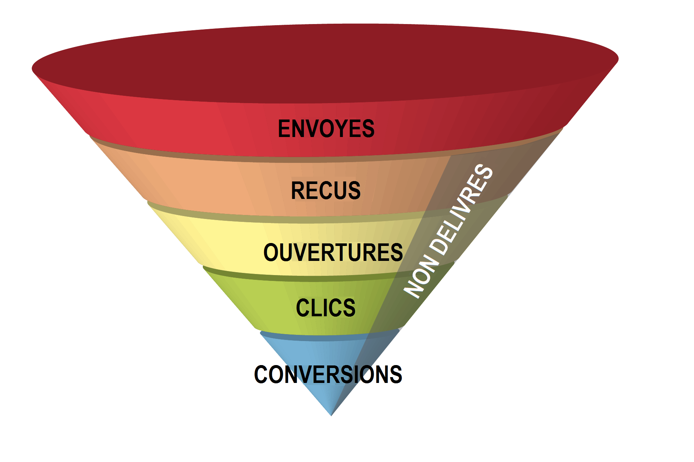

# Qu’est-ce que la délivrabilité ?{#about-deliverability}

La délivrabilité permet de mesurer le succès des campagnes atteignant la boîte de réception de vos destinataires, et ce, sans rebonds et sans être marquées comme spam. [Découvrez pourquoi la délivrabilité est importante](https://experienceleague.adobe.com/docs/deliverability-learn/deliverability-best-practice-guide/deliverability-strategy-and-definition.html?lang=fr#why-deliverability-matters).

Plus précisément, la délivrabilité des emails désigne l&#39;ensemble des caractéristiques qui déterminent la capacité d&#39;un message à atteindre sa destination, par l&#39;intermédiaire d&#39;une adresse email personnelle, dans un délai court, et avec la qualité attendue en termes de contenu et de format.

Pour en apprendre davantage sur la délivrabilité et en savoir plus sur les termes, concepts et approches clés qui s&#39;y rapportent, consultez le [Guide des bonnes pratiques relatives à la délivrabilité d&#39;Adobe](https://experienceleague.adobe.com/docs/deliverability-learn/deliverability-best-practice-guide/introduction.html?lang=fr).

## Procédure d&#39;amélioration de la délivrabilité {#deliverability-key-points}

En règle générale, les problèmes de délivrabilité sont liés aux mesures de protection contre le spam implémentées par les prestataires Internet et les administrateurs de serveurs de messagerie.

* Pour obtenir des recommandations générales sur la manière de concevoir des campagnes de marketing par email réussies, consultez la section [Stratégie et définition de la délivrabilité](https://experienceleague.adobe.com/docs/deliverability-learn/deliverability-best-practice-guide/deliverability-strategy-and-definition.html?lang=fr).

* Pour bénéficier de recommandations plus spécifiques quant à la manière d&#39;optimiser la délivrabilité de vos emails Adobe Campaign, Adobe recommande de suivre les bonnes pratiques répertoriées dans cette section.

>[!NOTE]
>
>Les FAI sont sans cesse obligés de développer de nouvelles techniques de filtrage sophistiquées afin de protéger leurs clients contre les spammeurs. Par conséquent, les critères et les règles qui caractérisent la délivrabilité des emails sont en constante évolution. Prenez soin de consulter le [Guide des bonnes pratiques relatives à la délivrabilité d&#39;Adobe](https://experienceleague.adobe.com/docs/deliverability-learn/deliverability-best-practice-guide/introduction.html), qui est mis à jour régulièrement.

### Taux de délivrabilité

Le taux de délivrabilité correspond au nombre de messages qui ont atteint les boîtes de réception des destinataires comparé au nombre de messages délivrés. Pour améliorer la délivrabilité, vous pouvez faire en sorte d&#39;augmenter ce taux.

Avec Adobe Campaign, le taux de délivrabilité dépend de nombreux facteurs, parmi lesquels :

* Configuration correcte de vos instances : contactez votre représentant Adobe pour obtenir de l&#39;aide.
* Configuration réseau légitime : consultez [cette section](optimize-delivery.md#network-config) ainsi que la section [Configuration et stratégie du domaine](https://experienceleague.adobe.com/docs/deliverability-learn/deliverability-best-practice-guide/transition-process/infrastructure.html?lang=fr#domain-setup-and-strategy).
* Votre réputation d’adresse IP : consultez la section [Stratégie IP](https://experienceleague.adobe.com/docs/deliverability-learn/deliverability-best-practice-guide/transition-process/infrastructure.html?lang=fr#ip-strategy).
* Qualité des adresses ciblées : consultez la section [Gestion des quarantaines](optimize-delivery.md#quarantine-management).
* Le faible taux de [plaintes](https://experienceleague.adobe.com/docs/deliverability-learn/deliverability-best-practice-guide/metrics-for-deliverability/complaints.html?lang=fr) et de [hard bounces](https://experienceleague.adobe.com/docs/deliverability-learn/deliverability-best-practice-guide/metrics-for-deliverability/bounces.html?lang=fr#hard-bounces).
* Le contenu de votre message : consultez la section [Contrôle du contenu des emails](control-message-content.md).
* Authentification des messages (SPF, DKIM, DMARC) : consultez [cette section](https://experienceleague.adobe.com/docs/deliverability-learn/deliverability-best-practice-guide/transition-process/infrastructure.html?lang=fr#authentication).
* Réputation de l&#39;expéditeur : pour savoir comment les principaux FAI évaluent la réputation d&#39;un expéditeur, consultez [cette section](https://experienceleague.adobe.com/docs/deliverability-learn/deliverability-best-practice-guide/internet-service-provider-specifics/overview.html?lang=fr).

## Outils de délivrabilité de Campaign {#deliverability-tools}

<!--Adobe Campaign provides a number of tools designed to ensure optimal deliverability.-->
Adobe Campaign fournit différents outils pour suivre et améliorer les performances de délivrabilité de votre plateforme. Cette page met également en avant les principes clés à garder en tête pour optimiser la délivrabilité lors de l&#39;utilisation de Campaign.

### Création minutieuse de votre message

Lors de la configuration, de la conception et du test de votre message, assurez-vous de suivre les bonnes pratiques mentionnées dans les sections ci-dessous. Tirer parti de toutes les fonctionnalités d&#39;Adobe Campaign contribue à améliorer la délivrabilité.

* [Bonnes pratiques relatives à la diffusion](delivery-best-practices.md)
* [Contrôle du contenu des e-mails](control-message-content.md)
* [Inbox rendering](inbox-rendering.md)
* [Envoyer un bon à tirer](steps-validating-the-delivery.md#sending-a-proof)

### Vérification du consentement par le biais du double opt-in {#double-opt-in}

Pour éviter d&#39;envoyer des messages à des adresses non valides, limiter les communications abusives et améliorer la réputation de l&#39;expéditeur, Adobe recommande de mettre en place un mécanisme de double opt-in. Vous pouvez ainsi vous assurer que vos destinataires se sont abonnés intentionnellement.

Pour plus d&#39;informations à ce sujet, voir [Créer un formulaire d&#39;abonnement avec double opt-in](../../web/using/use-cases--web-forms.md#create-a-subscription--form-with-double-opt-in).

Pour plus d&#39;informations sur les bonnes pratiques à appliquer lors de la collecte de données auprès de vos clients, consultez le [Guide des bonnes pratiques relatives à la délivrabilité d&#39;Adobe](https://experienceleague.adobe.com/docs/deliverability-learn/deliverability-best-practice-guide/first-impressions/address-collection-and-list-growth.html?lang=fr#data-quality-and-hygiene).

### Utilisation de la gestion des quarantaines

Adobe Campaign gère une liste qui rassemble les plaintes contre le spam, les hard bounces et soft bounces qui surviennent de manière systématique.

Pour protéger votre délivrabilité, les destinataires dont les adresses se trouvent sur cette liste sont exclus par défaut de toute diffusion future. En effet, un envoi à ces contacts pourrait nuire à votre réputation d&#39;envoi.

Certains fournisseurs d&#39;accès Internet considèrent automatiquement les emails comme du spam si le taux d&#39;adresses invalides est trop élevé. La quarantaine permet donc d&#39;éviter d&#39;être ajouté à une liste bloquée par ces fournisseurs.

Voir à ce propos les sections suivantes :

* [Comprendre les échecs de diffusion](understanding-delivery-failures.md)
* [Comprendre la gestion des quarantaines](understanding-quarantine-management.md)
* [Quarantaine et liste bloquée](understanding-quarantine-management.md#quarantine-vs-denylist)

### Utilisation des outils de surveillance et de reporting

Utilisez les outils proposés par Adobe Campaign pour surveiller votre délivrabilité.

Adobe Campaign permet de vérifier les performances de vos diffusions et de les comprendre à l&#39;aide d&#39;un ensemble d&#39;indicateurs et de rapports en temps réel intégrés.

Voir à ce propos les sections suivantes :

* [Surveillance de la délivrabilité](monitoring-deliverability.md)
* [À propos du suivi des diffusions](about-delivery-monitoring.md)
* [À propos des rapports natifs de Campaign](../../reporting/using/about-campaign-built-in-reports.md)

<!--TO REMOVE
## Background {#background}

Email deliverability presents a major challenge to marketers - whether they're sending a few thousand messages or several billion. One in five messages never reach the inbox, or their intended recipient.

Once relegated as a "technical issue" for the IT department, email deliverability continues to move higher on the marketing agenda. That's because savvy marketers recognize that although many of its elements are technical in nature, deliverability is ultimately a business issue with significant revenue implications.

Consider the email marketing funnel. Deliverability determines the number of messages received, which in turn impacts each subsequent stage of the funnel. Fewer emails received results in fewer opens, fewer clicks, and fewer conversions. **For companies with a large database, the difference between average and great deliverability could literally mean hundreds of thousands to millions of dollars in revenues.**

By settling for average (80%) deliverability, marketers are leaving significant conversions - and dollars - on the table.

What exactly is email deliverability? And how can marketers improve deliverability rates to widen the mouth of the funnel and squeeze more results from their email campaigns?

Email deliverability refers to the set of characteristics that determine a message's ability to reach its destination, via a personal e-mail address, within a short time, and with the expected quality in terms of content and format. These characteristics fall into four main categories: data quality, message and content, sending infrastructure, and reputation. Together, they form the foundation of a successful email deliverability program. This overview outlines the four fundamentals of email deliverability success and offers best practices for reaching the inbox and driving greater revenues from email marketing programs.

-->
