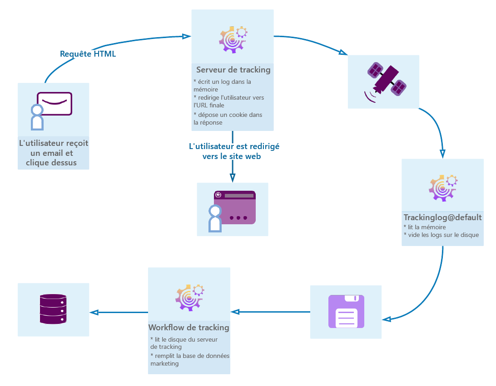

# Prise en main du tracking des messages {#get-started-tracking}

Grâce à ses fonctionnalités de tracking, Adobe Campaign vous permet de tracker les messages envoyés et de vérifier le comportement des destinataires : ouverture, clics sur les liens, désinscription, etc.

Ces informations sont récupérées dans l&#39;onglet **[!UICONTROL Tracking]** du profil de chaque destinataire de la diffusion. Cet onglet présente tous les liens URL trackés sur lesquels le destinataire sélectionné dans la liste a cliqué. Il s’agit de l’accumulation de toutes les URL trackées dans les diffusions qui sont toujours présentes dans l’écran de diffusion. La liste peut être configurée et contient généralement les informations suivantes : l’URL sur laquelle l’utilisateur a cliqué, la date et l’heure du clic et le document dans lequel l’URL a été trouvée. Pour plus d’informations, consultez [cette section](../../platform/using/editing-a-profile.md#tracking-tab).

Le **tableau de bord des diffusions** est la clé pour suivre les diffusions et les erreurs éventuelles rencontrées lors de l’envoi des messages. Voir à ce sujet [cette section](delivery-dashboard.md).

Le diagramme suivant présente les étapes de la conversation entre l&#39;utilisateur et les différents serveurs.

## Paramétrer le tracking {#configure-tracking}

**Principe de fonctionnement**

Avant d’utiliser le tracking, vous devez d’abord le paramétrer pour votre instance. [En savoir plus](../../installation/using/deploying-an-instance.md#operating-principle)

**Serveur de tracking**

Pour paramétrer le tracking, votre instance doit être déclarée et enregistrée auprès du ou des serveurs de tracking. [En savoir plus](../../installation/using/deploying-an-instance.md#tracking-server)

**Enregistrement du tracking**

Une fois le tracking configuré et les URL renseignées, le serveur de tracking doit être enregistré. [En savoir plus](../../installation/using/deploying-an-instance.md#saving-tracking)

## Tracking des messages {#message-tracking}

**Liens trackés**

Vous pouvez tracker la réception des messages et l’activation des liens insérés dans le contenu du message pour mieux comprendre le comportement des destinataires. [En savoir plus](how-to-configure-tracked-links.md)

**Tracking des URL**

Les options de tracking peuvent être paramétrées en activant ou en désactivant les URL suivies. [En savoir plus](personalizing-url-tracking.md)

**Personnalisation des liens trackés**

Les fonctionnalités de tracking de Campaign Classic vous permettent d’ajouter des liens dans les emails qui peuvent être personnalisés et qui prennent en charge le tracking. [En savoir plus](tracking-personalized-links.md)

**Logs de tracking**

Le workflow technique de tracking récupère les données de tracking une fois que la diffusion a été envoyée et que le tracking a été activé. Ces données figurent dans l’onglet Tracking de votre diffusion. [En savoir plus](accessing-the-tracking-logs.md)

**Tester le tracking**

Avant d’envoyer vos messages avec votre tracking, vous pouvez tester ce dernier sur votre page miroir, vos logs d&#39;email et vos liens. [En savoir plus](testing-tracking.md)

## Tracking des applications web {#web-application-tracking}

**Tracking d&#39;une application web**

Vous pouvez également tracker et mesurer les visites sur les pages d&#39;application web avec des balises de tracking. Cette fonctionnalité peut être utilisée pour tous les types d&#39;application web, tels que les formulaires et les landing pages. [En savoir plus](../../web/using/tracking-a-web-application.md)

**Désinscription (opt-out) du tracking des applications web**

Le processus d’opt-out du tracking des applications web vous permet d&#39;arrêter le tracking des comportements web des utilisateurs finaux qui se désinscrivent du tracking comportemental. Vous pouvez inclure la possibilité d’afficher une bannière dans des applications web ou des landing pages pour permettre aux utilisateurs de se désinscrire. [En savoir plus](../../web/using/web-application-tracking-opt-out.md)

## Rapports de tracking {#tracking-reports}

**Statistiques de tracking**

Ce rapport fournit des statistiques sur les ouvertures, les clics et les transactions et vous permet de suivre l&#39;impact marketing de la diffusion. [En savoir plus](../../reporting/using/delivery-reports.md#tracking-statistics)

**URL et flux de clics (URLs and click streams)**

Ce rapport contient la liste des pages visitées suite au lancement d&#39;une diffusion. [En savoir plus](../../reporting/using/delivery-reports.md#urls-and-click-streams)

**Personnes et destinataires**

Comprenez la différence de tracking entre une personne/plusieurs personnes et un destinataire dans Adobe Campaign avec cet exemple. [En savoir plus](../../reporting/using/person-people-recipients.md)

**Indicateurs de tracking**

Ce rapport combine les indicateurs clés pour le tracking du comportement des destinataires à la réception de la diffusion, tels que les taux d&#39;ouverture, de clics publicitaires et de flux de clics. [En savoir plus](../../reporting/using/delivery-reports.md#tracking-indicators)

**Calcul des indicateurs**

Les différents tableaux contiennent la liste des indicateurs utilisés dans les différents rapports et leur formule de calcul en fonction du type de diffusion. [En savoir plus](../../reporting/using/indicator-calculation.md)

## Résolution des problèmes liés au tracking {#tracking-troubleshooting}

Les conseils de dépannage suivants vous aideront à résoudre les problèmes les plus courants qui se produisent lors de l’utilisation du tracking dans Adobe Campaign Classic. Pour un dépannage plus avancé, reportez-vous à [cette section](tracking-troubleshooting.md).

* Vérifier que le processus trackinglogd est en cours d&#39;exécution

  Ce processus lit la mémoire partagée IIS/serveur web et écrit les logs de redirection.

  Vous pouvez y accéder à partir de la page d&#39;accueil en sélectionnant l&#39;onglet Supervision dans votre instance. Vous pouvez également exécuter la commande suivante sur l’instance : `<user>@<instance>:~$ nlserver pdump`

  Si le processus trackinglogd n’apparaît pas dans la liste, lancez-le avec la commande suivante sur l’instance : `<user>@<instance>:~$ nlserver start trackinglogd`

* Vérifiez que le workflow technique de tracking s&#39;est récemment exécuté.

  Vous pouvez localiser le workflow technique de tracking dans les dossiers Administration > Exploitation > Workflows techniques.
