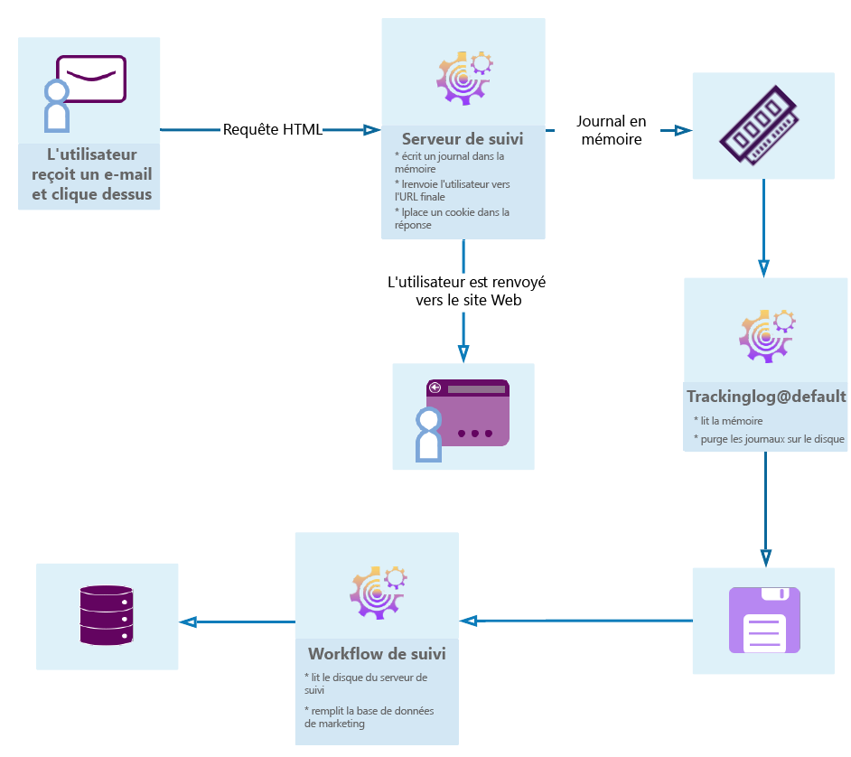

# Commencer avec le suivi des messages {#get-started-tracking}

Grâce à ses fonctionnalités de suivi, Adobe Campaign vous permet de suivre de près les messages envoyés et de vérifier le comportement des destinataires : ouverture, clics sur les liens, désinscription, etc.

Ces informations sont récupérées dans l&#39;onglet **[!UICONTROL Suivi]** du profil de chaque destinataire de la diffusion. Cet onglet présente tous les liens URL suivis et cliqués par le destinataire sélectionné dans la liste. Il s’agit de l’accumulation de toutes les URL suivies dans les diffusions qui sont toujours présentes dans l’écran de diffusion. La liste peut être configurée et contient généralement : l’URL sur laquelle l’utilisateur a cliqué, la date et l’heure du clic et le document de recherche de l’URL. Voir à ce propos [cette section](../../platform/using/editing-a-profile.md#tracking-tab).

Le **tableau de bord de diffusion** est également essentiel pour surveiller vos diffusions et les éventuels problèmes rencontrés lors de l&#39;envoi des messages. Pour plus d&#39;informations à ce sujet, consultez [cette section](../../delivery/using/delivery-dashboard.md).

Le diagramme suivant montre les étapes de la boîte de dialogue entre l&#39;utilisateur et les différents serveurs.

## Configurer le suivi {#configure-tracking}

**Principe de fonctionnement**

Avant d’utiliser le suivi, vous devez d’abord le configurer pour votre instance. [En savoir plus](../../installation/using/deploying-an-instance.md#operating-principle)

**Serveur de tracking**

Pour configurer le suivi, votre instance doit être déclarée et enregistrée auprès des serveurs de suivi. [En savoir plus](../../installation/using/deploying-an-instance.md#tracking-server)

**Enregistrement du tracking**

Une fois le suivi configuré et les URL renseignées, le serveur de suivi doit être enregistré. [En savoir plus](../../installation/using/deploying-an-instance.md#saving-tracking)

## Tracking des messages {#message-tracking}

**Liens suivis**

Vous pouvez suivre la réception des messages et l’activation des liens insérés dans le contenu du message pour mieux comprendre le comportement des destinataires. [En savoir plus](../../delivery/using/how-to-configure-tracked-links.md)

**Suivi des URL**

Les options de suivi peuvent être configurées en activant ou en désactivant les URL suivies. [En savoir plus](../../delivery/using/personalizing-url-tracking.md)

**Personnalisation des liens suivis**

Les fonctionnalités de suivi des Campaign Classic vous permettent d’ajouter des liens dans les courriers électroniques qui peuvent être personnalisés et qui prennent en charge le suivi. [En savoir plus](../../delivery/using/tracking-personalized-links.md)

**Logs de tracking**

Le processus technique de suivi récupère les données de suivi une fois que la diffusion a été envoyée et que le suivi a été activé. Ces données se trouvent dans l’onglet Suivi de votre diffusion. [En savoir plus](../../delivery/using/accessing-the-tracking-logs.md)

**Tester le tracking**

Avant d’envoyer vos messages avec votre suivi, vous pouvez tester le suivi sur votre page miroir, vos journaux de messagerie et vos liens. [En savoir plus](../../delivery/using/testing-tracking.md)

## Tracking des applications Web {#web-application-tracking}

**Tracking d’une application web**

Vous pouvez également suivre et mesurer les visites sur les pages d’Application web avec des balises de tracking. Cette fonctionnalité peut être utilisée pour tous les types d’Application web, tels que les formulaires et les questionnaires en ligne. [En savoir plus](../../web/using/tracking-a-web-application.md)

**Désinscription (opt-out) du tracking des applications web**

L’exclusion du suivi des Applications web vous permet d’arrêter le suivi des comportements Web des utilisateurs finaux qui se désabonnent du suivi comportemental. Vous pouvez inclure la possibilité d’afficher une bannière dans des applications Web ou des landings page pour permettre aux utilisateurs de s’exclure. [En savoir plus](../../web/using/web-application-tracking-opt-out.md)

## Rapports de suivi {#tracking-reports}

**Statistiques de tracking**

Ce rapport fournit des statistiques sur les ouvertures, les clics et les transactions et vous permet de suivre l&#39;impact marketing de la diffusion. [En savoir plus](../../reporting/using/delivery-reports.md#tracking-statistics)

**URL et flux de clics (URLs and click streams)**

Ce rapport présente le palmarès des pages visitées suite au lancement d&#39;une diffusion. [En savoir plus](../../reporting/using/delivery-reports.md#urls-and-click-streams)

**Personnes et destinataires**

Comprenez mieux la différence de suivi entre une personne/une personne et un destinataire à Adobe Campaign avec cet exemple. [En savoir plus](../../reporting/using/person-people-recipients.md)

**Indicateurs de tracking**

Ce rapport combine les indicateurs clés pour le suivi du comportement des destinataires à la réception de la diffusion, tels que les taux d&#39;ouverture, de clics publicitaires et de clics publicitaires. [En savoir plus](../../reporting/using/delivery-reports.md#tracking-indicators)

**Calcul des indicateurs**

Les différents tableaux indiquent la liste des indicateurs utilisés dans les différents rapports et leur formule de calcul selon le type de diffusion. [En savoir plus](../../reporting/using/indicator-calculation.md)

## Résolution des problèmes de tracking {#tracking-troubleshooting}

Les conseils de dépannage suivants vous aideront à résoudre les problèmes les plus courants qui se produisent lors de l’utilisation du suivi dans Adobe Campaign Classic. Pour un dépannage plus avancé, reportez-vous à [cette section](../../delivery/using/tracking-troubleshooting.md).

* Vérifier que le processus trackinglogd est en cours d&#39;exécution

   Ce processus lit la mémoire partagée IIS/Web Server et écrit les journaux de redirection.

   Vous pouvez y accéder à partir de la page d&#39;accueil en sélectionnant l&#39;onglet Surveillance dans votre instance. Vous pouvez également exécuter la commande suivante sur l’instance : `<user>@<instance>:~$ nlserver pdump`

   Si le processus trackinglogd n’apparaît pas dans la liste, lancez-le avec la commande suivante sur l’instance : `<user>@<instance>:~$ nlserver start trackinglogd`

* Vérifiez que le processus technique de suivi s&#39;est récemment exécuté.

   Vous pouvez localiser le processus technique de suivi dans les dossiers Administration > Production > Workflows techniques.
