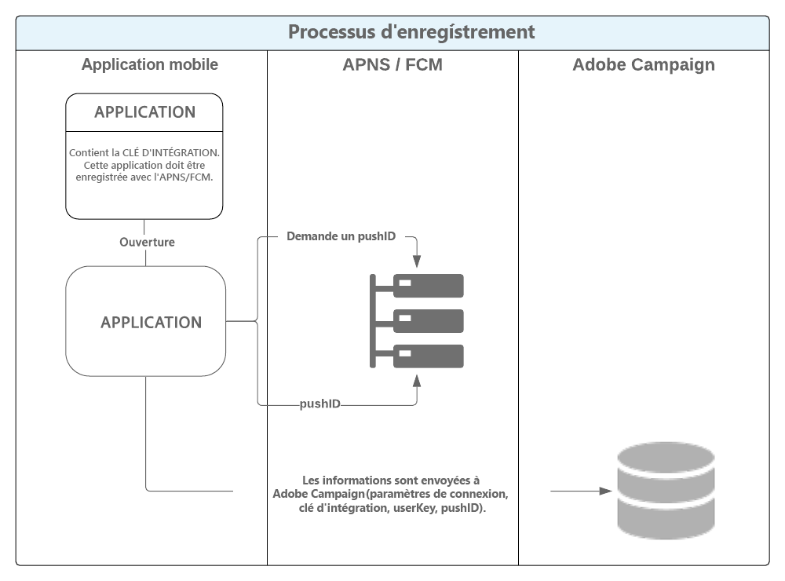

# Prise en main du canal des applications mobiles{#about-mobile-app-channel}

Le **canal des applications mobiles** permet d’envoyer des notifications push personnalisées depuis la plateforme Adobe Campaign sur des terminaux iOS et Android, via des applications.

Deux canaux de diffusions sont disponibles :

* Un canal iOS permettant d’envoyer des notifications sur les appareils mobiles Apple.

  

* Un canal Android permettant d’envoyer des messages de données sur les appareils mobiles Android.

  

  >[!IMPORTANT]
  >
  >Certaines modifications importantes apportées au service Android FCM (Firebase Cloud Messaging) seront publiées en 2024 et auront une incidence sur votre mise en œuvre d’Adobe Campaign. Il se peut que la configuration de vos services d’abonnement pour les notifications push Android doive être mise à jour pour prendre en charge cette modification. Vous pouvez déjà vérifier et agir. En savoir plus dans cette [note technique d’Adobe Campaign v8](https://experienceleague.adobe.com/docs/campaign/technotes-ac/tn-new/push-technote.html?lang=fr){target="_blank"}.

A ces deux canaux correspondent deux activités de diffusion dans les workflows de campagne. Deux modèles sont également disponibles pour les messages transactionnels.


Vous pouvez définir le comportement de l’application lorsque l’utilisateur active la notification afin d’afficher l’écran correspondant au contexte de l’application. Par exemple :

* Une notification est envoyée au client pour l&#39;informer que son colis est sorti de l&#39;entrepôt. L&#39;activation de la notification affiche une page contenant les informations relatives à la diffusion.
* L&#39;utilisateur a ajouté des éléments à son panier, mais il a quitté l&#39;application sans concrétiser l&#39;achat. Une notification est envoyée, l&#39;informant que son panier a été abandonné. Lorsque l&#39;utilisateur active la notification, l&#39;écran du produit abandonné est affiché.

>[!CAUTION]
>
>* Vous devez vous assurer que les notifications envoyées vers une application mobile sont conformes aux prérequis et conditions définis par Apple (Apple Push Notification Service) et Google (Firebase Cloud Messaging).
>* Attention : dans certains pays, la loi exige que vous informiez les utilisateurs de vos applications mobiles du type de données collectées et de la finalité de leur traitement. Vous devez vérifier la législation.

Le workflow **[!UICONTROL Gestion des opt-out NMAC]** (mobileAppOptOutMgt) met à jour les désabonnements aux notifications sur les appareils mobiles. Pour plus d&#39;informations sur ce workflow, consultez la [liste des workflows techniques](../../workflow/using/about-technical-workflows.md).

Adobe Campaign est compatible avec APNs HTTP/2. Pour plus d’informations sur les étapes de configuration, voir [cette section](configuring-the-mobile-application.md).

Pour plus d’informations sur la création d’une diffusion, voir [cette section](steps-about-delivery-creation-steps.md).


## Configurer le canal de notification push {#push-notification-configuration}

Pour envoyer des notifications push avec Adobe Campaign, vous devez d’abord configurer votre environnement et votre application. Avant de commencer à envoyer des notifications push avec Adobe Campaign, vous devez vous assurer que les configurations et les intégrations sont en place sur l’application mobile et pour les balises dans Adobe Experience Platform. Le SDK mobile Adobe Experience Platform fournit des API d’intégration côté client pour vos appareils mobiles via les SDK compatibles Android et iOS. La configuration des SDK s’effectue dans l’interface utilisateur de collecte de données, qui offre des options de configuration flexibles et des intégrations extensibles basées sur des règles. Pour en savoir plus, consultez la [documentation d’Adobe Campaign v8](https://experienceleague.adobe.com/fr/docs/campaign/campaign-v8/send/push/push-settings).


## Chemin de données {#data-path}

Les schémas suivants présentent les étapes permettant à une application mobile d&#39;échanger des données avec Adobe Campaign. Ce processus comporte trois acteurs :

* l&#39;application mobile
* le service de notification : APNS (Apple Push Notification Service) pour Apple et FCM (Firebase Cloud Messaging) pour Android
* Adobe Campaign

Les trois grandes étapes du processus de notification sont : l&#39;enregistrement de l&#39;application dans Adobe Campaign (collecte des abonnements), les diffusions et le tracking.

### Etape 1 : collecte des abonnements {#step-1--subscription-collection}

L&#39;application mobile est téléchargée par l&#39;utilisateur sur l&#39;App Store ou Google Play. Cette application contient, entre autres, les paramètres de connexion (certificat pour iOS et clé de projet pour Android) et la clé d&#39;intégration. Lors du premier lancement de l&#39;application, l&#39;utilisateur peut être amené (selon la configuration de l&#39;application) à renseigner une information d&#39;enregistrement (@userKey : par exemple l&#39;email ou le numéro de compte). Au même moment, l&#39;application interroge le service de notification pour récupérer un identifiant de notification (push id). Toutes ces informations (paramètres de connexion, clé d&#39;intégration, identifiant de notification, userKey) sont envoyées à Adobe Campaign.



### Etape 2 : diffusion {#step-2--delivery}

Le spécialiste marketing cible les abonnés d’une application.Le processus de diffusion envoie au service de notifications les paramètres de connexion (certificat pour iOS et clé de projet pour Android), l’identifiant de notification (push id), et le contenu de la notification.Le service de notification envoie les notifications sur les terminaux ciblés.

Les informations suivantes sont remontées dans Adobe Campaign :

* Android uniquement : nombre d&#39;appareils ayant affiché la notification (impressions)
* Android et iOS : nombre d&#39;appuis sur la notification (clics sur notification)


Le serveur d’Adobe Campaign doit être en mesure de contacter le serveur APNs sur le port 443 pour le connecteur HTTP/2 iOS.

Pour en tester le bon fonctionnement, utilisez les commandes suivantes :

* Pour les tests :

  ```
  api.development.push.apple.com:443
  ```

* En production :

  ```
  api.push.apple.com:443
  ```

Avec le connecteur HTTP/2 iOS, le MTA et le serveur web doivent pouvoir contacter les APN sur le port 443.

Si vous devez utiliser le connecteur HTTP/2 iOS via un proxy, reportez-vous à cette [page](../../installation/using/file-res-management.md#proxy-connection-configuration).
