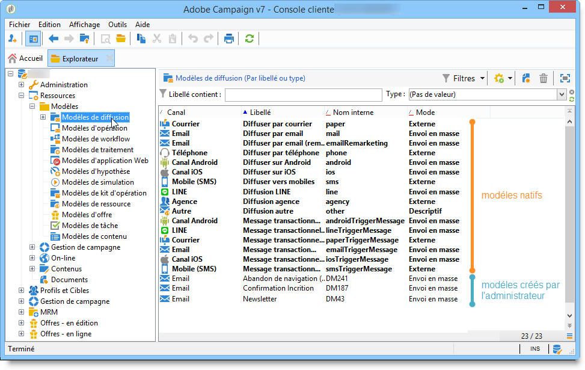

# À propos des modèles{#about-templates}

Le paramétrage d&#39;une diffusion peut être sauvegardé dans un modèle de diffusion afin d&#39;être réutilisé. Le modèle peut contenir un paramétrage complet ou partiel de la diffusion.

Le modèle de diffusion peut être exécuté manuellement, c&#39;est le cas décrit dans ce chapitre, ou exécuté selon un événement (lancement à heure fixe, à l&#39;arrivée d&#39;un fichier sur un serveur, etc.). Les opérations de configuration d&#39;un modèle de diffusion sont effectuées à partir du noeud **[!UICONTROL Ressources>Modèles>Modèles de diffusion]** de l&#39;arborescence.

Il existe deux types de modèles :

1. Les modèles de diffusion natifs d&#39;Adobe Campaign

   On parle de modèles natifs car ils NE DOIVENT PAS être supprimés du système et ils proposent un paramétrage minimal pour chaque canal de diffusion. L&#39;administrateur peut cependant restreindre certaines fonctionnalités ou proposer aux utilisateurs des valeurs par défaut (activation du tracking, adresses email expéditeur, etc.). Les modèles de diffusion natifs apparaissent en gras dans la liste des modèles. Ils doivent être dupliqués pour être modifiés.

1. Les modèles de diffusion prédéfinis

   L’administrateur Adobe Campaign peut créer d’autres modèles de diffusion. Ceux-ci peuvent ensuite être réutilisés par les opérateurs disposant des droits d’accès adéquats ou automatiquement par les processus serveur. Par exemple, vous pouvez configurer un modèle de diffusion e-mail. Lorsque les utilisateurs créent une diffusion à l’aide de ce modèle, il leur suffit de saisir le texte ou le contenu HTML puis de le diffuser, les autres choix ayant déjà été définis par l’administrateur.

>[!NOTE]
>
>Les modèles disponibles dépendent de vos droits d’accès, de la configuration de votre instance et du contexte dans lequel ils sont appelés. Par exemple, lorsque vous créez un service d’information, vous pouvez y associer un modèle de diffusion pour les messages de confirmation : vous ne pourrez alors accéder qu’aux modèles dont le mapping de ciblage correspond à celui des abonnements. Pour plus dʼinformations, consultez les sections [Sélection dʼun mapping de ciblage](selecting-a-target-mapping.md) et [Services et abonnements](about-services-and-subscriptions.md).
