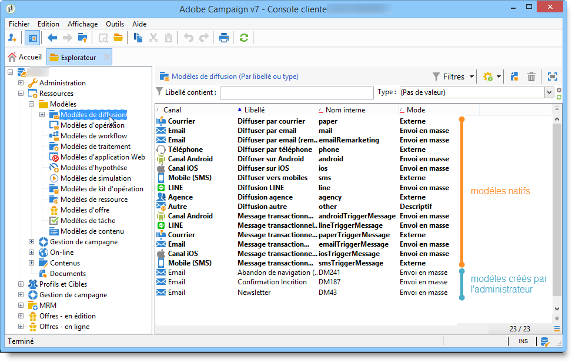

# Utiliser des modèles de diffusion {#about-templates}

Une configuration de diffusion peut être enregistrée dans un modèle de diffusion afin d’être réutilisée. Le modèle peut contenir une configuration complète ou partielle de la diffusion.

Il existe deux types de modèles :

1. Modèles de diffusion natifs Adobe Campaign : les modèles natifs NE DOIVENT PAS être supprimés du système. Ils comprennent une configuration minimale pour chaque canal de diffusion. L’administration peut toutefois restreindre certaines fonctions ou proposer des valeurs par défaut (activation du tracking, adresses e-mail d’expédition, etc.). Les scénarios natifs s’affichent en gras dans la liste des modèles. Ils doivent être dupliqués pour pouvoir les modifier.

1. Modèles de diffusion prédéfinis - L’administration Adobe Campaign peut créer des modèles de diffusion. Ceux-ci peuvent ensuite être réutilisés par les opérateurs disposant des droits d’accès adéquats ou automatiquement par les processus serveur. Par exemple, vous pouvez configurer un modèle de diffusion e-mail. Lorsque les utilisateurs ou les utilisatrices créent une diffusion à l’aide de ce modèle, il leur suffit de saisir le texte ou le contenu HTML puis de le diffuser, les autres choix ayant déjà été définis par l’administrateur ou l’administratrice.

Découvrez comment créer et utiliser des modèles de diffusion dans la [documentation de Campaign v8](https://experienceleague.adobe.com/fr/docs/campaign/campaign-v8/send/create-templates){target="_blank"}.