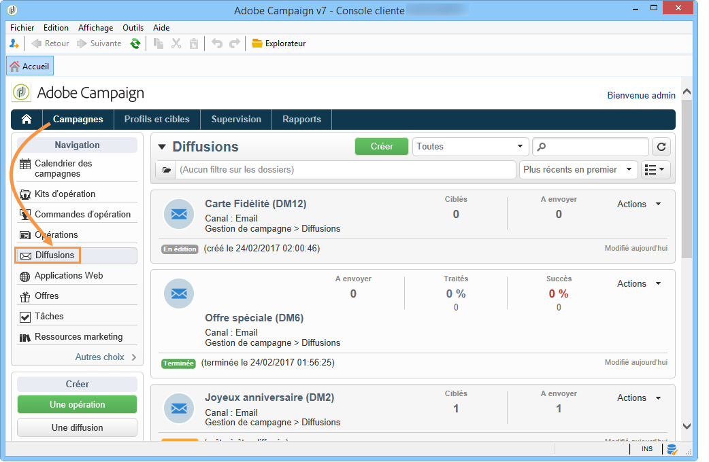
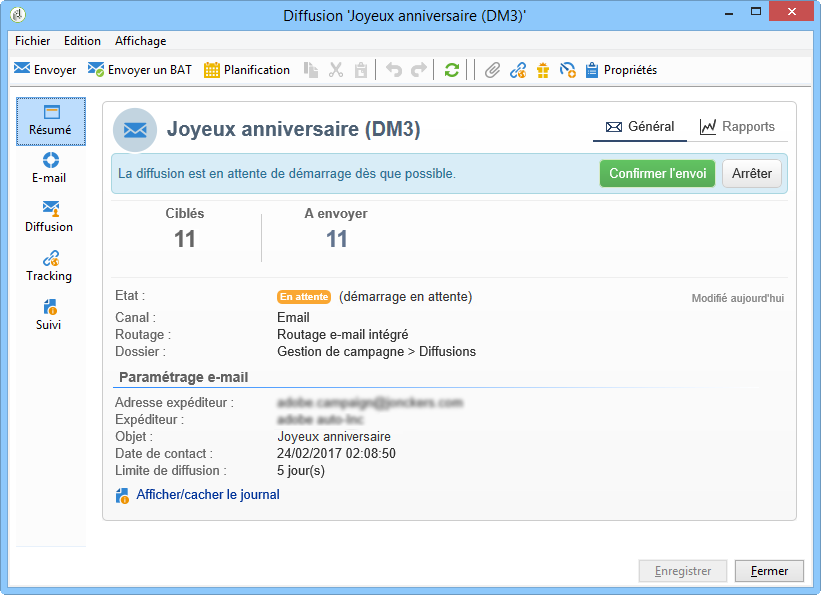
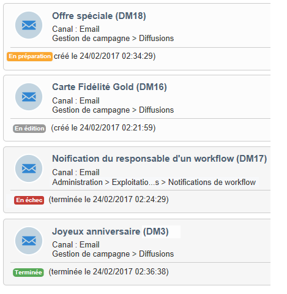
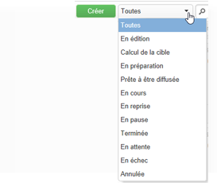
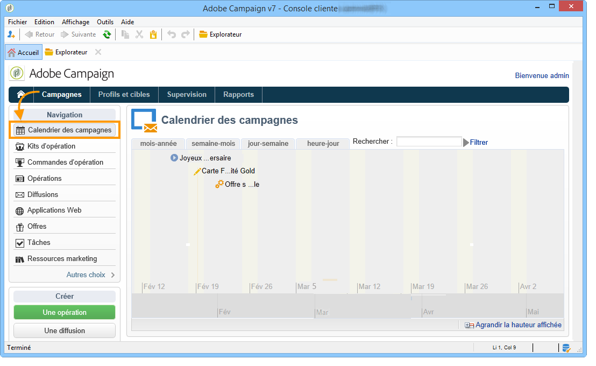
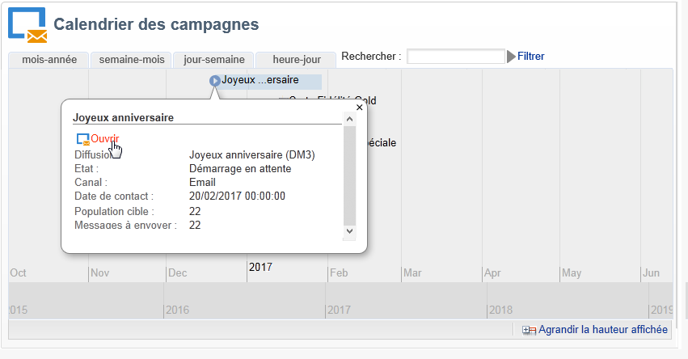
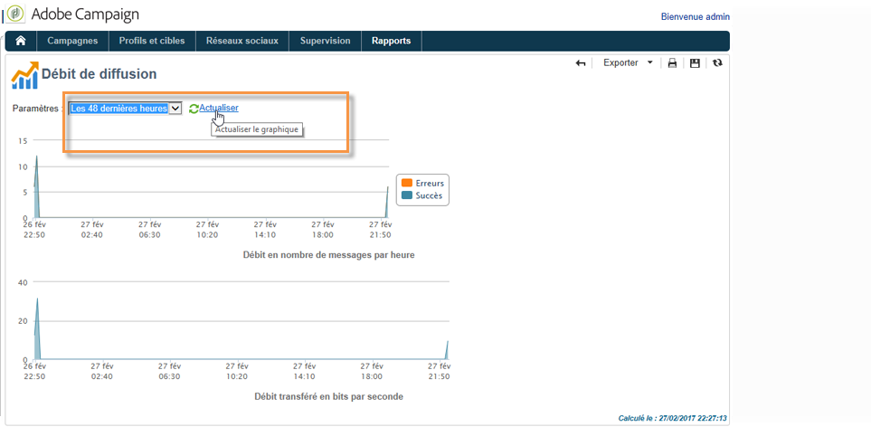

# Accès aux informations sur les diffusions{#accessing-deliveries-information}

## Accès à la liste des diffusions {#accessing-the-list-of-deliveries}

Pour accéder à la liste des diffusions, positionnez-vous sur l&#39;univers **[!UICONTROL Campagnes]** et cliquez sur le lien **[!UICONTROL Diffusions]**.

Si vous utilisez la [vue Explorateur](../../platform/using/adobe-campaign-workspace.md#about-adobe-campaign-explorer), vous pouvez accéder à l&#39;ensemble des diffusions à partir du nœud **[!UICONTROL Gestion de campagne > Diffusions]** de l&#39;arborescence.

>[!NOTE]
>
>L&#39;espace de travail d&#39;Adobe Campaign est présenté dans [cette section](../../platform/using/adobe-campaign-workspace.md).

Cette page vous donne accès à une vue d&#39;ensemble de vos diffusions : elle affiche toutes les diffusions de votre base. Vous pouvez y consulter leur état, taux de succès et date de modification.

>[!NOTE]
>
>Le filtrage des informations est présenté dans [cette section](../../platform/using/filtering-options.md).

L&#39;assistant de diffusion vous permet de paramétrer vos diffusions, d&#39;en lancer la validation puis de les envoyer. Le contenu de l&#39;assistant dépend du canal de communication (email, mobile, push, courrier) et des droits dont dispose l&#39;opérateur.

Pour agir sur les diffusions de la liste, cliquez sur la diffusion de votre choix. Celle-ci s&#39;ouvre dans une nouvelle fenêtre. Vous pouvez alors confirmer son envoi, ou l&#39;arrêter par exemple.

En fonction de l&#39;avancement dans le cycle de diffusion, les principaux états possibles sont :

* Annulée
* En échec
* En attente
* Terminé
* En pause
* En reprise
* En cours
* Prête à être diffusée
* En préparation
* Calcul de la cible
* En édition

A chaque état correspond une couleur et un libellé spécifique.

La liste déroulante placée à côté du bouton **[!UICONTROL Créer]** vous permet de filtrer les diffusions selon leur état.

## Accès au calendrier des diffusions {#accessing-the-delivery-calendar}

Pour accéder au calendrier des campagnes, positionnez-vous sur l&#39;univers **[!UICONTROL Campagne]** et cliquez sur le lien **[!UICONTROL Calendrier des campagnes]**. Ce calendrier affiche la répartition des campagnes dans le temps. Vous pouvez personnaliser l&#39;affichage par mois, semaine ou jour.

Pour chaque campagne, cliquez sur son libellé afin d&#39;afficher les informations principales la concernant. Vous pouvez également ouvrir la campagne, si besoin est, en cliquant sur le lien **[!UICONTROL Ouvrir]**.

## Accès aux informations sur le débit des diffusions {#accessing-deliveries-throughput-information}

Les informations contenues dans la page du **[!UICONTROL Débit des diffusions]** concernent toutes les diffusions de la plateforme. Pour mesurer la vitesse de diffusion des messages, les critères sont le nombre de messages diffusés par heure et la taille des messages, en bits par seconde. Dans l&#39;exemple ci-dessous, le premier graphique indique, en bleu, les diffusions envoyées avec succès et, en orange, le nombre de messages en erreur.

Vous avez la possibilité de choisir la plage sur laquelle est calculé le débit. Pour cela, sélectionnez la valeur dans la liste déroulante, puis cliquez sur le lien **[!UICONTROL Actualiser]**.

>[!NOTE]
>
>Pour les installations hébergées ou hybrides, si vous avez effectué la mise à niveau vers la MTA améliorée, la page de débit de **[!UICONTROL diffusion]** n’affichera plus le débit vers vos destinataires de courrier électronique. Il indiquera la vitesse de débit du relais de vos messages de Campaign vers la MTA améliorée.
>
>Pour plus d’informations sur la MTA améliorée d’Adobe Campaign, reportez-vous à ce [document](https://helpx.adobe.com/campaign/kb/campaign-enhanced-mta.html).