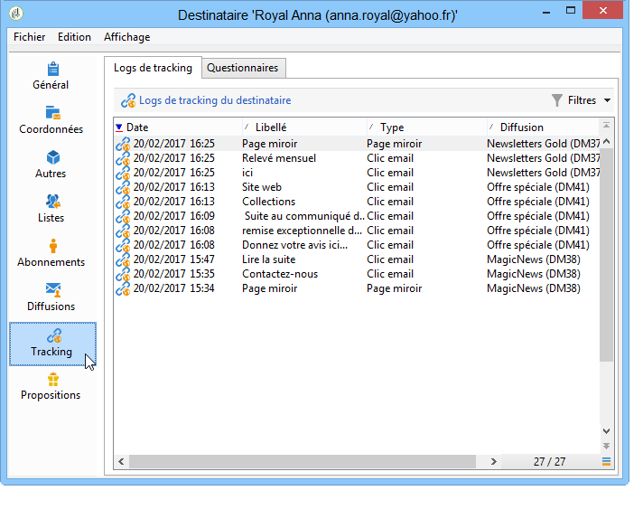
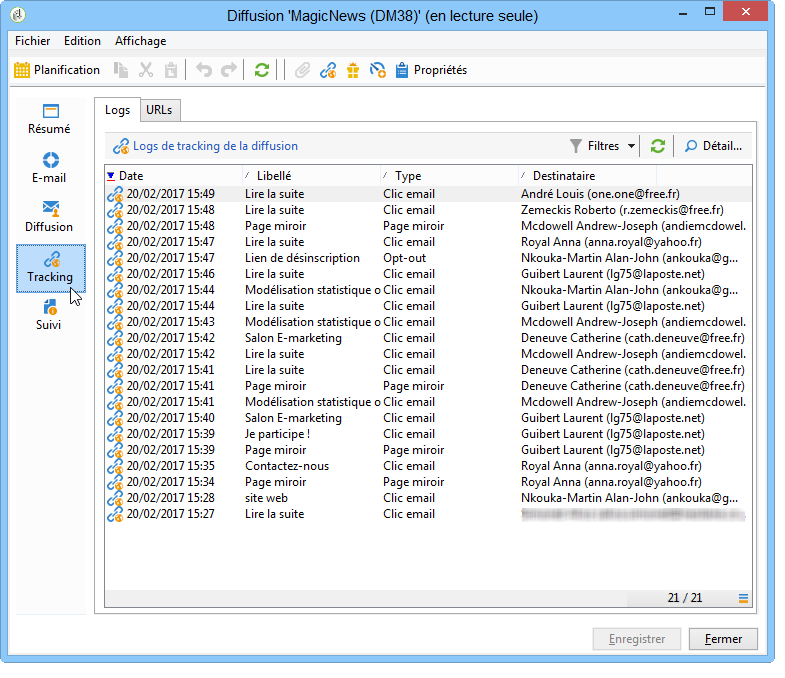

# Accès aux logs de tracking{#accessing-the-tracking-logs}

Une fois la diffusion envoyée et le tracking activé, le workflow technique **[!UICONTROL Tracking]** est chargé de récupérer les informations de tracking. Par défaut, il s&#39;exécute toutes les heures.

Ces informations sont remontées dans l&#39;onglet **[!UICONTROL Tracking]** du profil des destinataires ciblés par la diffusion, comme dans l&#39;exemple suivant :

Elles sont également accessibles depuis l&#39;onglet **[!UICONTROL Tracking]** de la diffusion.

>[!NOTE]
>
>Si l&#39;onglet **[!UICONTROL Tracking]** d&#39;une diffusion n&#39;est pas visible, cela signifie que le tracking n&#39;a pas été activé. Consultez [cette section](how-to-configure-tracked-links.md).
