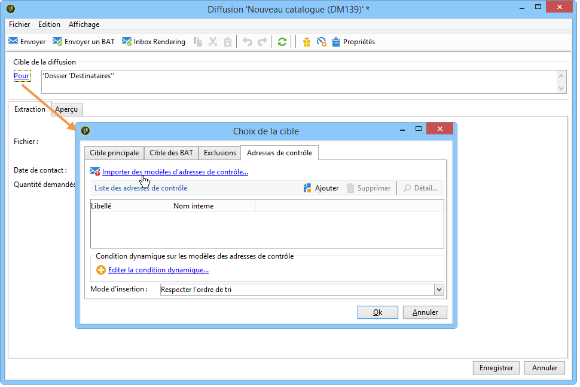
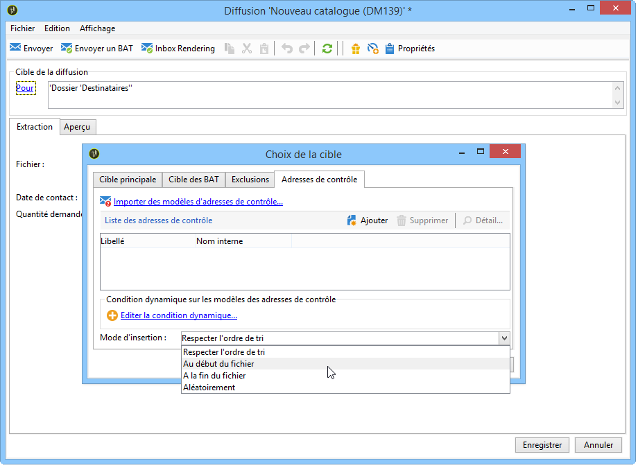
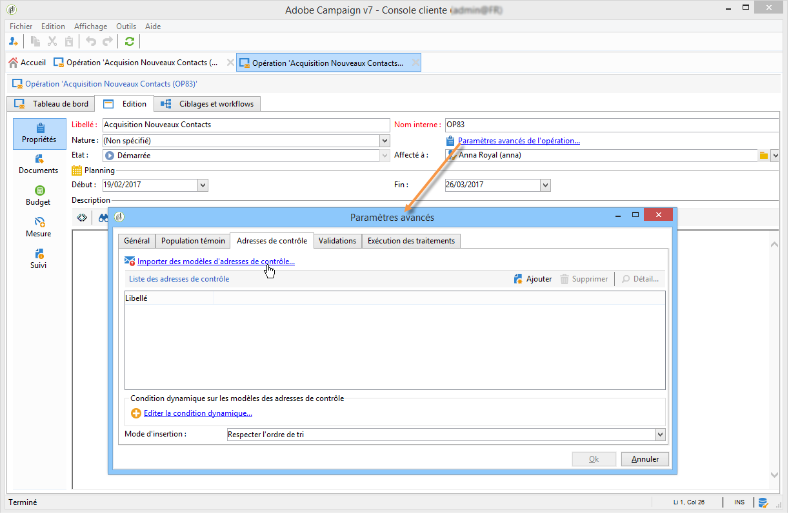

# Ajouter des adresses de contrôle{#adding-seed-addresses}

## Adresses de contrôle dans une diffusion {#seed-addresses-in-a-delivery}

Pour ajouter des adresses de contrôle spécifiques à une diffusion, cliquez sur le lien **[!UICONTROL Pour]**, puis sélectionnez l&#39;onglet **[!UICONTROL Adresses de contrôle]**.

Trois modes d&#39;insertion sont possibles :

1. Vous pouvez saisir les adresses de contrôle.

   Pour cela, cliquez sur le bouton **[!UICONTROL Ajouter]** et définissez le contenu des champs de l&#39;adresse. Répétez l&#39;opération pour chaque adresse à ajouter.

1. Vous pouvez importer des modèles d&#39;adresses que vous pourrez adapter selon vos besoins.

   Pour cela, cliquez sur le lien **[!UICONTROL Importer des adresses de contrôle...]** et sélectionnez le dossier contenant les modèles d&#39;adresses. Pour plus d’informations à ce sujet, consultez [cette section](creating-seed-addresses.md#creating-seed-address-templates).

   Au besoin, une fois ajoutées, vous pouvez double-cliquer dessus ou cliquer sur le bouton **[!UICONTROL Détail...]** pour adapter le contenu des champs de chaque adresse.

1. Vous pouvez créer une condition pour sélectionner dynamiquement les adresses de contrôle à insérer.

   Pour cela, cliquez sur le lien **[!UICONTROL Editer la condition dynamique...]**, puis indiquez les paramètres de sélection des adresses de contrôle. Vous pouvez par exemple inclure toutes les adresses de contrôle contenues dans un dossier spécifique ou les adresses de contrôle appartenant à un service particulier de votre société.

   Vous trouverez un exemple dans la section : [Cas pratique : sélectionner des adresses de contrôle selon des critères](use-case--selecting-seed-addresses-on-criteria.md).

>[!NOTE]
>
>Cette option est notamment utilisée lorsque la table des destinataires utilisée n’est pas la table par défaut **nms:recipient** et que vous utilisez la fonctionnalité d’Inbox Rendering fournie avec le module de **[!UICONTROL Délivrabilité]** d’Adobe Campaign.
>
>Voir à ce sujet la section [Utiliser une table de destinataires externe](using-an-external-recipient-table.md) et la documentation sur la fonctionnalité [Inbox rendering](inbox-rendering.md).

Pour les diffusions courrier, vous pouvez personnaliser le mode d&#39;insertion des adresses dans le fichier d&#39;extraction. Par défaut, elles sont insérées dans l&#39;ordre de tri du fichier de sortie, mais vous pouvez choisir de les insérer à la fin ou au début du fichier, ou aléatoirement parmi les destinataires de la cible principale.

## Adresses de contrôle dans une opération {#seed-addresses-in-a-campaign}

Pour ajouter des adresses de contrôle dans la cible au niveau d&#39;une opération, sélectionnez l&#39;opération visée et cliquez sur l&#39;onglet **[!UICONTROL Edition]**.

Cliquez sur le lien **[!UICONTROL Paramètres avancés de l&#39;opération...]** puis sur l&#39;onglet **[!UICONTROL Adresses de contrôle]**, comme ci-dessous :

Les adresses de contrôle insérées depuis l&#39;opération seront ajoutées à la cible de chacune des diffusions de cette opération.
