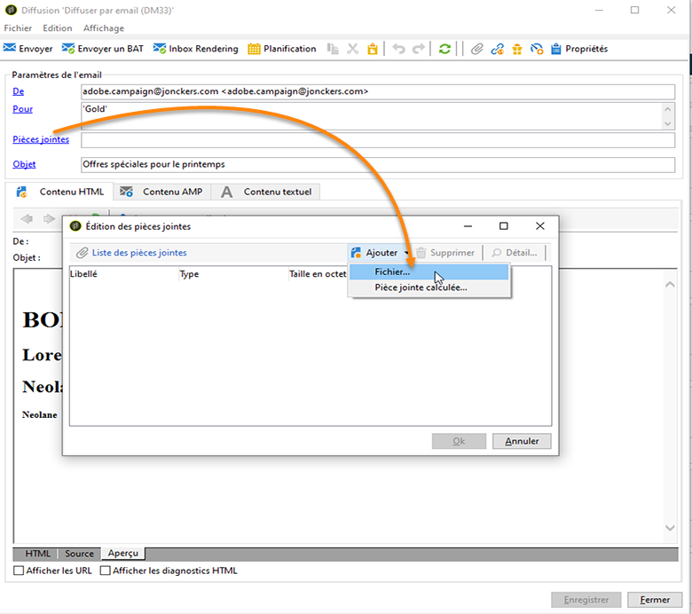
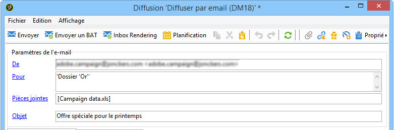
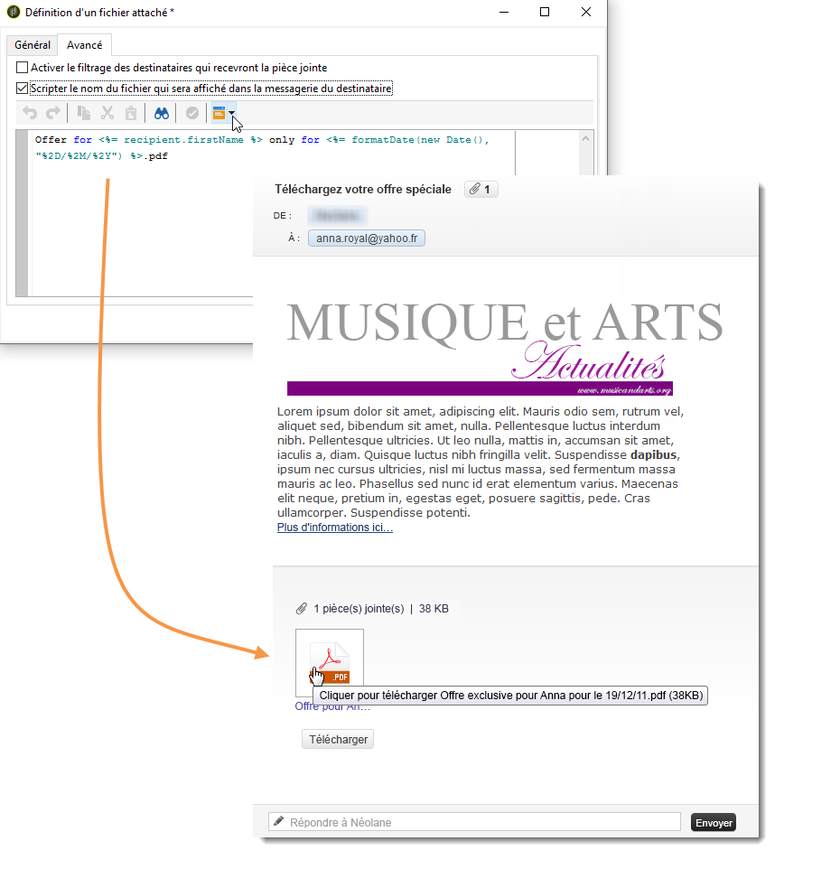

# Joindre des fichiers{#attaching-files}

## A propos des pièces jointes à un email {#about-email-attachments}

Vous pouvez attacher un ou plusieurs fichiers à une diffusion par email. Deux cas sont possibles :

* Sélectionner un fichier et le joindre tel quel à la diffusion.
* Personalize the content of the attachment for each recipient. In this case, you need to create a **calculated attachment**: the name of the attachment is computed at the time of delivery for each message depending on the recipient. The content can also be personalized and converted into PDF format at the time of delivery, if you have the **Variable Digital Printing** option.

>[!NOTE]
>
>Ce type de configuration est généralement effectué dans les modèles de remise. For more on this, refer to [About templates](../../delivery/using/about-templates.md).

## Joindre un fichier local {#attaching-a-local-file}

Pour joindre un fichier local à une remise, procédez comme suit.

>[!NOTE]
>
>Vous pouvez joindre plusieurs fichiers à une remise. Les pièces jointes peuvent être dans n’importe quel format, format compressé inclus.

1. Click the **[!UICONTROL Attachments]** link.
1. **[!UICONTROL Cliquez sur le bouton]** Ajouter **[!UICONTROL , puis sur]** Fichier... pour sélectionner le fichier à joindre à la diffusion.

Vous pouvez également faire glisser et déposer directement le fichier dans le champ **[!UICONTROL Pièces jointes]** de remise ou utiliser l’icône **[!UICONTROL Joindre]** de la barre d’outils de l’assistant de remise,

1. Une fois le fichier sélectionné, il est immédiatement téléchargé sur le serveur pour être disponible au moment de la remise. Il est répertorié dans le champ **[!UICONTROL Pièces jointes]** .

## Créer un attachement calculé {#creating-a-calculated-attachment}

Lorsque vous créez un attachement calculé, le nom de la pièce jointe peut être calculé au moment de l&#39;analyse ou de l&#39;envoi pour chaque message et dépendre du destinataire. Il peut également être personnalisé et converti en PDF.

Pour créer une pièce jointe personnalisée, procédez comme suit :

1. Click the **[!UICONTROL Attachments]** link.
1. Cliquez sur le bouton **[!UICONTROL Ajouter]** , puis sélectionnez Pièce jointe **** calculée.
1. Sélectionnez le type de calcul dans la liste déroulante **[!UICONTROL Type]** :

Les options disponibles sont les suivantes :

* **Le nom de fichier est renseigné lors de la création du modèle de diffusion**
* **Le contenu du fichier est personnalisé et converti en PDF au moment de l&#39;envoi pour chaque message**
* **Le nom de fichier est calculé lors de l&#39;analyse de la diffusion (il ne peut pas dépendre du destinataire)**
* **Le nom de fichier est calculé au moment de l&#39;envoi pour chaque destinataire (il peut dépendre du destinataire)**

### Joindre un fichier local {#attach-a-local-file}

Si la pièce jointe est un fichier local, sélectionnez l’option : Le nom du **[!UICONTROL fichier est spécifié lors de la création du modèle]** de remise. Le fichier est sélectionné localement et téléchargé sur le serveur. Suivez les étapes ci-dessous :

1. Sélectionnez le fichier à télécharger dans le champ **[!UICONTROL Fichier local]**.
1. Précisez le libellé si nécessaire. Le libellé remplace le nom du fichier lorsqu&#39;il est visualisé dans les systèmes de messagerie. Si rien n&#39;est spécifié, le nom du fichier est utilisé par défaut.

   

1. Au besoin, sélectionnez l&#39;option **[!UICONTROL Télécharger le fichier sur le serveur]**, puis cliquez sur le lien **[!UICONTROL Mettre à jour sur le serveur]** pour lancer le transfert.

   

   Le fichier est alors disponible sur le serveur pour être joint aux diffusions créées à partir de ce modèle.

### Ajout d’un message personnalisé {#attach-a-personalized-message}

L&#39;option **[!UICONTROL Le contenu du fichier est personnalisé et converti en PDF au moment de l&#39;envoi pour chaque message]** permet de sélectionner des champs de personnalisation tels que le nom et le prénom du destinataire visé.

Pour ce type d&#39;attachement, les étapes de paramétrage sont les suivantes :

1. Sélectionnez le fichier à télécharger.

   >[!NOTE]
   >
   >Le fichier source doit être créé sous LibreOffice. La configuration de l&#39;instance doit respecter les prérequis décrits dans [cette section](../../installation/using/before-starting.md).

1. Précisez le libellé si nécessaire.
1. Sélectionnez l&#39;option **[!UICONTROL Télécharger le fichier sur le serveur]**, puis cliquez sur le lien **[!UICONTROL Mettre à jour sur le serveur]** pour lancer le transfert.
1. Vous pouvez afficher une prévisualisation : pour cela, sélectionnez un destinataire.

   

1. Analysez votre diffusion puis démarrez-la.

   Chaque destinataire reçoit un PDF personnalisé en attachement de la diffusion.

   

### Ajout d’un fichier calculé {#attach-a-calculated-file}

Vous pouvez calculer le nom d&#39;un attachement pendant la préparation de la diffusion. Pour cela, sélectionnez l&#39;option **[!UICONTROL Le nom de fichier est calculé lors de l&#39;analyse de la diffusion (il ne peut pas dépendre du destinataire)]**.

>[!NOTE]
>
>Cette option n&#39;est utilisée que lorsque la diffusion est envoyée par un procédé externe ou par un workflow.

1. Précisez le libellé que vous souhaitez appliquer à la pièce jointe.
1. Indiquez le chemin d&#39;accès au fichier et son nom exact dans la fenêtre de définition.

   >[!CAUTION]
   >
   >Le fichier doit être présent sur le serveur.

   

1. Analysez puis démarrez votre diffusion.

   Le calcul du nom du fichier est visible dans le journal de l&#39;analyse.

   

### Ajout d’un fichier personnalisé {#attach-a-personalized-file}

Lorsque vous sélectionnez un fichier attaché, vous pouvez choisir l&#39;option **[!UICONTROL Le nom de fichier est calculé au moment de l&#39;envoi pour chaque destinataire (il peut dépendre du destinataire)]**. Vous pouvez ensuite associer les données de personnalisation des destinataires au nom du fichier à envoyer.

>[!NOTE]
>
>Cette option n&#39;est utilisée que lorsque la diffusion est envoyée par un procédé externe ou par un workflow.

1. Précisez le libellé que vous souhaitez appliquer à la pièce jointe.
1. Indiquez le chemin d&#39;accès du fichier, ainsi que son nom exact dans la fenêtre de définition. Si le nom du fichier est personnalisé, vous pouvez utiliser les champs de personnalisation pour les valeurs correspondantes.

   

   >[!CAUTION]
   >
   >Le fichier doit être présent sur le serveur.

1. Analysez puis démarrez votre diffusion.

   Dans l&#39;exemple ci-dessous, le fichier attaché a été choisi en fonction de son nom tel qu&#39;il a été défini à l&#39;aide des champs de fusion.

   

### Paramètres des fichiers attachés {#attachment-settings}

Pour les deux premières options, vous pouvez choisir de **[!UICONTROL Télécharger le fichier sur le serveur]**, en cochant l&#39;option correspondante. Le lien **[!UICONTROL Mettre à jour sur le serveur]** permet de lancer le téléchargement.

Un message vous indique que le fichier a bien été téléchargé sur le serveur :

En cas de changement de fichier, un message d&#39;avertissement est affiché :

L&#39;onglet **[!UICONTROL Avancé]** permet de définir des options avancées sur les fichiers joints :

* Vous pouvez définir des options de filtrage afin de ne pas transmettre le fichier joint à tous les destinataires. L&#39;option **[!UICONTROL Activer le filtrage des destinataires qui recevront la pièce jointe]** active une zone de saisie utilisée pour définir un script de sélection des destinataires. Ce script doit être saisi en JavaScript.
* Vous pouvez scripter le nom du fichier afin de le personnaliser.

   Entrez votre texte dans la fenêtre et utilisez les champs de personnalisation disponibles dans la liste déroulante. Dans l&#39;exemple ci-dessous, le nom du fichier est personnalisé pour contenir la date du jour et le nom du destinataire.

   
