# Automatisation à l&#39;aide de workflows{#automating-via-workflows}


## Activité Gestion de contenu {#content-management-activity}

La création, l&#39;édition et la publication d&#39;un contenu peuvent être automatisées à partir d&#39;un workflow paramétré depuis l&#39;interface cliente Adobe Campaign.

L&#39;activité **Gestion de contenu** est accessible à partir de la barre d&#39;outils **[!UICONTROL Outils]** du diagramme de workflow.

Les propriétés de l&#39;activité se divisent en quatre étapes :

* **[!UICONTROL Contenu]** : permet de renseigner un contenu déjà existant ou de le créer,
* **[!UICONTROL Mettre à jour du contenu]** : permet de modifier le sujet du contenu ou de mettre à jour le contenu à partir d&#39;un flux de données XML,
* **[!UICONTROL Action à effectuer]** : permet d&#39;enregistrer ou de générer le contenu,
* **[!UICONTROL Transition]** : permet de générer ou non une transition sortante et, si elle existe, de la nommer.

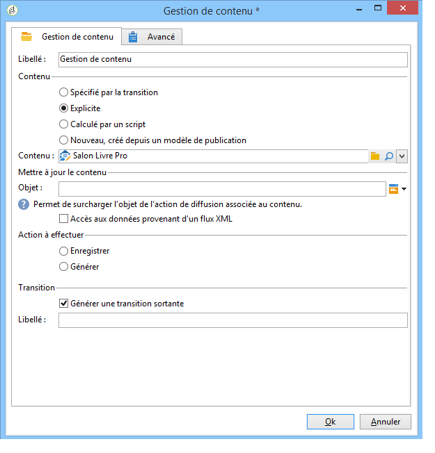

### Content {#content}

* **Spécifié par la transition**

   Le contenu à utiliser a été créé précédemment, les traitements porteront sur l&#39;instance de contenu propagée par l&#39;événement entrant. L&#39;identifiant du contenu est accessible à partir de la variable &quot;contentId&quot; de l&#39;événement.

* **Explicite**

   Permet de choisir un contenu déjà créé.

* **Calculé par un script**

   Choisit une instance de contenu à partir d&#39;un template JavaScript, le code à évaluer permet de récupérer l&#39;identifiant du contenu.

* **Nouveau, créé depuis un modèle de publication**

   Crée un nouveau contenu depuis un modèle de publication. L&#39;instance de contenu sera enregistrée dans le dossier &quot;Chaîne&quot; renseigné.

### Mettre à jour le contenu {#update-the-content}

* **Objet**

   Permet de modifier le sujet de l&#39;action de diffusion lors d&#39;une publication.

* **Accès aux données provenant d&#39;un flux XML**

   Le contenu est mis à jour à partir d&#39;un flux XML provenant d&#39;une source externe. Une URL doit être renseignée pour le téléchargement des données.

   Une feuille de style XSL peut être utilisée pour transformer les données XML entrantes.

### Action à effectuer {#action-to-execute}

* **Enregistrer**

   Sauve le contenu créé ou modifié, l&#39;identifiant du contenu sauvé est propagé dans la variable &quot;contentId&quot; de l&#39;événement sortant.

* **Générer**

   Génère les fichiers de sortie pour chacun des modèles de transformation dont le type de publication est &quot;Fichier&quot;. La transition sortante est activée pour chacun des fichiers générés, avec pour paramètres l&#39;identifiant du contenu sauvegardé dans la variable &quot;contentId&quot; et le nom du fichier dans la variable &quot;filename&quot;.

### Transition {#transition}

L&#39;option **Générer une transition sortante** permet d&#39;ajouter une transition en sortie de l&#39;activité de **[!UICONTROL Gestion de contenu]** afin d&#39;enchaîner l&#39;exécution du workflow sur une nouvelle activité. Lorsque cette option est cochée, vous devez saisir le libellé de la transition.

## Exemples  {#examples}

### Automatiser la création et la diffusion d’un contenu {#automating-content-creation-and-delivery}

L&#39;exemple suivant automatise la création et la diffusion d&#39;un contenu.

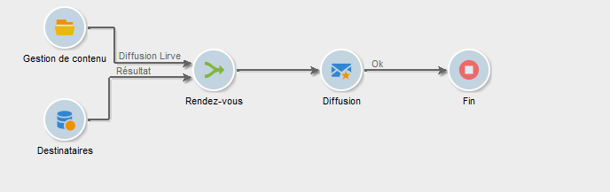

Le contenu est paramétré à partir de l&#39;activité Gestion de contenu, comme suit :

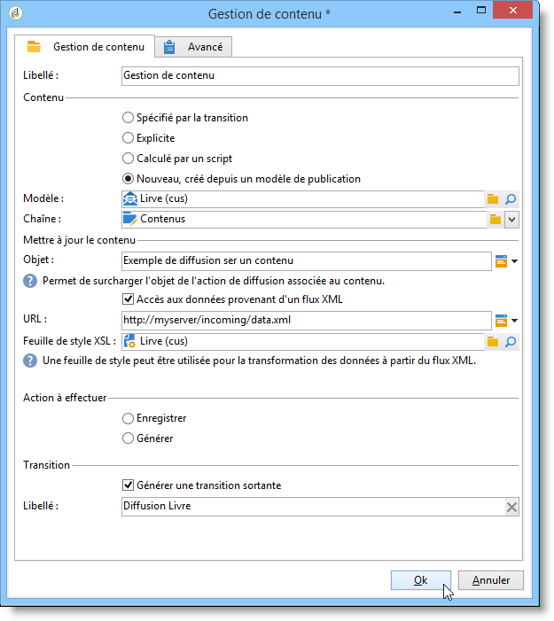

Une nouvelle instance de contenu est créée à partir du modèle de publication et du dossier chaîne de contenu.

Dans notre exemple, nous avons surchargé le sujet de la diffusion. Il sera pris en compte à la place de celui renseigné dans le modèle de diffusion de l&#39;activité **[!UICONTROL Diffusion]**.

Le contenu est complété automatiquement par un flux XML provenant de l&#39;URL renseignée :

```
<?xml version='1.0' encoding='ISO-8859-1'?>
<book name="Content automation test" date="2008/06/08" language="eng" computeString="Content automation test">
  <section id="1" name="Introduction">
    <page>Introduction to input forms.</page>
  </section>
</book>
```

Le format de données ne correspond pas au schéma de données entré dans le modèle de publication (**cus:book** dans notre exemple) ; l’élément **`<section>`** doit être remplacé par l’élément **`<chapter>`**. Il est nécessaire d’appliquer la feuille de style « cus:book-workflow.xsl » pour apporter les modifications nécessaires.

Code source de la feuille de style XSLT utilisée :

```
<?xml version="1.0" encoding="utf-8"?>
<xsl:stylesheet version="1.0" xmlns:xsl="http://www.w3.org/1999/XSL/Transform">
 <xsl:output indent="yes" method="xml"  encoding="ISO-8859-1"/>

 <xsl:template match="text()|@*"/>

  <xsl:template match="*">
    <xsl:variable name="element.name" select="name(.)"/>
    <xsl:element name="{$element.name}">
      <xsl:copy-of select="text()|@*"/>
      <xsl:apply-templates/>
    </xsl:element>
  </xsl:template>

  <xsl:template match="book">
  <book name="test">
     <xsl:apply-templates/>
    <book>
 </xsl:template>

  <xsl:template match="section">
    <chapter>
      <xsl:for-each select="@*">
        <xsl:copy-of select="."/>
      </xsl:for-each>
       <xsl:apply-templates/>
    </chapter>
  </xsl:template>
  
</xsl:stylesheet>
```

L&#39;action finale de l&#39;activité est d&#39;enregistrer l&#39;instance de contenu et continuer sur la tâche suivante.

Le ciblage de la population à diffuser est renseigné via l&#39;activité **Requête**.

Une activité **Rendez-vous** a été ajoutée afin de ne lancer la diffusion qu&#39;une fois le requêtage de la cible et la mise à jour du contenu terminés.

L&#39;action de diffusion est paramétrée à partir de l&#39;activité **Diffusion** :

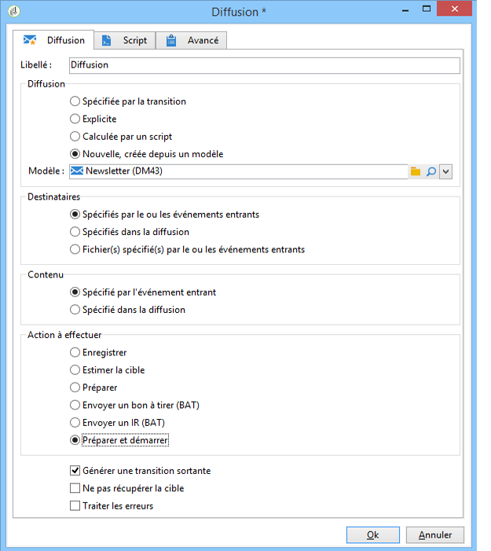

Une nouvelle action de diffusion est créée depuis un modèle.

Le modèle de diffusion de l&#39;activité est utilisé pour sélectionner les modèles de transformation du modèle de publication. La génération du contenu prendra en compte les modèles HTML et Texte sans modèle de diffusion associés ou référencés avec le même modèle que celui spécifié dans l&#39;activité.

La cible à diffuser est renseignée à partir de l&#39;événement entrant.

Le contenu de la diffusion est renseigné à partir de l&#39;événement entrant.

L&#39;action finale de l&#39;activité est de préparer puis lancer la diffusion.

### Créer du contenu pour une publication ultérieure {#creating-content-and-publishing-it-later}

Cet exemple crée un contenu et ne lance la publication fichier qu&#39;après un délai d&#39;attente.

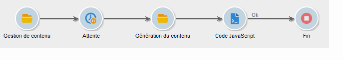

La première tâche **Gestion de contenu** crée une instance de contenu.

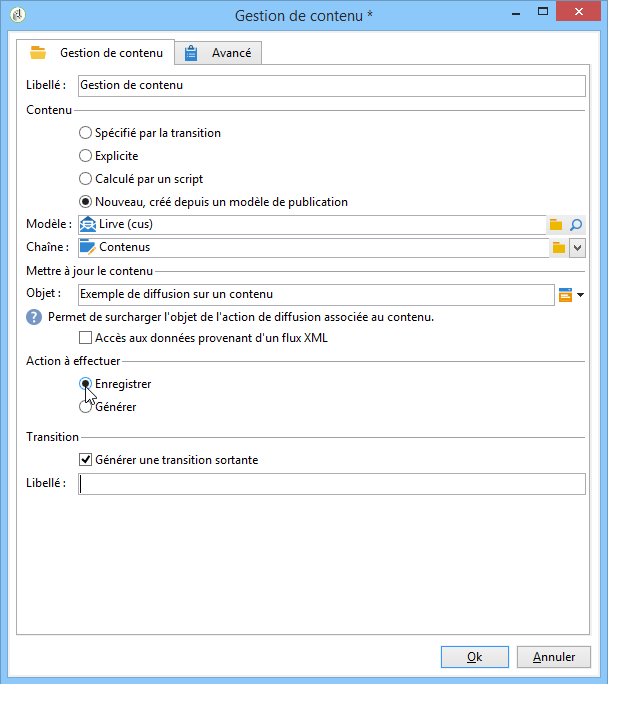

>[!NOTE]
>
>L&#39;onglet **[!UICONTROL Publication]** des modèles de transformation doit être renseigné avec la localisation de la cible à générer.

Une activité d&#39;attente est ajoutée afin de suspendre la transition suivante pendant une semaine.

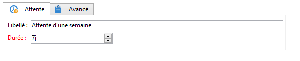

Le contenu est renseigné manuellement pendant ce délai.

La tâche suivante lance la génération du contenu.

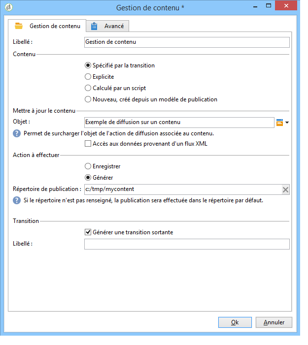

Le contenu à publier est renseigné à partir de la transition entrante.

L&#39;action finale est la génération de ce contenu en forçant le répertoire de publication.

L&#39;activité **Code JavaScript** récupère le nom complet de chaque fichier généré.

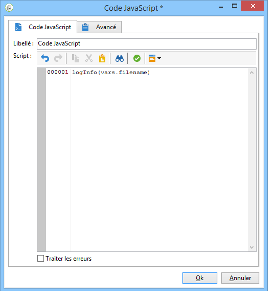

### Créer la diffusion et son contenu {#creating-the-delivery-and-its-content}

Cet exemple reprend le principe du premier exemple, mais avec la création de l&#39;action de diffusion en première étape.

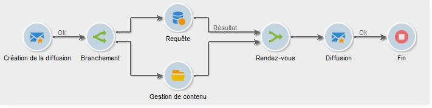

La première tâche **Création de diffusion** crée l&#39;action de diffusion.

L&#39;activité de branchement permet de lancer en parallèle le calcul de la cible et la création de l&#39;instance de contenu.

Une fois les tâches effectuées, la boite de rendez-vous active la tâche **Diffusion** pour lancer la diffusion créée précédemment sur le contenu et le ciblage.

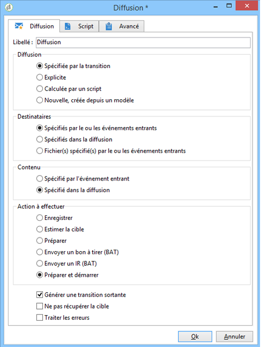

L&#39;action de diffusion à démarrer est renseignée à partir de la transition.

La cible à diffuser est renseignée à partir de l&#39;événement entrant.

Le contenu de la diffusion est renseigné à partir de l&#39;événement entrant.

L&#39;action finale de l&#39;activité est de préparer et de lancer la diffusion.

### Import du contenu depuis FTP {#importing-content-from-ftp}

Si le contenu de votre diffusion figure dans un fichier HTML qui se trouve sur un serveur FTP ou SFTP, vous pouvez facilement charger ce contenu dans les diffusions Adobe Campaign. Voir [cet exemple](../../workflow/using/loading-delivery-content.md).

### Import du contenu depuis le connecteur Amazon Simple Storage Service (S3) {#importing-content-from-amazon-simple-storage-service--s3--connector}

Si le contenu de votre diffusion figure dans un fichier HTML qui se trouve dans des compartiments Amazon Simple Storage Service (S3), vous pouvez facilement charger ce contenu dans les diffusions Adobe Campaign. Voir [cet exemple](../../workflow/using/loading-delivery-content.md).

## Mise à jour semi-automatique {#semi-automatic-update}

Les données d&#39;un contenu peuvent être mises à jour en mode &quot;semi-automatique&quot;. Les données sont récupérées à partir d&#39;un flux XML provenant d&#39;une URL.

L&#39;activation de la récupération des données est réalisée manuellement à partir du formulaire de saisie.

L’objectif est de déclarer un champ de type **editBtn** **`<input>`** dans le formulaire. Ce contrôle comprend une zone de modification et un bouton permettant de lancer le traitement.

La zone d&#39;édition permet de renseigner une donnée variable utilisée pour construire l&#39;URL du flux XML de données à récupérer.

Le bouton exécute la méthode SOAP **GetAndTransform** renseignée sous la balise **`<input>`**.

La déclaration du contrôle dans le formulaire est la suivante :

```
<input type="editbtn" xpath="<path>">
  <enter>
    <soapCall name="GetAndTransform" service="ncm:content">
      <param exprIn="<url>" type="string"/>
      <param exprIn="'xtk:xslt|<style sheet>'" type="string"/>
      <param type="DOMElement" xpathOut="<output path>"/>
    </soapCall>
  </enter>
</input>
```

La méthode **GetAndTransform** doit être déclarée sous l’élément **`<enter>`** de la balise **`<input>`**. Cette balise prend comme paramètres l’URL de récupération des données XML d’une expression construite dynamiquement. Le deuxième paramètre de la fonction est facultatif et fait référence à une feuille de style utilisée pour une transformation intermédiaire lorsque les données XML entrantes ne sont pas au même format que le contenu.

La sortie met à jour le contenu à partir du chemin renseigné dans le dernier paramètre.

**Exemple** : Pour illustrer cette fonctionnalité, nous partirons du schéma &quot;cus:livre&quot;.

On ajoute dans le formulaire de saisie un contrôle d&#39;édition de mise à jour semi-automatique :


```
<input label="File name" type="editbtn" xpath="/tmp/@name">
  <enter>
    <soapCall name="GetAndTransform" service="ncm:content">
      <param exprIn="'https://myserver.adobe.com/incoming/' + [/tmp/@name] + '.xml'" type="string"/>
      <param exprIn="'xtk:xslt|cus:book-workflow.xsl'" type="string"/>
      <param type="DOMElement" xpathOut="."/>
    </soapCall>
  </enter>
</input>
```

La zone d’édition vous permet de saisir le nom du fichier à récupérer. L’URL est construite en fonction de ce nom, par exemple : https://myserver.adobe.com/incomin/data.xml

Le format des données à récupérer est le même que dans l&#39;exemple 1 de l&#39;automatisation des workflows. Nous utiliserons la feuille de style &quot;cus:livre-workflow.xsl&quot; vue dans cet exemple.

Le résultat de l&#39;exécution du traitement met à jour l&#39;instance de contenu à partir du chemin &#39;.&#39;.
