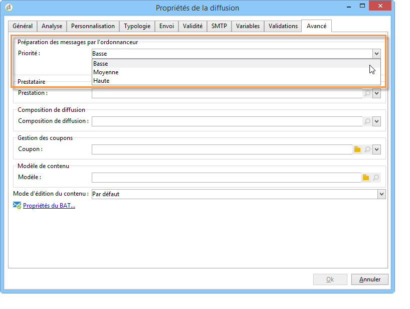
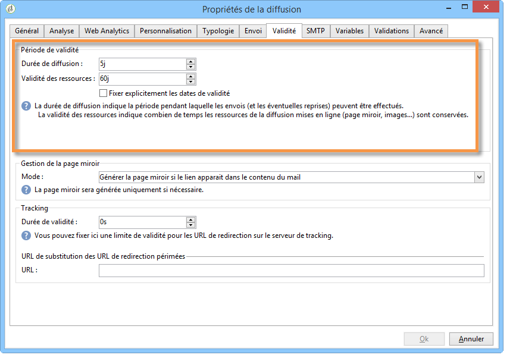

# Canaux de communication{#communication-channels}

Avec Adobe Campaign, vous pouvez réaliser des campagnes cross-canal, y compris sous forme d&#39;e-mails, SMS, notifications push et courrier, et mesurer leur efficacité à l&#39;aide de différents rapports dédiés. Ces messages sont conçus et envoyés par le biais de diffusions, et peuvent être personnalisés pour chaque destinataire.

Les principales fonctionnalités comprennent le ciblage, la définition et la personnalisation des messages, l’exécution des communications et les rapports opérationnels associés.

Dans le cadre de la transition de Campaign v7 vers v8, le jeu de documentation de Campaign Classic a été rationalisé et réorganisé. Les fonctionnalités communes sont désormais disponibles exclusivement dans le jeu de documentation de Campaign v8.

>[!BEGINTABS]

>[!TAB Documentation sur les canaux de communication]

Pour en savoir plus sur les canaux de communication, consultez la [documentation Campaign v8](https://experienceleague.adobe.com/docs/campaign/campaign-v8/send/gs-message.html?lang=fr){target=_blank}.

{target=_blank}

>[!TAB Contenu de la diffusion et audience]

Découvrez les principales étapes liées à la création d’une diffusion, à son contenu et à l’audience dans la **documentation de Campaign v8** :

* [Créer la diffusion](https://experienceleague.adobe.com/docs/campaign/campaign-v8/send/create-message.html?lang=fr#create-the-delivery){target="_blank"} : apprenez à créer une diffusion unique ponctuelle.
* [Définir le contenu](https://experienceleague.adobe.com/docs/campaign/campaign-v8/send/create-message.html?lang=fr#content-of-the-delivery){target="_blank"} : configurez le contenu de la diffusion selon les spécificités de chaque canal.
* [Spécifier l’audience](https://experienceleague.adobe.com/docs/campaign/campaign-v8/send/create-message.html?lang=fr#target-population){target="_blank"} : définissez plusieurs types d’audience : audience principale, cible BAT, adresses de contrôle et groupes de contrôle.
* [Utiliser des modèles de diffusion](https://experienceleague.adobe.com/fr/docs/campaign/campaign-v8/send/create-templates.html?lang=fr){target="_blank"} : découvrez comment définir des modèles afin de faciliter la création de diffusions.

>[!TAB Validation et envoi de la diffusion]

Consultez ces pages pour en savoir plus sur la validation, l’envoi et les bonnes pratiques liées à la diffusion dans la **documentation de Campaign v8** :

* [Valider la diffusion](https://experienceleague.adobe.com/docs/campaign/campaign-v8/send/create-message.html?lang=fr#validate-the-delivery){target="_blank"} : découvrez comment valider la diffusion avant de l’envoyer à la cible principale.
* [Envoyer la diffusion](https://experienceleague.adobe.com/docs/campaign/campaign-v8/send/create-message.html?lang=fr#configuring-and-sending-the-delivery){target="_blank"} : configurez les paramètres d’envoi et définissez les modalités de diffusion de vos messages.
* [Bonnes pratiques de diffusion](https://experienceleague.adobe.com/fr/docs/campaign/campaign-v8/send/delivery-best-practices.html?lang=fr){target="_blank"} : consultez les bonnes pratiques relatives aux fonctionnalités de diffusion dans Campaign.

>[!ENDTABS]

Les paramètres suivants sont propres à Campaign Classic. Pour les autres paramètres de diffusion, consultez la [documentation de Campaign v8](https://experienceleague.adobe.com/docs/campaign/campaign-v8/send/gs-message.html?lang=fr){target="_blank"}.

+++ **Analyse de diffusion**

**Améliorer les performances de l’analyse de diffusion**

Pour accélérer la préparation de la diffusion, vous pouvez cocher l’option **[!UICONTROL Préparer les fragments de diffusion dans la base de données]** avant de lancer l’analyse.

Lorsque cette option est activée, la préparation de la diffusion est effectuée directement dans la base de données, ce qui peut accélérer considérablement l’analyse.

Actuellement, cette option n’est disponible que si les conditions suivantes sont remplies :

* La diffusion doit être un email. Les autres canaux ne sont pas pris en charge pour l’instant.
* Vous ne devez pas utiliser de routage de mid-sourcing ou externe. Seul le type de routage de diffusion en masse est possible. Vous pouvez vérifier le routage utilisé dans l’onglet **[!UICONTROL Général]** des **[!UICONTROL Propriétés de la diffusion]**.
* Vous ne pouvez pas cibler une population provenant d’un fichier externe. Pour une diffusion unique, cliquez sur le lien **[!UICONTROL À]** dans les **[!UICONTROL Paramètres de l’e-mail]** et vérifiez que l’option **[!UICONTROL Définie depuis la base de données]** est sélectionnée. Pour une diffusion utilisée dans un workflow, vérifiez que les destinataires sont **[!UICONTROL Spécifiés par le ou les événements entrants]** dans l’onglet **[!UICONTROL Diffusion]**.
* Vous devez utiliser une base de données PostgreSQL.

**Configurer la priorité d’analyse**

Lorsque votre diffusion fait partie d&#39;une campagne, l&#39;onglet **[!UICONTROL Avancé]** propose une option supplémentaire : celle-ci vous permet d&#39;organiser l&#39;ordre de traitement des diffusions d&#39;une même campagne.

Avant envoi, chaque diffusion est analysée. La durée d&#39;analyse dépend de la taille du fichier d&#39;extraction de la diffusion. Plus sa taille est importante, plus l&#39;analyse est longue, ce qui met en attente les diffusions suivantes.

Les options de la section **[!UICONTROL Préparation des messages par l’ordonnanceur]** vous permettent de prioriser l’analyse des diffusions d’un workflow de campagne.

Si une diffusion est trop volumineuse, il est préférable de lui administrer une priorité basse afin de ne pas ralentir l’analyse des autres diffusions du workflow.

>[!NOTE]
>
>Pour vous assurer que l&#39;analyse des diffusions les plus volumineuses ne freine pas le déroulement de vos workflows, il vous est possible de différer leur exécution en cochant la case **[!UICONTROL Différer l&#39;exécution vers une plage horaire de faible activité]**.

+++

+++ **Envoi de la diffusion**

**Configurer les reprises**

Les messages temporairement non diffusés en raison d&#39;une erreur **Soft** ou **Ignoré** sont soumis à une nouvelle reprise automatique. Les types et les raisons d&#39;échec de diffusion sont présentés dans cette [section](understanding-delivery-failures.md#delivery-failure-types-and-reasons).

>[!IMPORTANT]
>
>Pour les installations hébergées ou hybrides, si vous avez effectué une mise à niveau vers le [MTA amélioré](sending-with-enhanced-mta.md), les paramètres de reprise de la diffusion ne sont plus utilisés par Campaign. Les reprises des rebonds temporaires et l’intervalle qui les sépare sont déterminés par le MTA amélioré en fonction du type et de la gravité des réponses des rebonds provenant du domaine de messagerie du message.

Pour les installations on-premise et les installations hébergées/hybrides utilisant l’ancien MTA de Campaign, la section centrale de l’onglet **[!UICONTROL Diffusion]** pour les paramètres de diffusion indique le nombre de reprises à effectuer le lendemain de la diffusion et le délai minimal entre celles-ci.

Par défaut, cinq reprises sont planifiées le premier jour de l’envoi, avec un intervalle minimum d’une heure, réparties sur les 24h de la journée. Les jours suivants, une reprise par jour est programmée jusquʼà la date limite de la diffusion, définie dans lʼonglet **[!UICONTROL Validité]**. Consultez la section ci-dessous.

**Définir la période de validité**

Une fois la diffusion lancée, les messages (et les éventuelles reprises) peuvent être envoyés jusqu&#39;à la limite de la diffusion. Elle est indiquée dans les propriétés de la diffusion, à partir de l&#39;onglet **[!UICONTROL Validité]**.

* Le champ **[!UICONTROL Durée de diffusion]** permet de saisir la limite pour des reprises globales de diffusion. Concrètement, Adobe Campaign diffuse les messages à partir de la date de début. Puis, pour les messages en erreur uniquement, des reprises régulières et paramétrables sont effectuées tant que la limite de diffusion n’est pas atteinte.

  Vous pouvez également choisir de spécifier des dates. Pour ce faire, sélectionnez **[!UICONTROL Fixer explicitement les dates de validité]**. Dans ce cas, les dates limites de diffusion et de validité permettent également de définir l’heure. L’heure actuelle est utilisée par défaut, mais vous pouvez la modifier directement dans le champ de saisie.

  >[!IMPORTANT]
  >
  >Pour les installations hébergées ou hybrides, si vous avez effectué une mise à niveau vers le [MTA amélioré](sending-with-enhanced-mta.md), le paramètre **[!UICONTROL Durée de diffusion]** des diffusions Campaign ne sera utilisé que s’il est défini sur **3,5 jours ou moins**. Si vous définissez une valeur supérieure à 3,5 jours, elle ne sera pas prise en compte.

* **Limite de validité des ressources** : le champ **[!UICONTROL Limite de validité]** est utilisé pour les ressources téléchargées, principalement pour la page miroir et les images. Les ressources de cette page ont une durée de validité limitée (afin d&#39;économiser de l&#39;espace disque).

  Dans ce champ, les valeurs peuvent être exprimées dans les unités listées dans [cette section](../../platform/using/adobe-campaign-workspace.md#default-units).

+++

<!--

   Learn how to create a one-shot single delivery. You can create other types of deliveries to build your use cases. 

For more information about the different types of deliveries and how to create them, refer to the [Campaign v8 documentation](https://experienceleague.adobe.com/docs/campaign/campaign-v8/send/create-message.html){target="_blank"}. 

>[!NOTE]
>
>Adobe Campaign offers a set of tools to monitor your deliverability and optimize email sending. Learn more in [this section](about-deliverability.md).

Delivery sending can be automated by preparing a delivery and/or sending it in the process of a workflow. For more on delivery-type activities in workflows, refer to [this section](../../workflow/using/about-action-activities.md).

Adobe Campaign offers the following delivery channels:

1. **Email channel**: email deliveries let you send personalized emails to the target population. Refer to [About email channel](about-email-channel.md).
1. **Direct mail channel**: direct mail deliveries let you generate an extraction file which contains data on the target population. Refer to [About direct mail channel](about-direct-mail-channel.md).
1. **Mobile channel**: deliveries on mobile channels let you send personalized SMS or LINE messages to the target population. Refer to [SMS channel](sms-channel.md).
1. **Mobile application channel**: mobile app deliveries let you send notifications to iOS and Android systems. Refer to the [Mobile app channel](about-mobile-app-channel.md) chapter.

   Other channels are described on [this section](#other-channels).

   >[!NOTE]
   >
   >The number of available channels depends on your contract. Please check your license agreement.

Deliveries can be carried out **online** (via email, one of the mobile channels and push notifications), and **offline** (direct mail channel).

Depending on the channel, delivery modes can be:

* Direct mass delivery via Adobe Campaign (default mode for email channel).
* External delivery via a specialist operator who is given the output file generated by the delivery assistant (default mode for direct mail channel).

External accounts are configured via the **[!UICONTROL Administration > Platform > External accounts]** node. This configuration should be performed by expert users only.

## Email deliveries {#email-deliveries}

The [Email channel](about-email-channel.md) is one of the core channels in Adobe Campaign, allowing you to schedule and send personalized emails to specific targets.

You can send different types of emails:

* Single-send emails: emails that you can send once to a defined target. They are usually used to promote a specific content that would be prepared and sent only once (newsletter, promotional email, etc.).
* Recurring emails: in a campaign, send the same email regularly and aggregate each send and its reports on a periodic basis. The same email is sent, but usually to a different target, based on the eligible target for the day of the send. A common example is a birthday email. For more on this, refer to [Recurring deliveries](../../workflow/using/recurring-delivery.md).
* Transactional emails: unitary emails that are triggered based on your customers' behavior. Refer to [Transactional messaging](../../message-center/using/about-transactional-messaging.md).

To learn about delivery usage and recommendations, consult Campaign [Delivery best practices](delivery-best-practices.md).

For more on the different types of deliveries, refer to [this section](#types-of-deliveries).

## Mobile deliveries {#mobile-deliveries}

Adobe Campaign allows you to deliver [SMS](sms-channel.md) and [LINE](line-channel.md) messages on mobiles.

For SMS messages, you can create, modify, and personalize messages in text format only. You can also preview your SMS messages before they are sent.

For LINE messages, you can send text or images and links.

To deliver SMS or LINE messages to a mobile phone you need:

* An external account configured on the **[!UICONTROL Mobile (SMS)]** channel or on the **[!UICONTROL LINE]** channel. 
* An SMS or LINE delivery template that is correctly linked to this external account.

## Push notifications {#push-notifications}

Adobe Campaign allows you to send personalized and segmented [push notifications](about-mobile-app-channel.md) on iOS and Android mobile devices, through dedicated apps. Once configuration and integration steps have been performed, iOS and Android deliveries can be created and sent. You can also design rich notifications with images or videos.

## Direct mail {#direct-mail}

[Direct mail](about-direct-mail-channel.md) is an offline channel that allows you to personalize and generate the file required by direct mail providers. It gives you the possibility to mix online and offline channels in your customer journeys.

Online channels allow you to create your messages (email, SMS, mobile app delivery, etc.) and send them to your audience directly from Adobe Campaign. With offline channels, it is different. When you prepare a direct mail delivery, Adobe Campaign generates a file including all the targeted profiles and the chosen contact information (postal address for example). You will then be able to send this file to your direct mail provider who will take care of the actual sending.

## Other channels {#other-channels}

Adobe Campaign offers Telephone delivery template, which is used to create external deliveries. Using this channel implies you set up dedicated methodologies to process output files. Configuration steps are the same as for [Direct mail channel](about-direct-mail-channel.md).

>[!NOTE]
>
>The Telephone channel is not available out-of-the-box. Its implementation requires Adobe Consulting or an Adobe Partner to be engaged. Please reach out to your Adobe representative for more information.

In addition, 'Other' type deliveries use a specific technical template which does not execute a process: this lets them manage marketing actions executed outside of the Adobe Campaign platform.

This channel has no specific mechanism. It is a generic channel that has its own external account routing option, delivery template type and campaign workflow activity, just like any other communication channel available in Adobe Campaign.

This channel is designed for descriptive purposes only, for example to define deliveries for which you want to keep a trace of the target of a campaign performed in a tool other than Adobe Campaign.

## Types of deliveries{#types-of-deliveries}

There are three types of delivery objects in Campaign:

### Single delivery {#single-delivery}

A **delivery** is a standalone delivery object that is executed once. It can be duplicated, prepared again, but as long as it is in its final state (canceled, stopped, finished), it cannot be reused.

Deliveries can be created either from the list of deliveries, or within a workflow via a [Delivery](../../workflow/using/delivery.md) activity.

Workflows also provide specific delivery activities according to the type of channel you want to use. For more on these activities, refer to [this section](../../workflow/using/cross-channel-deliveries.md).

### Recurring delivery {#recurring-delivery}

A **recurring delivery** lets you create a new delivery each time the activity is executed. This avoids you having to create a new delivery for recurring tasks.

As an example, if you run this type of activity once a month, you will end up with 12 deliveries after a year.

Recurring deliveries are created within workflows via the [Recurring delivery activity](../../workflow/using/recurring-delivery.md). An example of this activity being used is presented in this section: [Creating a recurring delivery in a targeting workflow](../../workflow/using/sending-a-birthday-email.md#creating-a-recurring-delivery-in-a-targeting-workflow).

### Continuous delivery {#continuous-delivery}

A **continuous delivery** lets you add new recipients to an existing delivery, which avoids having to create a new delivery each time it is executed.

If an information in the delivery changes (content, name, etc.), a new delivery object is created at the delivery execution. If no information was changed, the same delivery object is reused and the delivery and tracking logs are added in the same object.

As an example, if you run this type of activity once a month, you will end up with a single delivery after a year (provided you did not make any change to the delivery).

Continuous deliveries are created within workflows via the [Continuous delivery activity](../../workflow/using/continuous-delivery.md).-->
