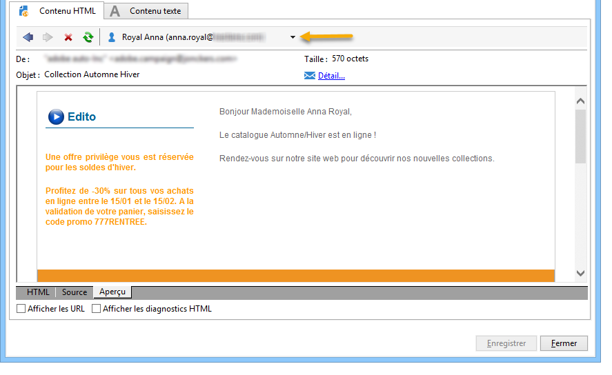

# Contenu conditionnel{#conditional-content}


En configurant des champs de contenu conditionnel, vous pouvez créer une personnalisation dynamique basée sur le profil du destinataire, par exemple. Les blocs de texte et/ou les images sont remplacés lorsqu&#39;une condition particulière est remplie.

 [Découvrez cette fonctionnalité en vidéo](#conditionnal-content-video)


## Utilisation de conditions dans un e-mail {#using-conditions-in-an-email}

Dans l&#39;exemple ci-dessous, vous allez découvrir comment créer de manière dynamique un message personnalisé selon le genre et les centres d&#39;intérêt du destinataire.

* Affichage de &quot;Monsieur&quot; ou &quot;Madame&quot; selon que la valeur du champ **[!UICONTROL Genre]** de la source de données vaut respectivement M ou F,
* Assemblage personnalisé d&#39;une newsletter ou d&#39;offres promotionnelles en fonction des centres d&#39;intérêt renseignés ou détectés :

   * Centre d&#39;intérêt 1 -- > Bloc 1
   * Centre d&#39;intérêt 2 -- > Bloc 2
   * Centre d&#39;intérêt 3 -- > Bloc 3
   * Centre d&#39;intérêt 4 -- > Bloc 4

Pour créer un contenu conditionnel en fonction de la valeur d&#39;un champ, respectez les étapes suivantes :

1. Cliquez sur l&#39;icône de personnalisation et choisissez **[!UICONTROL Contenu conditionnel > Si]**.

   

   Les éléments de personnalisation sont insérés dans le corps du message : vous devez maintenant les paramétrer.

1. Renseignez ensuite les paramètres de l&#39;expression **if**.

   Pour cela :

   * Sélectionnez le premier élément de l’expression **`<field>`** (par défaut, cet élément est en surbrillance lors de l’insertion de l’expression **if**) et cliquez sur l’icône de personnalisation pour le remplacer par le champ sur lequel porte le test.

     

   * Remplacez **`<value>`** par la valeur du champ pour lequel la condition sera remplie. Cette valeur doit être entre guillemets.
   * Spécifiez ensuite le contenu à insérer lorsque la condition est vérifiée. Ce contenu peut être du texte, une image, un formulaire, un lien hypertexte, etc.

     

1. Cliquez sur l&#39;onglet **[!UICONTROL Aperçu]** pour visualiser le contenu du message en fonction du destinataire de la diffusion :

   * Sélection d&#39;un destinataire pour lequel la condition est vérifiée :

     

   * Sélection d&#39;un destinataire pour lequel la condition n&#39;est pas vérifiée :

     

Vous pouvez ajouter d&#39;autres cas et définir un contenu différent en fonction des valeurs d&#39;un ou plusieurs champs. Utilisez pour cela les options **[!UICONTROL Contenu conditionnel > Sinon]** et **[!UICONTROL Contenu conditionnel > Sinon si]**. Le paramétrage de ces expressions est le même que pour l&#39;expression **if**.


>[!CAUTION]
>
>Pour respecter la syntaxe du JavaScript, les caractères **%> &lt;%** doivent être supprimés après l&#39;ajout de conditions de type **Sinon** et **Sinon si**.

Cliquez sur l&#39;onglet **[!UICONTROL Aperçu]** et sélectionnez un destinataire pour visualiser le contenu conditionnel.


## Création dʼun e-mail multilingue {#creating-multilingual-email}

Dans l’exemple ci-dessous, vous allez découvrir comment créer un email multilingue. Le contenu s’affiche dans une langue ou une autre, selon la préférence linguistique du destinataire.

1. Créez un email et sélectionnez la population cible. Dans cet exemple, la condition d&#39;affichage d&#39;une version ou d&#39;une autre sera basée sur la valeur **Langue** du profil du destinataire. Dans cet exemple, ces valeurs sont définies sur **EN**, **FR**, **ES**.
1. Dans le contenu HTML de l&#39;email, cliquez sur l&#39;onglet **[!UICONTROL Source]** et collez le code suivant :

   ```
   <% if (language == "EN" ) { %>
   <DIV id=en-version>Hello <%= recipient.firstName %>,</DIV>
   <DIV>Discover your new offers!</DIV>
   <DIV><a href="https://www.adobe.com/products/en">www.adobe.com/products/en</A></FONT></DIV><%
    } %>
   <% if (language == "FR" ) { %>
   <DIV id=fr-version>Bonjour <%= recipient.firstName %>,</DIV>
   <DIV>Découvrez nos nouvelles offres !</DIV>
   <DIV><a href="https://www.adobe.com/products/fr">www.adobe.com/products/fr</A></DIV><%
    } %>
    <% if (language == "ES" ) { %>
   <DIV id=es-version><FONT face=Arial>
   <DIV>Olà <%= recipient.firstName %>,</DIV>
   <DIV>Descubra nuestros nuevas ofertas !</DIV>
   <DIV><a href="https://www.adobe.com/products/es">www.adobe.com/products/es</A></DIV>
   <% } %>
   ```

1. Testez le contenu de l&#39;email dans l&#39;onglet **[!UICONTROL Aperçu]** en sélectionnant des destinataires avec des préférences linguistiques différentes.

   >[!NOTE]
   >
   >Comme aucune autre version n&#39;a été définie dans le contenu de l&#39;email, veillez à filtrer la population cible avant d&#39;envoyer l&#39;email.

## Tutoriel vidéo {#conditionnal-content-video}

Découvrez comment ajouter du contenu conditionnel à une diffusion en prenant pour exemple une newsletter multilingue.

>[!VIDEO](https://video.tv.adobe.com/v/24926?quality=12)

D’autres vidéos pratiques sur Campaign Classic sont disponibles [ici](https://experienceleague.adobe.com/docs/campaign-classic-learn/tutorials/overview.html?lang=fr).
