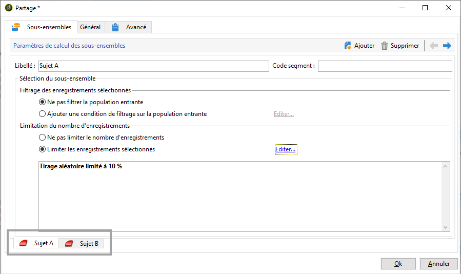

# Configurer les tests AB {#configuring-a-b-testing}

Cette section décrit comment créer un workflow pour effectuer des tests A/B.

1. Créez un workflow, puis configurez une activité Requête pour cibler la population souhaitée. Consultez la [documentation de Campaign v8](https://experienceleague.adobe.com/fr/docs/campaign/automation/workflows/wf-activities/targeting-activities/query.html?lang=fr){target="_blank"}.

1. Ajoutez une activité Partage pour diviser la population ciblée en plusieurs sous-ensembles. Consultez la [documentation de Campaign v8](https://experienceleague.adobe.com/docs/campaign/automation/workflows/wf-activities/targeting-activities/split.html?lang=fr){target="_blank"}.

1. Ouvrez l&#39;activité, puis configurez chaque sous-ensemble en fonction de vos besoins. Pour plus d&#39;informations sur le paramétrage d&#39;une activité **[!UICONTROL Partage]**, consultez [cette section](../../workflow/using/split.md).

   Dans cet exemple, nous voulons tester deux nouveaux objets pour une newsletter en les présentant à 10 % de la population ciblée.

   

1. Ajoutez une transition afin d’envoyer au reste de la population la newsletter avec l’objet actuel. Pour ce faire, activez l&#39;option **[!UICONTROL Générer le complémentaire]** à partir de l&#39;onglet **[!UICONTROL Général]**.

   

1. Pour chaque sous-ensemble, ajoutez la version de la diffusion à tester.

   

Vous pouvez maintenant démarrer le workflow. Une fois les diffusions envoyées, vous pourrez suivre le comportement des trois sous-ensembles dans les logs de diffusion, afin de déterminer quel objet a rencontré le plus de succès.

Les workflows vous permettent également d&#39;automatiser vos processus en identifiant automatiquement la variante de diffusion qui a obtenu de meilleurs résultats, puis en l&#39;envoyant à la population restante. Voir à ce propos le [cas pratique](a-b-testing-use-case.md) dédié.
