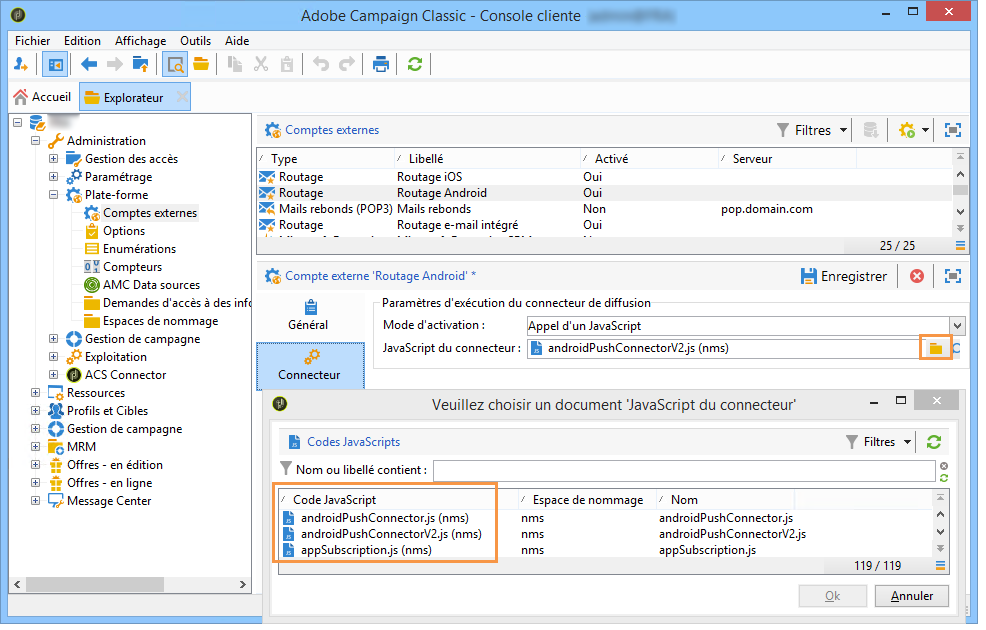
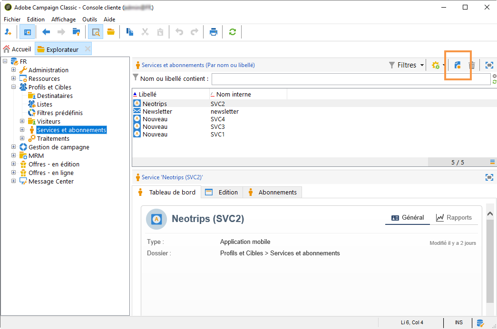
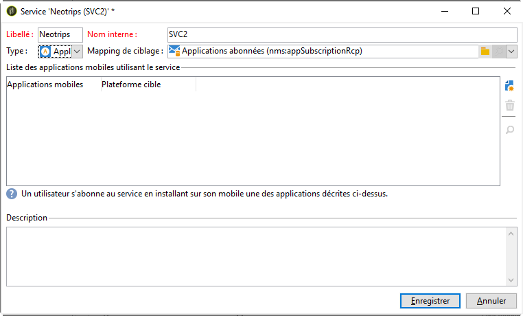
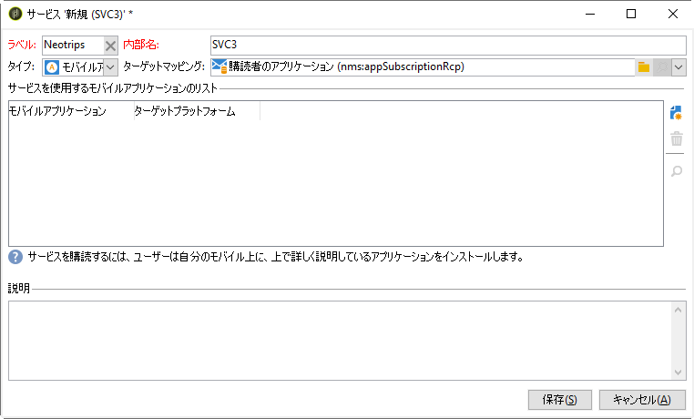
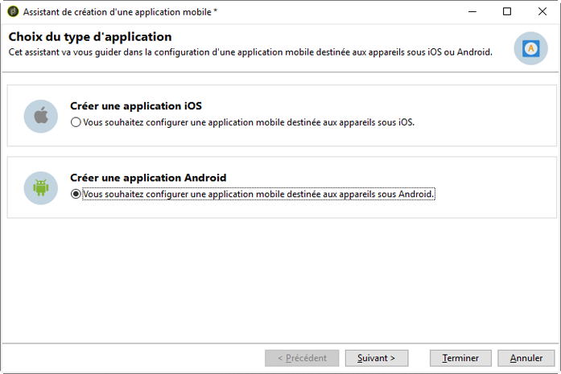
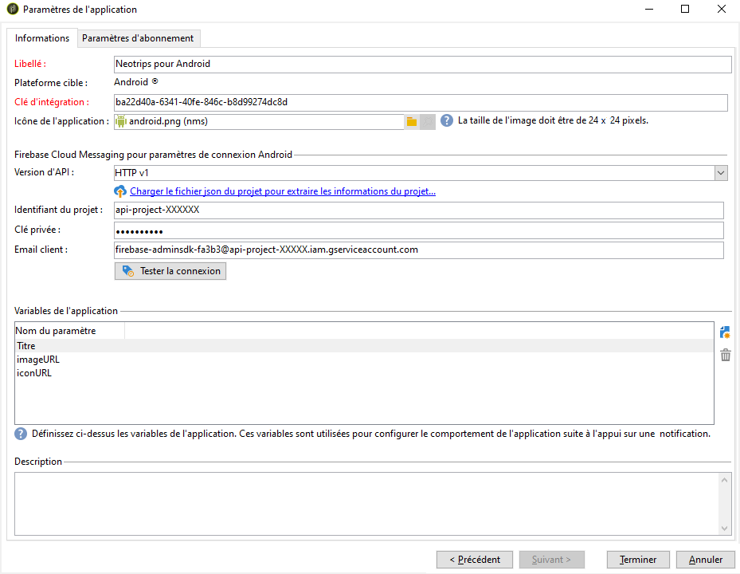
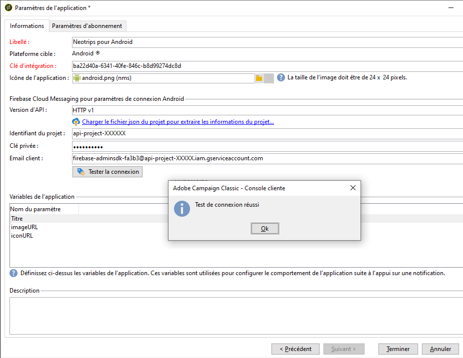
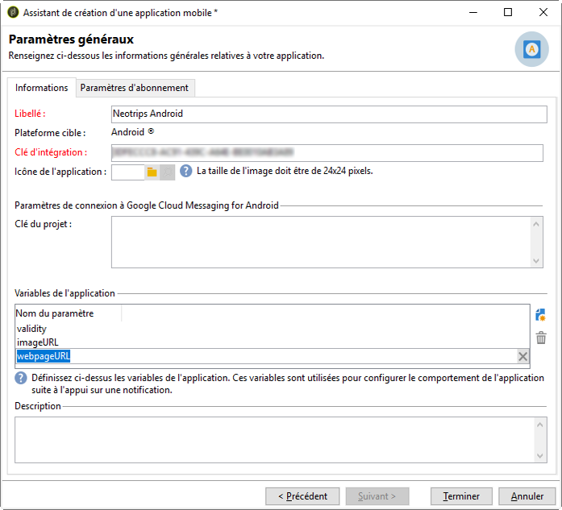

# Étapes de configuration pour Android

Une fois le package installé, vous pouvez définir les paramètres de votre application Android dans Adobe Campaign Classic.

>[!NOTE]
>
>Pour savoir comment configurer votre application pour iOS et comment créer une diffusion pour iOS, reportez-vous à cette [section](configuring-the-mobile-application.md).

Les étapes clés sont les suivantes :

1. [Configuration du compte externe Android](#configuring-external-account-android)
1. [Configuration du service Android](#configuring-android-service)
1. [Création de l’application mobile dans Campaign](#creating-android-app)
1. [Étendre le schéma de l’application avec des données supplémentaires](#extend-subscription-schema)

Vous pourrez alors [créer une notification Android enrichie](create-notifications-android.md).

## Configuration du compte externe Android {#configuring-external-account-android}

Deux connecteurs sont disponibles pour Android :

* Le connecteur V1 permet une connexion par MTA enfant.
* Le connecteur V2 permet plusieurs connexions simultanées avec le serveur FCM pour améliorer le débit.

Pour sélectionner le connecteur à utiliser, procédez comme suit :

1. Accédez à **[!UICONTROL Administration > Plateforme > Comptes externes]**.
1. Sélectionnez le compte externe de **[!UICONTROL routage Android]**.
1. Dans l&#39;onglet **[!UICONTROL Connecteur]**, renseignez le champ **[!UICONTROL JavaScript du connecteur]** :

   Pour Android V2 : https://localhost:8080/nms/jsp/androidPushConnectorV2.js

   >[!NOTE]
   >
   > Vous pouvez également le configurer comme suit (https://localhost:8080/nms/jsp/androidPushConnector.js), mais nous vous conseillons d&#39;utiliser la version 2 du connecteur.

   

1. Pour Android V2, un paramètre supplémentaire est disponible dans le fichier de configuration du serveur Adobe (serverConf.xml) :

   * **maxGCMConnectPerChild** : limite maximale du nombre de requêtes HTTP parallèles sur le serveur FCM initiées par chaque serveur enfant (8 par défaut).

## Configuration d&#39;un service Android {#configuring-android-service}

 [Découvrez comment configurer un service Android en vidéo](https://experienceleague.adobe.com/docs/campaign-classic-learn/getting-started-with-push-notifications-for-android/configuring-an-android-service-in-campaign.html?lang=fr#configuring-an-android-service-and-creating-an-android-mobile-application-in-campaign)

1. Dans l&#39;arborescence, positionnez-vous sur le nœud **[!UICONTROL Profils et Cibles > Services et abonnements]** et cliquez sur le bouton **[!UICONTROL Nouveau]**.

   

1. Définissez un **[!UICONTROL Libellé]** et un **[!UICONTROL Nom interne]**.
1. Dans le champ **[!UICONTROL Type]**, choisissez **[!UICONTROL Application mobile]**.

   >[!NOTE]
   >
   >Le mapping de ciblage par défaut **[!UICONTROL Applications abonnées (nms:appSubscriptionRcp)]** est lié à la table des destinataires. Si vous souhaitez utiliser un autre mapping de ciblage, vous devez créer un nouveau mapping de ciblage et le renseigner dans le champ **[!UICONTROL Mapping de ciblage]** du service. Pour plus d&#39;informations sur la création d&#39;un mapping de ciblage, reportez-vous à [cette section](../../configuration/using/about-custom-recipient-table.md).

   

1. Cliquez ensuite sur le bouton **[!UICONTROL Ajouter]** pour sélectionner le type d&#39;application.

   

1. Créez votre application Android. Pour plus d’informations, consultez [cette section](configuring-the-mobile-application-android.md#creating-android-app).

## Création de l&#39;application mobile Android {#creating-android-app}

Après avoir créé votre service, vous devez maintenant créer votre application Android :

1. Dans le service que vous venez de créer, cliquez sur le bouton **[!UICONTROL Ajouter]** pour choisir le type d&#39;application.

   

1. Sélectionnez **[!UICONTROL Créer une application Android]** et saisissez un **[!UICONTROL libellé]**.

   

1. Assurez-vous que la même **[!UICONTROL clé d&#39;intégration]** est définie dans Adobe Campaign et dans le code de l&#39;application via le SDK. Pour plus d’informations, consultez [cette section](integrating-campaign-sdk-into-the-mobile-application.md).

   >[!NOTE]
   >
   > La **[!UICONTROL clé d&#39;intégration]** est entièrement personnalisable avec une valeur de chaîne, mais doit être exactement identique à celle spécifiée dans le SDK.

1. Sélectionnez la **[!UICONTROL version de l’API]** : HTTP v1 ou HTTP (hérité). Ces fonctions sont présentées en détails dans [cette section](#select-api-version)

1. Renseignez les champs **[!UICONTROL Firebase Cloud Messaging pour paramètres de connexion Android]** 

1. Cliquez sur **[!UICONTROL Terminer]**, puis sur **[!UICONTROL Enregistrer]**. Votre application Android est maintenant prête à être utilisée dans Campaign Classic.

Par défaut, Adobe Campaign enregistre une clé dans le champ **[!UICONTROL Identifiant de l&#39;utilisateur]** (@userKey) de la table **[!UICONTROL Applications abonnées (nms:appSubscriptionRcp)]**. Cette clé permet de relier un abonnement à un destinataire. Si vous souhaitez collecter des données additionnelles (par exemple une clé de réconciliation complexe), vous devez effectuer le paramétrage suivant :

### Sélectionner la version d&#39;API{#select-api-version}

Après avoir créé un service et une nouvelle application mobile, vous devez configurer votre application mobile en fonction de la version d&#39;API choisie.

* La configuration **HTTP v1** est détaillée dans [cette section](configuring-the-mobile-application-android.md#android-service-httpv1).
* La configuration **HTTP (héritée)** est détaillée dans [cette section](configuring-the-mobile-application-android.md#android-service-http).

#### Configuration de l’API HTTP v1{#android-service-httpv1}

Pour configurer la version d&#39;API HTTP v1, procédez comme suit :

1. Dans la fenêtre de l&#39;**[!UICONTROL assistant de création d&#39;une application mobile]**, sélectionnez **[!UICONTROL HTTPV1]** dans la liste déroulante **[!UICONTROL Versions d&#39;API]**.

1. Cliquez sur **[!UICONTROL Charger le fichier json du projet pour extraire les détails du projet...]** pour charger directement votre fichier de clé JSON. Pour plus d&#39;informations sur l&#39;extraction de votre fichier JSON, consultez [cette page](https://firebase.google.com/docs/admin/setup#initialize-sdk).

   Vous pouvez également saisir manuellement les informations suivantes :
   * **[!UICONTROL Identifiant du projet]**
   * **[!UICONTROL Clé privée]**
   * **[!UICONTROL Email client]**

   

1. Cliquez sur **[!UICONTROL Tester la connexion]** pour vérifier que votre configuration est correcte et que le serveur marketing a accès au FCM.

   >[!CAUTION]
   >
   >Dans le cas de déploiement Mid-sourcing, le bouton **[!UICONTROL Tester la connexion]** ne vérifie pas si le serveur MID a accès au serveur FCM.

   

1. Vous pouvez, si nécessaire, enrichir un contenu de message push avec certaines **[!UICONTROL variables d&#39;application]**. Elles sont entièrement personnalisables et font partie de la payload du message envoyé à l&#39;appareil mobile.

1. Cliquez sur **[!UICONTROL Terminer]**, puis sur **[!UICONTROL Enregistrer]**. Votre application Android est maintenant prête à être utilisée dans Campaign Classic.

Vous trouverez ci-dessous les noms de payload FCM pour personnaliser davantage votre notification push :

| Type de message | Élément de message configurable (nom de payload FCM) | Options configurables (nom de payload FCM) |
|:-:|:-:|:-:|
| Message de données | N/A | validate_only |
| Message de notification | title, body, android_channel_id, icon, sound, tag, color, click_action, image, ticker, sticky, visibility, notification_priority, notification_count   | validate_only |

 
 

#### Configuration de l’API HTTP (héritée){#android-service-http}

Pour configurer la version d&#39;API HTTP (hérité), procédez comme suit :

1. Dans la fenêtre de l&#39;**[!UICONTROL assistant de création d&#39;une application mobile]**, sélectionnez **[!UICONTROL HTTP (hérité)]** dans la liste déroulante **[!UICONTROL Versions d&#39;API]**.

1. Saisissez la **[!UICONTROL clé du projet]** fournie par le développeur de l&#39;application mobile.

1. Vous pouvez, si nécessaire, enrichir un contenu de message push avec certaines **[!UICONTROL variables d&#39;application]**. Elles sont entièrement personnalisables et font partie de la payload du message envoyé à l&#39;appareil mobile.

   Dans l&#39;exemple suivant, nous ajoutons **title**, **imageURL** et **iconURL** pour créer une notification push enrichie, puis nous fournissons à l&#39;application l&#39;image, le titre et l&#39;icône à afficher dans la notification.

   

1. Cliquez sur **[!UICONTROL Terminer]**, puis sur **[!UICONTROL Enregistrer]**. Votre application Android est maintenant prête à être utilisée dans Campaign Classic.

Vous trouverez ci-dessous les noms de payload FCM pour personnaliser davantage votre notification push :

| Type de message | Élément de message configurable (nom de payload FCM) | Options configurables (nom de payload FCM) |
|:-:|:-:|:-:|
| Message de données | N/A | dryRun |
| Message de notification | title, body, android_channel_id, icon, sound, tag, color, click_action   | dryRun |

 

## Étendre le schéma appsubscriptionRcp {#extend-subscription-schema}

 [Découvrez comment étendre le schéma appsubscriptionRcp en vidéo](https://experienceleague.adobe.com/docs/campaign-classic-learn/getting-started-with-push-notifications-for-android/extending-the-app-subscription-schema.html?lang=fr#extending-the-app-subscription-schema-to-personalize-push-notifications)

Vous devez étendre la valeur **appsubscriptionRcp** pour définir de nouveaux champs supplémentaires afin de stocker les paramètres de l’application dans la base de données Campaign. Ces champs seront utilisés pour la personnalisation, par exemple. Pour cela :

1. Créez une extension du schéma **[!UICONTROL Applications abonnées (nms:appSubscriptionRcp)]** et définissez les nouveaux champs. En savoir plus sur l’extension de schéma dans [cette page](../../configuration/using/about-schema-edition.md)

1. Définissez le mapping dans l&#39;onglet **[!UICONTROL Paramètres d&#39;abonnement]**.

   >[!CAUTION]
   >
   >Assurez-vous que les noms des paramètres dans l&#39;onglet **[!UICONTROL Paramètres d&#39;abonnement]** sont les mêmes que dans le code de l&#39;application mobile. Consultez [cette section](integrating-campaign-sdk-into-the-mobile-application.md).
