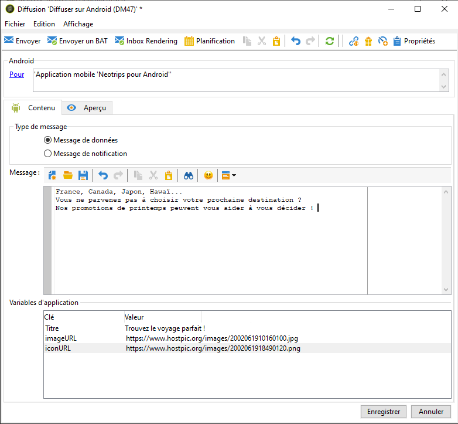
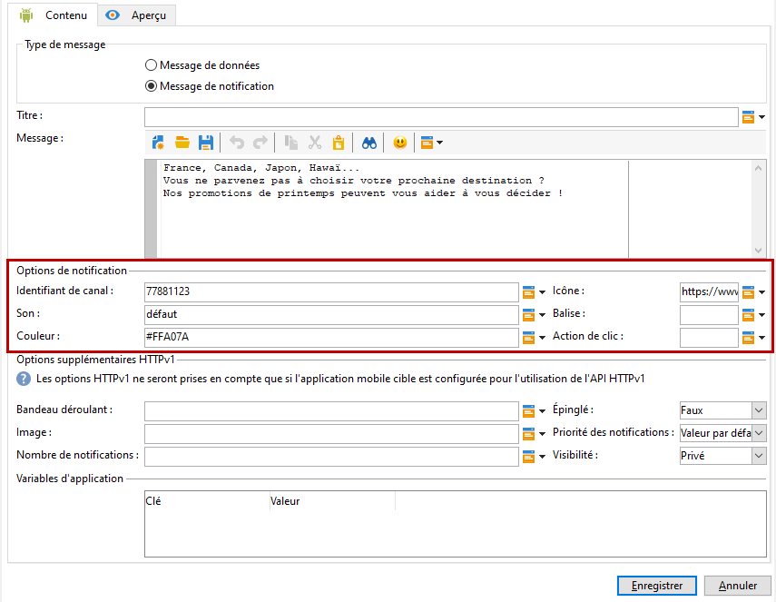

# Procédure de configuration pour Android

Une fois le pack installé, vous pouvez définir les paramètres de votre application Android dans Adobe Campaign Classic.

>[!NOTE]
>
>Pour savoir comment configurer votre application pour iOS et comment créer une diffusion pour iOS, reportez-vous à cette [section](../../delivery/using/configuring-the-mobile-application.md).

## Configuring Android external account {#configuring-external-account-android}

Deux connecteurs sont disponibles pour Android :

* Le connecteur V1 permet une connexion par MTA child.
* Le connecteur V2 permet plusieurs connexions simultanées avec le serveur FCM pour améliorer le débit.

Pour sélectionner le connecteur à utiliser, procédez comme suit :

1. Accédez à **[!UICONTROL Administration > Plate-forme > Comptes externes]**.
1. Sélectionnez le compte externe de **[!UICONTROL routage Android]**.
1. Dans l&#39;onglet **[!UICONTROL Connecteur]**, renseignez le champ **[!UICONTROL JavaScript du connecteur]** :

   Pour Android V2 : https://localhost:8080/nms/jsp/androidPushConnectorV2.js

   >[!NOTE]
   >
   > Vous pouvez également le configurer comme suit (https://localhost:8080/nms/jsp/androidPushConnector.js), mais nous vous conseillons d’utiliser la version 2 du connecteur.

   

1. Pour Android V2, un paramètre supplémentaire est disponible dans le fichier de configuration du serveur Adobe (serverConf.xml) :

   * **maxGCMConnectPerChild** : limite maximale du nombre de requêtes HTTP parallèles sur le serveur FCM initiées par chaque serveur fils (8 par défaut).

## Configuration du service Android {#configuring-android-service}

1. Dans l&#39;arborescence, positionnez-vous sur le noeud **[!UICONTROL Profils et Cibles > Services et abonnements]** et cliquez sur le bouton **[!UICONTROL Nouveau]**.

   

1. Définissez un **[!UICONTROL Libellé]** et un **[!UICONTROL Nom interne]**.
1. Dans le champ **[!UICONTROL Type]**, choisissez **[!UICONTROL Application mobile]**.

   >[!NOTE]
   >
   >Le mapping de ciblage par défaut **[!UICONTROL Applications abonnées (nms:appSubscriptionRcp)]** est lié à la table des destinataires. Si vous souhaitez utiliser un autre mapping de ciblage, vous devez créer un nouveau mapping de ciblage et le renseigner dans le champ **[!UICONTROL Mapping de ciblage]** du service. La création d&#39;un mapping de ciblage est présentée dans le [Guide de configuration](../../configuration/using/about-custom-recipient-table.md).

   

1. Cliquez ensuite sur le bouton **[!UICONTROL Ajouter]** pour sélectionner le type d’application.

   

1. Créez votre application Android. Pour plus d’informations à ce sujet, consultez cette [section](../../delivery/using/configuring-the-mobile-application-android.md#creating-android-app).

## Création d’applications mobiles Android {#creating-android-app}

Après avoir créé votre service, vous devez maintenant créer votre application Android :

1. Dans le service que vous venez de créer, cliquez sur le bouton **[!UICONTROL Ajouter]** pour sélectionner le type d’application.

   

1. Sélectionnez **[!UICONTROL Créer une application]** Android et saisissez une **[!UICONTROL étiquette]**.

   

1. Assurez-vous que la même **[!UICONTROL clé d’intégration]** est définie dans Adobe Campaign et dans le code de l’application via le SDK. Voir à ce sujet la section : [Intégrer le SDK Campaign dans l’application mobile](../../delivery/using/integrating-campaign-sdk-into-the-mobile-application.md).

   >[!NOTE]
   >
   > La **[!UICONTROL clé d’intégration]** est entièrement personnalisable avec une valeur de chaîne, mais doit être exactement identique à celle spécifiée dans le SDK.

1. Sélectionnez l’une des versions **[!UICONTROL de l’]** API :
   * HTTP. For more information refer to this [section](../../delivery/using/configuring-the-mobile-application-android.md#android-service-http).
   * HTTPV1. For more information refer to this [section](../../delivery/using/configuring-the-mobile-application-android.md#android-service-httpv1).

1. Renseignez les paramètres de messagerie **[!UICONTROL Firebase Cloud pour les champs de connexion]** Android.

1. Cliquez sur **[!UICONTROL Terminer]**, puis sur **[!UICONTROL Enregistrer]**. Votre application Android est maintenant prête à être utilisée dans Campaign Classic.

Par défaut, Adobe Campaign enregistre une clé dans le champ **[!UICONTROL Identifiant de l&#39;utilisateur]** (@userKey) de la table **[!UICONTROL Applications abonnées (nms:appSubscriptionRcp)]**. Cette clé permet de relier un abonnement à un destinataire. Si vous souhaitez collecter des données additionnelles (par exemple une clé de réconciliation complexe), vous devez effectuer le paramétrage suivant :

1. Créez une extension du schéma **[!UICONTROL Applications abonnées (nms:appSubscriptionRcp)]** et définissez les nouveaux champs.

1. Définissez le mapping dans l&#39;onglet **[!UICONTROL Paramètres d&#39;abonnement]**.

   >[!CAUTION]
   >
   >Assurez-vous que les noms des paramètres dans l&#39;onglet **[!UICONTROL Paramètres d’abonnement]** sont les mêmes que dans le code de l’application mobile. Voir [Intégrer le SDK Campaign dans l’application mobile](../../delivery/using/integrating-campaign-sdk-into-the-mobile-application.md).

### Sélectionner la version de l’API{#select-api-version}

Après avoir créé un service et une nouvelle application mobile, vous devez configurer votre application mobile en fonction de la version d’API choisie.

Pour plus d’informations sur les créations de services et d’applications mobiles, voir cette [section](../../delivery/using/configuring-the-mobile-application-android.md#configuring-android-service)

#### Utiliser la version de l’API HTTP v1{#android-service-httpv1}

Pour configurer la version de l’API HTTP v1, procédez comme suit :

1. Dans la fenêtre de l’assistant **[!UICONTROL de création d’applications]** mobiles, sélectionnez **[!UICONTROL HTTPV1]** dans la liste déroulante des versions **[!UICONTROL de l’]** API.

1. Cliquez sur **[!UICONTROL Charger le fichier json du projet pour extraire les détails du projet...]** pour charger directement votre fichier de clé JSON. For more information on how to extract your JSON file, refer to this [page](https://firebase.google.com/docs/admin/setup#initialize-sdk).

1. Vous pouvez également saisir manuellement les informations suivantes :
   * **[!UICONTROL Identifiant du projet]**
   * **[!UICONTROL Clé privée]**
   * **[!UICONTROL Email client]**

   

1. Cliquez sur **[!UICONTROL Tester la connexion]** pour vérifier que votre configuration est correcte et que le serveur marketing a accès à FCM.

   >[!CAUTION]
   >
   >Dans le cas du déploiement de Midsourcing, le bouton de connexion **** Test ne vérifie pas si le serveur MID a accès au serveur FCM.

   

1. Vous pouvez, si nécessaire, enrichir un contenu de message push avec certaines **[!UICONTROL variables d’application]**. Elles sont entièrement personnalisables et font partie de la payload du message envoyé à l’appareil mobile.

1. Cliquez sur **[!UICONTROL Terminer]**, puis sur **[!UICONTROL Enregistrer]**. Votre application Android est maintenant prête à être utilisée dans Campaign Classic.

Vous trouverez ci-dessous les noms de charge utile FCM pour personnaliser davantage votre notification Push :

| Type de message | Élément de message configurable (nom de charge utile FCM) | Options configurables (nom de charge utile FCM) |
|:-:|:-:|:-:|
| Message de données | N/A | validate_only |
| Message de notification | titre, corps, android_canal_id, icône, son, balise, couleur, click_action, image, autocollant, visibilité, notification_priority, notification_count   | validate_only |

 
 

#### Version de l’API HTTP{#android-service-http}

Pour configurer la version de l’API HTTP (héritée), procédez comme suit :

1. Dans la fenêtre de l’assistant **[!UICONTROL de création d’applications]** mobiles, sélectionnez **[!UICONTROL HTTP (hérité)]** dans la liste déroulante des versions **[!UICONTROL de l’]** API.

1. Saisissez la clé **** Project fournie par le développeur de l&#39;application mobile.

1. Vous pouvez, si nécessaire, enrichir un contenu de message push avec certaines **[!UICONTROL variables d’application]**. Elles sont entièrement personnalisables et font partie de la payload du message envoyé à l’appareil mobile.

   Dans l’exemple suivant, nous ajoutons **title**, **imageURL** et **iconURL** pour créer une notification push enrichie, puis nous fournissons à l’application l’image, le titre et l’icône à afficher dans la notification.

   

1. Cliquez sur **[!UICONTROL Terminer]**, puis sur **[!UICONTROL Enregistrer]**. Votre application Android est maintenant prête à être utilisée dans Campaign Classic.

Vous trouverez ci-dessous les noms de charge utile FCM pour personnaliser davantage votre notification Push :

| Type de message | Élément de message configurable (nom de charge utile FCM) | Options configurables (nom de charge utile FCM) |
|:-:|:-:|:-:|
| Message de données | N/A | dryRun |
| Message de notification | titre, corps, android_canal_id, icône, son, balise, couleur, click_action   | dryRun |

 

## Creating an Android rich notification {#creating-android-delivery}

Firebase Cloud Messaging vous permet de choisir entre deux types de messages :

* **[!UICONTROL Message]**de données, géré par l’application cliente.
    Les messages sont envoyés directement à l’application mobile qui génère et affiche la notification android sur le périphérique. Les messages de données contiennent uniquement les variables d’application personnalisées.

* **[!UICONTROL Message]**de notification, géré automatiquement par le SDK FCM.
     FCM affiche automatiquement le message sur les périphériques de vos utilisateurs pour le compte de l’application cliente. Les messages de notification contiennent un ensemble prédéfini de paramètres et d’options, mais peuvent encore être personnalisés avec des variables d’application personnalisées.

Pour plus d’informations sur les types de messages de messagerie Firebase Cloud, consultez la documentation [de](https://firebase.google.com/docs/cloud-messaging/concept-options#notifications_and_data_messages)FCM.

### Création d’un message de données {#creating-data-message}

1. Accédez à **[!UICONTROL Gestion de campagne]** > **[!UICONTROL Diffusions]**.

1. Cliquez sur **[!UICONTROL Nouveau]**.

   

1. Sélectionnez **[!UICONTROL Diffuser sur Android (android)]** dans la liste déroulante **[!UICONTROL Modèle de diffusion]**. Ajoutez un **[!UICONTROL Libellé]** à la diffusion.

1. Cliquez sur **[!UICONTROL Pour]** pour définir la population à cibler. Par défaut, l’**[!UICONTROL Application abonnée]** est appliquée. Cliquez sur **[!UICONTROL Ajouter]** pour sélectionner votre service.

   

1. Dans la fenêtre **[!UICONTROL Type de cible]******, sélectionnez Abonnés d’une application mobile Android, puis cliquez sur **[!UICONTROL Suivant]**.

1. Dans la liste déroulante **[!UICONTROL Service]**, sélectionnez le service créé précédemment, puis l’application ciblée, et cliquez sur **[!UICONTROL Terminer]**.
Les **[!UICONTROL variables d’application]** sont automatiquement ajoutées en fonction de ce qui a été incorporé au cours des étapes de configuration.

   

1. Sélectionnez le message **** de données comme type **[!UICONTROL de]** message.

1. Éditez la notification enrichie.

   

1. Si nécessaire, vous pouvez ajouter des informations dans vos variables **[!UICONTROL d’]** application précédemment configurées. **[!UICONTROL Les variables]** d’application doivent être configurées dans le service Android et font partie de la charge de message envoyée au périphérique mobile.

1. Cliquez sur **[!UICONTROL Enregistrer]**, puis envoyez votre diffusion.

L&#39;image et la page web doivent s&#39;afficher dans la notification push lors de la réception sur les appareils Android des abonnés.

### Création d’un message de notification {#creating-notification-message}

>[!NOTE]
>
>D’autres options de message de notification sont disponibles uniquement avec la configuration de l’API HTTP v1. Pour plus d’informations à ce sujet, consultez cette [section](../../delivery/using/configuring-the-mobile-application-android.md#android-service-httpv1).

1. Accédez à **[!UICONTROL Gestion de campagne]** > **[!UICONTROL Diffusions]**.

1. Cliquez sur **[!UICONTROL Nouveau]**.

   

1. Sélectionnez **[!UICONTROL Diffuser sur Android (android)]** dans la liste déroulante **[!UICONTROL Modèle de diffusion]**. Ajoutez un **[!UICONTROL Libellé]** à la diffusion.

1. Cliquez sur **[!UICONTROL Pour]** pour définir la population à cibler. Par défaut, l’**[!UICONTROL Application abonnée]** est appliquée. Cliquez sur **[!UICONTROL Ajouter]** pour sélectionner votre service.

   

1. Dans la fenêtre **[!UICONTROL Type de cible]******, sélectionnez Abonnés d’une application mobile Android, puis cliquez sur **[!UICONTROL Suivant]**.

1. Dans la liste déroulante **[!UICONTROL Service]**, sélectionnez le service créé précédemment, puis l’application ciblée, et cliquez sur **[!UICONTROL Terminer]**.

   

1. Sélectionnez le message **[!UICONTROL de]** notification comme type **[!UICONTROL de]** message.

1. Ajoutez un titre et modifiez votre message. Personnalisez votre notification Push avec les options **** Notification :

   * **[!UICONTROL ID]** du canal : Définissez l’ID de canal de votre notification. L’application doit créer un canal avec cet ID de canal avant la réception d’une notification avec cet ID de canal.
   * **[!UICONTROL Son]**: Définissez le son à lire lorsque le périphérique reçoit votre notification.
   * **[!UICONTROL Couleur]**: Définissez la couleur de l’icône de votre notification.
   * **[!UICONTROL Icône]**: Définissez l’icône de la notification pour qu’elle s’affiche sur les périphériques de vos profils.
   * **[!UICONTROL Balise]**: Définissez l’identifiant utilisé pour remplacer les notifications existantes dans le tiroir de notification.
   * **[!UICONTROL Action]** de clic : Définissez l’action associée à un clic de l’utilisateur sur votre notification.

   Pour plus d’informations sur les options **[!UICONTROL de]** notification et sur la façon de remplir ces champs, consultez la documentation [de](https://firebase.google.com/docs/reference/fcm/rest/v1/projects.messages#androidnotification)FCM.

   

1. Si votre application est configurée avec le protocole API HTTP v1, vous pouvez personnaliser davantage votre notification Push avec les options **[!UICONTROL supplémentaires]** HTTPV1 suivantes :

   * **[!UICONTROL Billet]**: Définissez le texte de la coche de votre notification. Uniquement disponible pour les périphériques configurés sur Android 5.0 Lollipop.
   * **[!UICONTROL Image]**: Définissez l’URL de l’image à afficher dans votre notification.
   * **[!UICONTROL Nombre]** de notifications : Définissez le nombre de nouvelles informations non lues à afficher directement sur l’icône de l’application.
   * **[!UICONTROL Attractif]**: Définissez cette variable sur true ou false. Si elle est définie sur false, la notification est automatiquement ignorée lorsque l’utilisateur clique dessus. Si elle est définie sur true, la notification reste affichée même lorsque l’utilisateur clique dessus.
   * **[!UICONTROL Priorité]** de la notification : Définissez les niveaux de priorité de votre notification sur par défaut, minimum, faible ou élevé. For more on this, refer to [FCM documentation](https://firebase.google.com/docs/reference/fcm/rest/v1/projects.messages#NotificationPriority).
   * **[!UICONTROL Visibilité]**: Définissez les niveaux de visibilité de votre notification sur public, privé ou secret. For more on this, refer to [FCM documentation](https://firebase.google.com/docs/reference/fcm/rest/v1/projects.messages#visibility).

   Pour plus d’informations sur les options **[!UICONTROL supplémentaires]** HTTP v1 et sur la façon de remplir ces champs, consultez la documentation [de](https://firebase.google.com/docs/reference/fcm/rest/v1/projects.messages#androidnotification)FCM.

   

1. Si nécessaire, vous pouvez ajouter des informations dans vos variables **[!UICONTROL d’]** application précédemment configurées. **[!UICONTROL Les variables]** d’application doivent être configurées dans le service Android et font partie de la charge de message envoyée au périphérique mobile.

1. Cliquez sur **[!UICONTROL Enregistrer]**, puis envoyez votre diffusion.

L&#39;image et la page web doivent s&#39;afficher dans la notification push lors de la réception sur les appareils Android des abonnés.
