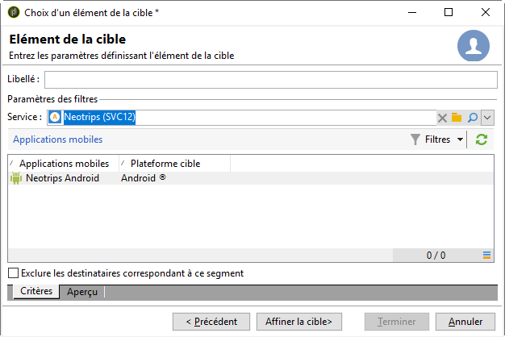
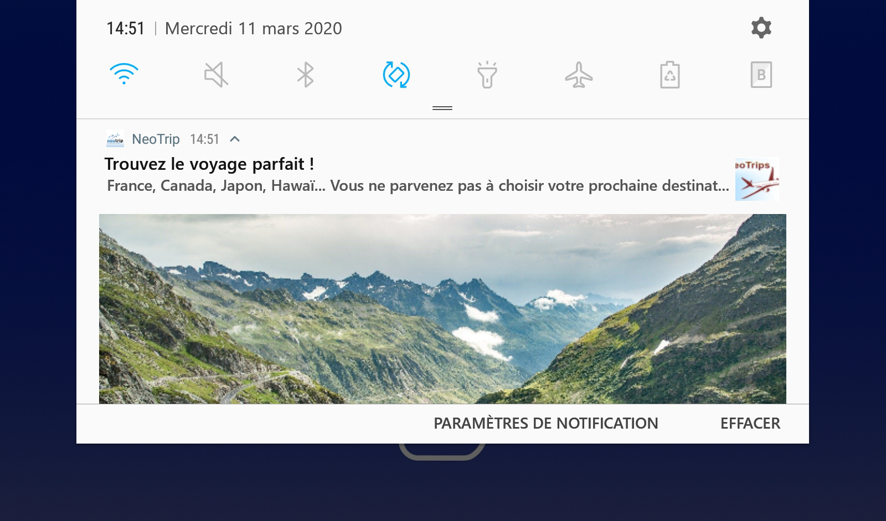

# Étapes de configuration pour Android

Une fois le package installé, vous pouvez définir les paramètres de votre application Android dans Adobe Campaign Classic.

>[!NOTE]
>
>Pour savoir comment configurer votre application pour iOS et comment créer une diffusion pour iOS, reportez-vous à cette [section](../../delivery/using/configuring-the-mobile-application.md).

Les étapes clés sont les suivantes :

1. [Configuration du compte externe Android](#configuring-external-account-android)
1. [Configuration du service Android](#configuring-android-service)
1. [Création de l’application mobile dans Campaign](#creating-android-app)
1. [Étendre le schéma de l’application avec des données supplémentaires](#extend-subscription-schema)

Vous pourrez alors [créer une notification](#creating-android-delivery)Android enrichie.

## Configuration du compte externe Android {#configuring-external-account-android}

Deux connecteurs sont disponibles pour Android :

* Le connecteur V1 permet une connexion par MTA child.
* Le connecteur V2 permet plusieurs connexions simultanées avec le serveur FCM pour améliorer le débit.

Pour sélectionner le connecteur à utiliser, procédez comme suit :

1. Accédez à **[!UICONTROL Administration > Plate-forme > Comptes externes]**.
1. Sélectionnez le compte externe de **[!UICONTROL routage Android]**.
1. Dans l&#39;onglet **[!UICONTROL Connecteur]**, renseignez le champ **[!UICONTROL JavaScript du connecteur]** :

   Pour Android V2 : https://localhost:8080/nms/jsp/androidPushConnectorV2.js

   >[!NOTE]
   >
   > Vous pouvez également le configurer comme suit (https://localhost:8080/nms/jsp/androidPushConnector.js), mais nous vous conseillons d&#39;utiliser la version 2 du connecteur.

   

1. Pour Android V2, un paramètre supplémentaire est disponible dans le fichier de configuration du serveur Adobe (serverConf.xml) :

   * **maxGCMConnectPerChild** : limite maximale du nombre de requêtes HTTP parallèles sur le serveur FCM initiées par chaque serveur fils (8 par défaut).

## Configuration du service Android {#configuring-android-service}

1. Dans l&#39;arborescence, positionnez-vous sur le nœud **[!UICONTROL Profils et Cibles > Services et abonnements]** et cliquez sur le bouton **[!UICONTROL Nouveau]**.

   

1. Définissez un **[!UICONTROL Libellé]** et un **[!UICONTROL Nom interne]**.
1. Dans le champ **[!UICONTROL Type]**, choisissez **[!UICONTROL Application mobile]**.

   >[!NOTE]
   >
   >Le mapping de ciblage par défaut **[!UICONTROL Applications abonnées (nms:appSubscriptionRcp)]** est lié à la table des destinataires. Si vous souhaitez utiliser un autre mapping de ciblage, vous devez créer un nouveau mapping de ciblage et le renseigner dans le champ **[!UICONTROL Mapping de ciblage]** du service. La création d&#39;un mapping de ciblage est présentée dans le [Guide de configuration](../../configuration/using/about-custom-recipient-table.md).

   

1. Cliquez ensuite sur le bouton **[!UICONTROL Ajouter]** pour sélectionner le type d&#39;application.

   

1. Créez votre application Android. Pour plus d&#39;informations à ce sujet, consultez cette [section](../../delivery/using/configuring-the-mobile-application-android.md#creating-android-app).

## Création d&#39;applications mobiles Android {#creating-android-app}

Après avoir créé votre service, vous devez maintenant créer votre application Android :

1. Dans le service que vous venez de créer, cliquez sur le bouton **[!UICONTROL Ajouter]** pour choisir le type d&#39;application.

   

1. Sélectionnez **[!UICONTROL Créer une application Android]** et saisissez un **[!UICONTROL libellé]**.

   

1. Assurez-vous que la même **[!UICONTROL clé d&#39;intégration]** est définie dans Adobe Campaign et dans le code de l&#39;application via le SDK. Voir à ce sujet la section : [Intégrer le SDK Campaign dans l&#39;application mobile](../../delivery/using/integrating-campaign-sdk-into-the-mobile-application.md).

   >[!NOTE]
   >
   > La **[!UICONTROL clé d&#39;intégration]** est entièrement personnalisable avec une valeur de chaîne, mais doit être exactement identique à celle spécifiée dans le SDK.

1. Sélectionnez la version **[!UICONTROL de l’]** API : HTTP v1 ou HTTP (hérité). These configurations are detailed in [this section](#select-api-version)

1. Fill in the **[!UICONTROL Firebase Cloud Messaging the Android connection settings]** fields.

1. Cliquez sur **[!UICONTROL Terminer]**, puis sur **[!UICONTROL Enregistrer]**. Votre application Android est maintenant prête à être utilisée dans Campaign Classic.

Par défaut, Adobe Campaign enregistre une clé dans le champ **[!UICONTROL Identifiant de l&#39;utilisateur]** (@userKey) de la table **[!UICONTROL Applications abonnées (nms:appSubscriptionRcp)]**. Cette clé permet de relier un abonnement à un destinataire. Si vous souhaitez collecter des données additionnelles (par exemple une clé de réconciliation complexe), vous devez effectuer le paramétrage suivant :

### Sélectionner la version d&#39;API{#select-api-version}

Après avoir créé un service et une nouvelle application mobile, vous devez configurer votre application mobile en fonction de la version d&#39;API choisie.

* **La configuration HTTP v1** est détaillée dans cette [section](../../delivery/using/configuring-the-mobile-application-android.md#android-service-httpv1).
* **La configuration HTTP (héritée)** est détaillée dans cette [section](../../delivery/using/configuring-the-mobile-application-android.md#android-service-http).

#### Configuration de l’API HTTP v1{#android-service-httpv1}

Pour configurer la version d&#39;API HTTP v1, procédez comme suit :

1. Dans la fenêtre de l&#39;**[!UICONTROL assistant de création d&#39;une application mobile]**, sélectionnez **[!UICONTROL HTTPV1]** dans la liste déroulante **[!UICONTROL Versions d&#39;API]**.

1. Cliquez sur **[!UICONTROL Charger le fichier json du projet pour extraire les détails du projet...]** pour charger directement votre fichier de clé JSON. Pour plus d&#39;informations sur l&#39;extraction de votre fichier JSON, consultez cette [page](https://firebase.google.com/docs/admin/setup#initialize-sdk).

   Vous pouvez également saisir manuellement les informations suivantes :
   * **[!UICONTROL Identifiant du projet]**
   * **[!UICONTROL Clé privée]**
   * **[!UICONTROL Email client]**

   

1. Cliquez sur **[!UICONTROL Tester la connexion]** pour vérifier que votre configuration est correcte et que le serveur marketing a accès au FCM.

   >[!CAUTION]
   >
   >Dans le cas de déploiement Mid-sourcing, le bouton **[!UICONTROL Tester la connexion]** ne vérifie pas si le serveur MID a accès au serveur FCM.

   

1. Vous pouvez, si nécessaire, enrichir un contenu de message push avec certaines **[!UICONTROL variables d&#39;application]**. Elles sont entièrement personnalisables et font partie de la payload du message envoyé à l&#39;appareil mobile.

1. Cliquez sur **[!UICONTROL Terminer]**, puis sur **[!UICONTROL Enregistrer]**. Votre application Android est maintenant prête à être utilisée dans Campaign Classic.

Vous trouverez ci-dessous les noms de payload FCM pour personnaliser davantage votre notification push :

| Type de message | Élément de message configurable (nom de payload FCM) | Options configurables (nom de payload FCM) |
|:-:|:-:|:-:|
| Message de données | N/A | validate_only |
| Message de notification | title, body, android_channel_id, icon, sound, tag, color, click_action, image, ticker, sticky, visibility, notification_priority, notification_count   | validate_only |

 
 

#### Configuration de l’API HTTP (héritée){#android-service-http}

Pour configurer la version d&#39;API HTTP (hérité), procédez comme suit :

1. Dans la fenêtre de l&#39;**[!UICONTROL assistant de création d&#39;une application mobile]**, sélectionnez **[!UICONTROL HTTP (hérité)]** dans la liste déroulante **[!UICONTROL Versions d&#39;API]**.

1. Saisissez la **[!UICONTROL clé du projet]** fournie par le développeur de l&#39;application mobile.

1. Vous pouvez, si nécessaire, enrichir un contenu de message push avec certaines **[!UICONTROL variables d&#39;application]**. Elles sont entièrement personnalisables et font partie de la payload du message envoyé à l&#39;appareil mobile.

   Dans l&#39;exemple suivant, nous ajoutons **title**, **imageURL** et **iconURL** pour créer une notification push enrichie, puis nous fournissons à l&#39;application l&#39;image, le titre et l&#39;icône à afficher dans la notification.

   

1. Cliquez sur **[!UICONTROL Terminer]**, puis sur **[!UICONTROL Enregistrer]**. Votre application Android est maintenant prête à être utilisée dans Campaign Classic.

Vous trouverez ci-dessous les noms de payload FCM pour personnaliser davantage votre notification push :

| Type de message | Élément de message configurable (nom de payload FCM) | Options configurables (nom de payload FCM) |
|:-:|:-:|:-:|
| Message de données | N/A | dryRun |
| Message de notification | title, body, android_channel_id, icon, sound, tag, color, click_action   | dryRun |

 

## Étendre le schéma appsubscriptionRcp {#extend-subscription-schema}

Vous devez étendre la valeur **appsubscriptionRcp** pour définir de nouveaux champs supplémentaires afin de stocker les paramètres de l’application dans la base de données Campaign. Ces champs seront utilisés pour la personnalisation, par exemple. Pour cela :

1. Créez une extension du schéma **[!UICONTROL Applications abonnées (nms:appSubscriptionRcp)]** et définissez les nouveaux champs. Learn more about schema extension in [this page](../../configuration/using/about-schema-edition.md)

1. Définissez le mapping dans l&#39;onglet **[!UICONTROL Paramètres d&#39;abonnement]**.

   >[!CAUTION]
   >
   >Assurez-vous que les noms des paramètres dans l&#39;onglet **[!UICONTROL Paramètres d&#39;abonnement]** sont les mêmes que dans le code de l&#39;application mobile. Voir [Intégrer le SDK Campaign dans l&#39;application mobile](../../delivery/using/integrating-campaign-sdk-into-the-mobile-application.md).

## Création d&#39;une notification Android enrichie {#creating-android-delivery}

Firebase Cloud Messaging vous permet de choisir entre deux types de messages :

* **[!UICONTROL Message de données]**, géré par l&#39;application cliente.
    Les messages sont envoyés directement à l&#39;application mobile qui génèrera et affichera la notification Android sur l&#39;appareil. Les messages de données contiennent uniquement vos variables d&#39;application personnalisées.

* **[!UICONTROL Message de notification]**, géré automatiquement par le SDK FCM.
     FCM affiche automatiquement le message sur les appareils de vos utilisateurs pour le compte de l&#39;application cliente. Les messages de notification contiennent un ensemble de paramètres et d&#39;options prédéfini, mais peuvent encore être personnalisés avec des variables d&#39;application personnalisées.

Pour plus d&#39;informations sur les types de messages Firebase Cloud Messaging, consultez la [documentation de FCM](https://firebase.google.com/docs/cloud-messaging/concept-options#notifications_and_data_messages).

### Création d&#39;un message de données {#creating-data-message}

1. Accédez à **[!UICONTROL Gestion de campagne]** > **[!UICONTROL Diffusions]**.

1. Cliquez sur **[!UICONTROL Nouveau]**.

   

1. Sélectionnez **[!UICONTROL Diffuser sur Android (android)]** dans la liste déroulante **[!UICONTROL Modèle de diffusion]**. Ajoutez un **[!UICONTROL Libellé]** à la diffusion.

1. Cliquez sur **[!UICONTROL Pour]** pour définir la population à cibler. Par défaut, le mapping de ciblage **[!UICONTROL Application abonnés]** est appliquée. Cliquez sur **[!UICONTROL Ajouter]** pour sélectionner votre service.

   

1. Dans la fenêtre **[!UICONTROL Type de cible]******, sélectionnez Abonnés d&#39;une application mobile Android, puis cliquez sur **[!UICONTROL Suivant]**.

1. Dans la liste déroulante **[!UICONTROL Service]**, sélectionnez le service créé précédemment, puis l&#39;application ciblée, et cliquez sur **[!UICONTROL Terminer]**.
Les **[!UICONTROL variables d&#39;application]** sont automatiquement ajoutées en fonction de ce qui a été incorporé au cours des étapes de configuration.

   

1. Sélectionnez le **[!UICONTROL message de données]** comme **[!UICONTROL type de message]**.

1. Modifiez la notification enrichie.

   

1. Si nécessaire, vous pouvez ajouter des informations dans vos **[!UICONTROL variables d&#39;application]** configurées précédemment. **[!UICONTROL Les variables d&#39;application]** doivent être configurées dans le service Android et font partie de la payload du message envoyée à l&#39;appareil mobile.

1. Cliquez sur **[!UICONTROL Enregistrer]**, puis envoyez votre diffusion.

L&#39;image et la page web doivent s&#39;afficher dans la notification push lors de la réception sur les appareils Android des abonnés.

### Création d&#39;un message de notification {#creating-notification-message}

>[!NOTE]
>
>D&#39;autres options de message de notification sont disponibles uniquement avec la configuration d&#39;API HTTP v1. Pour plus d&#39;informations à ce sujet, consultez cette [section](../../delivery/using/configuring-the-mobile-application-android.md#android-service-httpv1).

1. Accédez à **[!UICONTROL Gestion de campagne]** > **[!UICONTROL Diffusions]**.

1. Cliquez sur **[!UICONTROL Nouveau]**.

   

1. Sélectionnez **[!UICONTROL Diffuser sur Android (android)]** dans la liste déroulante **[!UICONTROL Modèle de diffusion]**. Ajoutez un **[!UICONTROL Libellé]** à la diffusion.

1. Cliquez sur **[!UICONTROL Pour]** pour définir la population à cibler. Par défaut, le mapping de ciblage **[!UICONTROL Application abonnés]** est appliquée. Cliquez sur **[!UICONTROL Ajouter]** pour sélectionner votre service.

   

1. Dans la fenêtre **[!UICONTROL Type de cible]******, sélectionnez Abonnés d&#39;une application mobile Android, puis cliquez sur **[!UICONTROL Suivant]**.

1. Dans la liste déroulante **[!UICONTROL Service]**, sélectionnez le service créé précédemment, puis l&#39;application ciblée, et cliquez sur **[!UICONTROL Terminer]**.

   

1. Sélectionnez le **[!UICONTROL message de notification]** comme **[!UICONTROL type de message]**.

1. Ajoutez un titre et modifiez votre message. Personnalisez votre notification push avec les **[!UICONTROL options de notification]** :

   * **[!UICONTROL Identifiant de canal]** : définissez l&#39;identifiant de canal de votre notification. L&#39;application doit créer un canal avec cet identifiant de canal avant la réception d&#39;une notification avec cet identifiant de canal.
   * **[!UICONTROL Son]** : définissez le son à émettre lorsque l&#39;appareil reçoit votre notification.
   * **[!UICONTROL Couleur]** définissez la couleur de l&#39;icône de votre notification.
   * **[!UICONTROL Icône]** : définissez l&#39;icône de la notification pour qu&#39;elle s&#39;affiche sur les appareils de vos profils.
   * **[!UICONTROL Balise]** : définissez l&#39;identifiant utilisé pour remplacer les notifications existantes dans le tiroir de notifications.
   * **[!UICONTROL Action de clic]** : définissez l&#39;action associée à un clic de l&#39;utilisateur sur votre notification.

   Pour plus d&#39;informations sur les **[!UICONTROL options de notification]** et sur la façon de remplir ces champs, consultez la [documentation FCM](https://firebase.google.com/docs/reference/fcm/rest/v1/projects.messages#androidnotification).

   

1. Si votre application est configurée avec le protocole API HTTP v1, vous pouvez personnaliser davantage votre notification push à l&#39;aide des **[!UICONTROL options supplémentaires HTTPV1]** suivantes :

   * **[!UICONTROL Bandeau déroulant]** : définissez le texte du bandeau déroulant de votre notification. Uniquement disponible pour les appareils configurés sur Android 5.0 Lollipop.
   * **[!UICONTROL Image]** : définissez l&#39;URL de l&#39;image à afficher dans votre notification.
   * **[!UICONTROL Nombre de notifications]** : définissez le nombre de nouvelles informations non lues à afficher directement sur l&#39;icône de l&#39;application.
   * **[!UICONTROL Épinglé]** : définissez cette variable sur true ou false. Si elle est définie sur false, la notification est automatiquement ignorée lorsque l&#39;utilisateur clique dessus. Si elle est définie sur true, la notification reste affichée même lorsque l&#39;utilisateur clique dessus.
   * **[!UICONTROL Priorité des notifications]** : définissez les niveaux de priorité de votre notification sur &#39;par défaut&#39;, &#39;minimum&#39;, &#39;basse&#39; ou &#39;élevée&#39;. Pour plus d&#39;informations à ce propos, consultez la [documentation FCM](https://firebase.google.com/docs/reference/fcm/rest/v1/projects.messages#NotificationPriority).
   * **[!UICONTROL Visibilité]** : définissez les niveaux de visibilité de votre notification sur public, privé ou secret. Pour plus d&#39;informations à ce propos, consultez la [documentation FCM](https://firebase.google.com/docs/reference/fcm/rest/v1/projects.messages#visibility).

   Pour plus d&#39;informations sur les **[!UICONTROL options supplémentaires HTTPv1]** et sur la façon de remplir ces champs, consultez la [documentation FCM](https://firebase.google.com/docs/reference/fcm/rest/v1/projects.messages#androidnotification).

   

1. Si nécessaire, vous pouvez ajouter des informations dans vos **[!UICONTROL variables d&#39;application]** configurées précédemment. **[!UICONTROL Les variables d&#39;application]** doivent être configurées dans le service Android et font partie de la payload du message envoyée à l&#39;appareil mobile.

1. Cliquez sur **[!UICONTROL Enregistrer]**, puis envoyez votre diffusion.

L&#39;image et la page web doivent s&#39;afficher dans la notification push lors de la réception sur les appareils Android des abonnés.
